# Báo cáo công việc ngày 20/07/2026

## A. Công việc đã làm 
- Debug quá trình lost tracking 
- Quay 1 video lại để phân tích khi không ở công ty. 
- Debug , phân tích pipeLine của model full frame static 640x640.
### 1. Debug quá trình lost tracking 
- Video được quay ở FPS = 30
- Độ phân giải : Full HD (1920x1080)
- Các bước biến đổi kích thước, hình thái ảnh:

**Full frame model (static 640x640):**

| Bước | Mô tả | Độ phân giải kiểm chứng | Ảnh |
|------|-------|-------------------------|-----|
| 1 | Frame gốc từ video | 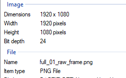 | 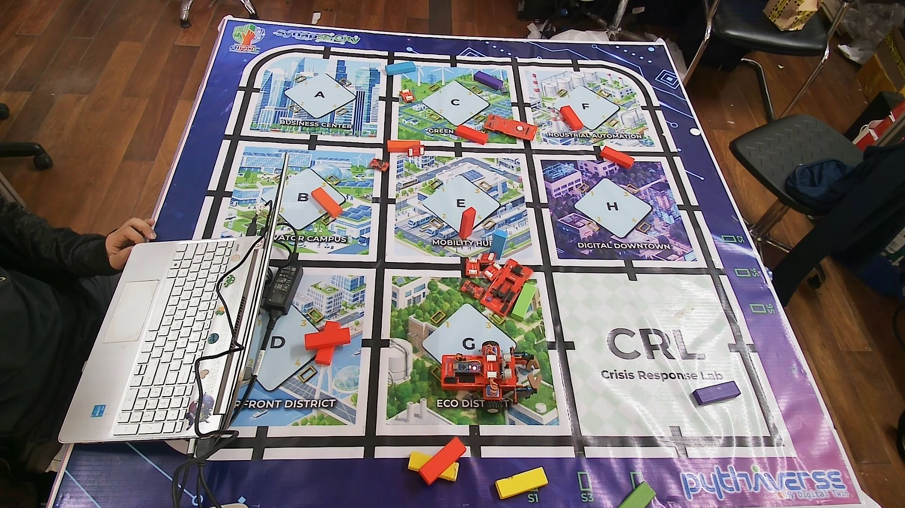 |
| 2 | Sau khi crop 62.5% giữa | 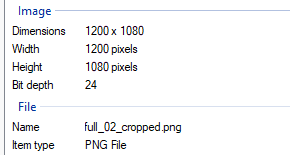 | 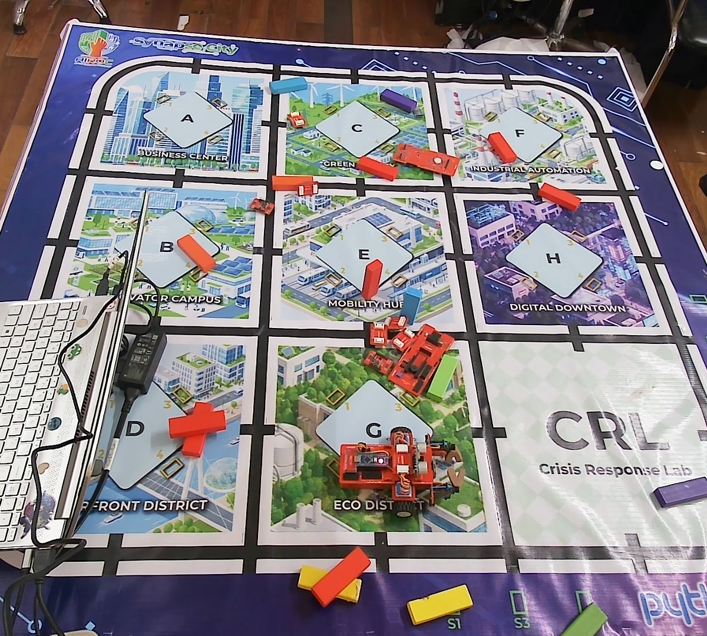 |
| 3 | Sau khi padding thành hình vuông | 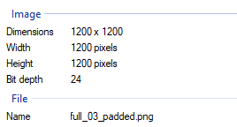 | 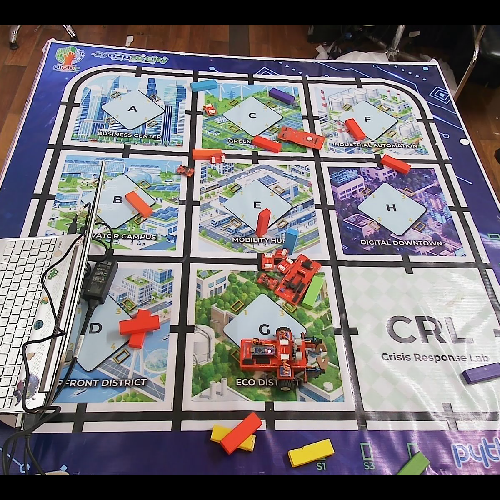 |
| 4 | Sau khi resize về 640×640 (đưa vào model) | 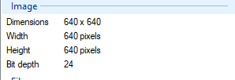 | 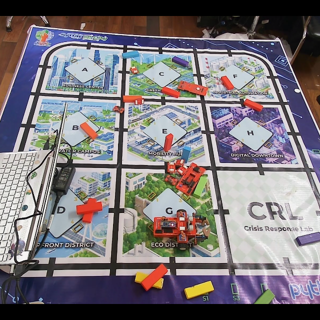 |

**ROI tracking model (static 160x160):**

| Bước | Mô tả | Độ phân giải kiểm chứng | Ảnh |
|------|-------|-------------------------|-----|
| 1 | Frame gốc từ video |  |  |
| 2 | Vùng ROI được cắt ra (kích thước bội 32) | 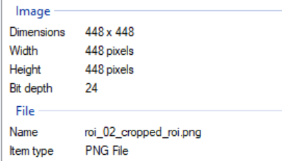 | 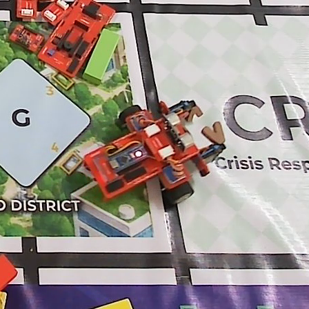 |
| 3 | Sau khi resize về 160×160 (đưa vào model) | 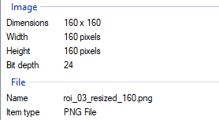 |  |


> Các bước resize ảnh đã theo đúng chuẩn luồng hoạt động --> Lỗi khiến việc mất tracking không đến từ lý do này 

- **Các lỗi có thể có để tiến hành debug kiểm tra :** 
    - Điều kiện vẽ BBox để tính ra ROI của Full frame model (static 640x640)
    - Điều kiện để tính là có Leanbot để trích xuất ra góc + vẽ bbox của Roi tracking model static 160x160

#### 1.1 Debug lỗi của full frame model (static 640x640)
- **Output của model full frame (640x640):**
    - Frame được center-crop còn 62.5% chiều rộng, padding thành ảnh vuông, sau đó resize về `640x640`.
    - Input tensor OpenVINO có shape `[1, 3, 640, 640]`.
    - Output raw no-NMS tensor có shape `[1, 28, 8400]`; sau khi chuẩn hóa trong code có shape `[8400, 28]`.
    - Mỗi anchor có cấu trúc: `[x_center, y_center, width, height, score_class_0, ..., score_class_23]`.
    - `28` = `4 giá trị bounding box` +` 24 confidence tương ứng với 24 class góc Leanbot`.
    - `8400` = `80x80 + 40x40 + 20x20` anchor từ ba feature map.
    - Đây là output raw, chưa thực hiện NMS và chưa phải bounding box cuối cùng.


- **Điều kiện hiện tại để lọc ra Leanbot BBox trong PipeLine Roi tracking:**
    1. Model static 640 trả về cố định `8400` raw anchor. Với mỗi anchor, lấy confidence lớn nhất trong `24` class làm confidence đại diện để thực hiện bước lọc tiếp theo.
    2. Giữ các anchor có confidence lớn hơn `--conf`, mặc định đang đặt là `0.25`.
    3. Lấy Top-K anchor có confidence cao nhất, mặc định đang đặt là `100` anchor.
    4. Dùng toàn bộ 24 class score để tính vector góc cho từng anchor.
    5. Gom các anchor có IoU lớn hơn `--iou`, mặc định đang đặt là `0.5`.
    6. Tính bounding box trung bình có trọng số và vector tổng cho từng group (`vector_magnitude`)
    7. Loại các group có `vector_magnitude` nhỏ hơn `--min-mag`, mặc định đang đặt là `2.0`.
    8. Chọn group có `vector_magnitude` lớn nhất làm kết quả Leanbot cuối cùng.
    9. Điều kiện vẽ bounding box hiện tại là `vector_magnitude > 0`, 

- **Điều kiện ghi các thông tin liên quan đến output model vào CSV:**
    1. Mỗi frame đang recording đều có một dòng CSV. Các giá trị thật của bbox, `best_conf`, `vector_magnitude` và `angle` chỉ có khi pipeline tìm được ít nhất một group hợp lệ.
    2. Một group sẽ bao gồm các anchor được gom lại từ những anchor vượt ngưỡng confidence (`0.25` với FULL 640, `0.15` với ROI 160), tạo được group theo IoU (`IoU >= 0.5`) và có `vector_magnitude >= 2.0`.
    3. Nếu có nhiều group hợp lệ, chỉ thông tin của group có `vector_magnitude` lớn nhất được trả về và ghi vào CSV.
    4. `vector_magnitude` là độ lớn vector tổng hợp của toàn bộ anchor trong group được chọn.
    5. `angle` là góc của vector tổng hợp group, được tính từ toàn bộ score của 24 class góc bằng `atan2(sum_y, sum_x)`; không phải chỉ lấy góc của class có confidence lớn nhất.
    6. `x_center`, `y_center`, `width`, `height` là bbox trung bình có trọng số của group được chọn, sau đó được chuyển về hệ tọa độ frame gốc. (BBox của Leanbot)
    7. Nếu không có anchor vượt confidence, không tạo được group hoặc mọi group đều có `vector_magnitude < 2.0`, hàm trả về bbox, `best_conf`, `vector_magnitude` và `angle` bằng `0`; CSV sẽ ghi các giá trị `0` tương ứng.

> Các tham số ảnh hưởng đến quá trình lọc anchor gồm `--conf`, `--topk`, `--iou` và `--min-mag`. Đối với ROI tracking có thêm `--roi_conf`. Để xác định riêng ảnh hưởng của `--conf` và `--min-mag`, tiến hành bốn thí nghiệm trên cùng video, cùng model, `topk=100` và `iou=0.5`.

#### 1.2. Kiểm thử riêng model Full Frame với từng điều kiện lọc

| Thí nghiệm | `conf` | `min-mag` | Mục đích | Thư mục kết quả |
|:---:|---:|---:|:---|:---|
| A | `0.25` | `2.0` | Baseline với cấu hình mặc định | `benchmark/fullframe_A_default` |
| B | `0.01` | `2.0` | Chỉ giảm confidence để kiểm tra bước lọc anchor | `benchmark/fullframe_B_low_conf` |
| C | `0.25` | `0.0` | Chỉ bỏ ngưỡng magnitude để kiểm tra bước lọc group | `benchmark/fullframe_C_low_min_mag` |
| D | `0.01` | `0.0` | Giảm đồng thời hai ngưỡng để kiểm tra ảnh hưởng kết hợp | `benchmark/fullframe_D_low_both` |

Các thí nghiệm sử dụng `--mode baseline`; model static `160x160` vẫn được truyền vào theo tham số của chương trình nhưng không tham gia inference trong chế độ này. File CSV và ảnh tại các frame mất detection được lưu riêng trong từng thư mục thí nghiệm.

##### Test A — Cấu hình mặc định

- Giữ nguyên `conf=0.25` và `min-mag=2.0` để tạo kết quả đối chứng.

```bash
python tools/roi_tracking_baseline_infer.py --show --video videoTest/test.mp4 --mode baseline --log benchmark/fullframe_A_default/fullframe_A.csv --full-model models/YOLO11n_versions/FP16_NO_NMS/best_640_openvino_model --tracking-model models/YOLO11n_versions/FP16_NO_NMS/best_160_openvino_model --conf 0.25 --iou 0.5 --topk 100 --min-mag 2.0
```

- CSV: [benchmark/fullframe_A_default/fullframe_A.csv](benchmark/fullframe_A_default/fullframe_A.csv).
- Ảnh mất detection:

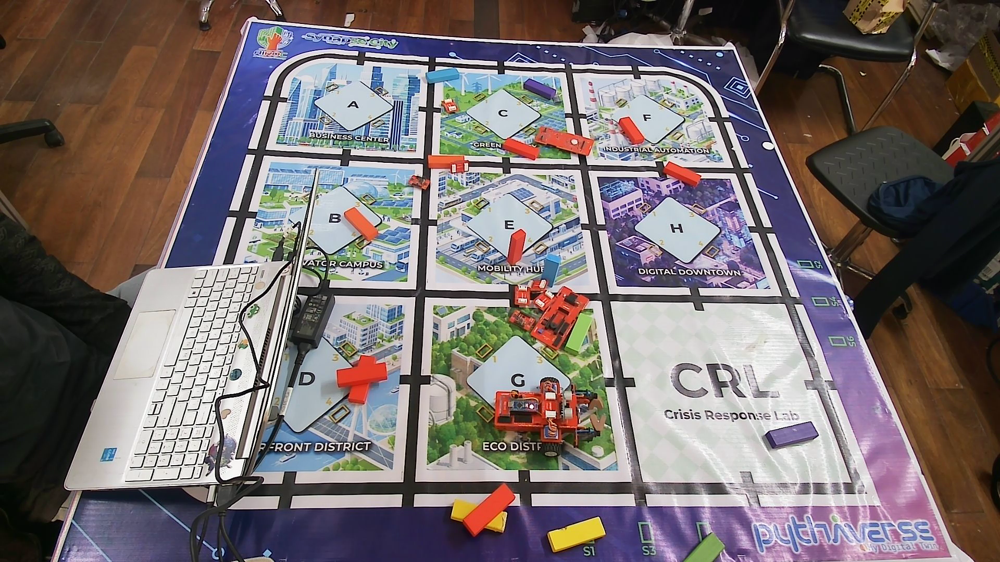.

- Toàn bộ quá trình chạy conference đều mất toàn bộ detection .

##### Test B — Chỉ giảm confidence

- Giảm `conf` từ `0.25` xuống `0.01`; giữ `min-mag=2.0`.
- Nếu kết quả tốt hơn test A, bước lọc confidence đang loại bỏ các anchor cần thiết. Nếu kết quả không thay đổi, group có thể tiếp tục bị loại bởi `min-mag`.

```bash
python tools/roi_tracking_baseline_infer.py --show --video videoTest/test.mp4 --mode baseline --log benchmark/fullframe_B_low_conf/fullframe_B.csv --full-model models/YOLO11n_versions/FP16_NO_NMS/best_640_openvino_model --tracking-model models/YOLO11n_versions/FP16_NO_NMS/best_160_openvino_model --conf 0.01 --iou 0.5 --topk 100 --min-mag 2.0
```

- CSV: [`benchmark/fullframe_B_low_conf/fullframe_B.csv`](benchmark/fullframe_B_low_conf/fullframe_B.csv).

- Ảnh mất detection: 

.

- Cả quá trình chạy inference đều khong detect được Leanbot liên tục, chỉ có số ít vài frame được detect.


##### Test C — Chỉ giảm minimum vector magnitude

- Giữ `conf=0.25`; giảm `min-mag` từ `2.0` xuống `0.0`.
- Nếu kết quả tốt hơn A, các anchor đã vượt confidence và tạo được group nhưng group bị loại tại bước kiểm tra magnitude.

```bash
python tools/roi_tracking_baseline_infer.py --show --video videoTest/test.mp4 --mode baseline --log benchmark/fullframe_C_low_min_mag/fullframe_C.csv --full-model models/YOLO11n_versions/FP16_NO_NMS/best_640_openvino_model --tracking-model models/YOLO11n_versions/FP16_NO_NMS/best_160_openvino_model --conf 0.25 --iou 0.5 --topk 100 --min-mag 0.0
```

- CSV: [`benchmark/fullframe_C_low_min_mag/fullframe_C.csv`](benchmark/fullframe_C_low_min_mag/fullframe_C.csv).
- Ảnh mất detection: 

.

- Quá trình chạy inference vẫn vậy, đều không detect liên tục được Leanbot, chỉ có một vài frame là detect được .


##### Test D — Giảm đồng thời confidence và magnitude

- Giảm `conf=0.01` và `min-mag=0.0` để hạn chế việc loại anchor/group tại hai bước đang kiểm tra.

```bash
python tools/roi_tracking_baseline_infer.py --show --video videoTest/test.mp4 --mode baseline --log benchmark/fullframe_D_low_both/fullframe_D.csv --full-model models/YOLO11n_versions/FP16_NO_NMS/best_640_openvino_model --tracking-model models/YOLO11n_versions/FP16_NO_NMS/best_160_openvino_model --conf 0.01 --iou 0.5 --topk 100 --min-mag 0.0
```

- CSV: [`benchmark/fullframe_D_low_both/fullframe_D.csv`](benchmark/fullframe_D_low_both/fullframe_D.csv).


- Với cấu hình này, BBox được detect gần như liên tục trong video kiểm thử:

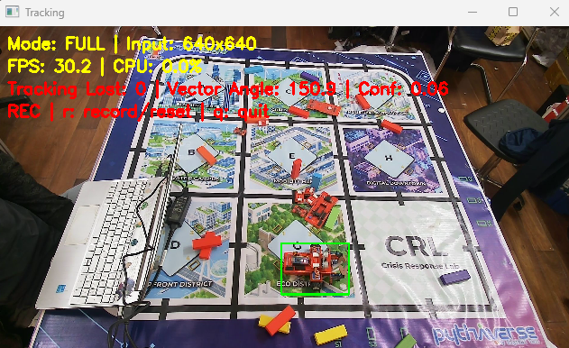

- Ghi nhận `2` frame liên tiếp mất detection (`frame 294` và `frame 295`) trong lần chạy thử nghiệm:

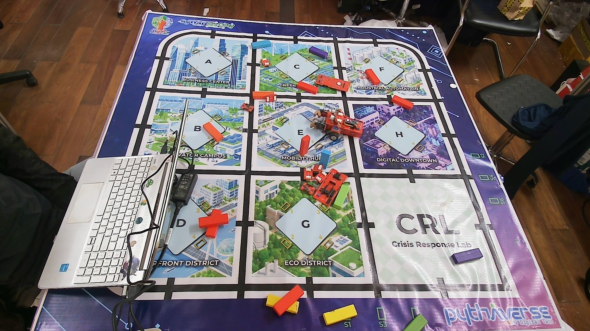


> Qua bốn thử nghiệm cho thấy hai ngưỡng `conf` và `min-mag` cùng ảnh hưởng đến kết quả tạo BBox. Với cấu hình mặc định ở test A, phần lớn frame không tạo được group hợp lệ. 

> Test B cho thấy giảm riêng confidence chỉ giúp thêm một số anchor vượt qua bước lọc đầu tiên, nhưng group vẫn có thể bị loại bởi `min-mag=2.0`. 

> Test C cho kết quả tốt hơn test A khi bỏ ngưỡng magnitude, tuy nhiên detection vẫn không liên tục vì `conf=0.25` tiếp tục loại nhiều anchor trước khi gom nhóm. 

> Chỉ khi giảm đồng thời `conf=0.01` và `min-mag=0.0` ở test D, model mới detect được `665/667` frame (`99.70%`).

> Từ kết quả trên có thể xác định cơ chế gây mất BBox trực tiếp nằm ở sự kết hợp của hai bước lọc: ngưỡng confidence cao làm giảm số anchor của Leanbot được đưa vào gom nhóm, sau đó ngưỡng `vector_magnitude` tiếp tục loại các group còn lại có độ lớn vector thấp. Việc chỉ giảm một trong hai ngưỡng chưa đủ để duy trì detection; cần điều chỉnh đồng thời để các anchor tạo được group và group được chấp nhận làm kết quả cuối cùng.


#### 1.3. Chạy test với full pipeline ROI tracking (`roi_conf=0.01`)

```bash
python tools/roi_tracking_baseline_infer.py --show --video videoTest/test.mp4 --mode roi --log fullframe_test.csv --full-model models/YOLO11n_versions/FP16_NO_NMS/best_640_openvino_model --tracking-model models/YOLO11n_versions/FP16_NO_NMS/best_160_openvino_model --conf 0.01 --iou 0.5 --topk 100 --min-mag 0.0 --roi_conf 0.01 
```

- Ảnh thực tế khi inference :

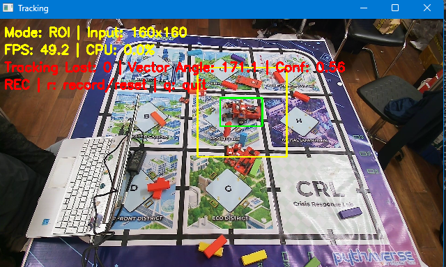

- Khi giảm ngưỡng lọc Anchors của Model roi tracking static 160x160 xuống `0.01` , thì đã có thể tracking theo Leanbot, chỉ có 1 lần lost tracking . Tuy nhiên có vài lần bị detect nhầm sang nền nhiễu .

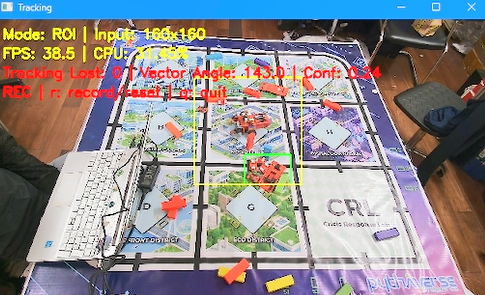


## B. Khó khăn 
-  Không
## C. Công việc tiếp theo 
- Hiện tại khi em giảm các điều kiện lọc anchors xuống rất thấp thì khi chạy inference đã detect và tracking được ổn định rồi ạ. Tuy nhiên có vài trường hợp số ít , bị detect nhầm vật thể nhiễu ( PCB Leanbot Base, khối gỗ). 
- Em có cần thu thập thêm ảnh nhiễu nền không ạ ? 
- Em có cần debug gì thêm nữa khôgn ạ ? 
- Em xin phép nhận hướng đi tiếp theo từ Thầy ạ . 
