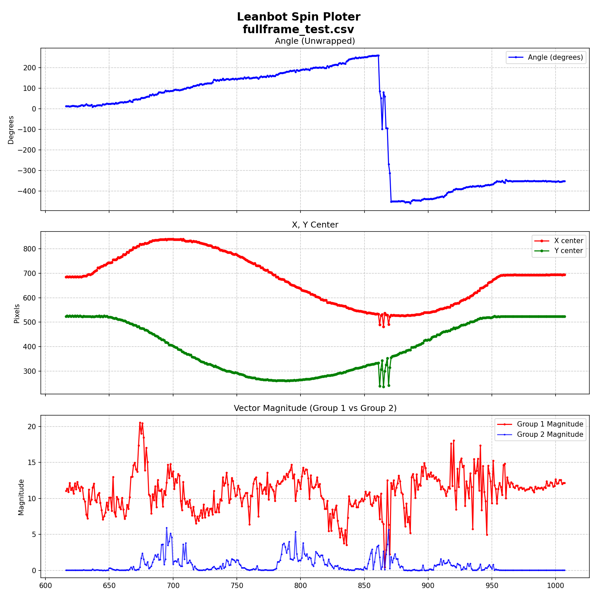

# Báo cáo công việc ngày 21/07/2026

## A. Công việc đã làm
- Trình bày lại quy trình các bước lọc Anchors
- Tắt cơ chế lọc `--conf`, `--min-mag`, `--roi_conf` và chạy test inference
- Debug các frame bị lost tracking và detect nhầm để đánh giá


### 1. Trình bày lại quy trình các bước lọc Anchors

#### 1.1. Phạm vi của quy trình lọc Anchor

- Code được sử dụng: [`tools/roi_tracking_baseline_infer.py`](tools/roi_tracking_baseline_infer.py).
- Với các model đang sử dụng ( không có khối NMS)
  - Model FULL static `640x640` trả về output `[1, 28, 8400]`.
  - Model ROI static `160x160` trả về output `[1, 28, 525]`.
  - Code chuyển output về dạng `[number_of_anchors, 28]`.
- Mỗi Anchor có cấu trúc:

```text
[x_center, y_center, width, height, score_class_0, ..., score_class_23]
```

- 4 giá trị đầu mô tả BBox theo định dạng `xywh`; 24 giá trị sau là score của 24 class góc Leanbot.

#### 1.2. Các tham số tham gia lọc Anchor

| Tham số | Mặc định | Model áp dụng | Ý nghĩa |
| :--- | ---: | :--- | :--- |
| `--conf` | `0.25` | FULL `640x640` | Ngưỡng confidence lọc từng Anchor khi detect trên toàn frame. |
| `--roi_conf` | `0.15` | ROI `160x160` | Ngưỡng confidence lọc từng Anchor của model ROI tracking static 160. |
| `--topk` | `100` | FULL và ROI | Giữ tối đa K Anchor có confidence cao nhất. |
| `--iou` | `0.5` | FULL và ROI | Ngưỡng IoU gom các Anchor chồng lấp thành group. |
| `--min-mag` | `2.0` | FULL và ROI | Magnitude tối thiểu để chấp nhận một group. |

> `--conf` và `--roi_conf` cùng lọc confidence của từng Anchor nhưng áp dụng cho hai model/input khác nhau. `--min-mag` dùng chung cho FULL và ROI. 
#### 1.3. Ý nghĩa của `conf`, `roi_conf` và `min-mag`

##### 1.3.1. Ngưỡng `conf`

- Với mỗi Anchor, code lấy score lớn nhất trong 24 class làm confidence đại diện:

```text
anchor_confidence = max(score_class_0, ..., score_class_23)
```

- Điều kiện thực tế trong code là:

```text
anchor_confidence > conf_threshold
```

- Khi chạy FULL, `conf_threshold = --conf`, mặc định `0.25`.
- Mục đích:
  - Loại sớm Anchor có score thấp.
  - Giảm Anchor nhiễu trước Top-K và IoU grouping.
  - Giảm khối lượng tính vector và IoU.
- `0.25` là ngưỡng baseline ban đầu chưa tinh chỉnh, không phải ngưỡng tối ưu cố định. 

##### 1.3.2. Ngưỡng `roi_conf`

- `roi_conf` có cùng chức năng với `conf`, nhưng chỉ dùng khi model ROI static `160x160` đang inference.


- Cần ngưỡng riêng vì FULL model nhận ảnh `640x640` đã crop/padding, còn ROI model nhận vùng ảnh vuông được resize về `160x160`. Phân bố score có thể khác nhau do input và mức phóng lớn vật thể khác nhau.
- Giá trị mặc định của `roi_conf` là `0.15`. 

##### 1.3.3. Ngưỡng `min-mag`

- Sau khi gom Anchor overlap thành group, code cộng vector góc của toàn bộ Anchor trong group:

```text
group_sum_x = Σ(anchor_magnitude × cos(anchor_angle))
group_sum_y = Σ(anchor_magnitude × sin(anchor_angle))

group_vector_magnitude = sqrt(group_sum_x² + group_sum_y²)
group_angle = atan2(group_sum_y, group_sum_x)
```

- Điều kiện lọc trong code :

```text
group_vector_magnitude >= min_mag
```

- Với `--min-mag=2.0`, chỉ group có magnitude từ `2.0` trở lên được giữ.
- Mục đích:
  - Loại group chỉ gồm ít Anchor có tín hiệu yếu.
  - Loại group có các vector góc không đồng thuận, triệt tiêu nhau.
  - Chỉ chấp nhận group có đủ tổng tín hiệu.
- `min-mag` không phải confidence của một Anchor; đây là đại lượng độ dài vector của toàn bộ group sau IoU grouping.
#### 1.4. Quy trình xử lý chi tiết
```text
1. Raw model output
2. Tính confidence lớn nhất của từng Anchor
3. Lọc Anchor bằng `conf` hoặc `roi_conf`
4. Lấy Top-K Anchor có confidence cao nhất
5. Tính vector góc cho từng Anchor từ toàn bộ 24 class score
6. Gom các Anchor overlap theo IoU
7. Tính BBox trung bình có trọng số cho từng group
8. Tính vector tổng, magnitude và angle của từng group
9. Lọc group bằng `min-mag`
10. Chọn group có `vector_magnitude` lớn nhất
11. Chuyển BBox về frame gốc và cập nhật ROI
```

##### Bước 1 — Tính confidence đại diện của từng Anchor

- Với từng Anchor, code lấy score cao nhất trong 24 class:

```python
best_scores_per_anchor = class_scores.max(axis=1)
```

- Confidence này dùng để lọc Anchor và xếp hạng Top-K. Góc cuối cùng không được tính bằng cách lấy riêng class có score lớn nhất.

##### Bước 2 — Lọc Anchor theo `conf` hoặc `roi_conf`

- Điều kiện trong code:

```python
conf_mask = best_scores_per_anchor > conf_thres
```

- `conf_thres` nhận:
  - `args.conf` nếu frame chạy bằng FULL model.
  - `args.roi_conf` nếu frame chạy bằng ROI model.
- Nếu không còn Anchor nào, hàm trả về BBox, confidence, góc và magnitude bằng `0`; frame được đánh dấu `tracking_lost=1`.

##### Bước 3 — Chọn Top-K Anchor

- Anchor còn lại được sắp xếp giảm dần theo confidence.
- Code chỉ giữ tối đa `--topk=100` Anchor:

```python
topk_actual = min(topk, number_of_filtered_anchors)
```

- Top-K giới hạn số Anchor cần tính vector và IoU. Vì vậy, kể cả khi đặt confidence threshold bằng `0`, pipeline vẫn chỉ xử lý tối đa K Anchor có confidence cao nhất.

##### Bước 4 — Tính vector góc cho từng Anchor

- Mỗi class biểu diễn một góc, ví dụ `Leanbot_0`, `Leanbot_p15`, `Leanbot_m15`.
- Score của mỗi class là trọng số của vector đơn vị tại góc tương ứng:

```text
anchor_sum_x = Σ(score_i × cos(angle_i))
anchor_sum_y = Σ(score_i × sin(angle_i))

anchor_vector_magnitude = sqrt(anchor_sum_x² + anchor_sum_y²)
anchor_angle = atan2(anchor_sum_y, anchor_sum_x)
```

- Code dùng toàn bộ 24 class score để tạo góc liên tục, thay vì chỉ trả về góc rời rạc của class có score lớn nhất.

##### Bước 5 — Gom nhóm Anchor theo IoU

- Anchor được sắp xếp giảm dần theo `anchor_vector_magnitude`.
- Code lấy Anchor có magnitude lớn nhất làm Anchor trung tâm của group.
- Các Anchor còn lại có `IoU > --iou` so với Anchor trung tâm được đưa vào cùng group.
- Với `--iou=0.5`, hai Anchor phải overlap trên `50%` theo IoU mới được gom chung.
- Sau khi tạo group, các Anchor thuộc group được loại khỏi danh sách; quá trình tiếp tục với Anchor mạnh nhất còn lại.

##### Bước 6 — Tính BBox đại diện của group

- BBox group là trung bình có trọng số của BBox các Anchor.

```text
group_x_center = Σ(anchor_magnitude × anchor_x_center) / Σ(anchor_magnitude)
group_y_center = Σ(anchor_magnitude × anchor_y_center) / Σ(anchor_magnitude)
group_width    = Σ(anchor_magnitude × anchor_width) / Σ(anchor_magnitude)
group_height   = Σ(anchor_magnitude × anchor_height) / Σ(anchor_magnitude)
```

- Anchor group nào có vector lớn nhất thì sẽ lấy group đó để vẽ bbox

##### Bước 7 — Tính vector tổng của group

```text
group_sum_x = Σ(anchor_magnitude × cos(anchor_angle))
group_sum_y = Σ(anchor_magnitude × sin(anchor_angle))

group_vector_magnitude = sqrt(group_sum_x² + group_sum_y²)
group_angle = atan2(group_sum_y, group_sum_x)
```

##### Bước 8 — Lọc group theo `min-mag`

- Code giữ group thỏa mãn:

```python
group_vector_magnitude >= min_mag
```

- Nếu tất cả group bị loại, hàm trả về các giá trị `0` và frame được đánh dấu mất detection.

##### Bước 9 — Chọn group và BBox cuối cùng

- Group hợp lệ được sắp xếp giảm dần theo `group_vector_magnitude`.
- Group có magnitude lớn nhất được chọn.
- Hàm trả về:

```text
box_xyxy, best_conf, group_angle, group_vector_magnitude
```

- Pipeline xác định detection thành công bằng:

```python
detected = vector_magnitude > 0
```
#### 1.5. Ví dụ minh họa

Giả sử sau bước tính score và vector có 5 Anchor. Ví dụ dùng `Top-K=4`, `IoU=0.5`, `conf=0.25`, `min-mag=2.0` để trình bày ngắn gọn; pipeline thực tế mặc định dùng `Top-K=100`.

| Anchor | Confidence lớn nhất | BBox `(xc, yc, w, h)` | Vector Anchor |
| :---: | ---: | :---: | :---: |
| A1 | `0.72` | `(100, 100, 40, 40)` | `0.90 ∠ 0°` |
| A2 | `0.68` | `(102, 101, 42, 40)` | `0.85 ∠ 15°` |
| A3 | `0.31` | `(98, 99, 41, 39)` | `0.60 ∠ 0°` |
| A4 | `0.40` | `(300, 250, 50, 50)` | `0.35 ∠ 180°` |
| A5 | `0.18` | `(150, 150, 30, 30)` | `0.20 ∠ 90°` |

##### Bước 1 — Lọc confidence

- Điều kiện `confidence > 0.25` giữ A1, A2, A3, A4.
- A5 có confidence `0.18` nên bị loại.

##### Bước 2 — Chọn Top-K

- Với `Top-K=4`, thứ tự confidence là A1, A2, A4, A3.
- Cả bốn Anchor được đưa vào tính vector và gom nhóm.
- `best_conf` được ghi log bằng `0.72`, là confidence của A1.

##### Bước 3 — Gom nhóm IoU

- A1, A2, A3 overlap tại cùng vị trí:
  - `IoU(A1, A2) ≈ 0.865`.
  - `IoU(A1, A3) ≈ 0.863`.
- Hai giá trị lớn hơn `0.5`, do đó:

```text
Group 1 = {A1, A2, A3}
```

- A4 nằm ở vị trí khác, tạo group riêng:

```text
Group 2 = {A4}
```

##### Bước 4 — Tính BBox có trọng số của Group 1

- Tổng trọng số:

```text
0.90 + 0.85 + 0.60 = 2.35
```

- Ví dụ tọa độ tâm theo trục X:

```text
group_x_center
= (0.90×100 + 0.85×102 + 0.60×98) / 2.35
≈ 100.21
```

- Tính tương tự cho các thành phần còn lại:

```text
(x_center, y_center, width, height)
≈ (100.21, 100.11, 40.98, 39.74)
```

##### Bước 5 — Tính vector tổng của Group 1

```text
sum_x
= 0.90×cos(0°) + 0.85×cos(15°) + 0.60×cos(0°)
≈ 2.321

sum_y
= 0.90×sin(0°) + 0.85×sin(15°) + 0.60×sin(0°)
≈ 0.220
```

- Vector kết quả:

```text
Group 1 magnitude = sqrt(2.321² + 0.220²) ≈ 2.33
Group 1 angle = atan2(0.220, 2.321) ≈ 5.41°
```

- Group 2 chỉ có A4:

```text
Group 2 magnitude = 0.35
Group 2 angle = 180°
```

##### Bước 6 — Lọc `min-mag` và chọn kết quả

- Với `min-mag=2.0`:
  - Group 1 có magnitude `2.33`, được giữ.
  - Group 2 có magnitude `0.35`, bị loại.
- Group 1 trở thành kết quả cuối cùng:

```text
best_conf = 0.72
vector_magnitude = 2.33
angle = 5.41°
bbox ≈ (100.21, 100.11, 40.98, 39.74)
```

#### 1.7. Kết luận về các ngưỡng lọc

- `conf` và `roi_conf` lọc ở **cấp Anchor**, trước Top-K và IoU grouping.
- `min-mag` lọc ở **cấp group**, sau khi cộng vector của các Anchor overlap.

### 2. Tắt cơ chế lọc và chạy test inference

- Chạy lệnh inference với toàn bộ ngưỡng lọc đặt về `0`:

```bash
python tools/roi_tracking_baseline_infer.py --show --source 1 --mode roi \
  --log fullframe_test.csv \
  --full-model models/YOLO11n_versions/FP16_NO_NMS/best_640_openvino_model \
  --tracking-model models/YOLO11n_versions/FP16_NO_NMS/best_160_openvino_model \
  --conf 0.00 --iou 0.5 --topk 100 --min-mag 0.0 --roi_conf 0.00
```

- Bổ sung log CSV: thêm 4 cột `group1_magnitude`, `group1_angle`, `group2_magnitude`, `group2_angle` để ghi nhận vector magnitude và góc của 2 group mạnh nhất trên mỗi frame.
- Mục đích để quan sát sự thay đổi vị trí best giữa Group 1 (group được chọn vẽ BBox) và Group 2 (group mạnh thứ 2) để tìm nguyên nhân detect nhầm.

- Kết quả đồ thị khi chạy : 



### 3. Debug các frame bị detect nhầm

Trong 393 frame ghi log, phát hiện **3 frame bị detect nhầm sang vật thể nhiễu**: Frame 862, 865 và 869. Tại các frame này, BBox nhảy đột ngột từ vị trí Leanbot thật sang một vật thể nhiễu cố định trên sân. Vì nhanh quá nên em ko chụp được ảnh frame đó. 
#### 3.1 Các frame bị lỗi dettect từ log CSV

| Frame | Vị trí BBox (x, y) | BBox (w × h) | Group 1 | Group 2 | Conf | Nhận xét |
| :---: | :---: | :---: | :---: | :---: | ---: | :--- |
| 861 | (533, 333) | 95.9 × 109.0 | mag=10.23, ang=-101° | mag=3.47, ang=86° | 0.93 | Leanbot đúng theo các frame trước đó  |
| **862** | **(490, 239)** | **80.6 × 36.0** | **mag=7.12, ang=85°** | mag=1.81, ang=89° | **0.66** | lệch tọa độ sang vật thể nhiễu ở góc trên bên trái |
| 864 | (532, 343) | 95.9 × 116.9 | mag=6.75, ang=-99° | mag=0.48, ang=105° | 0.86 | Về lại vị trí Leanbot |
| **865** | **(482, 236)** | **67.0 × 43.1** | **mag=6.43, ang=80°** | **mag=2.68, ang=84°** | **0.68** | lại bị lệch về phía vật thể nhiễu ở góc trên bên trái |
| 868 | (529, 352) | 99.9 × 122.9 | mag=12.54, ang=-96° | mag=3.64, ang=108° | 0.91 | Lại về lại vị trí Leanbot |
| **869** | **(491, 241)** | **82.1 × 33.9** | **mag=6.37, ang=91°** | **mag=5.65, ang=-95°** | **0.84** | lại bị lệch về phía vật thể nhiễu ở góc trên bên trái |

#### 3.2. Nguyên nhân gốc

- Vật thể nhiễu nằm cố định ở vị trí khoảng (490, 240) trên sa bàn. Trong ROI `160×160`, vật nhiễu này rơi vào vùng ROI và tạo ra một nhóm anchor có vector magnitude cao hơn nhóm anchor của Leanbot thật.
- Cơ chế chọn kết quả hiện tại **chỉ dựa vào magnitude cao nhất**, không kiểm tra tính liên tục với frame trước. Do đó khi vật nhiễu tạo group mạnh hơn, nó lập tức cướp vị trí Group 1.

#### 3.3. Hướng xử lý đề xuất

- Thêm bước kiểm tra tính liên tục (continuity check) sau khi chọn group có magnitude cao nhất:
  - Nếu BBox của group mạnh nhất **nhảy quá xa** so với BBox frame trước (ví dụ > 50px), kiểm tra xem group mạnh thứ nhì có BBox gần vị trí cũ hơn không.
  - Nếu có, ưu tiên chọn group gần vị trí cũ thay vì group có magnitude cao nhất.
## B. Khó khăn
- Không

## C. Công việc tiếp theo
- Em xin phép nhận hướng đi tiếp theo từ Thầy ạ . 