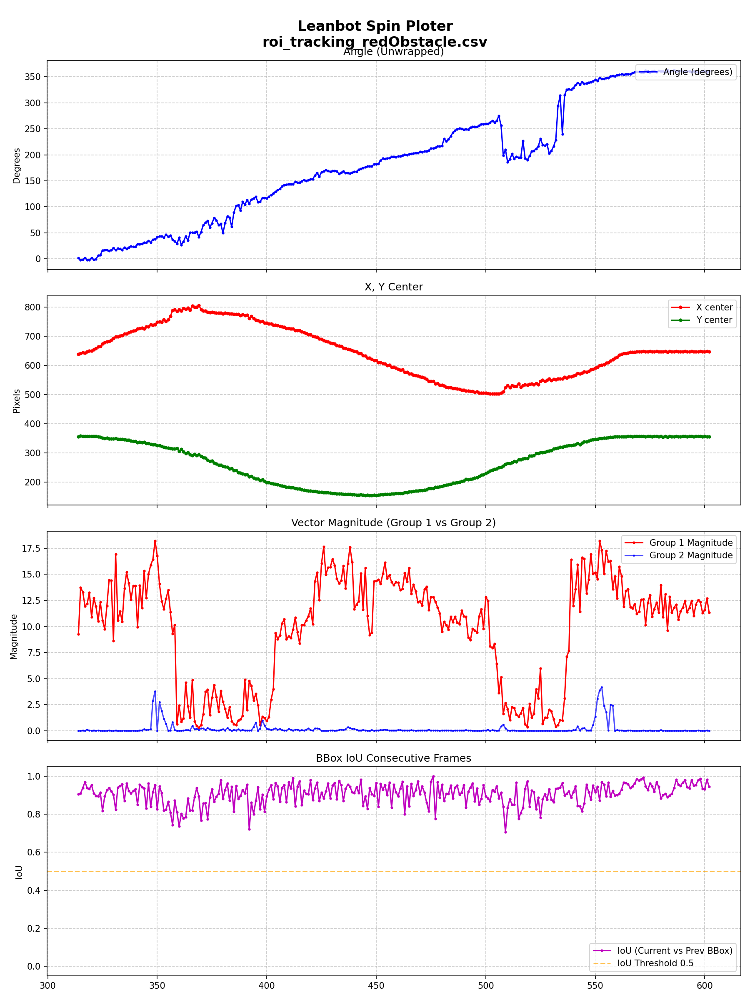
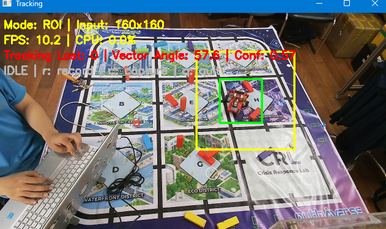
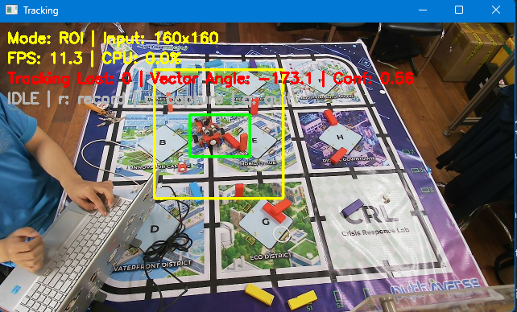

# Báo cáo công việc ngày 21/07/2026

## A. Công việc đã làm 
- Trả lời một số câu hỏi của Thầy .
- Bổ sung thêm log CSV ( IoU của Bbox frame trước và bbox frame hiện tại; Đồ thị Iou ; magnitude group1 & 2 )
- Chạy inference khảo sát Leanbot chạy vòng tròn lẫn với các khối đỏ.


### 1. Trả lời một số câu hỏi của Thầy. 

- ***Tại sao lọc theo Top-K chưa đủ mà phải thêm `conf` và `min-mag`?***

  - Dựa theo luồng pipeline đã có sẵn từ phần nghiên cứu tính toán góc trước đó thì em dùng luôn cái `Top-K` ạ.
  - `Top-K`chỉ giới hạn số lượng Anchor trong 8400 anchor của YOLO11n 640x640 đưa vào, chứ không đánh giá Anchor có đủ tin cậy hay không.

  Vì vậy cần thêm hai ngưỡng lọc độ tin cậy anchor ở hai cấp khác nhau:

  - `conf` lọc ở cấp **Anchor**, loại sớm các Anchor có confidence thấp trước khi tính vector và gom nhóm IoU.
  - `min-mag` lọc ở cấp **Group**, chỉ chấp nhận nhóm có đủ bằng chứng tổng hợp từ các Anchor overlap và có vector tổng đủ mạnh.
  > `Top-K` chủ yếu giới hạn khối lượng tính toán và giữ các Anchor tốt nhất tương đối, nó không phải điều kiện xác nhận có Leanbot.

- Theo em nghĩ nếu chỉ dùng `Top-K`, các Anchor nhiễu vẫn có thể được giữ lại, gom thành group và trở thành kết quả cuối có thể nhiễu góc. 

- ***Có phải tất cả các lần bị lẫn sang vật thể nhiễu thì vật thể đầu là mạch LbBase?***

  - Trong quá trình chạy inference và quan sát thì em thấy LbBase có khả năng bị nhiễu cao nhất , sau đó tới các khối gỗ đỏ ạ . 
  - Board mạch driver cũng có thể gây nhiễu, nhưng chỉ khi em cố tình sắp xếp nhiều board driver gom cụm lại ạ .


### 2. Chỉnh sửa log CSV bổ sung cột thông tin IoU.

- **Code sử dụng:** [`tools/roi_tracking_baseline_infer.py`](tools/roi_tracking_baseline_infer.py) và [`tools/plot_log.py`](tools/plot_log.py).

- **Các cột thông tin hiện tại trong Log CSV (`csv_header`):**

  | STT | Tên cột | Ý nghĩa |
  | :-: | :--- | :--- |
  | 1 | `frame_id` | Thứ tự frame hình ảnh |
  | 2 | `timestamp` | Thời gian ghi nhận frame (hh:mm:ss.ms) |
  | 3 | `mode` | Chế độ inference (`FULL` 640x640 hoặc `ROI` 160x160) |
  | 4 | `input_width`, `input_height` | Kích thước ảnh đưa vào model |
  | 5 | `roi_w`, `roi_h` | Kích thước ROI crop được từ frame gốc |
  | 6 | `inf_time_ms`, `end_to_end_time_ms` | Thời gian inference và thời gian xử lý toàn bộ frame (ms) |
  | 7 | `cpu_load_pct`, `fps` | Tải CPU tiến trình (%) và tốc độ khung hình (FPS) |
  | 8 | `x_center`, `y_center`, `width`, `height` | Tọa độ tâm và kích thước BBox detect |
  | 9 | **`iou_prev_bbox`** *(Mới)* | **Chỉ số IoU giữa BBox frame trước và BBox frame hiện tại (0.0 đến 1.0)** |
  | 10 | **`group1_magnitude`**, `group1_angle` | Độ dài vector magnitude và góc của nhóm Anchor tốt nhất (Group 1) |
  | 11 | **`group2_magnitude`**, `group2_angle` | Độ dài vector magnitude và góc của nhóm Anchor tốt thứ 2 (Group 2) |


- **Code tính toán IoU của frame trước và frame hiện tại:**

```python
# Khởi tạo biến lưu BBox của frame trước
prev_bbox_xyxy = None

# Trong vòng lặp từng frame khi detect thành công:
if detected:
    current_box_xyxy = np.array(best_box, dtype=np.float32)

    if prev_bbox_xyxy is not None:
        # Tính IoU giữa BBox hiện tại và BBox frame liền trước
        iou_prev = float(box_iou_numpy(current_box_xyxy, np.array([prev_bbox_xyxy]))[0])
    else:
        # Frame đầu tiên gán bằng 1.0 (100%) làm mốc
        iou_prev = 1.0

    prev_bbox_xyxy = current_box_xyxy.copy()
else:
    tracking_lost = 1
    prev_roi = None
    prev_bbox_xyxy = None
    iou_prev = 0.0
```


### 3. Chạy inference khảo sát Leanbot chạy vòng tròn lẫn với các khối đỏ. 
- Leanbot chạy vòng trong xugn quanh có các khối gỗ đỏ, cam ngẫu nhiên.
- Code sử dụng : [`tools/roi_tracking_baseline_infer.py`](tools/roi_tracking_baseline_infer.py).

- Lệnh chạy code : 
```bash
python tools/roi_tracking_baseline_infer.py --show --source 1 --mode roi --log roi_tracking_redObstacle.csv --full-model models/YOLO11n_versions/FP16_NO_NMS/best_640_openvino_model --tracking-model models/YOLO11n_versions/FP16_NO_NMS/best_160_openvino_model --conf 0.00 --iou 0.5 --topk 100 --min-mag 0.0 --roi_conf 0.00
```

- File CSV kết quả : [roi_tracking_redObstacle.csv](benchmark/roi_tracking_redObstacle.csv)
- Lệnh chạy vẽ biểu đồ : 

```bash
python tools/plot_log.py benchmark/roi_tracking_redObstacle.csv
```
- Không có hiện tượng lost tracking và detect nhầm sang vật thể khác. 

- Kết quả biểu đồ : 



- Nhìn biểu đồ có thể thấy có 2 khoảng bị nhiễu góc, Lý do là vì Leanbot khi đi sát các khối đỏ, hệ thống sẽ gom nhóm cả những anchor chứa cả Leanbot và khối gỗ, dẫn tới vector góc sẽ bị sai lệnh.
- Hình ảnh lỗi tại 2 khoảng nhiễu như sau : 

| Khoảng góc 50-100 độ| Khoảng góc 250 - 300 độ |
|:---:|:---:|
||  |

> Đối với các khối đỏ thì hệ thống vẫn có thể detect được Leanbot tốt hơn và không bị nhiễu bởi các vật nhiễu , nhưng cần lọc các anchor chứa các khối đỏ gần Leanbot để không bị nhiễu góc ( tăng ngưỡng IoU overlap).

## B. Khó khăn 
- Không
## C. Công việc tiếp theo
- Em xin phép nhận hướng đi tiếp theo từ Thầy ạ .
