# Báo cáo công việc ngày 24/07/2026

## A. Công việc đã làm 
- Đã nhận được Email Công ty cấp, và đăng nhập Git thành công, hiện tại có 3 repository như sau :
  - `anhdtt/https---github.com-giangduong-dulieumo.org`
  - `anhdtt/dulieumo.org`
  - `anhdtt/kml`
- Đổi tên biến `--min-mag` thành `--mag-threshold` để phù hợp ý nghĩa biểu thị là ngưỡng lọc Anchors thông qua Vector Magnitude.
- Báo cáo lại thôgn tin các cột categories của file log csv. 
- Đặt ngưỡng `--mag-threshold` = `0` , log và vẽ đồ thị vector magnitude tổng của 2 group tốt nhất trong frame ảnh ROI tracking. 
- Báo cáo lại link Log CSV biểu diễn dưới dạng bảng của Github .
- Thêm cơ chế chụp lại các frame lỗi để phân tích kỹ hơn. 
  - Phân tích các TopK anchor riêng lẻ (trước khi gộp thành group)
  - Có anchor nào có BBox chỉ bao gồm Leanbot, không bị lẫn thêm các khối gỗ đỏ vào không?
  - Vẽ ra tất cả Top-K anchor để quan sát

### Mục Lục 

### 1. Đổi tên biến `--min-mag` và Thông tin các cột categories trong log CSV.
- Code chỉnh sửa : 
```python 
# Định nghĩa hàm select_best_vector_detection nhận tham số mag_threshold mặc định là 0:
def select_best_vector_detection(compiled_model, image, names,
                                  conf_thres=0.0, topk=100,
                                  iou_thres=IOU_THRES, mag_threshold=0.0):
    ...
    # Lọc group bằng magnitude tổng hợp:
    summary_df = summary_df[summary_df["vector_magnitude"] >= mag_threshold]

# 2. Đổi tên thành --mag-threshold trong argparse:
    parser.add_argument("--mag-threshold", type=float, default=0.0, help="Vector magnitude toi thieu de chap nhan nhom (default 0.0)")
```

- Lệnh chạy code sau khi chỉnh sửa : 
```bash
python tools/roi_tracking_baseline_infer.py --show --source 1 --mode roi --log roi_tracking_redObstacle.csv --full-model models/YOLO11n_versions/FP16_NO_NMS/best_640_openvino_model --tracking-model models/YOLO11n_versions/FP16_NO_NMS/best_160_openvino_model --conf 0.00 --iou 0.5 --topk 100 --mag-threshold 0.0 --roi_conf 0.00
```
- Các cột thông tin categories hiện tại : 


| STT | Tên cột | Ý nghĩa |
| :-: | :--- | :--- |
| 1 | `frame_id` | Thứ tự frame hình ảnh |
| 2 | `timestamp` | Thời gian ghi nhận frame (hh:mm:ss.ms) |
| 3 | `mode` | Chế độ inference (`FULL` 640x640 hoặc `ROI` 160x160) |
| 4 | `input_width`, `input_height` | Kích thước ảnh đưa vào model |
| 5 | `roi_w`, `roi_h` | Kích thước ROI crop được từ frame gốc |
| 6 | `inf_time_ms`, `end_to_end_time_ms` | Thời gian inference và thời gian xử lý toàn bộ frame (ms) |
| 7 | `cpu_load_pct`, `end_to_end_cpu_load_pct`, `fps` | Tải CPU tiến trình (vòng lặp / toàn trình, tính theo %) và tốc độ khung hình (FPS) |
| 8 | `x_center`, `y_center`, `width`, `height` | Tọa độ tâm và kích thước BBox detect |
| 9 | **`iou_prev_bbox`** *(Mới)* | **Chỉ số IoU giữa BBox frame trước và BBox frame hiện tại (0.0 đến 1.0)** |
| 10 | **`group1_magnitude`**, `group1_angle` | Độ dài vector magnitude **Tổng** và góc của nhóm Anchor tốt nhất (Group 1) |
| 11 | **`group2_magnitude`**, `group2_angle` | Độ dài vector magnitude **Tổng** và góc của nhóm Anchor tốt thứ 2 (Group 2) |
| 12 | **`best_conf`** | Độ tự tin (confidence) cao nhất của detection hiện tại |
| 13 | **`tracking_lost`** | Trạng thái  ROI tracking (0: đang tracking bình thường, 1: bị mất tracking) |


### 2. Chạy test lại sau và đánh giá 
- Code sử dụng : [tools/roi_tracking_baseline_infer.py](tools/roi_tracking_baseline_infer.py)

- Lệnh chạy ( tắt toàn bộ các ngưỡng lọc --conf, --mag-threshold --roi_conf chỉ để --topK và --iou ) : 

```bash
python tools/roi_tracking_baseline_infer.py --show --source 1 --mode roi --log roi_tracking_redObstacle.csv --full-model models/YOLO11n_versions/FP16_NO_NMS/best_640_openvino_model --tracking-model models/YOLO11n_versions/FP16_NO_NMS/best_160_openvino_model --conf 0.00 --iou 0.5 --topk 100 --mag-threshold 0.0 --roi_conf 0.00
```

- Ảnh chạy thực tế khi có nhiều khối gỗ đỏ , cam : 

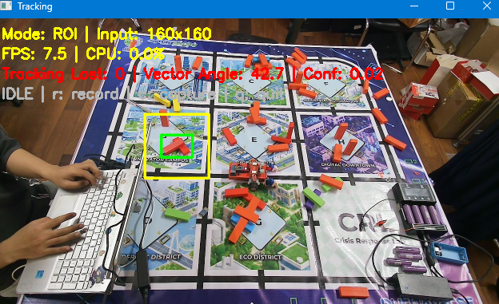

> Khi có nhiều khối gỗ đổ gom cụm lại thì nền nhiễu mạnh, em phải lấy tay che phần bị ROI tracking bám nhầm thì nó mới quay lại tìm Leanbot bằng full frame model để detect lại Leanbot ạ . 

- File log CSV dạng bảng **Table** hiển thị trên giao diện Github : [roi_tracking_redObstacle.csv](https://github.com/HoangAnh301194/Leanbot_orientation_estimation-CNN_base/blob/master/260724/benchmark/roi_tracking_redObstacle.csv)

- Đồ thị góc và các vector magnitude tổng của 2 group :


**Đánh giá tổng quan :**
- Hôm nay em xếp các khối gỗ dày hơn chút thì thấy liên tục bị nhiễu detect và roi tracking bị giữ lại tại vật nhiễu ạ . 
- Về phần vật nhiễu giữ ROI frame có thể xử lý bằng một số cách tạm thời sau ạ 
  - Định kỳ detect bằng full frame model . 
  - Dựa vào việc thay đổi vị trí BBox đột ngột qua một ngưỡng nào đó để kích hoạt cơ chế detect bằng full frame model . 
  - Tăng hệ số nhân bbox để tạo ra ROI lớn hơn và rộng hơn ( hiện tại là x2 Bbox)

### 3. Một số hình ảnh Leanbot gộp chung với khối gỗ .
- Hiện tại em đã thêm cơ chế capture lại frame mà Leanbot và khối gỗ bị nhóm chung vào 1 Bbox từ đó dẫn tới góc bị tính toán sai lệch đi. 
- Một số trường hợp capture được lưu trong : [benchmark/manual_captures/](benchmark/manual_captures/)

- **Tạo tools phân tích các Anchors có trong ảnh nhiễu và trực quan hóa dữ liệu phân tích.**

  - Tools sử dụng: [tools/evaluate_manual_roi_anchors.py](tools/evaluate_manual_roi_anchors.py)

  - Pipeline cho mỗi ảnh `*_orig.png`:
    - Chạy Full Frame `640x640` một lần để lấy BBox tốt nhất.
    - Tạo ROI tĩnh theo đúng pipeline ROI tracking hiện tại.
    - Resize ROI về `160x160`, chạy model ROI tracking một lần.
    - Tắt `--conf`, `--roi-conf`, `--mag-threshold`; lọc Top-100 Anchor và gom nhóm theo IoU `0.5`.
    - Quy đổi toàn bộ BBox Anchor từ hệ `160x160` về ROI và ảnh gốc.
    - Vẽ Top-100 BBox lên ảnh gốc; mỗi Anchor có mã `A001` đến `A100` và một mã màu riêng.

  - Mỗi ảnh origin tạo một cặp kết quả gồm một ảnh trực quan hóa và một file CSV riêng trong [benchmark/manual_captures_anchor_analysis/](benchmark/manual_captures_anchor_analysis/).

  - Mỗi dòng CSV tương ứng một Anchor của lượt ROI `160x160`. Kết quả hiện tại có `7` file CSV, mỗi file `100` dòng Anchor.

  - Các cột thông tin trong file CSV đánh giá ảnh nhiễu:

| STT | Nhóm cột | Ý nghĩa |
| :-: | :--- | :--- |
| 1 | `anchor_rank`, `anchor_index` | Thứ hạng Top-K và chỉ số Anchor trong raw output |
| 2 | `group_id` | ID nhóm Anchor được gom theo IoU `0.5`; nằm ở cột thứ 3 trong CSV |
| 3 | `best_class_id`, `best_class`, `best_conf` | Class có confidence lớn nhất và confidence tương ứng |
| 4 | `vector_magnitude`, `estimated_angle`, `vector_x`, `vector_y` | Vector tổng hợp từ 24 class score của Anchor |
| 5 | `x_center_160`, `y_center_160`, `width_160`, `height_160` | BBox `xywh` trong input ROI `160x160` |
| 6 | `x1_160`, `y1_160`, `x2_160`, `y2_160` | BBox `xyxy` trong input ROI `160x160` |
| 7 | `x_center_roi`, `y_center_roi`, `width_roi`, `height_roi` | BBox được scale về ROI trước resize |
| 8 | `x1_origin`, `y1_origin`, `x2_origin`, `y2_origin` | BBox Anchor quy đổi về ảnh origin |
| 9 | `x_center_origin`, `y_center_origin`, `width_origin`, `height_origin` | BBox `xywh` trên ảnh origin |
| 10 | `roi_x`, `roi_y`, `roi_width`, `roi_height` | Vị trí và kích thước ROI trên ảnh origin |
| 11 | `full_bbox_x1`, `full_bbox_y1`, `full_bbox_x2`, `full_bbox_y2` | BBox tốt nhất từ lượt Full Frame |
| 12 | `score_Leanbot_0` đến `score_Leanbot_m15` | Toàn bộ 24 class score raw của Anchor |
| 13 | `group_anchor_count`, `group_vector_magnitude`, `group_estimated_angle` | Số Anchor, magnitude và góc tổng hợp của group |
| 14 | `group_x_center_160`, `group_y_center_160`, `group_width_160`, `group_height_160` | BBox đại diện của group trong hệ `160x160` |
| 15 | `color_b`, `color_g`, `color_r`, `color_hex` | Màu đối chiếu CSV với BBox trên ảnh |
| 16 | `full_best_conf`, `full_group_angle`, `full_group_vector_magnitude` | Kết quả Full Frame dùng tạo ROI |

  - Lệnh chạy:

```bash
python tools/evaluate_manual_roi_anchors.py --input-dir benchmark/manual_captures --output-dir benchmark/manual_captures_anchor_analysis --pattern "*_orig.png" --topk 100 --conf 0.0 --roi-conf 0.0 --iou 0.5 --mag-threshold 0.0
```

- Chạy tool phân tích với toàn bộ ảnh nhiễu capture được. Kết quả: `7` ảnh trực quan hóa và `7` file CSV riêng, mỗi CSV có `100` dòng Anchor.

- **Ảnh nhiễu 1:** 

|Ảnh gốc|Ảnh UI|
|:--:|:--:|
|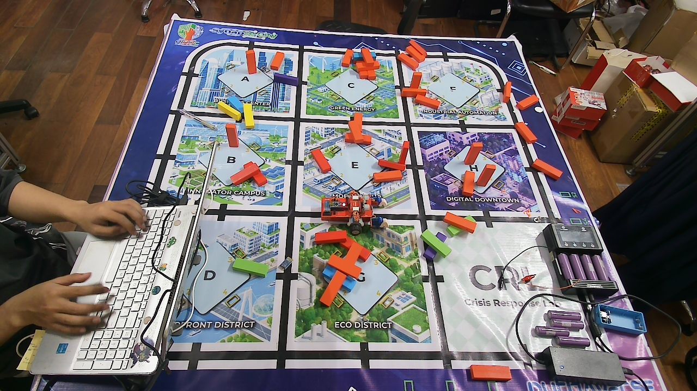|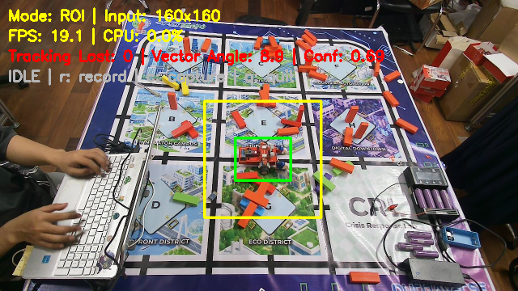|

  - Ảnh Anchor trực quan hóa 

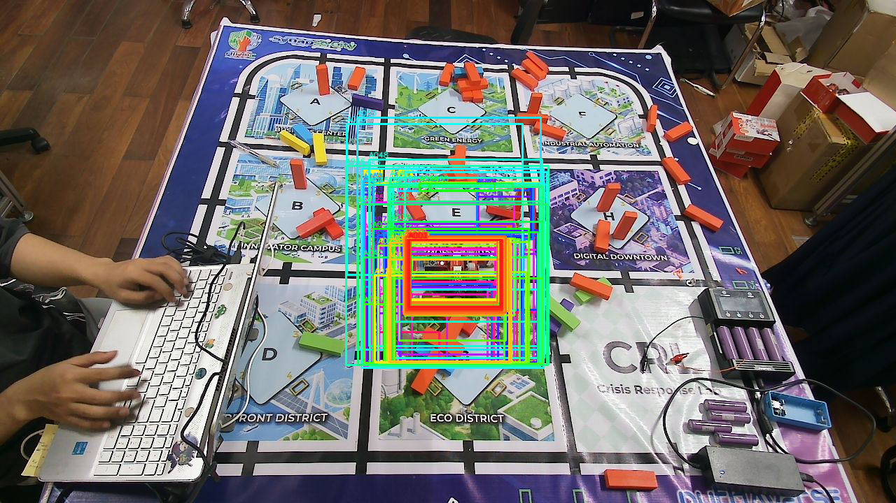

  - File CSV: 

  [manual_cap_679_20260724_143153_orig_roi160_top100_anchors.csv](https://github.com/HoangAnh301194/Leanbot_orientation_estimation-CNN_base/blob/master/260724/benchmark/manual_captures_anchor_analysis/manual_cap_679_20260724_143153_orig_roi160_top100_anchors.csv)


- **Ảnh nhiễu 2:** 

|Ảnh gốc|Ảnh UI|
|:--:|:--:|
|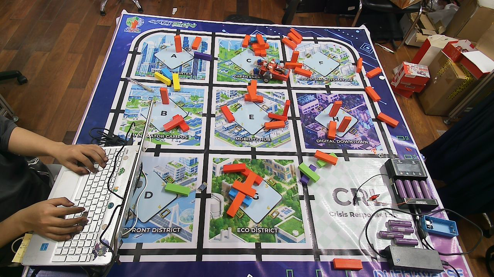|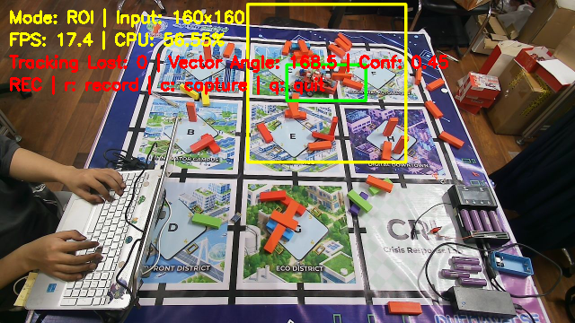|

  - Ảnh Anchor trực quan hóa 

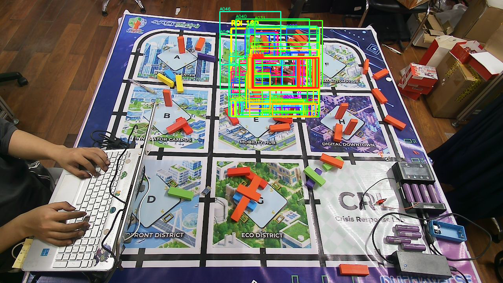

  - File CSV: [manual_cap_962_20260724_143212_orig_roi160_top100_anchors.csv](https://github.com/HoangAnh301194/Leanbot_orientation_estimation-CNN_base/blob/master/260724/benchmark/manual_captures_anchor_analysis/manual_cap_962_20260724_143212_orig_roi160_top100_anchors.csv)

- **Ảnh nhiễu 3:** 

|Ảnh gốc|Ảnh UI|
|:--:|:--:|
|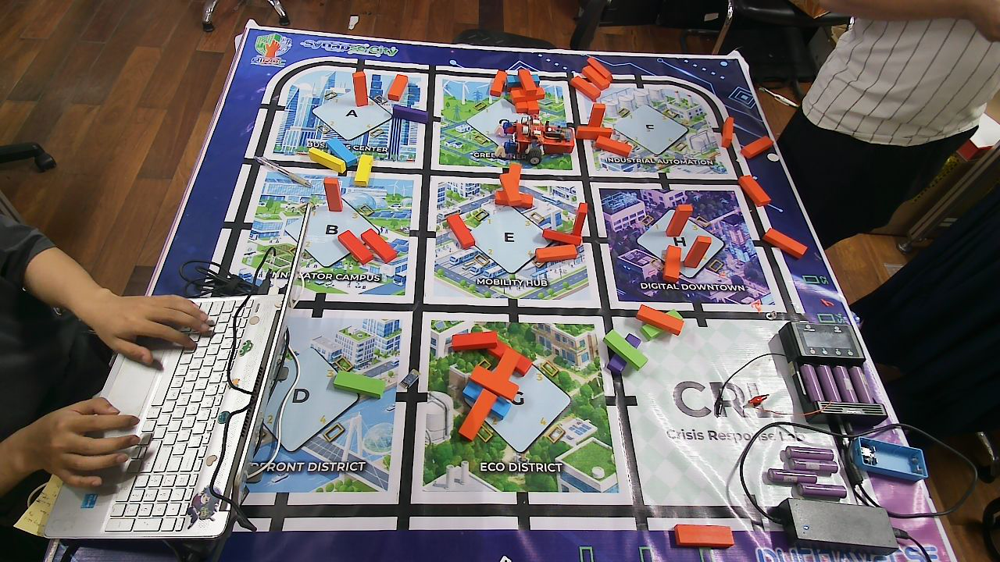|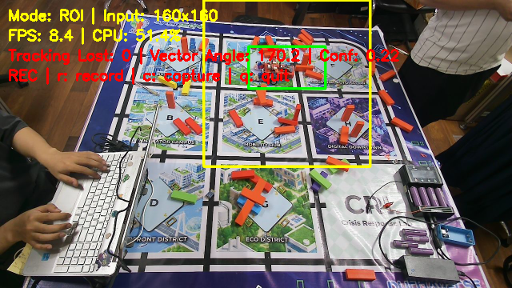|

  - Ảnh Anchor trực quan hóa 

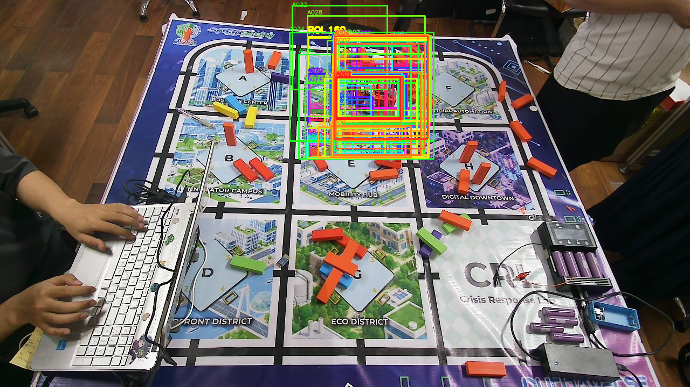

  - File CSV: [manual_cap_1359_20260724_143529_orig_roi160_top100_anchors.csv](https://github.com/HoangAnh301194/Leanbot_orientation_estimation-CNN_base/blob/master/260724/benchmark/manual_captures_anchor_analysis/manual_cap_1359_20260724_143529_orig_roi160_top100_anchors.csv)

- **Ảnh nhiễu 4:**

|Ảnh gốc|Ảnh UI|
|:--:|:--:|
||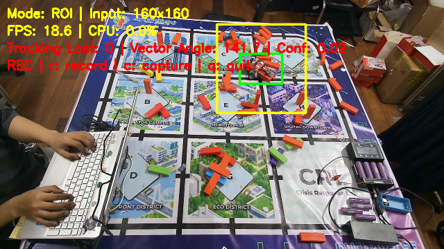|

  - Ảnh Anchor trực quan hóa

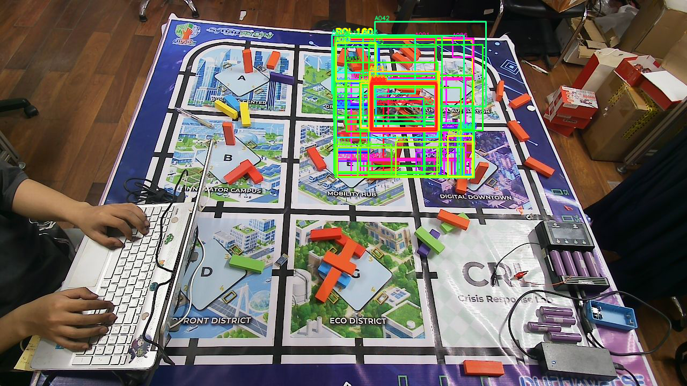

  - File CSV: [manual_cap_456_20260724_143429_orig_roi160_top100_anchors.csv](https://github.com/HoangAnh301194/Leanbot_orientation_estimation-CNN_base/blob/master/260724/benchmark/manual_captures_anchor_analysis/manual_cap_456_20260724_143429_orig_roi160_top100_anchors.csv)

- **Ảnh nhiễu 5:**

|Ảnh gốc|Ảnh UI|
|:--:|:--:|
||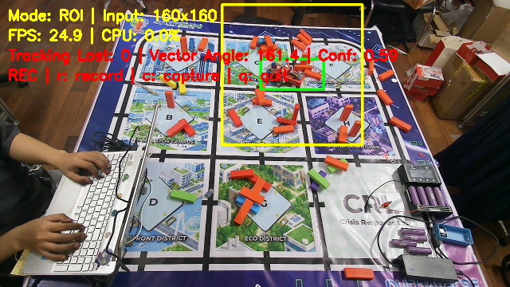|

  - Ảnh Anchor trực quan hóa

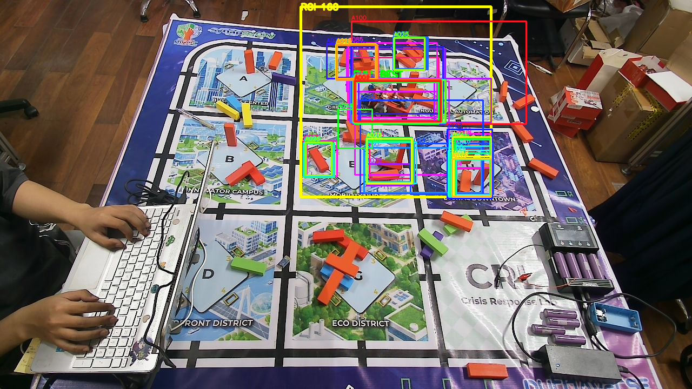

  - File CSV: [manual_cap_469_20260724_143429_orig_roi160_top100_anchors.csv](https://github.com/HoangAnh301194/Leanbot_orientation_estimation-CNN_base/blob/master/260724/benchmark/manual_captures_anchor_analysis/manual_cap_469_20260724_143429_orig_roi160_top100_anchors.csv)

- **Ảnh nhiễu 6:**

|Ảnh gốc|Ảnh UI|
|:--:|:--:|
||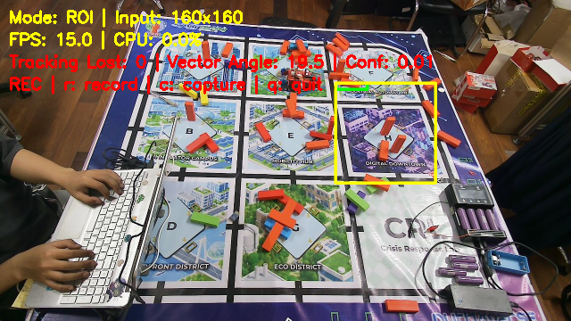|

  - Ảnh Anchor trực quan hóa

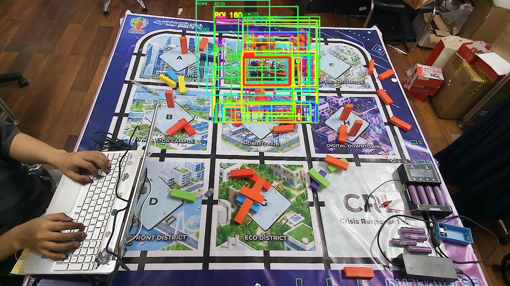

  - File CSV: [manual_cap_485_20260724_143430_orig_roi160_top100_anchors.csv](https://github.com/HoangAnh301194/Leanbot_orientation_estimation-CNN_base/blob/master/260724/benchmark/manual_captures_anchor_analysis/manual_cap_485_20260724_143430_orig_roi160_top100_anchors.csv)

- **Ảnh nhiễu 7:**

|Ảnh gốc|Ảnh UI|
|:--:|:--:|
|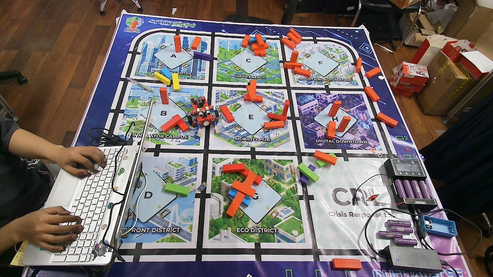|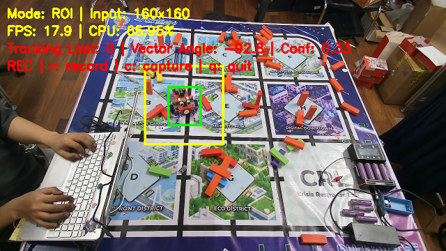|

  - Ảnh Anchor trực quan hóa

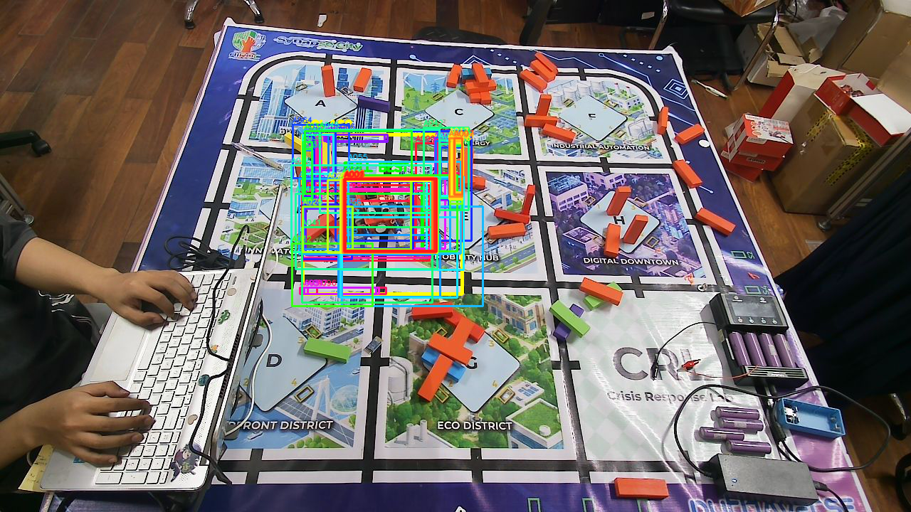

  - File CSV: [manual_cap_580_20260724_143436_orig_roi160_top100_anchors.csv](https://github.com/HoangAnh301194/Leanbot_orientation_estimation-CNN_base/blob/master/260724/benchmark/manual_captures_anchor_analysis/manual_cap_580_20260724_143436_orig_roi160_top100_anchors.csv)

## B. Khó khăn 
- Hiện tại thì Model vẫn bị nhiễu khi Leanbot gần các khối gỗ đỏ. Em có cần chụp thêm ảnh nhiễu nền để train lại khôgn ạ ? 
- Ngoài ra khi train thì dataset hiện tại chỉ có Leanbot trên nền trắng , chưa có trường hợp Leanbot trên nền có vật nhiễu ạ . 
- Hiện tại khi đánh giá chi tiết các ảnh nhiễu và vẽ các Anchors thì em thấy ngưỡng --topK = 100 khá cao, và ảnh trực quan hóa anchors hơi khó nhìn ạ, Em có cần giảm ngưỡng này xuống khôgn ạ ? 

## C. Công việc tiếp theo 
- Hiện tại cấu trúc file CSV debug chi tiết các ảnh đã ổn chưa ạ ? em cần debug thêm thông tin gì không ạ ? 
- Em xin phép nhận hướng đi tiếp theo từ Thầy ạ . 
