# Báo cáo công việc ngày 25/07/2026

## A. Công việc đã làm 
- Báo cáo các data đã từng chạy inference 
- Hàm `cv2.fitEllipse()` vẽ trajectory fit Elipse và tool vẽ lại đồ thị x,y_center dạng đồ thị Oxy 

### 1. Data Inference của các lần chạy từ trước tới giờ : 
|Folder báo cáo ngày|Link log csv | Cấu hình inference | Đồ thị góc, xy_center | 
|:--:|:--:|:--:|:--:|
|[10/07/2026](../260710/Readme.md)|[log_roi_tracking_720p.csv](../260710/benchmark/log_roi_tracking_720p.csv) — 551 frame, lost `0`|ROI tracking; full model `640` + tracking model `160`; camera `source=1`, `1280x720`|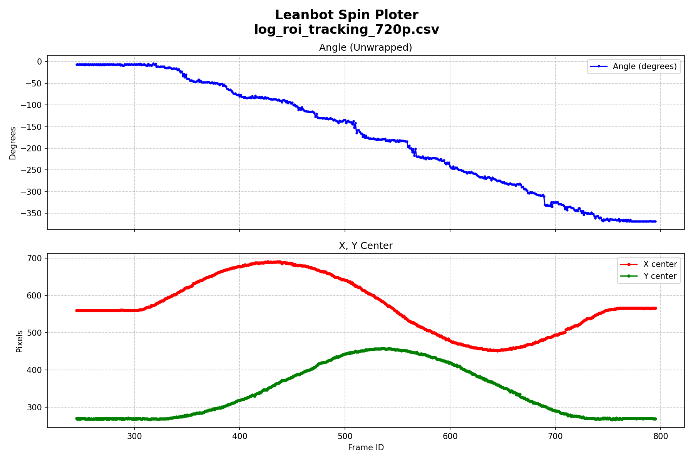|
|[14/07/2026](../260714/Readme.md)|[yolo11n_fp16_roi_tracking.csv — Full HD](../260714/benchmarkFullHD/yolo11n_fp16_roi_tracking.csv) — 561 frame, lost `0`|YOLO11n OpenVINO FP16; ROI `640/160`; camera `source=1`, `1920x1080`; `conf=0.25` mặc định|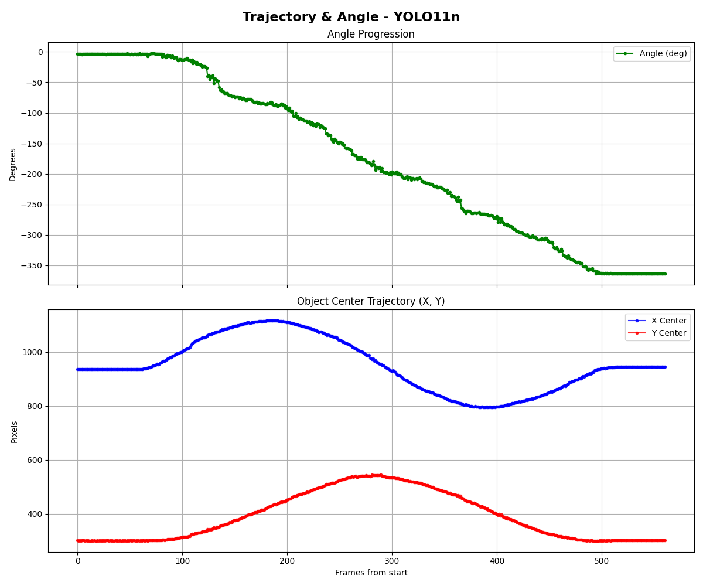|
|[14/07/2026](../260714/Readme.md)|[yolov8n_fp16_roi_tracking.csv — Full HD](../260714/benchmarkFullHD/yolov8n_fp16_roi_tracking.csv) — 566 frame, lost `0`|YOLOv8n OpenVINO FP16; ROI `640/160`; camera `source=1`, `1920x1080`; `conf=0.25` mặc định|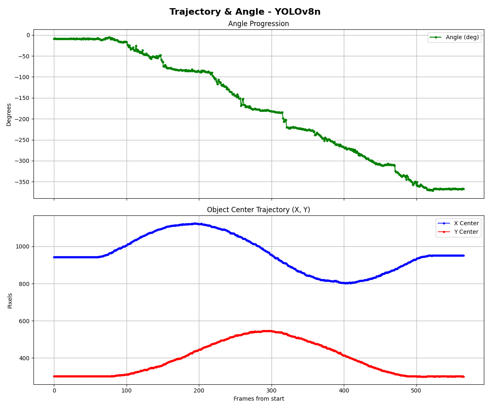|
|[14/07/2026](../260714/Readme.md)|[yolo11n obstacle — conf 0.25 lần 1](../260714/benchmarkWithObstacle/yolo11n_fp16_roi_tracking.csv) — 542 frame, lost `0`|YOLO11n OpenVINO FP16; ROI `640/160`; `1920x1080`; có khối gỗ chắn; `conf=0.25`; lần này BBox bám nhầm vật cản|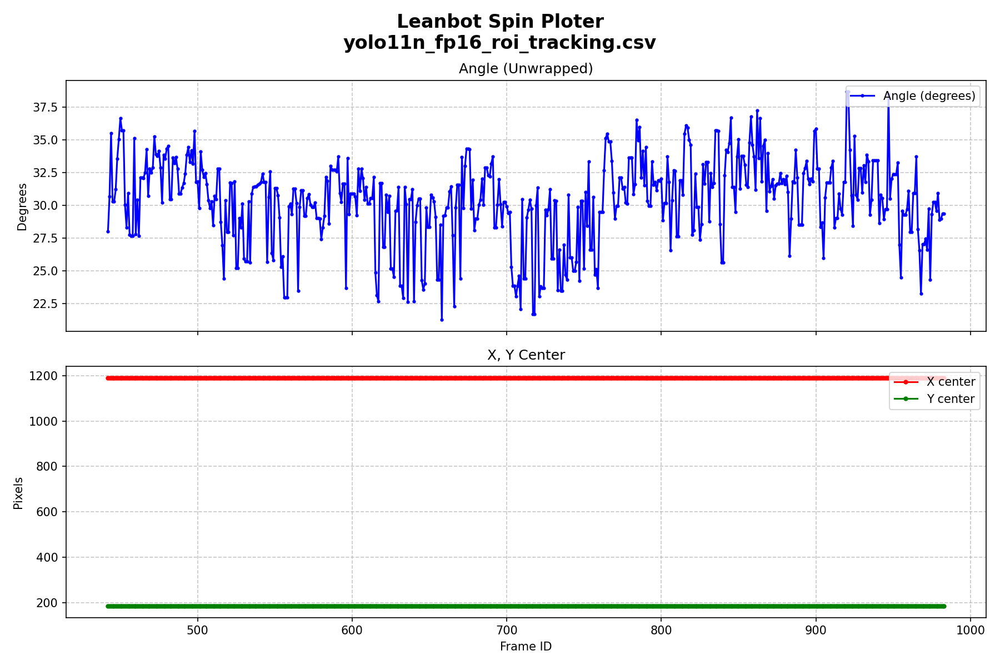|
|[14/07/2026](../260714/Readme.md)|[yolo11n obstacle — conf 0.25 lần 2](../260714/benchmarkWithObstacle/yolo11n_fp16_roi_tracking_tunr2.csv) — 506 frame, lost `2`|YOLO11n OpenVINO FP16; ROI `640/160`; `1920x1080`; có khối gỗ chắn; `conf=0.25`|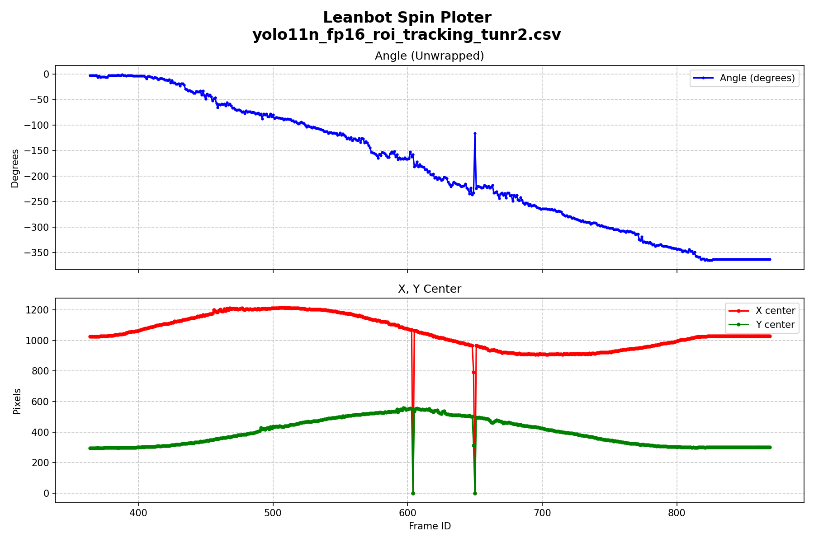|
|[14/07/2026](../260714/Readme.md)|[yolo11n obstacle — conf 0.65](../260714/benchmarkWithObstacle_065/yolo11n_fp16_roi_tracking_065.csv) — 512 frame, lost `14`|YOLO11n OpenVINO FP16; ROI `640/160`; `1920x1080`; có khối gỗ chắn; tăng `conf=0.65`|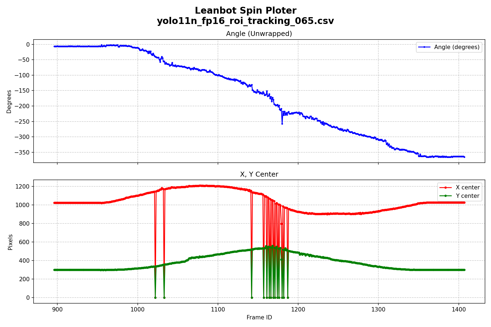|
|[16/07/2026](../260716/Readme.md)|[log_no_nms.csv](../260716/benchmark/log_no_nms.csv) — 549 frame, lost `0`|YOLO11n OpenVINO FP16 No-NMS; ROI static `640/160`; `source=1`; `conf=0.25`, `topk=200`, `IoU=0.5`, `min-mag=2.0`|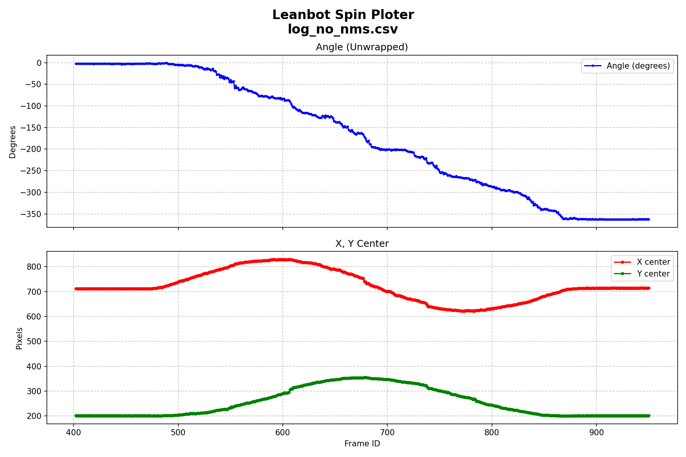|
|[17/07/2026](../260717/Readme.md)|[roi_tracking_log.csv](../260717/leanbot_colab/roi_tracking_log.csv) — 570 frame, lost `4`|YOLO11n retrain có ảnh nền, OpenVINO FP16 No-NMS `640/160`; ROI; `1920x1080`; `conf=0.25`, `topk=200`, `IoU=0.5`, `min-mag=2.0`; Leanbot chạy 5 vòng, bánh `1200/2000`|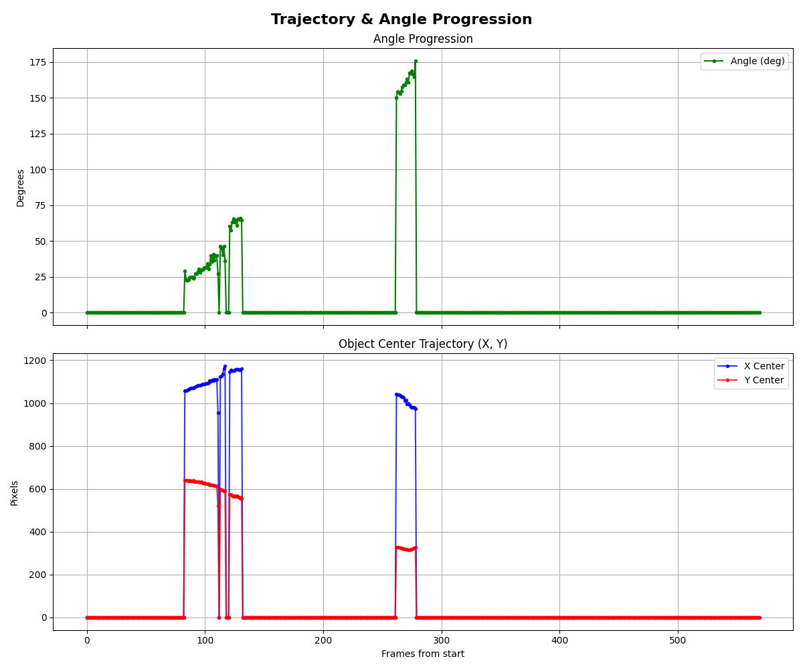|
|[20/07/2026](../260720/Readme.md)|[benchmark1/fullframe_test.csv](../260720/benchmark1/fullframe_test.csv) — 667 frame, lost `1`|Cùng video `1920x1080`; ROI; full/tracking No-NMS `640/160`; `conf=0.01`, `roi_conf=0.01`, `topk=100`, `IoU=0.5`, `min-mag=0.0`; lần 1||
|[20/07/2026](../260720/Readme.md)|[benchmark/fullframe_test.csv](../260720/benchmark/fullframe_test.csv) — 667 frame, lost `1`|Cùng video `1920x1080`; ROI; full/tracking No-NMS `640/160`; `conf=0.01`, `roi_conf=0.01`, `topk=100`, `IoU=0.5`, `min-mag=0.0`; lần 2|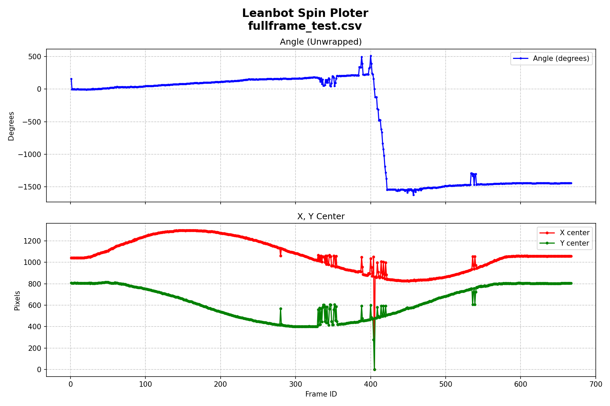|
|[21/07/2026](../260721/Readme.md)|[benchmark_0/fullframe_test.csv](../260721/benchmark_0/fullframe_test.csv) — 560 frame, lost `0`|Camera `source=1`; ROI No-NMS `640/160`; schema log cũ; chạy tắt ngưỡng lọc, nhưng README không lưu riêng lệnh của phiên này|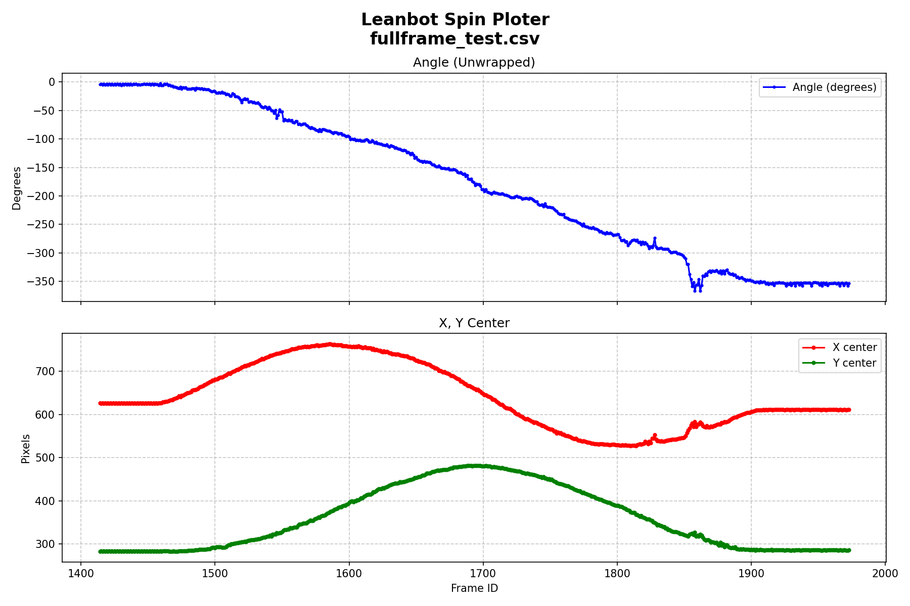|
|[21/07/2026](../260721/Readme.md)|[benchmark/fullframe_test.csv](../260721/benchmark/fullframe_test.csv) — 392 frame, lost `0`|Camera `source=1`; ROI No-NMS `640/160`; `conf=0`, `roi_conf=0`, `topk=100`, `IoU=0.5`, `min-mag=0`; log thêm Group 1/2|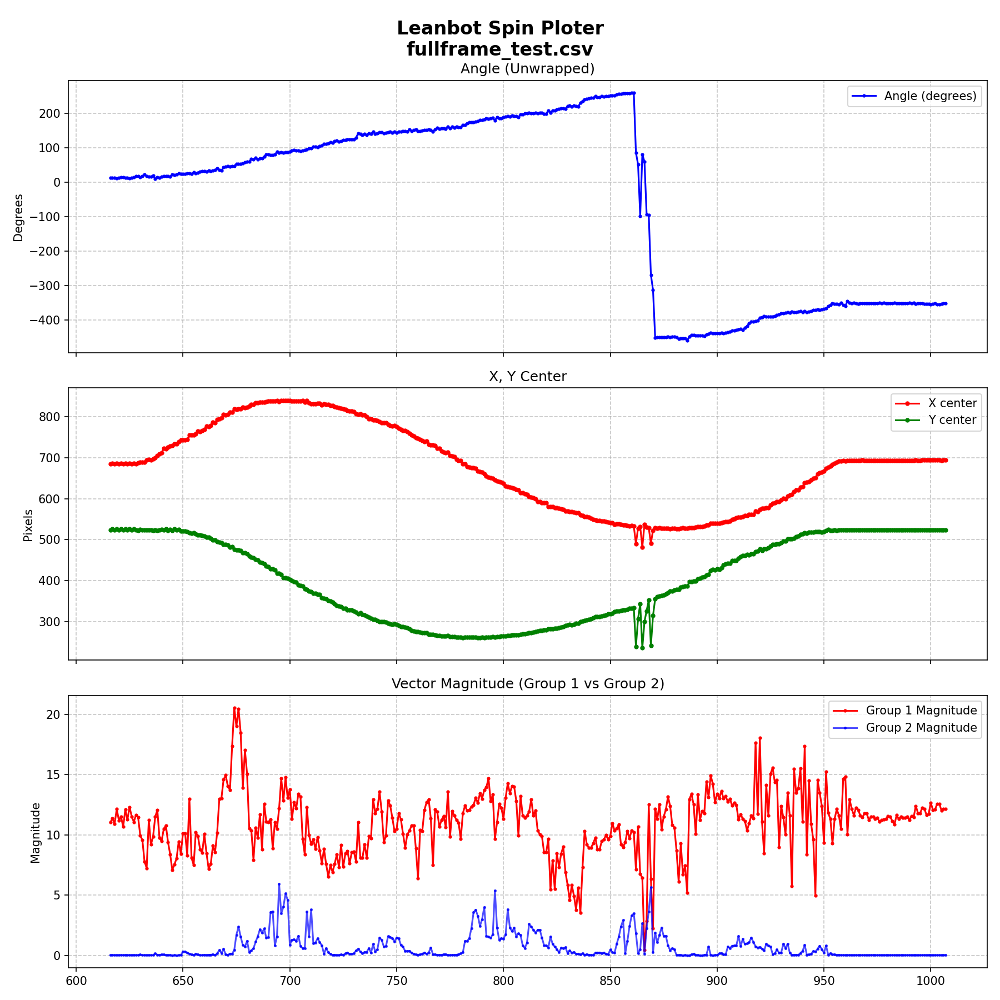|
|[23/07/2026](../260723/Readme.md)|[roi_tracking_redObstacle.csv](../260723/benchmark/roi_tracking_redObstacle.csv) — 289 frame, lost `0`|Camera `source=1`; ROI No-NMS `640/160`; khối đỏ/cam quanh vòng chạy; `conf=0`, `roi_conf=0`, `topk=100`, `IoU=0.5`, `min-mag=0`|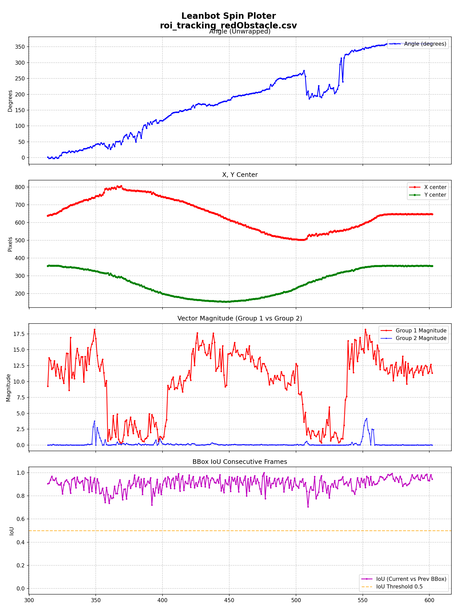|
|[24/07/2026](../260724/Readme.md)|[roi_tracking_redObstacle.csv](../260724/benchmark/roi_tracking_redObstacle.csv) — 349 frame, lost `0`|Camera `source=1`; ROI No-NMS `640/160`; nhiều khối đỏ/cam; `conf=0`, `roi_conf=0`, `topk=100`, `IoU=0.5`, `mag-threshold=0`|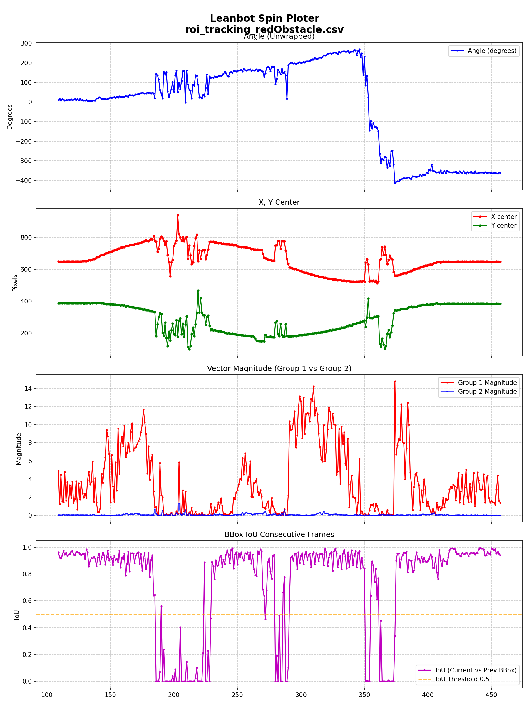|

> **Tổng cộng: 14 log inference Leanbot chạy vòng tròn khác nhau.** Chỉ giữ pipeline ROI tracking sử dụng hai model Full `640` + Tracking `160` và input là `FullHD` (`1920x1080`); Lọc bỏ các log chạy model có NMS, chế độ baseline/full-frame độc lập và input `2K` (`2560x1440`).

### 2. Tool vẽ đồ thị x,y_center trong không gian Oxy  và hàm `cv2.fitEllipse()` vẽ Trajectory fit elipse .
- Tool sử dụng : [plot_oxy_trajectory.py](tools/plot_oxy_trajectory.py)
- Log CSV lựa chọn để vẽ đồ thị Oxy_center (em chọn dựa trên quan sát đồ thị góc và tracking tốt, không bị nhiễu nhiều) : [260716/benchmark/log_no_nms.csv](../260716/benchmark/log_no_nms.csv)
- Tool chỉ sử dụng các điểm có `x_center > 0`, `y_center > 0` và `tracking_lost = 0` để đưa tọa độ các pixel và tập hợp quỹ tích vẽ ellipse.
- Hệ trục dùng toàn bộ frame Full HD: `X = 0..1920`, `Y = 0..1080`; PNG đầu ra đúng `1920x1080`, không zoom theo `min/max` của quỹ đạo.
- Lệnh chạy tool bằng venv:
```bash
.\venv\Scripts\python.exe 260725/tools/plot_oxy_trajectory.py 260716/benchmark/log_no_nms.csv --out-dir 260725/benchmark --frame-width 1920 --frame-height 1080
```

- Đồ thị góc Trajectory và x,y_center theo frame (t) của log csv :


#### Code fit và vẽ ellipse

##### Tài liệu OpenCV tham khảo

- [API `cv::fitEllipse()` — Shape fitting](https://docs.opencv.org/4.x/d3/dc0/group__imgproc__shape.html): hàm nhận tập điểm 2D, cần tối thiểu 5 điểm và trả về một `RotatedRect` mô tả ellipse fit.

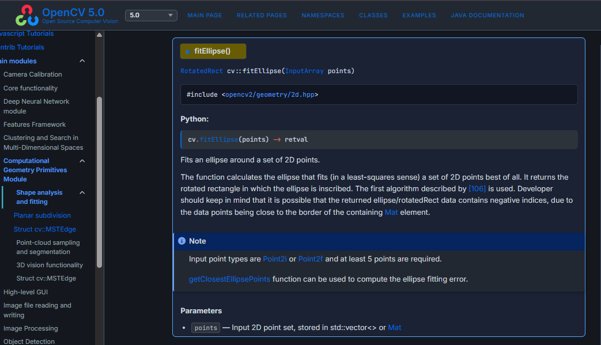


##### `cv2.fitEllipse()`

- Đầu vào là mảng điểm 2D dạng `N x 2`, các cặp `(x_center, y_center)`; thứ tự thời gian không tham gia phép fit, vì toàn bộ điểm hợp lệ được xem như một tập điểm hình học.
- Python trả tuple `((cx, cy), (d1, d2), angle)`, tương đương một `RotatedRect`:
  - `(cx, cy)`: tâm ellipse theo pixel.
  - `(d1, d2)`: hai kích thước đầy đủ của ellipse/khung xoay; công cụ chia `2` để lấy bán trục.
  - `angle`: góc xoay của `RotatedRect` theo độ. Nếu `d2 > d1`, code cộng thêm `90°` để biến `angle` thành góc của bán trục lớn `a`.
- OpenCV yêu cầu ít nhất 5 điểm. Khi các điểm gần thẳng hàng, chỉ phủ một cung rất ngắn hoặc có nhiều điểm tracking sai, ellipse fit có thể không ổn định --> cần lọc `x_center > 0`, `y_center > 0` và `tracking_lost = 0` trước khi gọi hàm.

##### Quy trình fit và vẽ

1. Ghép `x_center`, `y_center` thành ma trận điểm `float32` có kích thước `N x 2`.
2. Gọi `cv2.fitEllipse(pts)` để nhận tâm, kích thước đầy đủ và góc quay của ellipse phù hợp tập điểm.
3. Sắp xếp `a >= b`: `a` là bán trục lớn, `b` là bán trục nhỏ; chuẩn hóa góc để luôn biểu diễn hướng của `a`.
4. Sinh tham số `t` từ `0` đến `2π`. Trong hệ trục cục bộ chưa xoay, điểm trên ellipse là `(a cos(t), b sin(t))`.
5. Xoay điểm cục bộ theo `angle`, rồi tịnh tiến theo tâm `(cx, cy)` để được `x_ellipse`, `y_ellipse` trong hệ tọa độ ảnh.
6. Dùng Matplotlib vẽ 360 điểm đã sinh thành đường đứt nét đỏ. Biểu diễn mỗi góc thay đổi ước lượng là một điểm đối chiếu để vẽ ellipse .

```text
x_ellipse = cx + a*cos(t)*cos(angle) - b*sin(t)*sin(angle)
y_ellipse = cy + a*cos(t)*sin(angle) + b*sin(t)*cos(angle)
```

##### Code trong tool

```python
pts = np.column_stack((x_pts, y_pts)).astype(np.float32)
(cx, cy), (d1, d2), angle = cv2.fitEllipse(pts)

a = max(d1, d2) / 2.0
b = min(d1, d2) / 2.0
if d2 > d1:
    angle = (angle + 90) % 360

t = np.linspace(0, 2 * np.pi, 360)
rad = np.radians(angle)
x_ellipse = cx + a * np.cos(t) * np.cos(rad) - b * np.sin(t) * np.sin(rad)
y_ellipse = cy + a * np.cos(t) * np.sin(rad) + b * np.sin(t) * np.cos(rad)

ax.plot(x_ellipse, y_ellipse, 'r--', linewidth=2, zorder=4)
```
- Link code sử dụng : [plot_oxy_trajectory.py](tools/plot_oxy_trajectory.py)

- Lệnh chạy vẽ quỹ đạo với log [260716/benchmark/log_no_nms.csv](../260716/benchmark/log_no_nms.csv) :
```bash
python .\260725\tools\plot_oxy_trajectory.py .\260716\benchmark\log_no_nms.csv --out-dir .\260725\benchmark --frame-width 1920 --frame-height 1080
```
#### Chú thích đồ thị Oxy
- Quỹ đạo được vẽ trên không gian Oxy , độ phân giải là FullHD (`1920 x 1080`).
- Đường và chấm màu xanh dương: quỹ đạo từ các giá trị `x_center`, `y_center`; 
- Vòng tròn xanh lá: điểm đầu; dấu `X` đỏ: điểm cuối. 
- Đường đứt nét đỏ: ellipse được fit từ toàn bộ điểm hợp lệ bằng hàm `cv2.fitEllipse()`. 
- Hệ tọa độ theo frame camera quy ước bởi OpenCV: gốc ở góc trên bên trái, trục Y hướng xuống.

- Đồ thị quỹ đạo di chuyển trong không gian Oxy (X Center vs Y Center, có fit ellipse):

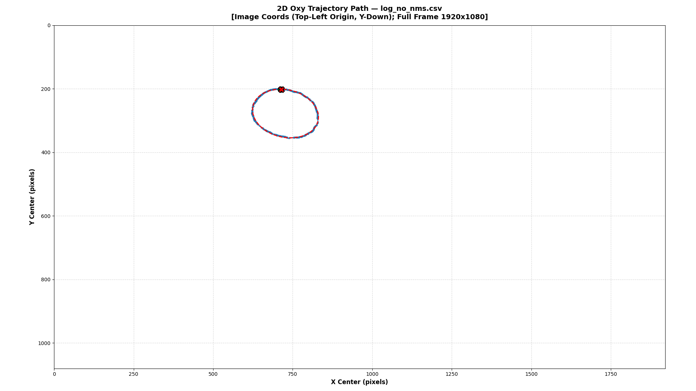


## B. Khó khăn 
- Không

## C. Công việc tiếp theo 
- Chụp lại ảnh dataset để train ( báo cáo lại một vài mẫu để Thầy xác nhận)
- Về phần công việc liên quan tới quỹ đạo chuyển động của Leanbot trên sa bàn em xin phép nhận hướng đi tiếp theo từ Thầy ạ . 
