# Báo cáo công việc ngày 25/07/2026

## A. Công việc đã làm 
- Vẽ lại quỹ đạo di chuyển của toàn bộ các log csv trước đó. 
- Chụp lại ảnh dataset .
- Build dataset. 
### 1. Vẽ lại quỹ đạo di chuyển của các log csv. 
- Các log csv được tái sử dụng và đồ thị quỹ đạo tương ứng : 

|Folder báo cáo ngày|Link log csv | Cấu hình inference | Đồ thị góc, xy_center | Đồ thị quỹ đạo Oxy auto-zoom |
|:--:|:--:|:--:|:--:|:--:|
|[10/07/2026](../260710/Readme.md)|[log_roi_tracking_720p.csv](../260710/benchmark/log_roi_tracking_720p.csv) — 551 frame, lost `0`|ROI tracking; full model `640` + tracking model `160`; camera `source=1`, `1280x720`||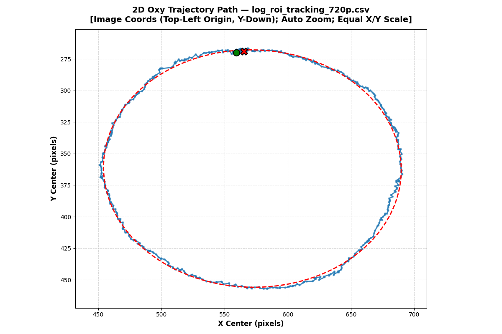|
|[14/07/2026](../260714/Readme.md)|[yolo11n_fp16_roi_tracking.csv — Full HD](../260714/benchmarkFullHD/yolo11n_fp16_roi_tracking.csv) — 561 frame, lost `0`|YOLO11n OpenVINO FP16; ROI `640/160`; camera `source=1`, `1920x1080`; `conf=0.25` mặc định||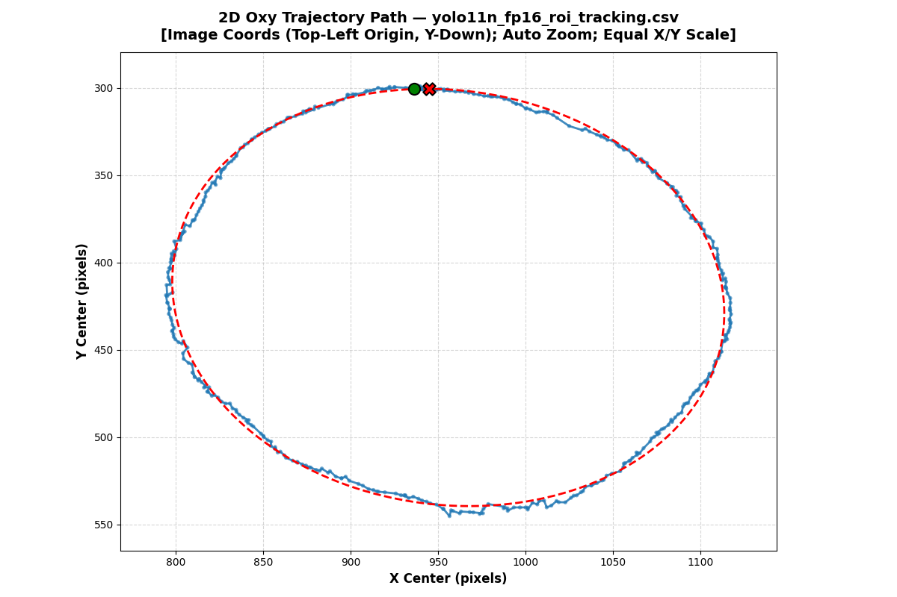|
|[14/07/2026](../260714/Readme.md)|[yolov8n_fp16_roi_tracking.csv — Full HD](../260714/benchmarkFullHD/yolov8n_fp16_roi_tracking.csv) — 566 frame, lost `0`|YOLOv8n OpenVINO FP16; ROI `640/160`; camera `source=1`, `1920x1080`; `conf=0.25` mặc định||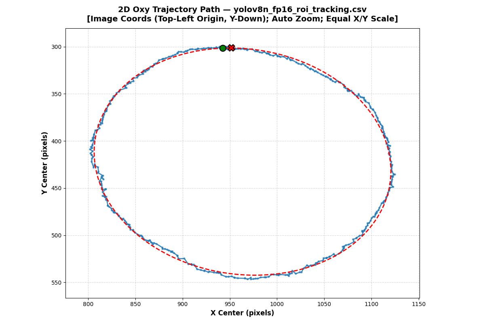|
|[14/07/2026](../260714/Readme.md)|[yolo11n obstacle — conf 0.25 lần 2](../260714/benchmarkWithObstacle/yolo11n_fp16_roi_tracking_tunr2.csv) — 506 frame, lost `2`|YOLO11n OpenVINO FP16; ROI `640/160`; `1920x1080`; có khối gỗ chắn; `conf=0.25`||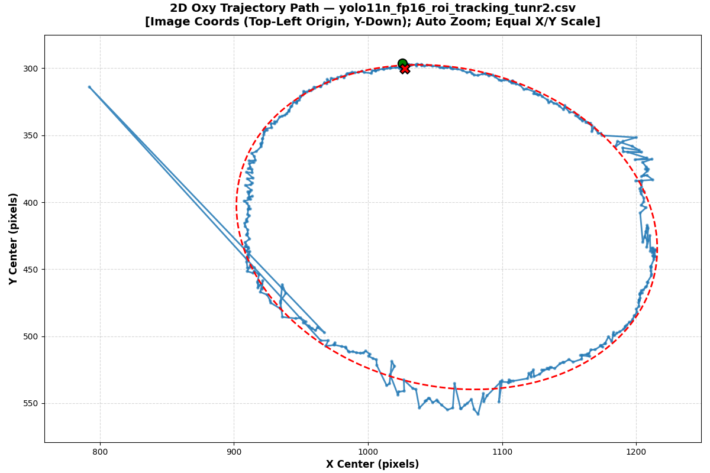|
|[14/07/2026](../260714/Readme.md)|[yolo11n obstacle — conf 0.65](../260714/benchmarkWithObstacle_065/yolo11n_fp16_roi_tracking_065.csv) — 512 frame, lost `14`|YOLO11n OpenVINO FP16; ROI `640/160`; `1920x1080`; có khối gỗ chắn; tăng `conf=0.65`||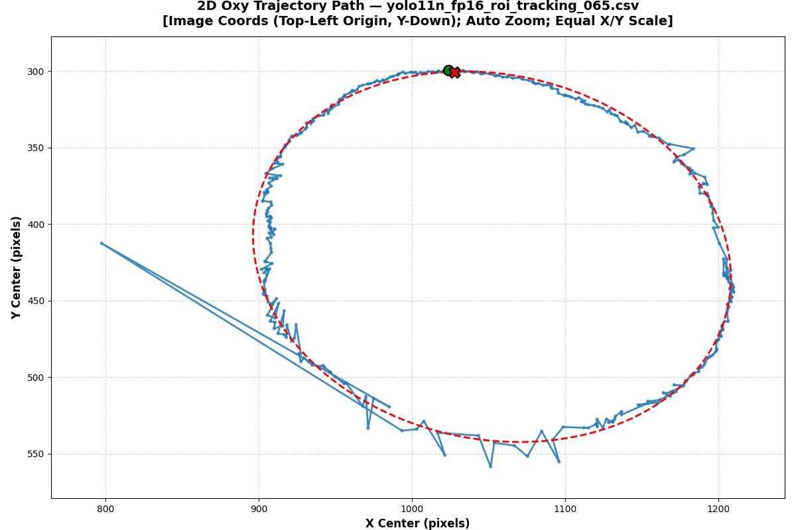|
|[16/07/2026](../260716/Readme.md)|[log_no_nms.csv](../260716/benchmark/log_no_nms.csv) — 549 frame, lost `0`|YOLO11n OpenVINO FP16 No-NMS; ROI static `640/160`; `source=1`; `conf=0.25`, `topk=200`, `IoU=0.5`, `min-mag=2.0`||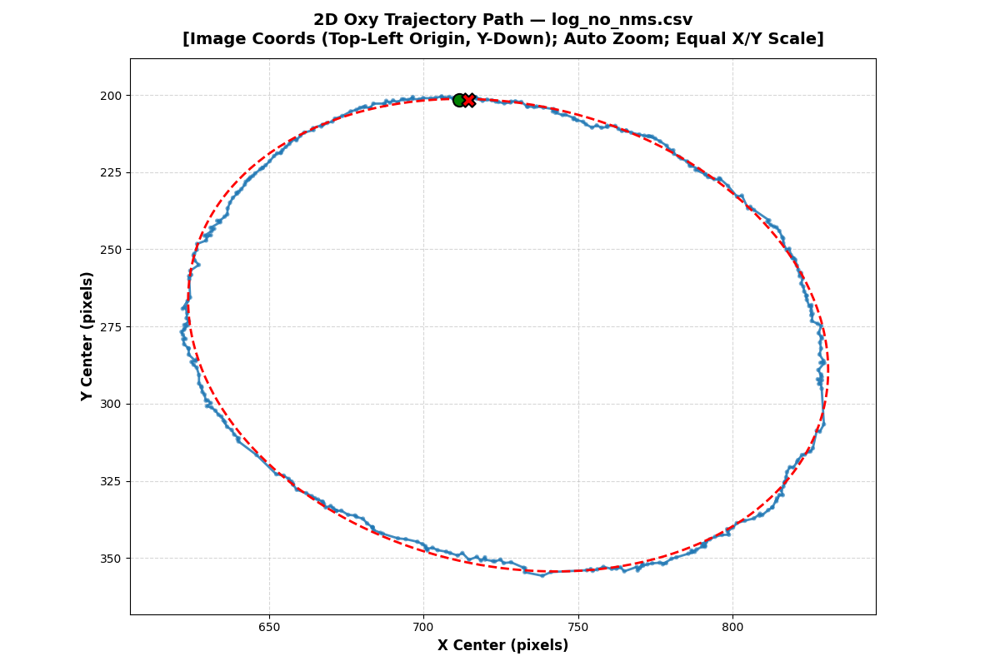|
|[20/07/2026](../260720/Readme.md)|[benchmark1/fullframe_test.csv](../260720/benchmark1/fullframe_test.csv) — 667 frame, lost `1`|Cùng video `1920x1080`; ROI; full/tracking No-NMS `640/160`; `conf=0.01`, `roi_conf=0.01`, `topk=100`, `IoU=0.5`, `min-mag=0.0`; lần 1|||
|[20/07/2026](../260720/Readme.md)|[benchmark/fullframe_test.csv](../260720/benchmark/fullframe_test.csv) — 667 frame, lost `1`|Cùng video `1920x1080`; ROI; full/tracking No-NMS `640/160`; `conf=0.01`, `roi_conf=0.01`, `topk=100`, `IoU=0.5`, `min-mag=0.0`; lần 2||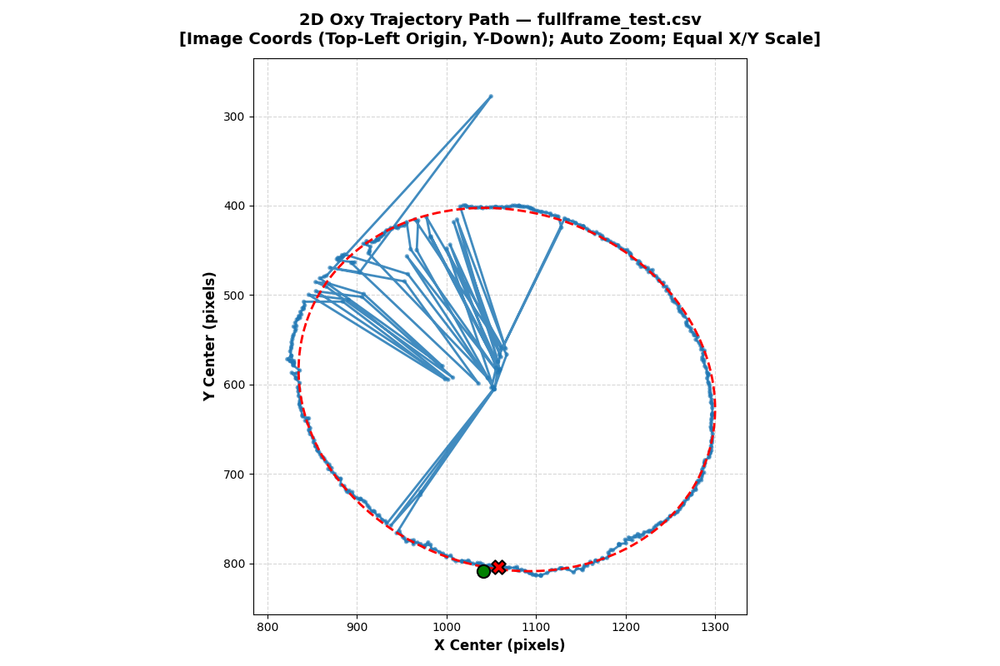|
|[21/07/2026](../260721/Readme.md)|[benchmark_0/fullframe_test.csv](../260721/benchmark_0/fullframe_test.csv) — 560 frame, lost `0`|Camera `source=1`; ROI No-NMS `640/160`; schema log cũ; chạy tắt ngưỡng lọc||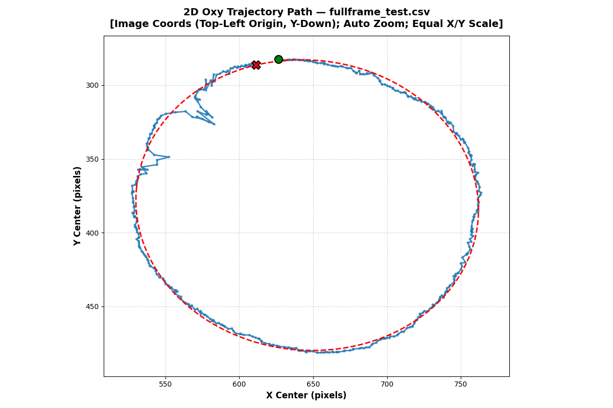|
|[21/07/2026](../260721/Readme.md)|[benchmark/fullframe_test.csv](../260721/benchmark/fullframe_test.csv) — 392 frame, lost `0`|Camera `source=1`; ROI No-NMS `640/160`; `conf=0`, `roi_conf=0`, `topk=100`, `IoU=0.5`, `min-mag=0`; log thêm Group 1/2||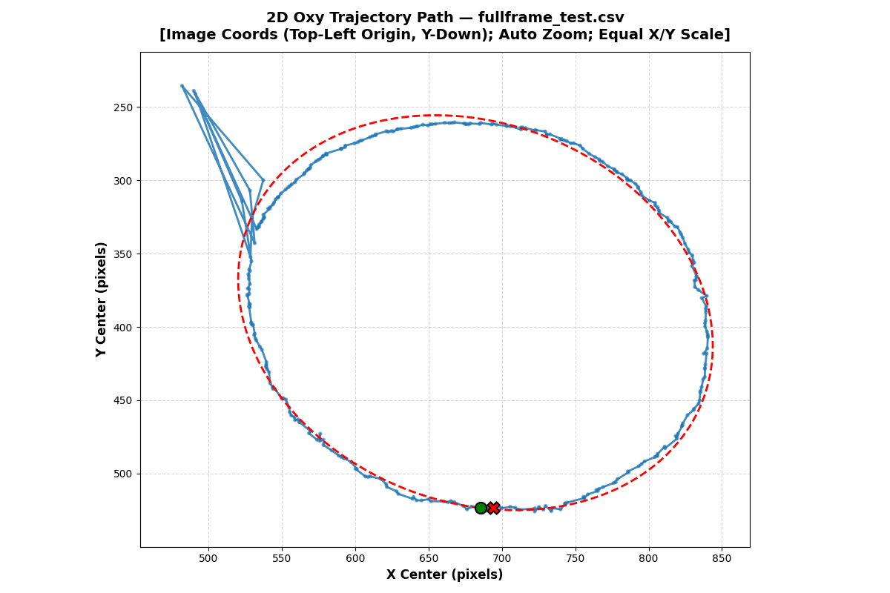|
|[23/07/2026](../260723/Readme.md)|[roi_tracking_redObstacle.csv](../260723/benchmark/roi_tracking_redObstacle.csv) — 289 frame, lost `0`|Camera `source=1`; ROI No-NMS `640/160`; khối đỏ/cam quanh vòng chạy; `conf=0`, `roi_conf=0`, `topk=100`, `IoU=0.5`, `min-mag=0`||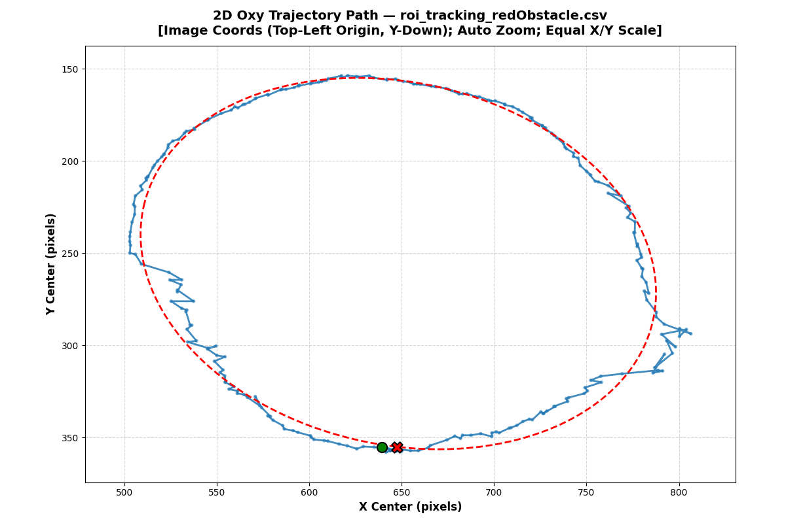|
|[24/07/2026](../260724/Readme.md)|[roi_tracking_redObstacle.csv](../260724/benchmark/roi_tracking_redObstacle.csv) — 349 frame, lost `0`|Camera `source=1`; ROI No-NMS `640/160`; nhiều khối đỏ/cam; `conf=0`, `roi_conf=0`, `topk=100`, `IoU=0.5`, `mag-threshold=0`||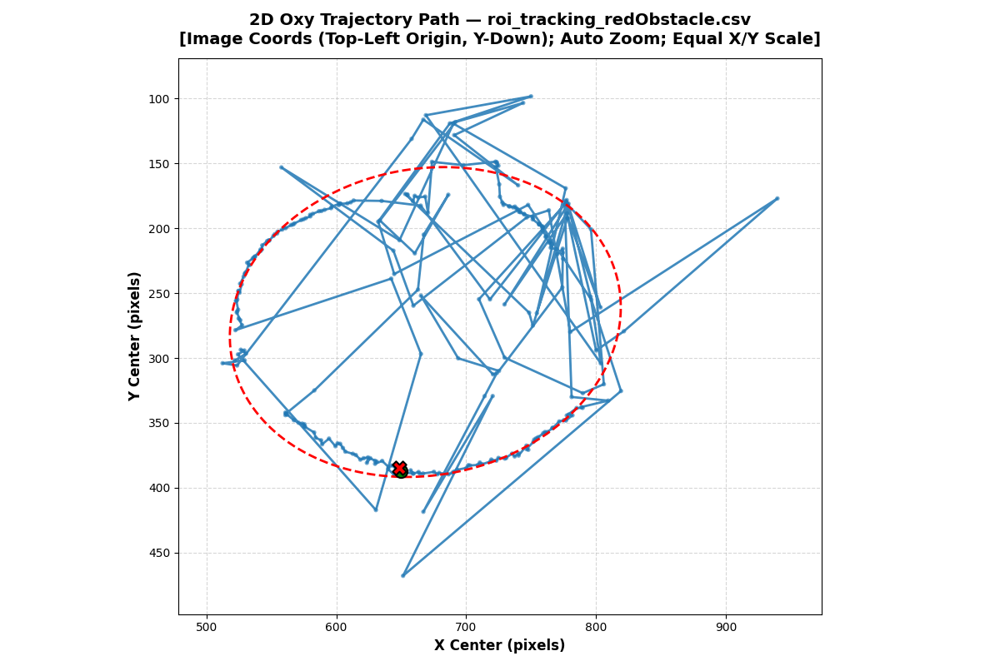|

- Code sử dụng: [tools/plot_oxy_trajectory.py](tools/plot_oxy_trajectory.py)

- Lệnh chạy tại thư mục `260727`:

```powershell
python tools/plot_oxy_trajectory.py
```

- Đồ thị tổng hợp quỹ đạo của các log csv . 

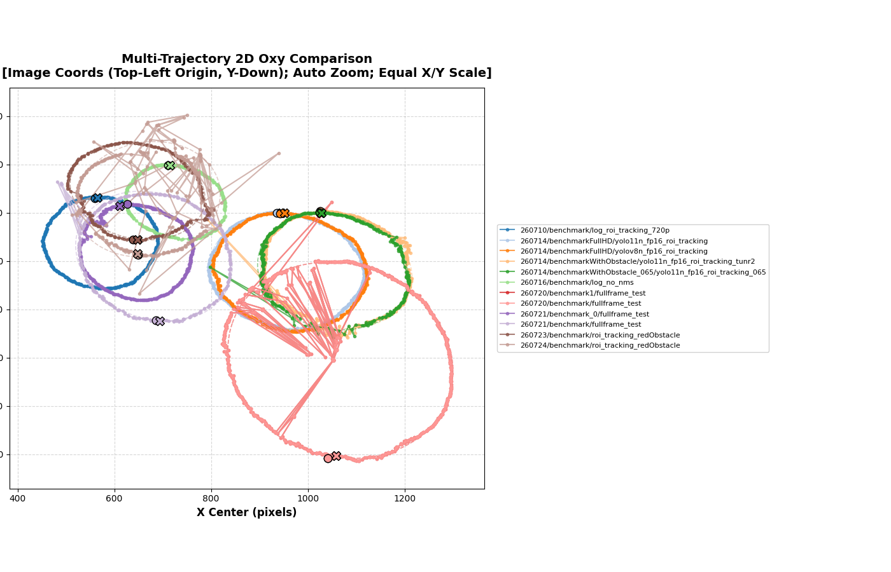

### 2. Chụp lại dataset .
- Trước khi tiến hành chụp thêm cho toàn bộ class em xin phép xin xác nhận từ Thầy các chụp các data như sau ạ 

Ví dụ 1 : 

| Ảnh capture | ảnh background | Ảnh trừ abstract | ảnh Bbox debug |
|-------------|----------------|------------------|----------------|
|  |  |  | 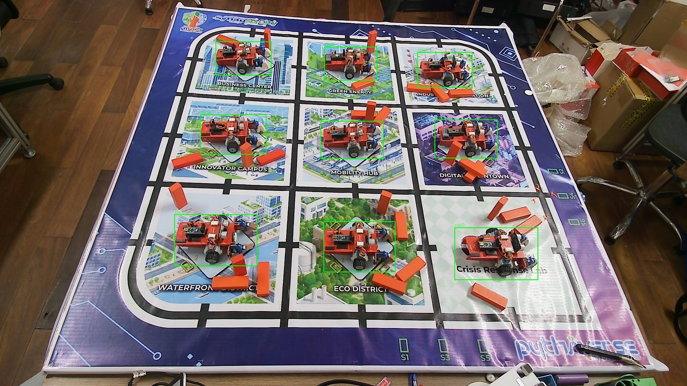 |

Ví dụ 2 :

| Ảnh capture | ảnh background | Ảnh trừ abstract | ảnh Bbox debug |
|-------------|----------------|------------------|----------------|
| 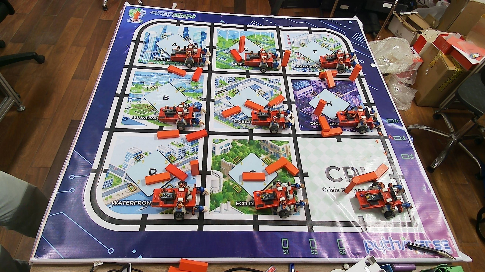 | 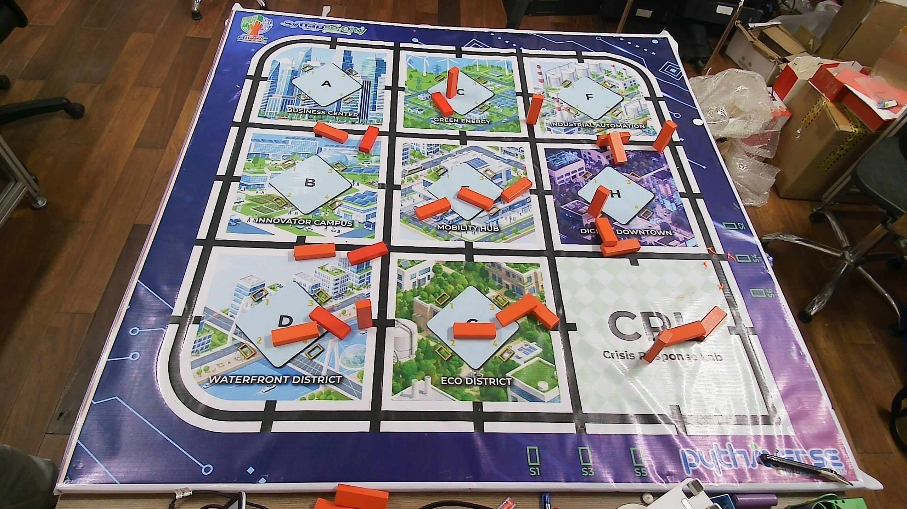 |  |  |

- Các bước chụp 1 ảnh : 
  - Đặt 9 Leanbot trên sa bàn 
  - Đặt các khối gỗ gần Leanbot mà theo thực nghiệm thấy rằng trường hợp đó sẽ lỗi 
  - Chụp ảnh Leanbot và các khối gỗ 
  - Bỏ Leanbot ra, chụp lại 1 lần nữa (chụp background)
  > Thời gian để chụp 1 bức ảnh dataset qua các bước như vậy có hơi mất thời gian ạ , khoảng 1-2 phút cho 1 ảnh ạ .

## B. Khó khăn 
- Không
## C. Công việc tiếp theo
- Training lại và đánh giá lại model mới khi chạy inference . 
