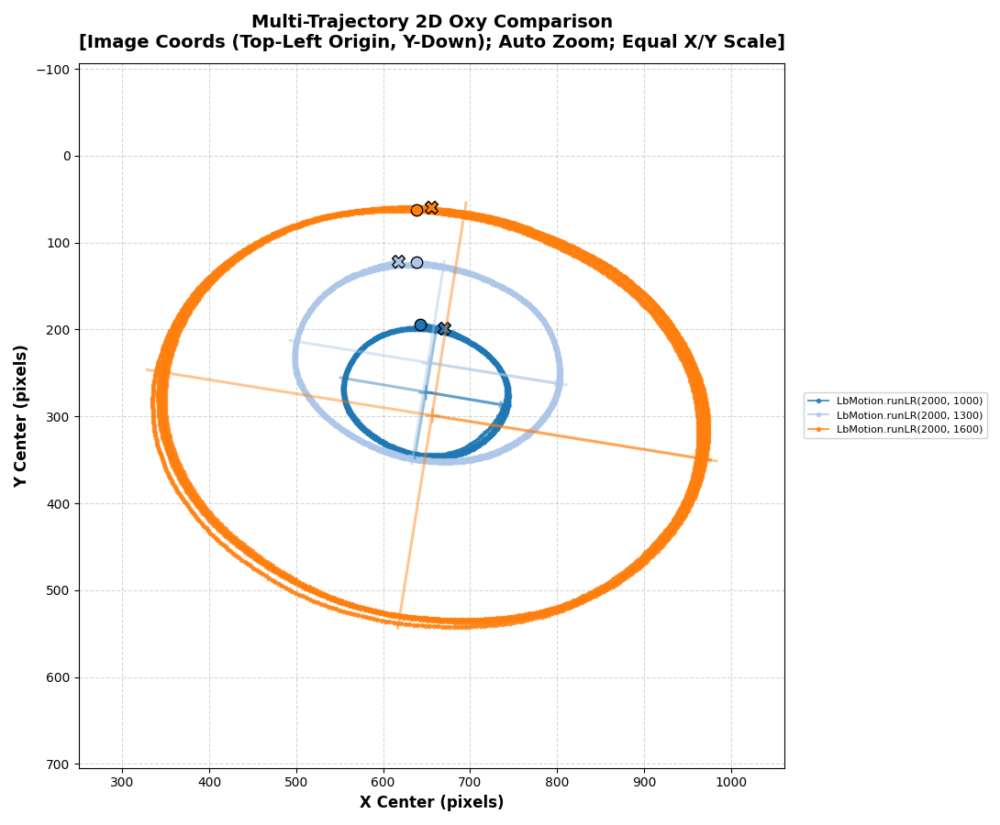
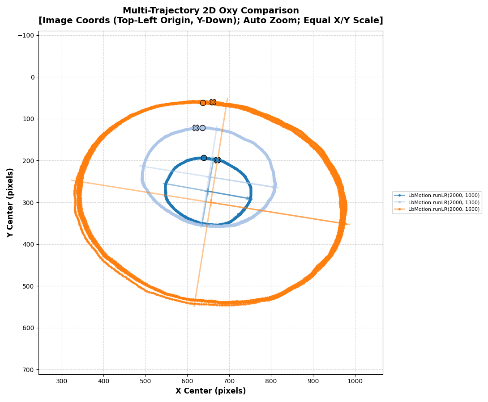
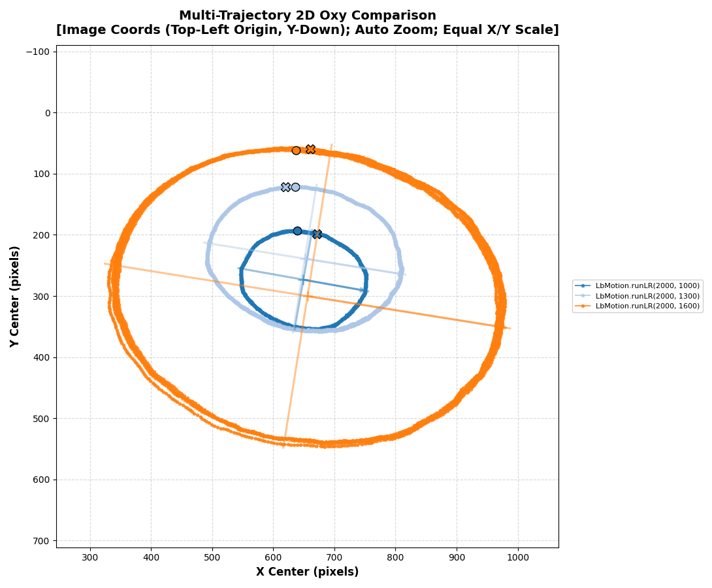
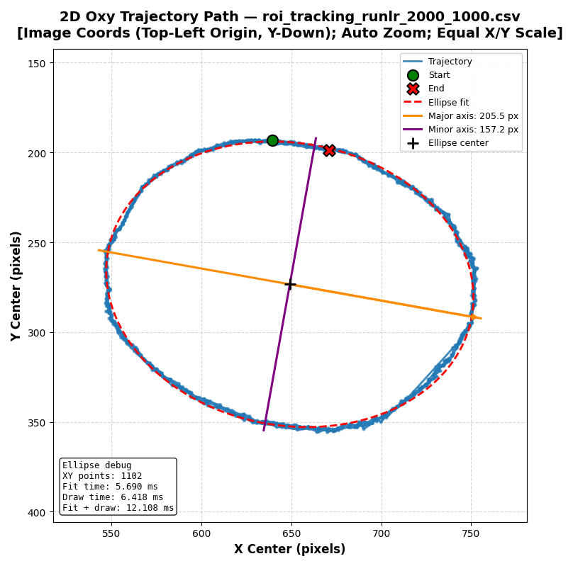
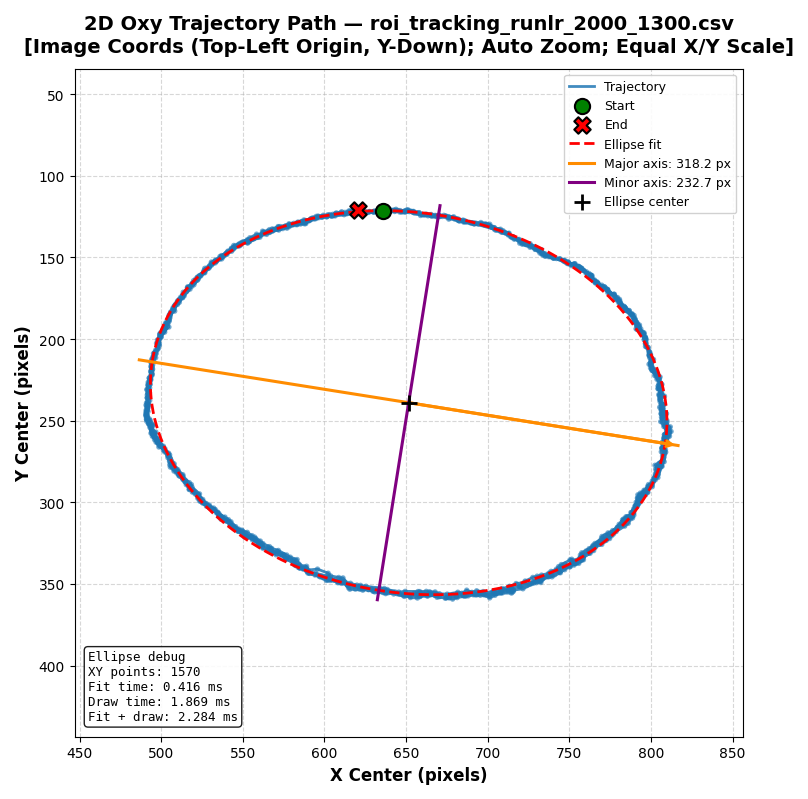
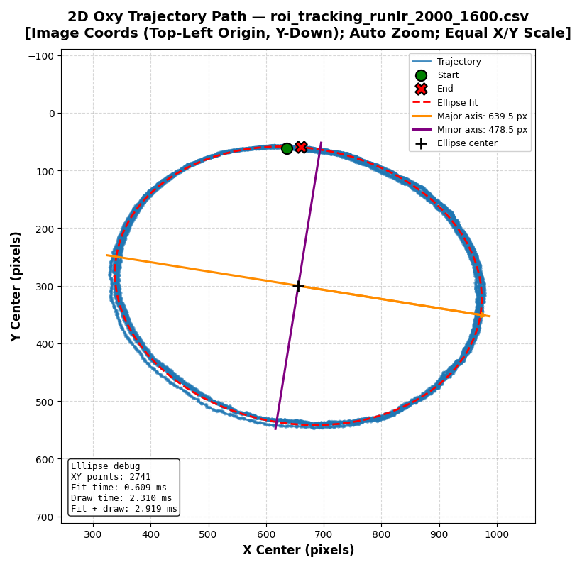

# Báo cáo công việc ngày 31/07/2026

## A. Công việc đã làm 
- Tìm hiểu một số thuật toán làm mượt dữ liệu góc online và offline 
- Đo thời gian vẽ ra hình elipse và debug các điểm x,y_center.
- Từ các điểm x,y_center nối tới tâm hình elipse và vẽ đồ thị góc 

### 1. Các thuật toán làm mượt dữ liệu phổ biến

#### 1.1. Đặc điểm của dữ liệu online và offline

##### Dữ liệu online

Dữ liệu online là dữ liệu được cập nhật liên tục theo thời gian. Tại thời điểm <var>t</var>, thuật toán chỉ có thể sử dụng dữ liệu ở thời điểm hiện tại và quá khứ:

<p align="center"><var>x</var><sub>t</sub>, <var>x</var><sub>t-1</sub>, <var>x</var><sub>t-2</sub>, &hellip;</p>

Thuật toán xử lý dữ liệu online cần đáp ứng các yêu cầu:

* Chi phí tính toán thấp.
* Sử dụng ít bộ nhớ.
* Thời gian xử lý nhỏ.
* Không sử dụng dữ liệu tương lai.
* Có thể hoạt động theo thời gian thực.

##### Dữ liệu offline

Dữ liệu offline là dữ liệu đã được thu thập đầy đủ trước khi xử lý. Khi xử lý dữ liệu tại thời điểm <var>t</var>, thuật toán có thể sử dụng cả dữ liệu quá khứ, hiện tại và tương lai:

<p align="center"><var>x</var><sub>t-1</sub>, <var>x</var><sub>t</sub>, <var>x</var><sub>t+1</sub></p>

Do có thể quan sát toàn bộ quá trình biến đổi của dữ liệu, các thuật toán offline thường có khả năng:

* Làm mượt dữ liệu tốt hơn.
* Giảm độ trễ pha.
* Phát hiện các giá trị bất thường chính xác hơn.
* Phân tích được xu hướng biến đổi tổng thể của tín hiệu.

#### 1.2. Các thuật toán làm mượt dữ liệu offline

##### Moving Average đối xứng

Moving Average đối xứng tính trung bình của các mẫu nằm trước và sau thời điểm đang xét:

<p align="center"><var>y</var><sub>t</sub> = [1 / (2<var>M</var> + 1)] &sum;<sub><var>i</var>=-<var>M</var></sub><sup><var>M</var></sup> <var>x</var><sub>t+i</sub></p>

Trong đó:

* <var>x</var><sub>t</sub> là dữ liệu ban đầu tại thời điểm <var>t</var>.
* <var>y</var><sub>t</sub> là dữ liệu sau khi làm mượt.
* <var>M</var> là số lượng mẫu được sử dụng ở mỗi phía.
* Tổng số mẫu trong cửa sổ là 2<var>M</var> + 1.


##### EMA hai chiều

EMA hai chiều, hay Bidirectional EMA, thực hiện lọc dữ liệu theo hai bước:

1. Chạy EMA từ đầu đến cuối chuỗi dữ liệu.
2. Chạy EMA theo chiều ngược lại, từ cuối về đầu.

##### Median Filter đối xứng

Median Filter thay giá trị tại thời điểm <var>t</var> bằng trung vị của các mẫu trong cửa sổ:

<p align="center"><var>y</var><sub>t</sub> = median(<var>x</var><sub>t-M</sub>, &hellip;, <var>x</var><sub>t</sub>, &hellip;, <var>x</var><sub>t+M</sub>)</p>

##### Gaussian Filter

Gaussian Filter tính trung bình có trọng số của các mẫu lân cận:

<p align="center"><var>y</var><sub>t</sub> = &sum;<sub><var>i</var>=-<var>M</var></sub><sup><var>M</var></sup> <var>w</var><sub>i</sub><var>x</var><sub>t+i</sub></p>

Trong đó <var>w</var><sub>i</sub> là các trọng số được xác định theo phân bố Gaussian. Những mẫu nằm gần thời điểm <var>t</var> có trọng số lớn hơn những mẫu ở xa.
#### 1.3. Các thuật toán làm mượt dữ liệu online

##### Exponential Moving Average (EMA)

EMA được xác định bởi:

<p align="center"><var>y</var><sub>t</sub> = &alpha;<var>x</var><sub>t</sub> + (1 - &alpha;)<var>y</var><sub>t-1</sub></p>

Công thức trên cũng có thể viết dưới dạng:

<p align="center"><var>y</var><sub>t</sub> = <var>y</var><sub>t-1</sub> + &alpha;(<var>x</var><sub>t</sub> - <var>y</var><sub>t-1</sub>)</p>

Trong đó:

* <var>x</var><sub>t</sub> là giá trị đo hiện tại.
* <var>y</var><sub>t</sub> là giá trị sau khi lọc.
* <var>y</var><sub>t-1</sub> là kết quả lọc tại thời điểm trước.
* &alpha; là hệ số làm mượt, với 0 &lt; &alpha; &le; 1.

##### Simple Moving Average dạng cửa sổ trượt

Simple Moving Average, viết tắt là SMA, tính trung bình của <var>N</var> mẫu gần nhất:

<p align="center"><var>y</var><sub>t</sub> = (1 / <var>N</var>) &sum;<sub><var>i</var>=0</sub><sup><var>N</var>-1</sup> <var>x</var><sub>t-i</sub></p>

##### Weighted Moving Average

Weighted Moving Average (WMA), gán trọng số khác nhau cho các mẫu trong cửa sổ:

<p align="center"><var>y</var><sub>t</sub> = [&sum;<sub><var>i</var>=0</sub><sup><var>N</var>-1</sup> <var>w</var><sub>i</sub><var>x</var><sub>t-i</sub>] / [&sum;<sub><var>i</var>=0</sub><sup><var>N</var>-1</sup> <var>w</var><sub>i</sub>]</p>

##### Bộ lọc thông thấp IIR bậc một

Bộ lọc thông thấp IIR bậc một có công thức:

<p align="center"><var>y</var><sub>t</sub> = <var>y</var><sub>t-1</sub> + &alpha;(<var>x</var><sub>t</sub> - <var>y</var><sub>t-1</sub>)</p>


> Vì dữ liệu 3 lần chạy hôm qua đều là dữ liệu offline nên em chọn tạm phương pháp phổ biến và dễ triển khai là EMA 2 chiều để làm mượt dữ liệu quỹ đạo được vẽ ra bởi tool [plot_oxy_trajectory.py](tools/plot_oxy_trajectory.py)

#### 1.4. Triển khai Bidirectional EMA (EMA hai chiều) trên dữ liệu offline


##### 1.4.1. Công thức toán
Thuật toán bao gồm hai bước lọc liên tiếp:
1. **Lọc tiến (Forward Filtering):** Áp dụng EMA thông thường từ mẫu đầu tiên đến mẫu cuối cùng.
   <p align="center"><var>y</var><sup>(f)</sup><sub>t</sub> = &alpha;<var>x</var><sub>t</sub> + (1 - &alpha;)<var>y</var><sup>(f)</sup><sub>t-1</sub></p>

2. **Lọc lùi (Backward Filtering):** Áp dụng EMA trên chuỗi kết quả của bước 1, đi ngược từ mẫu cuối cùng về mẫu đầu tiên.
   <p align="center"><var>y</var><sup>(b)</sup><sub>t</sub> = &alpha;<var>y</var><sup>(f)</sup><sub>t</sub> + (1 - &alpha;)<var>y</var><sup>(b)</sup><sub>t+1</sub></p>

**Trong đó:**
*   <var>x</var><sub>t</sub>: Tọa độ điểm gốc hiện tại (X hoặc Y) tại thời điểm <var>t</var>.
*   <var>y</var><sup>(f)</sup><sub>t</sub>: Tọa độ sau khi lọc tiến.
*   <var>y</var><sup>(b)</sup><sub>t</sub>: Tọa độ sau khi lọc lùi (kết quả quỹ đạo mượt cuối cùng).
*   &alpha;: Hệ số làm mượt (0 &lt; &alpha; &le; 1). Giá trị càng nhỏ thì làm mượt càng mạnh nhưng độ nhạy thay đổi bị giảm.

##### 1.4.2. Code áp dụng
Thuật toán được tích hợp trực tiếp vào tool khi vẽ đồ thị [`tools/plot_oxy_trajectory.py`](tools/plot_oxy_trajectory.py)

```python
import pandas as pd
import numpy as np

def apply_bidirectional_ema(data_array, alpha): # data_array là mảng 1D (tọa độ x hoặc y), alpha là hệ số làm mượt
    series = pd.Series(data_array)
    # 1. Lọc tiến (Forward EMA)
    f_ema = series.ewm(alpha=alpha, adjust=False).mean()
    # 2. Lọc lùi (Backward EMA) 
    b_ema = f_ema.iloc[::-1].ewm(alpha=alpha, adjust=False).mean().iloc[::-1]
    return b_ema.to_numpy(dtype=float)
```
- Gọi tham số làm mượt khi chạy code :
```bash
python tools/plot_oxy_trajectory.py benchmark/roi_tracking_runlr_2000_1300.csv --ema-alpha 0.2
```

##### 1.4.3. Kết quả khi chạy code
- Hệ số alpha = 0.1


- Hệ số alpha = 0.3 


- Hệ số alpha = 0.5 


- Hệ số alpha = 0.7 


- Hệ số alpha = 0.9 


- Hệ số alpha = 1 (Tương đương Chưa lọc)

### 2. Đo thời gian vẽ hình ellipse và debug số điểm `x_center`, `y_center`

#### 2.1. Code sử dụng

- Code đọc CSV, lấy toàn bộ điểm, fit ellipse, đo thời gian và xuất biểu đồ: [`tools/plot_oxy_trajectory.py`](tools/plot_oxy_trajectory.py).


Lệnh chạy toàn bộ CSV trong thư mục `benchmark`:

```powershell
python .\tools\plot_oxy_trajectory.py .\benchmark --multi
```

#### 2.2. Các bước tính toán

**Bước 1 — Đọc toàn bộ điểm tọa độ từ CSV**

Không lọc theo giá trị `x_center`, `y_center` và không lọc theo `tracking_lost`. Các tọa độ bằng `0` hoặc âm vẫn được sử dụng. Code chỉ bỏ dòng không thể chuyển thành số hoặc có `NaN` để tránh truyền dữ liệu không hợp lệ vào OpenCV.

```python
valid_mask = (
    x_values.notna()
    & y_values.notna()
)
```
**Bước 2 — Ghép mảng điểm và fit ellipse**

Hai mảng `x_center`, `y_center` được ghép thành mảng `N x 2`(OpenCV yêu cầu tối thiểu `5` điểm để fit ellipse )

```python
pts = np.column_stack((x_pts, y_pts)).astype(np.float32)
(cx, cy), (d1, d2), angle = cv2.fitEllipse(pts)
```

**Bước 3 — Đo thời gian fit và tạo nét vẽ ellipse**

Thời gian được đo bằng `time.perf_counter()`:

```python
fit_start = time.perf_counter()
ellipse_info = fit_ellipse_to_pts(x, y)
ellipse_fit_time_ms = (time.perf_counter() - fit_start) * 1000.0

draw_start = time.perf_counter()
draw_fitted_ellipse(ax, ellipse_info)
ellipse_draw_time_ms = (time.perf_counter() - draw_start) * 1000.0
```
Ảnh trajectory hiển thị trực tiếp hộp debug gồm:

- Số điểm `XY points` dùng để fit.
- `Fit time`: thời gian chạy thuật toán fit ellipse.
- `Draw time`: thời gian tạo đường ellipse, tâm, trục lớn và trục nhỏ.
- `Fit + draw`: tổng hai khoảng thời gian trên.


**Bước 4 — Tính góc của từng điểm theo thời gian**

- Tâm ellipse là `(cx, cy)`.
- Chiều dương trục lớn hướng về phía có tọa độ `X` lớn hơn và được chọn làm `0°`.
- Trục `Y` ảnh được đổi sang hệ Descartes hướng lên.
- Góc dương tăng ngược chiều kim đồng hồ.

```python
delta_x = x_center - cx
delta_y_cartesian = cy - y_center
radial_angle = np.degrees(np.arctan2(delta_y_cartesian, delta_x))
phase_angle = np.mod(radial_angle - major_axis_angle, 360.0)
```

Đồng thời dùng `np.unwrap()` để tạo góc liên tục qua nhiều vòng quay.

#### 2.3. Kết quả ba file CSV


| Thử nghiệm | File CSV | Số điểm XY sử dụng | Thời gian chạy log | Fit time | Draw time | Fit + draw |
|---|---|---:|---:|---:|---:|---:|
| `2000_1000` | [`roi_tracking_runlr_2000_1000.csv`](benchmark/roi_tracking_runlr_2000_1000.csv) | 1.102 | 75,51 s | 5,690 ms | 6,418 ms | 12,108 ms |
| `2000_1300` | [`roi_tracking_runlr_2000_1300.csv`](benchmark/roi_tracking_runlr_2000_1300.csv) | 1.570 | 105,26 s | 0,416 ms | 1,869 ms | 2,284 ms |
| `2000_1600` | [`roi_tracking_runlr_2000_1600.csv`](benchmark/roi_tracking_runlr_2000_1600.csv) | 2.741 | 183,04 s | 0,609 ms | 2,310 ms | 2,919 ms |


#### 2.4. Quỹ đạo đường ellipse fit

**RunLR `2000 1000`**



- Đồ thị góc theo thời gian: 

.

**RunLR `2000 1300`**



- Đồ thị góc theo thời gian: 

.

**RunLR `2000 1600`**



- Đồ thị góc theo thời gian: 

.


## B. Khó khăn 
- Hiện tại em vẫn chưa đăng nhập được Git để remote vào gitPythaverse nên chưa push code lên được ạ . Em có hỏi anh Thế Anh nhưng vẫn không tìm được nguyên nhân ạ. 
- Em xin phép báo cáo bằng repo Git cá nhân ạ .
## C. Công việc tiếp theo
- Vì em chưa hình dung rõ được các công việc kế tiếp sau khi đã phân tích được góc, vẽ được quỹ đạo thì sẽ trả qua các bước lớn nào để điều khiển được leanbot đi vào trạm sạc nên em xin phép nhận định hướng từ Thầy để em có thể tìm hiểu trước các phần đó song song với công việc Thầy giao khi làm trên công ty ạ . 
- Em xin phép nhận hướng đi tiếp theo từ Thầy ạ 
