# Báo cáo công việc ngày 04/08/2026

## A. Công việc đã làm 
- Thực hiện triển khai phương pháp **Polynomial Smooth (bậc 3, độ dài 30)** vào chạy online (real-time).

## 1. File Code sử dụng

- [`tools/roi_tracking_online_poly_smooth.py`](tools/roi_tracking_online_poly_smooth.py): Tool thực hiện ROI Tracking kết hợp làm mượt đa thức Online dạng Sliding Window.
- [`tools/plot_online_poly_log.py`](tools/plot_online_poly_log.py): Công cụ vẽ biểu đồ báo cáo thời gian và đồ thị quỹ đạo 2D (Raw vs Smooth) từ file CSV log.

---

## 2. Các bước thực hiện

### Bước 1: Thiết lập cấu hình thuật toán
- Khai báo các thông số làm mượt online cố định:
  - `SMOOTH_LENGTH = 30` (sử dụng cửa sổ 30 điểm raw point gần nhất).
  - `SMOOTH_ORDER = 3` (đa thức bậc 3).

### Bước 2: Xử lý cửa sổ trượt (Sliding Window) Online
- Với mỗi frame thu nhận được tọa độ thô $(raw\_x, raw\_y)$:
  - Đưa điểm mới vào cửa sổ đệm `raw_window` (tối đa 30 điểm).
  - Chuẩn hóa trục thời gian: $t = \frac{[0, 1, \dots, 29]}{30} \in [0.0, 0.967)$.

### Bước 3: Fit Polynomial bậc 3 & Tính điểm mượt mới nhất
- Fit 2 đa thức bậc 3 cho tọa độ $X$ và $Y$:
  $$x_{smooth}(t) = a_3 t^3 + a_2 t^2 + a_1 t + a_0$$
  $$y_{smooth}(t) = b_3 t^3 + b_2 t^2 + b_1 t + b_0$$
- Tính duy nhất vị trí mượt $(smooth\_x, smooth\_y)$ cho điểm thứ 30 (tại $t = \frac{29}{30}$):
  $$smooth\_x = f_x(29/30), \quad smooth\_y = f_y(29/30)$$
- Khi mất tracking (`tracking_lost == 1`): Bỏ qua frame bị lost, khi có frame mới không bị lost thì tiếp tục kết hợp với các điểm hợp lệ trước đó để smooth.

### Bước 4: Thực nghiệm và Ghi log CSV & Vẽ đồ thị quỹ đạo
- Cho Leanbot liên tục chạy vòng tròn với lệnh `LbMotion.runLR(2000, 1300)`.
- Nhấn phím `r` để bật/tắt ghi luồng dữ liệu bao gồm $x_{center}, y_{center}$ thô và $smooth\_x, smooth\_y$ vào file CSV log tương ứng khi xe chạy được 1 vòng, 2 vòng và 3 vòng.
- Sử dụng `plot_online_poly_log.py` để tự động xuất các đồ thị quỹ đạo 2D (nét mảnh, point nhỏ) cùng các đồ thị thành phần.

---

## 3. Lệnh chạy

### Chạy Online Tracking & Smooth:
```powershell
python tools/roi_tracking_online_poly_smooth.py --source 1 --log 1turn.csv
python tools/roi_tracking_online_poly_smooth.py --source 1 --log 2turn.csv
python tools/roi_tracking_online_poly_smooth.py --source 1 --log 3turn.csv
```

### Vẽ đồ thị báo cáo:
```powershell
python tools/plot_online_poly_log.py benchmark/1turn.csv
python tools/plot_online_poly_log.py benchmark/2turn.csv
python tools/plot_online_poly_log.py benchmark/3turn.csv
```

---

## 4. Kết quả Inference & Đồ thị chi tiết
- Leanbot chạy các vòng với vận tốc `LbMotion.runLR(2000, 1300)`.

### 4.1. Leanbot chạy 1 vòng
Dữ liệu log: [`benchmark/1turn.csv`](benchmark/1turn.csv)

#### a) Đồ thị Quỹ đạo 2D (Raw vs Online Poly Smooth)
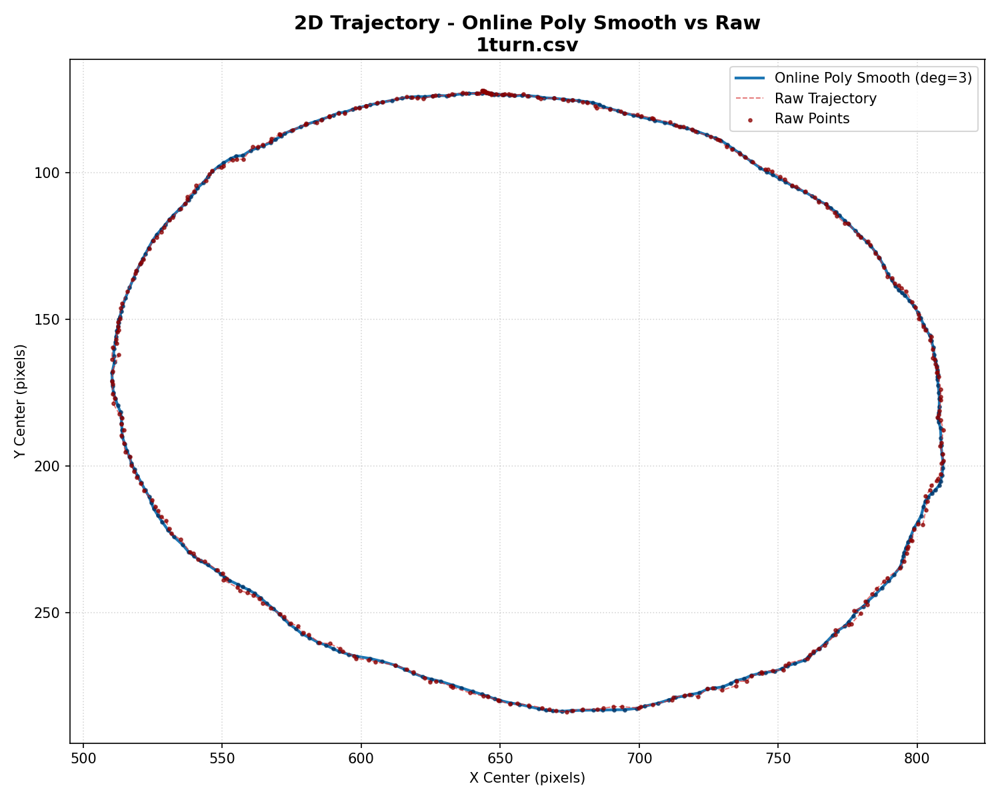

#### b) Đồ thị Đa thức $f_x(t), f_y(t)$ theo các đoạn 30 điểm mẫu

- **Segment 1 — index frames `[102 .. 131]`:**
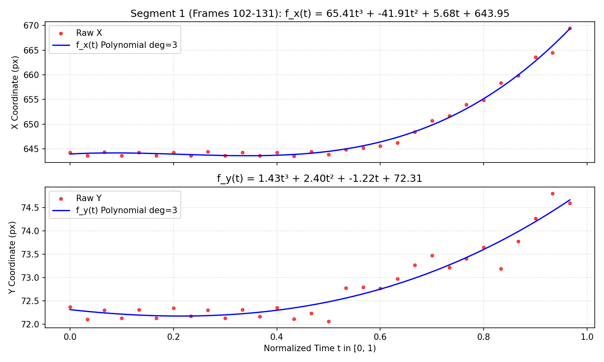

- **Segment 2 — index frames `[253 .. 282]`:**
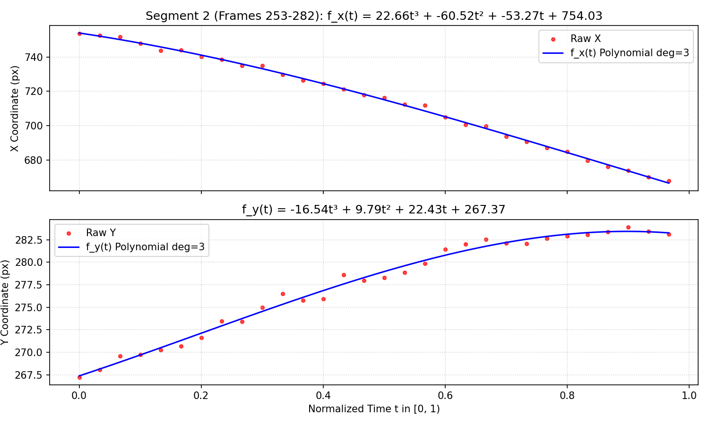

- **Segment 3 — index frames `[404 .. 433]`:**
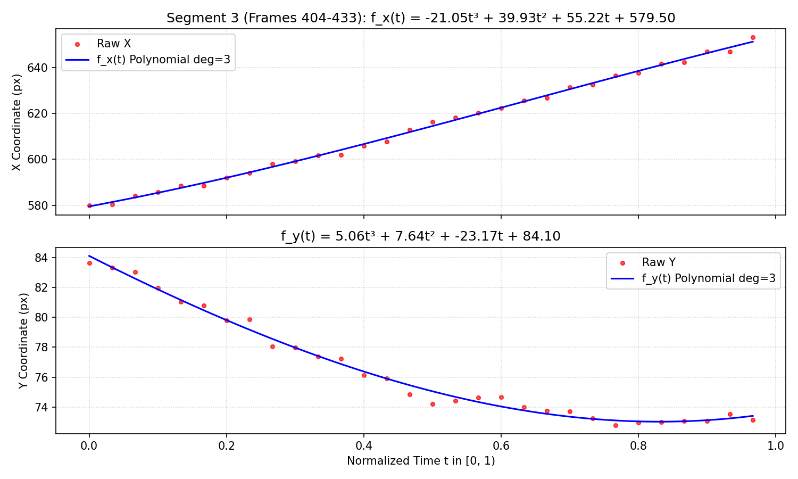

#### c) Biểu đồ Chuỗi thời gian (Time-series Log)
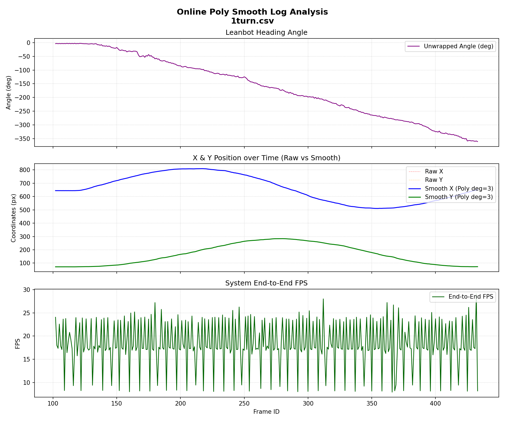

---

### 4.2. Leanbot chạy 2 vòng liên tục
Dữ liệu log: [`benchmark/2turn.csv`](benchmark/2turn.csv)

#### a) Đồ thị Quỹ đạo 2D (Raw vs Online Poly Smooth)
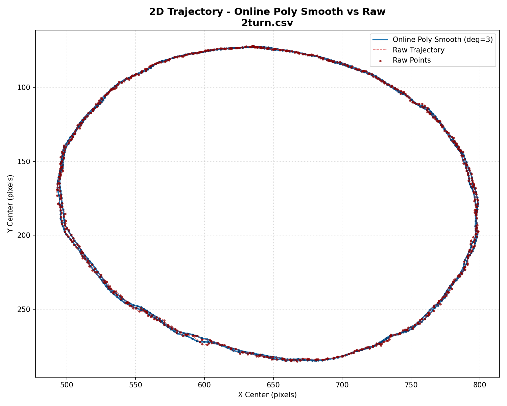

#### b) Đồ thị Đa thức $f_x(t), f_y(t)$ theo các đoạn 30 điểm mẫu

- **Segment 1 — index frames `[106 .. 135]`:**
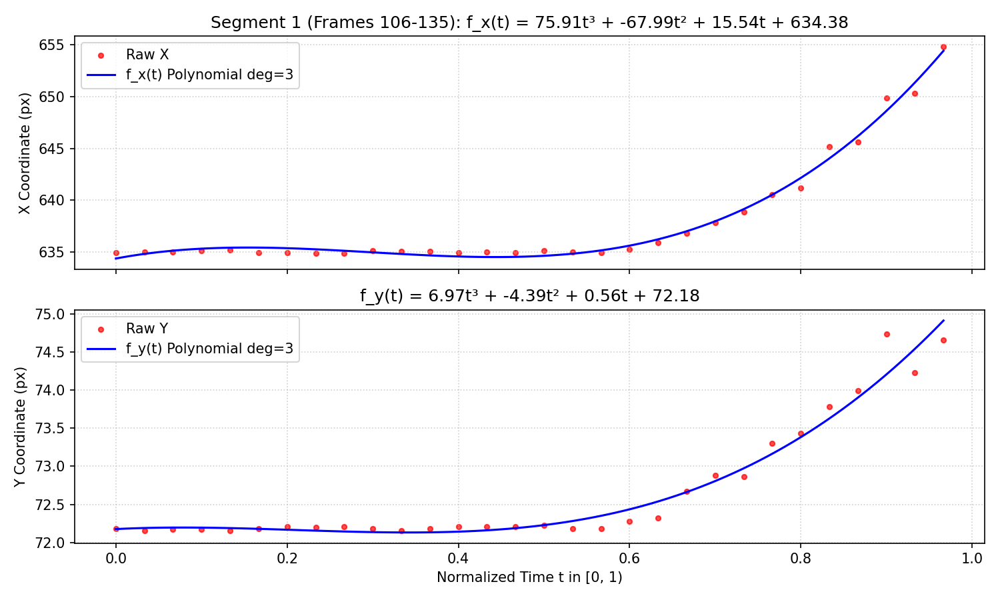

- **Segment 2 — index frames `[414 .. 443]`:**
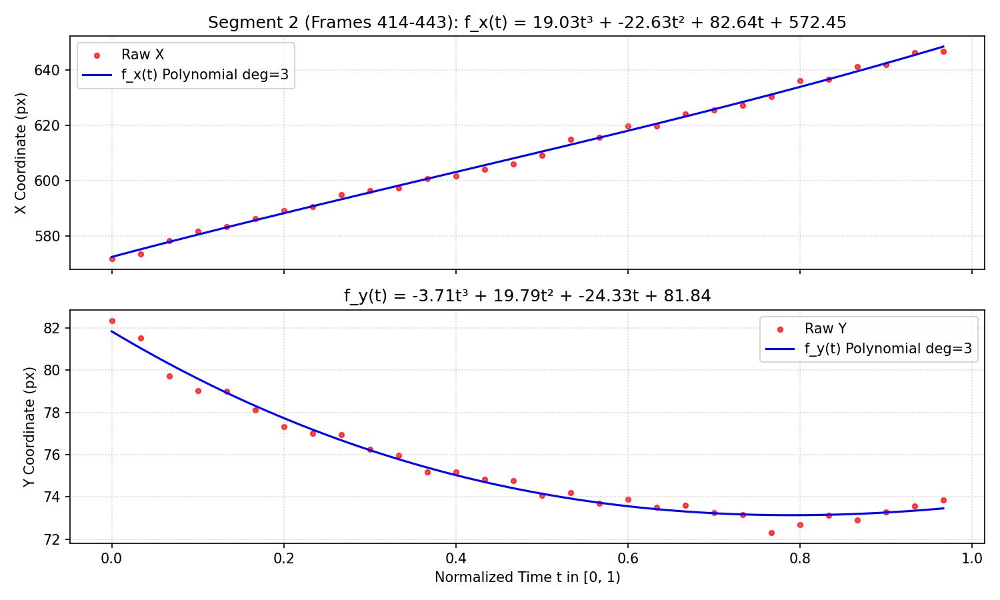

- **Segment 3 — index frames `[722 .. 751]`:**
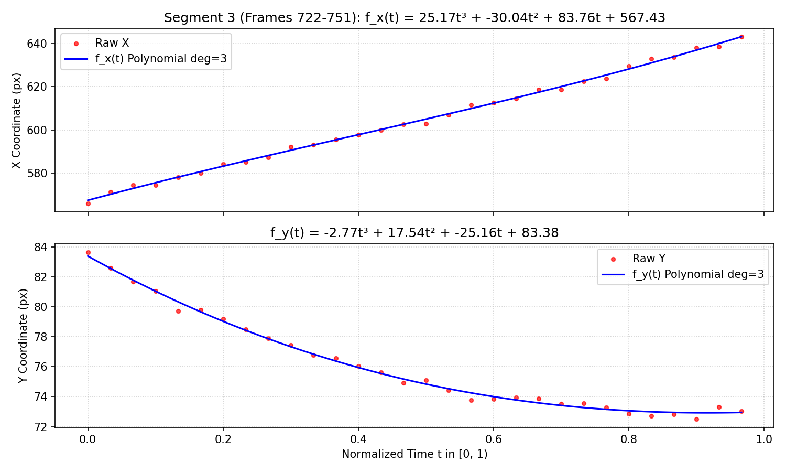

#### c) Biểu đồ Chuỗi thời gian (Time-series Log)
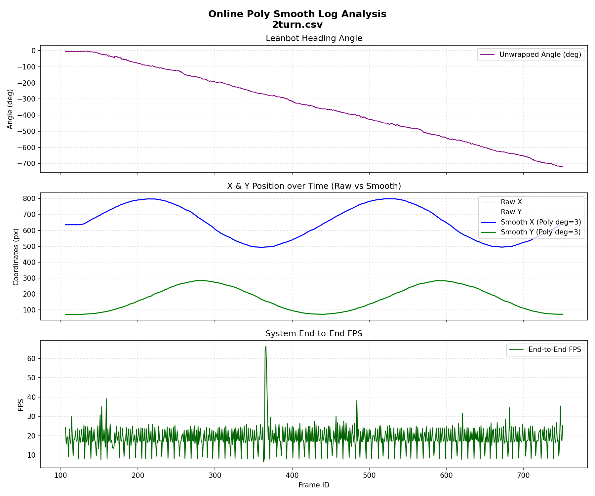

---

### 4.3. Leanbot chạy 3 vòng liên tục
Dữ liệu log: [`benchmark/3turn.csv`](benchmark/3turn.csv)

#### a) Đồ thị Quỹ đạo 2D (Raw vs Online Poly Smooth)
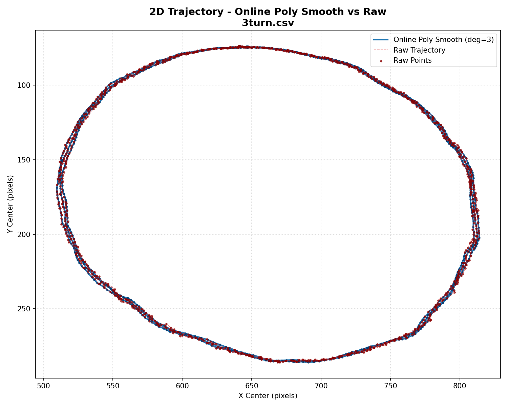

#### b) Đồ thị Đa thức $f_x(t), f_y(t)$ theo các đoạn 30 điểm mẫu

- **Segment 1 — index frames `[258 .. 287]`:**
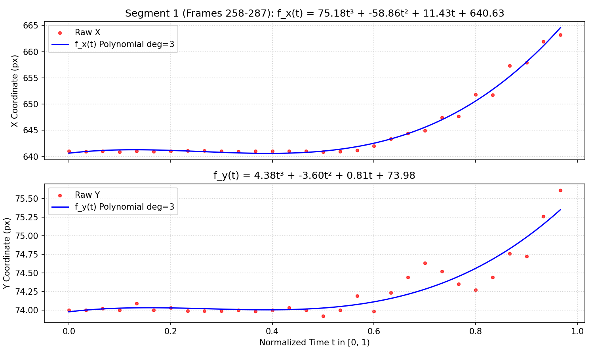

- **Segment 2 — index frames `[729 .. 758]`:**
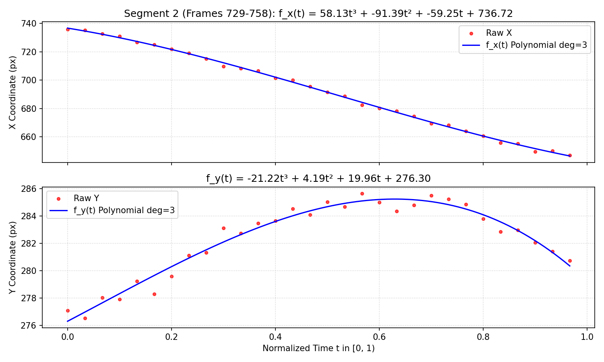

- **Segment 3 — index frames `[1201 .. 1230]`:**
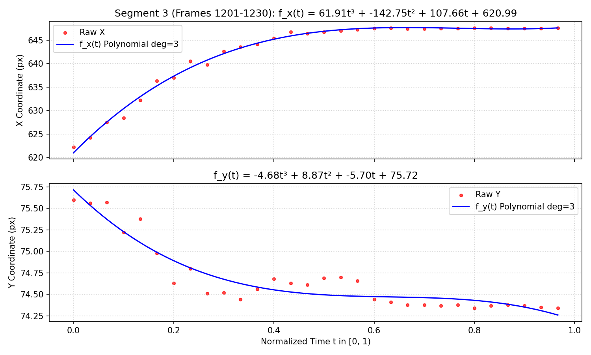

#### c) Biểu đồ Chuỗi thời gian (Time-series Log)
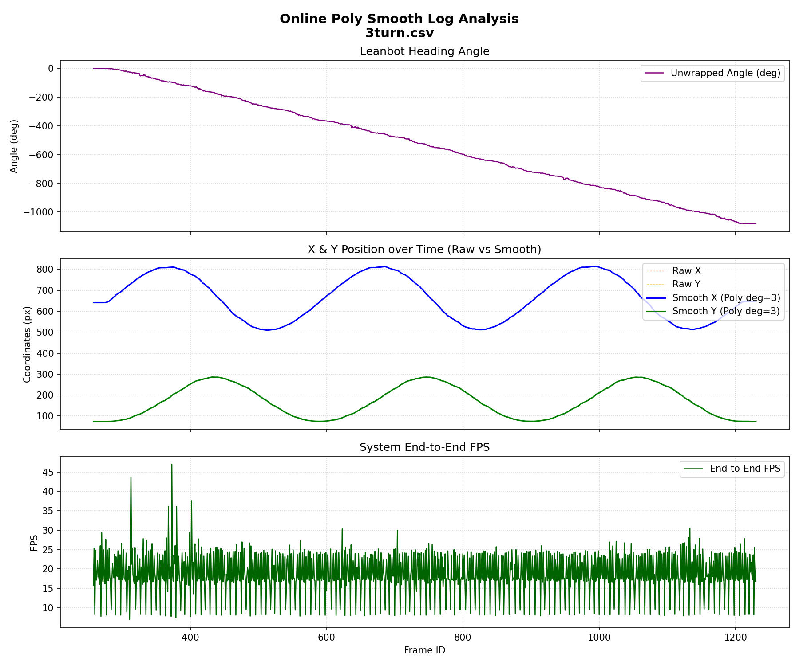

---

## B. Khó khăn 
- Không.

## C. Công việc tiếp theo 
- Em xin phép nhận công việc tiếp theo từ Thầy ạ.
