# Báo cáo công việc ngày 04/08/2026

## A. Công việc đã làm 
- Thực hiện triển khai phương pháp **Polynomial Smooth (bậc 3, độ dài 30)** vào chạy online (real-time).
- Thử giảm bậc đa thức xuống 2 và thử chạy Inference lại
- Chuẩn hóa lại trục thời gian 
- Tính và vẽ đồ thị Smooth angle so với Raw angle
- Báo cáo chi tiết các phần tính toán 
- Chọn ngẫu nhiên 5 đoạn 30 điểm và vẽ đồ thị smooth_angle và raw_angle
## 1. File Code sử dụng

- [`tools/roi_tracking_online_poly_smooth.py`](tools/roi_tracking_online_poly_smooth.py): Tool thực hiện ROI Tracking kết hợp làm mượt đa thức Online dạng Sliding Window.
- [`tools/plot_online_poly_log.py`](tools/plot_online_poly_log.py): Công cụ vẽ biểu đồ báo cáo thời gian và đồ thị quỹ đạo 2D (Raw vs Smooth) từ file CSV log.

---

## 2. Các bước thực hiện

### Bước 1: Thiết lập cấu hình thuật toán
- Khai báo các thông số làm mượt online cố định:
  - `SMOOTH_LENGTH = 30` (sử dụng cửa sổ 30 điểm raw point gần nhất).
  - `SMOOTH_ORDER = 3` (đa thức bậc 3).

### Bước 2: Xử lý cửa sổ trượt (Sliding Window) Online
- Với mỗi frame thu nhận được tọa độ thô $(raw\_x, raw\_y)$:
  - Đưa điểm mới vào cửa sổ đệm `raw_window` (tối đa 30 điểm).
  - Chuẩn hóa trục thời gian: $t = \frac{[0, 1, \dots, 29]}{30} \in [0.0, 0.967)$.

### Bước 3: Fit Polynomial bậc 3 & Tính điểm mượt mới nhất
- Fit 2 đa thức bậc 3 cho tọa độ $X$ và $Y$:
  $$x_{smooth}(t) = a_3 t^3 + a_2 t^2 + a_1 t + a_0$$
  $$y_{smooth}(t) = b_3 t^3 + b_2 t^2 + b_1 t + b_0$$
- Tính duy nhất vị trí mượt $(smooth\_x, smooth\_y)$ cho điểm thứ 30 (tại $t = \frac{29}{30}$):
  $$smooth\_x = f_x(29/30), \quad smooth\_y = f_y(29/30)$$
- Khi mất tracking (`tracking_lost == 1`): Bỏ qua frame bị lost, khi có frame mới không bị lost thì tiếp tục kết hợp với các điểm hợp lệ trước đó để smooth.

### Bước 4: Thực nghiệm và Ghi log CSV & Vẽ đồ thị quỹ đạo
- Cho Leanbot liên tục chạy vòng tròn với lệnh `LbMotion.runLR(2000, 1300)`.
- Nhấn phím `r` để bật/tắt ghi luồng dữ liệu bao gồm $x_{center}, y_{center}$ thô và $smooth\_x, smooth\_y$ vào file CSV log tương ứng khi xe chạy được 1 vòng, 2 vòng và 3 vòng.
- Sử dụng `plot_online_poly_log.py` để tự động xuất các đồ thị quỹ đạo 2D (nét mảnh, point nhỏ) cùng các đồ thị thành phần.

---

## 3. Lệnh chạy

### Chạy Online Tracking & Smooth:
```powershell
python tools/roi_tracking_online_poly_smooth.py --source 1 --log 1turn.csv
python tools/roi_tracking_online_poly_smooth.py --source 1 --log 2turn.csv
python tools/roi_tracking_online_poly_smooth.py --source 1 --log 3turn.csv
```

### Vẽ đồ thị báo cáo:
```powershell
python tools/plot_online_poly_log.py benchmark/1turn.csv
python tools/plot_online_poly_log.py benchmark/2turn.csv
python tools/plot_online_poly_log.py benchmark/3turn.csv
```

---

## 4. Kết quả Inference & Đồ thị chi tiết
- Leanbot chạy các vòng với vận tốc `LbMotion.runLR(2000, 1300)`.

### 4.1. Leanbot chạy 1 vòng
Dữ liệu log: [`benchmark/1turn.csv`](benchmark/1turn.csv)

#### a) Đồ thị Quỹ đạo 2D (Raw vs Online Poly Smooth)


#### b) Đồ thị Đa thức $f_x(t), f_y(t)$ theo các đoạn 30 điểm mẫu

- **Segment 1 — index frames `[102 .. 131]`:**


- **Segment 2 — index frames `[253 .. 282]`:**


- **Segment 3 — index frames `[404 .. 433]`:**


#### c) Biểu đồ Chuỗi thời gian (Time-series Log)


---

### 4.2. Leanbot chạy 2 vòng liên tục
Dữ liệu log: [`benchmark/2turn.csv`](benchmark/2turn.csv)

#### a) Đồ thị Quỹ đạo 2D (Raw vs Online Poly Smooth)


#### b) Đồ thị Đa thức $f_x(t), f_y(t)$ theo các đoạn 30 điểm mẫu

- **Segment 1 — index frames `[106 .. 135]`:**


- **Segment 2 — index frames `[414 .. 443]`:**


- **Segment 3 — index frames `[722 .. 751]`:**


#### c) Biểu đồ Chuỗi thời gian (Time-series Log)


---

### 4.3. Leanbot chạy 3 vòng liên tục
Dữ liệu log: [`benchmark/3turn.csv`](benchmark/3turn.csv)

#### a) Đồ thị Quỹ đạo 2D (Raw vs Online Poly Smooth)


#### b) Đồ thị Đa thức $f_x(t), f_y(t)$ theo các đoạn 30 điểm mẫu

- **Segment 1 — index frames `[258 .. 287]`:**


- **Segment 2 — index frames `[729 .. 758]`:**


- **Segment 3 — index frames `[1201 .. 1230]`:**


#### c) Biểu đồ Chuỗi thời gian (Time-series Log)


---

## 5. Thử nghiệm giảm bậc đa thức Polynomial Smooth (SMOOTH_ORDER = 2)

- Chuyển point smooth thành biểu tượng chữ `X` (`MARKER_CROSS` / `marker='x'`) để phân biệt trực quan hoàn toàn với **chấm tròn `O`** của điểm thô (Raw points).

- Hạ từ `SMOOTH_ORDER = 3` xuống `SMOOTH_ORDER = 2` (Parabol) giúp nắn mượt tự nhiên, tránh rung lắc/uốn sóng cục bộ.

- Pre-compute mảng mốc thời gian $t = \frac{[0, 1, \dots, 29]}{29.0} \in [0.0, 1.0]$ cố định 1 lần duy nhất trong `__init__` (không tính lại ở từng frame).

- Tính & Vẽ đồ thị `smooth_angle`: Tính góc hướng di chuyển thực tế từ vector 2 điểm smooth liên tiếp $(\Delta x, \Delta y)$ qua hàm $\arctan2(-\Delta y, \Delta x)$, bổ sung cột `smooth_angle` vào log CSV và xuất đồ thị so sánh trực tiếp với `raw_angle`.

---

### Kết quả Inference & Đồ thị thực nghiệm bậc 2:

#### 5.1. Leanbot chạy 1 vòng
- File log CSV: [`1turn_polynomial_order2_length30.csv`](benchmark/1turn_polynomial_order2_length30.csv)

##### a) Đồ thị Quỹ đạo 2D (Smooth điểm X vs Raw điểm O)
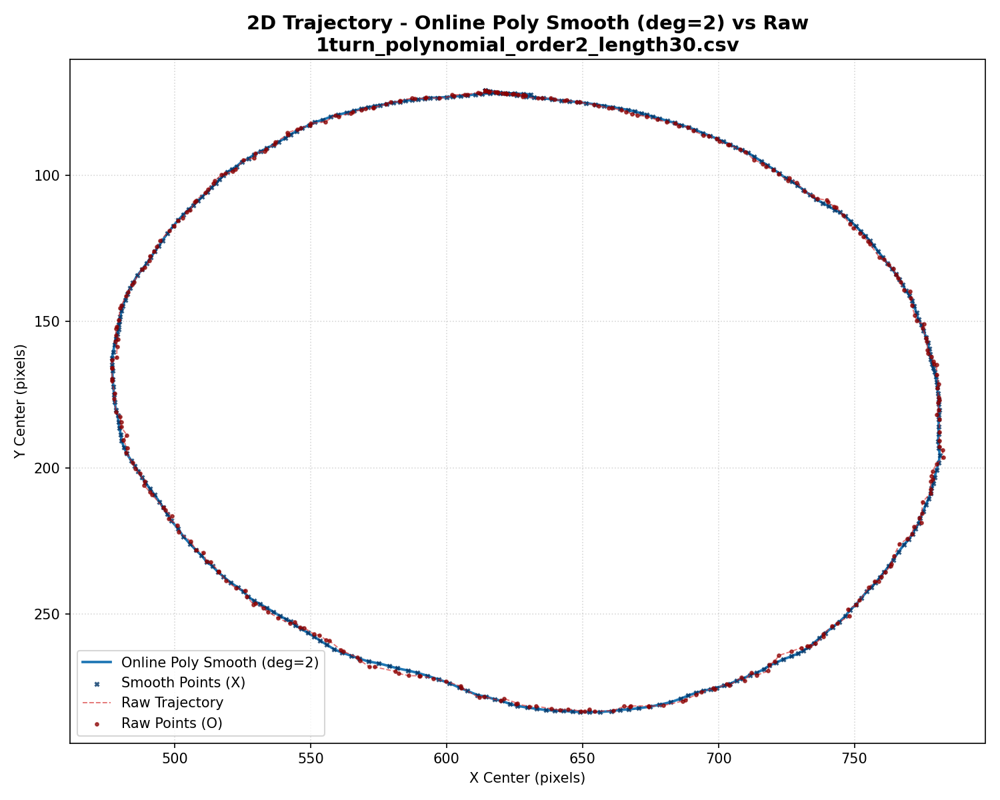

##### b) Đồ thị Đa thức $f_x(t), f_y(t)$ theo các đoạn 30 điểm mẫu
- **Segment 1:**
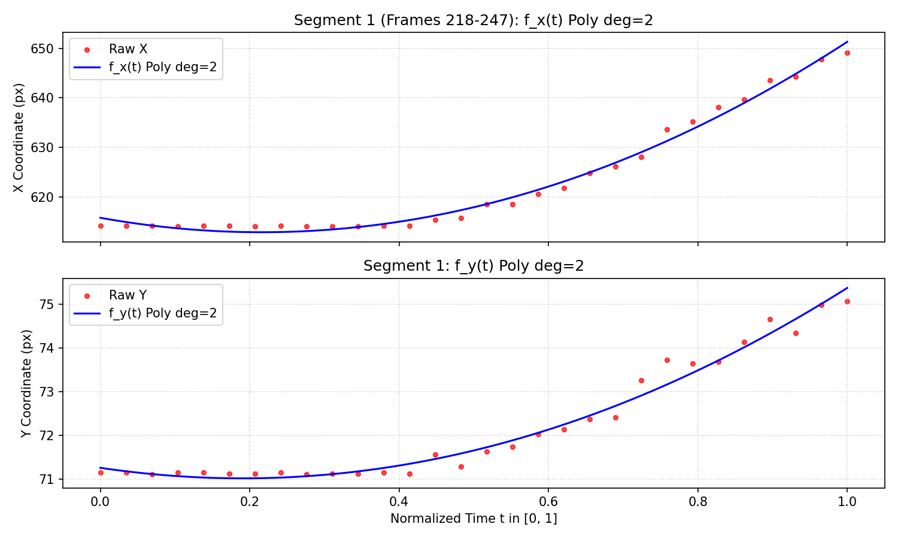

- **Segment 2:**
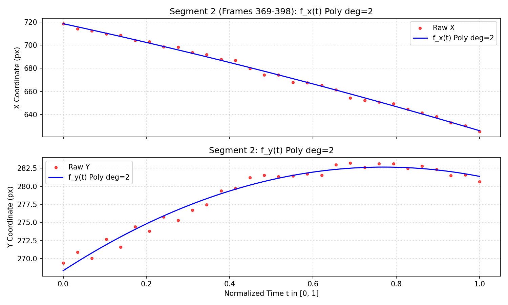

- **Segment 3:**
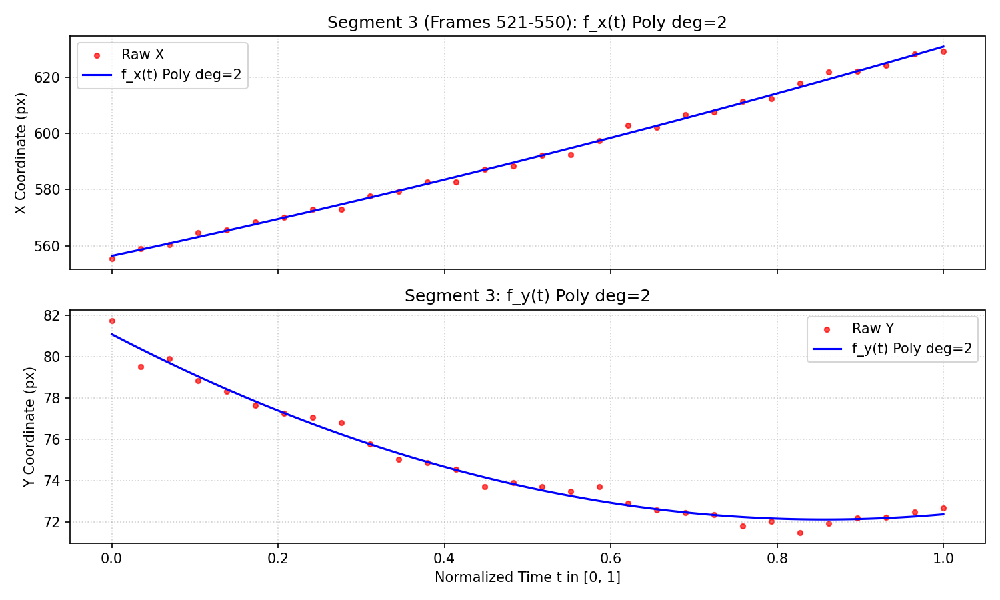

##### c) Biểu đồ Chuỗi thời gian (So sánh Raw Angle vs Smooth Angle, Position & FPS)
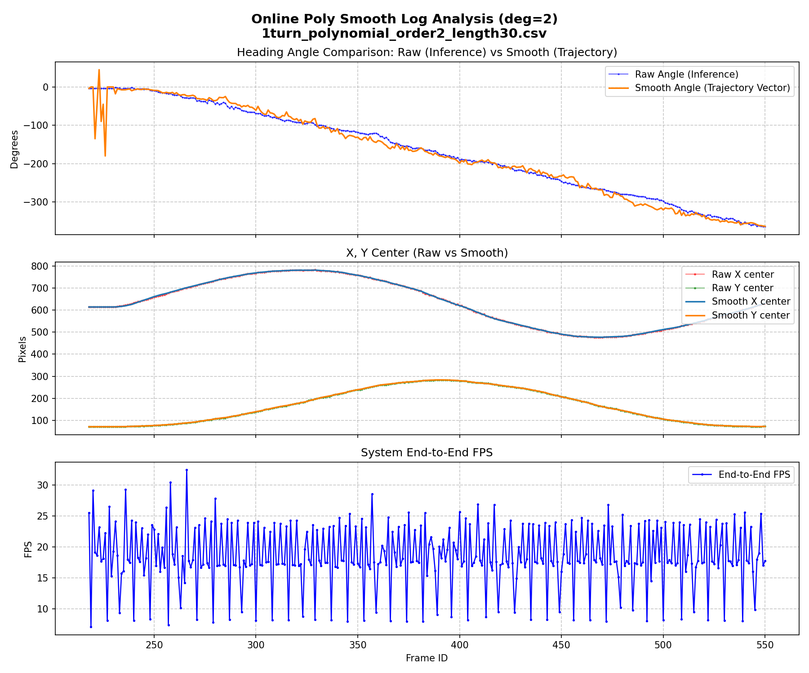

---

#### 5.2. Leanbot chạy 2 vòng liên tục
- File log CSV: [`2turn_polynomial_order2_length30.csv`](benchmark/2turn_polynomial_order2_length30.csv)

##### a) Đồ thị Quỹ đạo 2D (Smooth điểm X vs Raw điểm O)
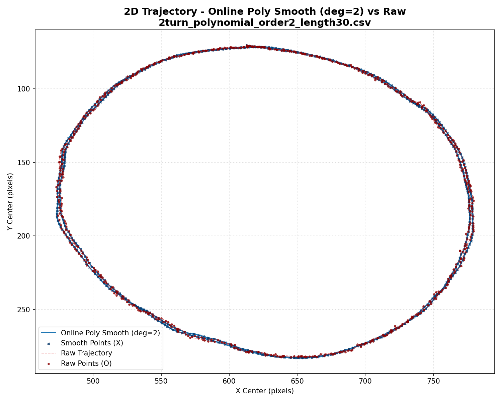

##### b) Đồ thị Đa thức $f_x(t), f_y(t)$ theo các đoạn 30 điểm mẫu
- **Segment 1:**
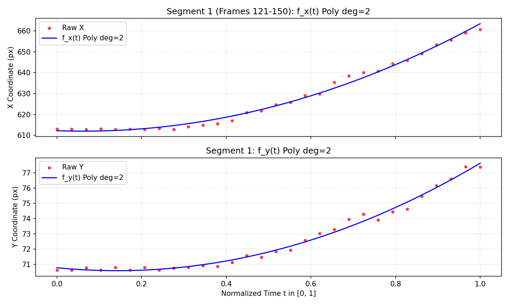

- **Segment 2:**
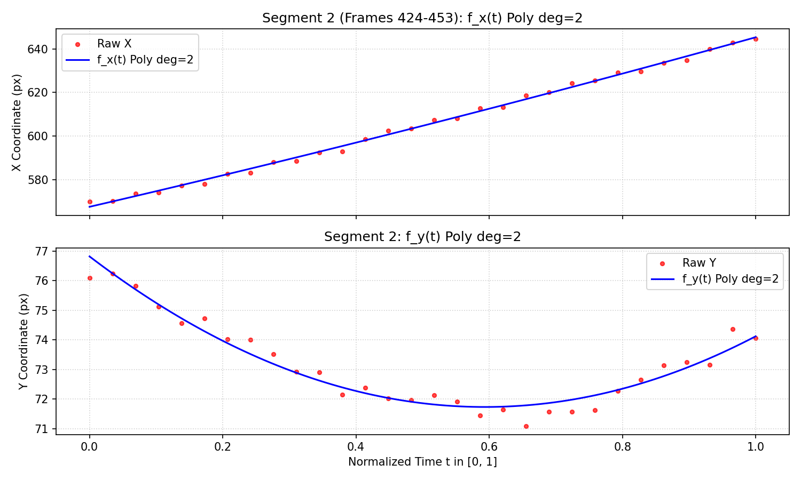

- **Segment 3:**
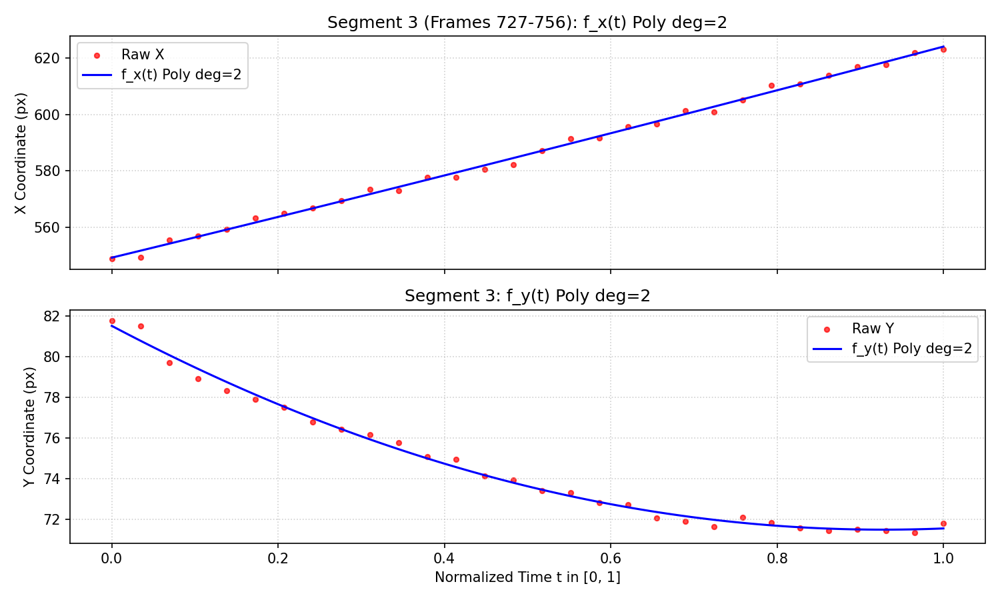

##### c) Biểu đồ Chuỗi thời gian (So sánh Raw Angle vs Smooth Angle, Position & FPS)
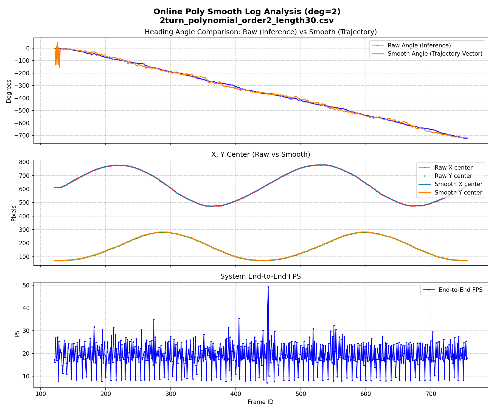

---

#### 5.3. Leanbot chạy 3 vòng liên tục
- File log CSV: [`3turn_polynomial_order2_length30.csv`](benchmark/3turn_polynomial_order2_length30.csv)

##### a) Đồ thị Quỹ đạo 2D (Smooth điểm X vs Raw điểm O)
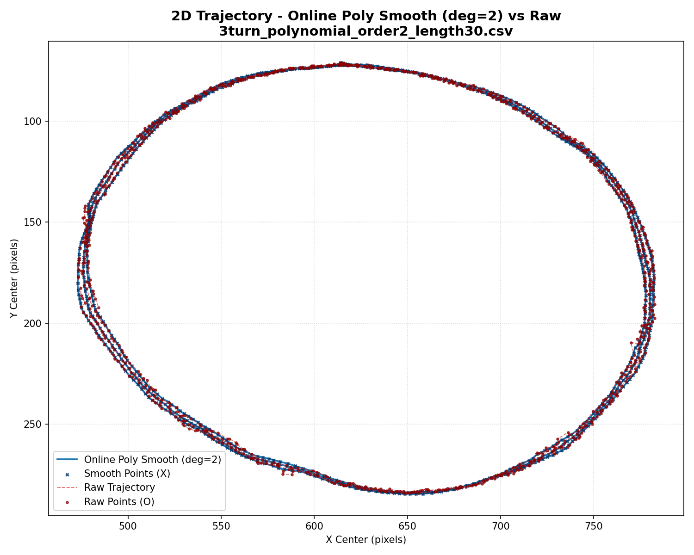

##### b) Đồ thị Đa thức $f_x(t), f_y(t)$ theo các đoạn 30 điểm mẫu
- **Segment 1:**
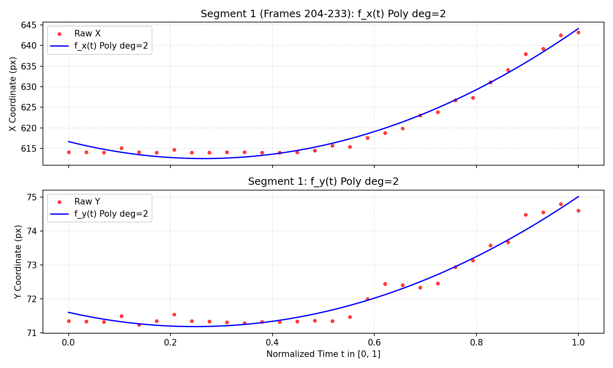

- **Segment 2:**
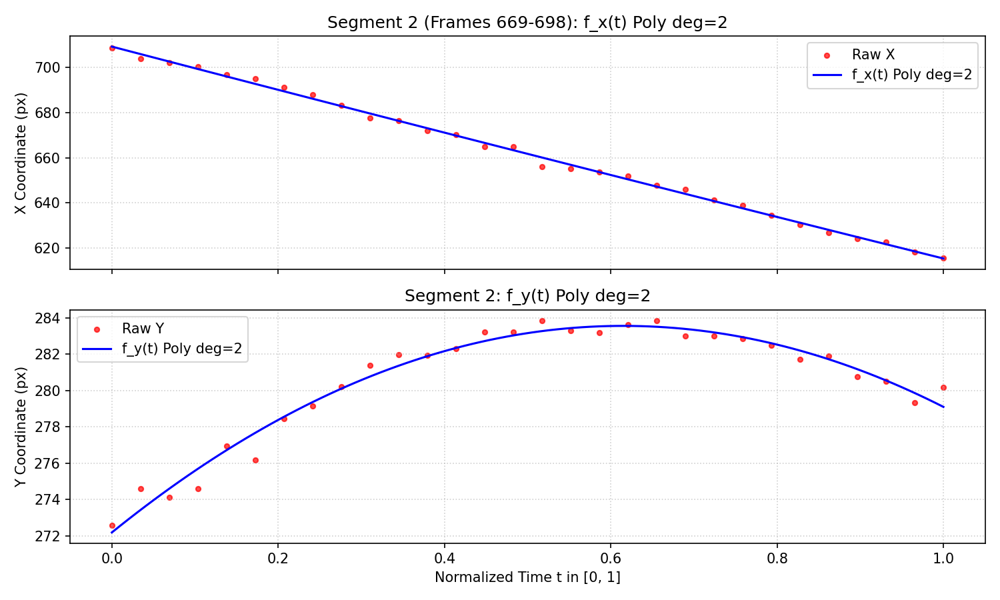

- **Segment 3:**
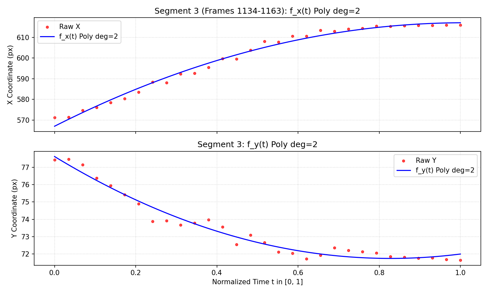

##### c) Biểu đồ Chuỗi thời gian (So sánh Raw Angle vs Smooth Angle, Position & FPS)
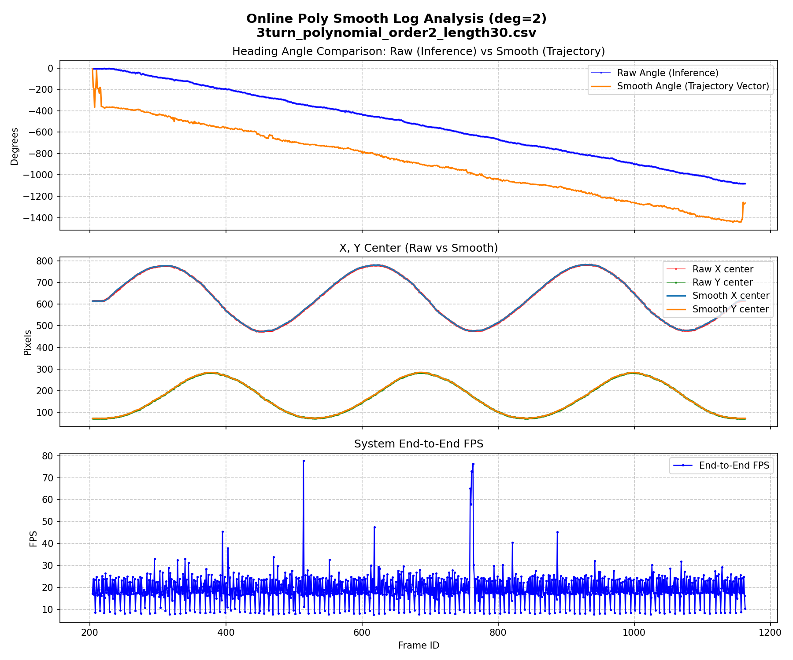

---

## 6. Báo cáo chi tiết Code & Chọn ngẫu nhiên 5 đoạn 30 điểm để phân tích

### 6.1. Báo cáo chi tiết code 

#### a) Thuật toán Online Polynomial Smooth (Bậc 2, Sliding Window 30 điểm)
File code: [`tools/roi_tracking_online_poly_smooth.py`](tools/roi_tracking_online_poly_smooth.py)

1. **Khởi tạo mảng thời gian chuẩn hóa $t$:**
   ```python
   # Pre-compute mảng mốc thời gian t thuộc [0.0, 1.0] cố định trong __init__
   self.t_norm = np.linspace(0.0, 1.0, window_size)  # 30 điểm: [0, 1/29, ..., 29/29 = 1.0]
   ```

2. **Hồi quy Đa thức bậc 2 & Tính tọa độ điểm mượt mới nhất ($t = 1.0$):**
   ```python
   coeffs_x = np.polyfit(self.t_norm, x_seg, deg=2)
   coeffs_y = np.polyfit(self.t_norm, y_seg, deg=2)

   # Điểm mượt mới nhất tại frame thứ 30 ứng với t = 1.0
   sx = float(np.polyval(coeffs_x, 1.0))
   sy = float(np.polyval(coeffs_y, 1.0))
   ```

#### b) Thuật toán tính `smooth_angle` và Đổi hệ quy chiếu

1. **Cách tính góc `smooth_angle`:**
   - Khi Leanbot di chuyển trên sa bàn luôn có tính liên tục về động học, hình học quỹ đạo. Hướng chuyển động `smooth_angle` tại mỗi điểm là **vector tiếp tuyến nối 2 vị trí `smooth_point` liên tiếp**: $(sx_{i-1}, sy_{i-1})$ và $(sx_i, sy_i)$.
   - Vector dịch chuyển smooth là :
     $$\Delta x = sx_i - sx_{i-1}, \quad \Delta y_{image} = sy_i - sy_{i-1}$$

2. **Chuyển đổi Hệ quy chiếu (Coordinate Transformation):**
   - Trong hệ tọa độ ảnh OpenCV, gốc $(0,0)$ ở góc trên bên trái, trục $Y_{image}$ có chiều **tăng từ trên xuống dưới**.
   - Trong khi đó, hệ tọa độ decaster chuẩn dùng cho `raw_angle` và hình học toán học có trục $Y_{cartesian}$ **tăng từ dưới lên trên**.
   - **Cách chuyển đổi:** 
     - Đổi dấu trục $Y$ từ hệ ảnh sang hệ decaster: $\Delta y_{cartesian} = -\Delta y_{image} = -(sy_i - sy_{i-1})$.
     - Công thức tính góc smooth chuẩn decaster sẽ là:
       $$\theta_{smooth} = \text{atan2}(-\Delta y_{image}, \Delta x) \times \frac{180}{\pi} \quad (\text{đơn vị: độ } [-180^\circ, 180^\circ])$$

3. **Code trích dẫn trong file:** [`roi_tracking_online_poly_smooth.py`](tools/roi_tracking_online_poly_smooth.py)

   ```python
   # Tính vector dịch chuyển giữa 2 điểm mượt liên tiếp
   dx = sx - prev_sx
   dy = sy - prev_sy

   # Dùng -dy để chuyển hệ tọa độ ảnh OpenCV (Y hướng xuống) -> Hệ tọa độ decaster (Y hướng lên)
   if math.hypot(dx, dy) > 1e-5:
       smooth_ang = math.degrees(math.atan2(-dy, dx))
   else:
       smooth_ang = self.smooth_angles[-1] if self.smooth_angles else 0.0
   ```

### 6.2. Đánh giá 5 đoạn 30 điểm ngẫu nhiên

- Chọn ngẫu nhiên 5 đoạn 30 điểm từ file log [`3turn_polynomial_order2_length30.csv`](benchmark/3turn_polynomial_order2_length30.csv) để phân tích

Lệnh chạy tạo đồ thị : 

```bash
python tools/plot_random_5segments.py benchmark/3turn_polynomial_order2_length30.csv --seed 42
```

#### Segment 1 — Frames `[279 .. 308]`
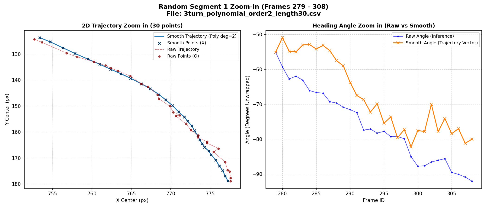

#### Segment 2 — Frames `[709 .. 738]`
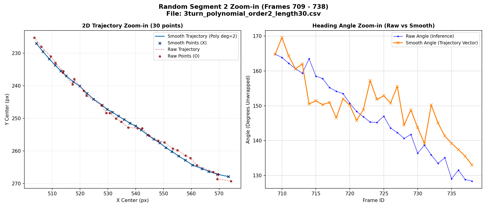

#### Segment 3 — Frames `[769 .. 798]`
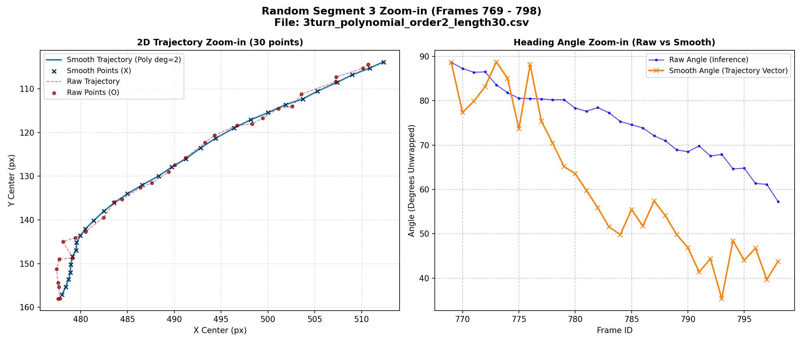

#### Segment 4 — Frames `[1024 .. 1053]`
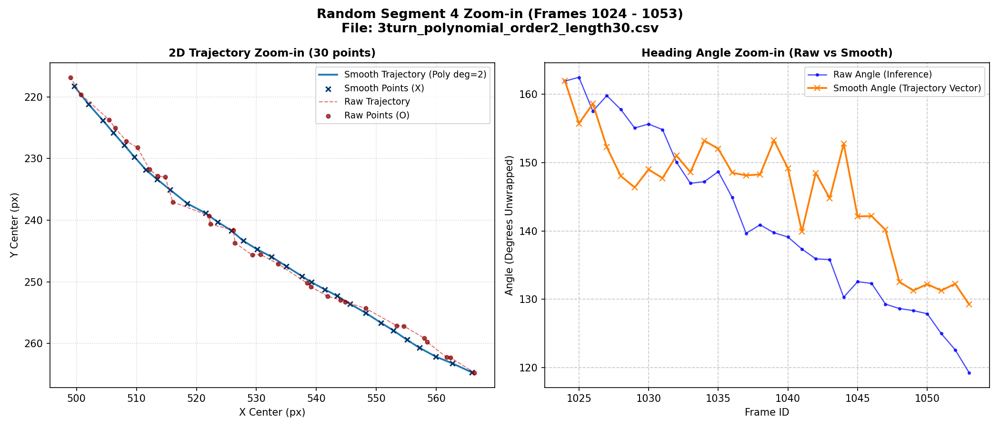

#### Segment 5 — Frames `[1089 .. 1118]`

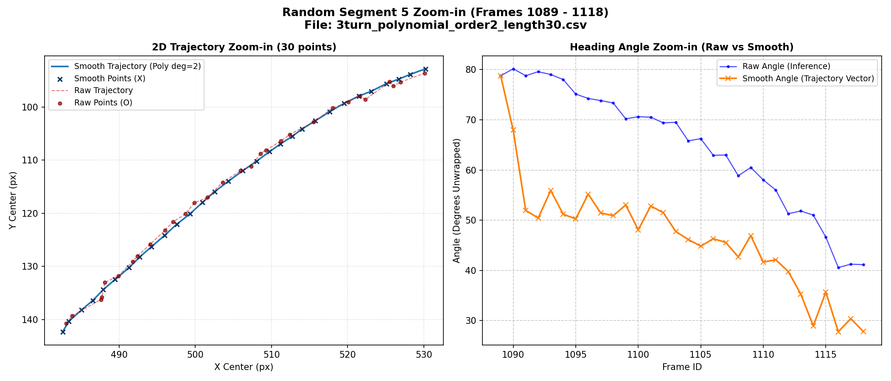


## B. Khó khăn 
- Không.

## C. Công việc tiếp theo 
- Em xin phép nhận công việc tiếp theo từ Thầy ạ.
