# Báo cáo công việc ngày 06/08/2026

## A. Công việc đã làm 

- Bổ sung polynomial smooth bậc 2, cửa sổ trượt 30 điểm cho hai chuỗi angle:
  - `raw_angle` -> `raw_angle_smooth`
  - `smooth_angle` -> `smooth_angle_smooth`
- Bổ sung cột `raw_angle` cho CSV log mới. Giá trị này là alias của `group1_angle`.
- Cập nhật biểu đồ để so sánh đồng thời bốn đường: Raw Angle, Smooth Angle, Raw Angle Smooth, Smooth Angle Smooth.
- Chọn 5 đoạn ngẫu nhiên, mỗi đoạn 30 điểm từ log csv thử nghiệm Leanbot chạy 1 vòng và 3 vòng.

---

## 1. File Code sử dụng

- [`tools/roi_tracking_online_poly_smooth.py`](tools/roi_tracking_online_poly_smooth.py): ROI tracking online; ghi `raw_angle`, `raw_angle_smooth`, `smooth_angle`, `smooth_angle_smooth` vào log mới.
- [`tools/postprocess_angle_poly_smooth.py`](tools/postprocess_angle_poly_smooth.py): Tái xử lý CSV cũ, thêm bốn cột angle mà không cần inference lại.
- [`tools/plot_online_poly_log.py`](tools/plot_online_poly_log.py): Vẽ quỹ đạo 2D, chuỗi thời gian bốn angle, X/Y và FPS.
- [`tools/plot_random_5segments.py`](tools/plot_random_5segments.py): Vẽ quỹ đạo và bốn angle cho các segment 30 điểm ngẫu nhiên.

---

## 2. Các bước thực hiện

### Step 1: Xác định bốn chuỗi angle

| Chuỗi | Nguồn |
|---|---|
| `raw_angle` | Hướng Leanbot gốc khi chạy inference. |
| `raw_angle_smooth` | Polynomial smooth của `raw_angle`. |
| `smooth_angle` | Góc tiếp tuyến từ hai điểm `(smooth_x, smooth_y)` liên tiếp. |
| `smooth_angle_smooth` | Polynomial smooth của `smooth_angle`. |

### Step 2: Nguyên lý & Quy trình Polynomial Fit

1. **Cửa sổ trượt dữ liệu góc, tọa độ (Sliding Window):**
   - Duy trì bộ đệm chứa 30 điểm dữ liệu gần nhất (`SMOOTH_LENGTH = 30`). 
   - Với 29 điểm đầu tiên (giai đoạn warm-up chưa đủ 30 điểm), giá trị mượt được giữ bằng giá trị gốc.

2. **Chuẩn hóa trục thời gian $t \in [0.0, 1.0]$:**
   - Tạo trục thời gian chuẩn hóa $t = \text{np.linspace}(0.0, 1.0, 30)$ cho 30 điểm trong cửa sổ.
   - Việc chuẩn hóa giúp ổn định số học khi tính toán ma trận bình phương tối thiểu, tránh hiện tượng nhiễu ma trận (ill-conditioned) khi chỉ số Frame ID tăng lớn.

3. **Mô hình Đa thức bậc 2 (Degree-2 Polynomial Fit):**
   - Khớp đa thức bậc 2 (`SMOOTH_ORDER = 2`) có dạng:
     $$f(t) = a \cdot t^2 + b \cdot t + c$$
   - Các hệ số $(a, b, c)$ được tìm bằng phương pháp Bình phương tối thiểu (Ordinary Least Squares - `np.polyfit`), sao cho tổng bình phương sai số giữa dữ liệu đo và đường cong đa thức đạt tối thiểu:
     $$\min_{a,b,c} \sum_{i=1}^{30} \left( f(t_i) - y_i \right)^2$$

4. **Tính giá trị mượt tại thời điểm hiện tại ($t = 1.0$):**
   - Giá trị mượt của frame hiện tại chính là giá trị của đa thức tại mốc thời gian mới nhất $t = 1.0$:
     $$y_{\text{smooth}} = f(1.0) = a + b + c$$
   - Phương pháp này giúp mô hình đáp ứng realtime (online tracking) trực tiếp tại thời điểm hiện tại mà không bị độ trễ pha (phase lag).

5. **Xử lý đặc thù cho dữ liệu Góc (Angle):**
   - **Khử đứt gãy biên $\pm 180^\circ$ (Unwrapping):** Trước khi fit đa thức cho chuỗi góc, áp dụng `np.unwrap` trên radian để loại bỏ nét đứt gãy đột ngột tại biên $-180^\circ / +180^\circ$.
   - **Tính góc tiếp tuyến quỹ đạo (`smooth_angle`):** Dựa trên tọa độ đã làm mượt $(smooth\_x, smooth\_y)$, góc vận tốc chuyển động được tính theo hệ tọa độ OpenCV (trục Y hướng xuống):
     ```python
     dx = sx - prev_sx
     dy = sy - prev_sy
     smooth_angle = math.degrees(math.atan2(-dy, dx))
     ```
   - Sau đó tiếp tục áp dụng Polynomial Fit bậc 2 cho chuỗi `smooth_angle` để thu được `smooth_angle_smooth`.

## 3. Lệnh chạy

### Chạy online tracking

```powershell
python tools/roi_tracking_online_poly_smooth.py --source 1 --log 1turn.csv
python tools/roi_tracking_online_poly_smooth.py --source 1 --log 2turn.csv
python tools/roi_tracking_online_poly_smooth.py --source 1 --log 3turn.csv
```

### Xử lí dữ liệu sau khi đã có file log csv inference 

```powershell
python tools/postprocess_angle_poly_smooth.py benchmark/1turn.csv benchmark/2turn.csv benchmark/3turn.csv
```

### Vẽ biểu đồ tổng hợp

```powershell
python tools/plot_online_poly_log.py benchmark/1turn_polynomial_order2_length30.csv --segments 3 --degree 2
python tools/plot_online_poly_log.py benchmark/2turn_polynomial_order2_length30.csv --segments 3 --degree 2
python tools/plot_online_poly_log.py benchmark/3turn_polynomial_order2_length30.csv --segments 3 --degree 2
```

### Vẽ năm segment ngẫu nhiên

```powershell
python tools/plot_random_5segments.py benchmark/1turn_polynomial_order2_length30.csv --num 5 --seed 42
python tools/plot_random_5segments.py benchmark/2turn_polynomial_order2_length30.csv --num 5 --seed 42
python tools/plot_random_5segments.py benchmark/3turn_polynomial_order2_length30.csv --num 5 --seed 123
```

---

## 4. Kết quả Inference & Đồ thị chi tiết

## Dữ liệu đã sử dụng

| Thí nghiệm | CSV gốc | Số frame | Frame ID | Tracking lost | CSV bốn angle |
|---|---|---:|---|---:|---|
| Leanbot chạy 1 vòng | [`benchmark/1turn.csv`](benchmark/1turn.csv) | 332 | 102-433 | 0 | [`benchmark/1turn_polynomial_order2_length30.csv`](benchmark/1turn_polynomial_order2_length30.csv) |
| Leanbot chạy 2 vòng | [`benchmark/2turn.csv`](benchmark/2turn.csv) | 646 | 106-751 | 0 | [`benchmark/2turn_polynomial_order2_length30.csv`](benchmark/2turn_polynomial_order2_length30.csv) |
| Leanbot chạy 3 vòng | [`benchmark/3turn.csv`](benchmark/3turn.csv) | 973 | 258-1230 | 0 | [`benchmark/3turn_polynomial_order2_length30.csv`](benchmark/3turn_polynomial_order2_length30.csv) |


### Leanbot chạy 1 vòng


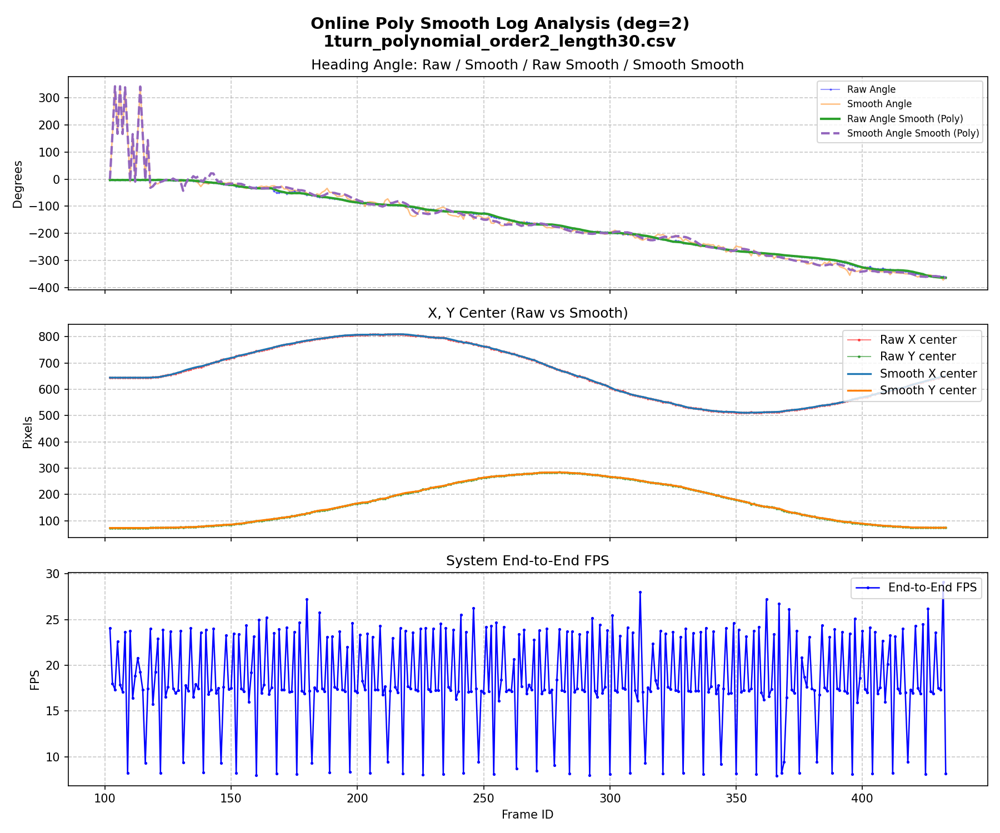

| Segment | Frame ID |
|---|---|
| 1 | 102-131 |
| 2 | 167-196 |
| 3 | 257-286 |
| 4 | 332-361 |
| 5 | 377-406 |

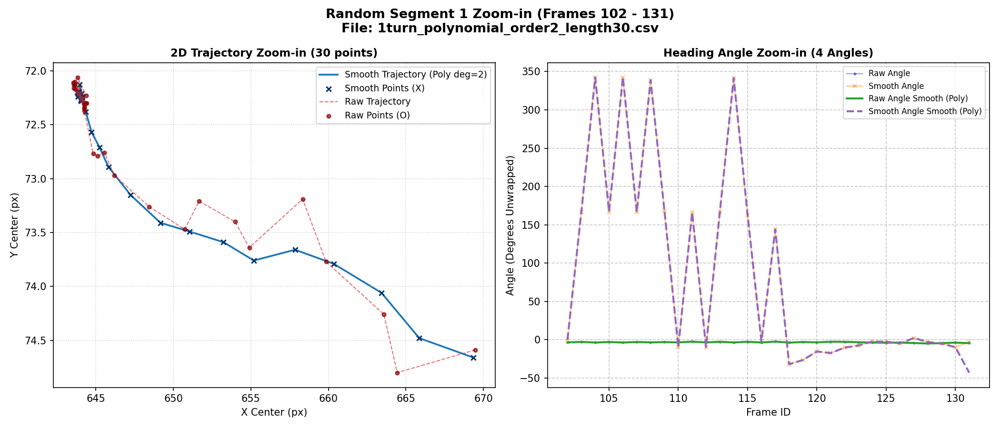
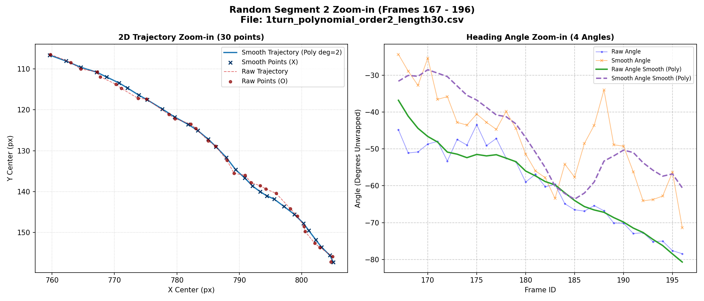
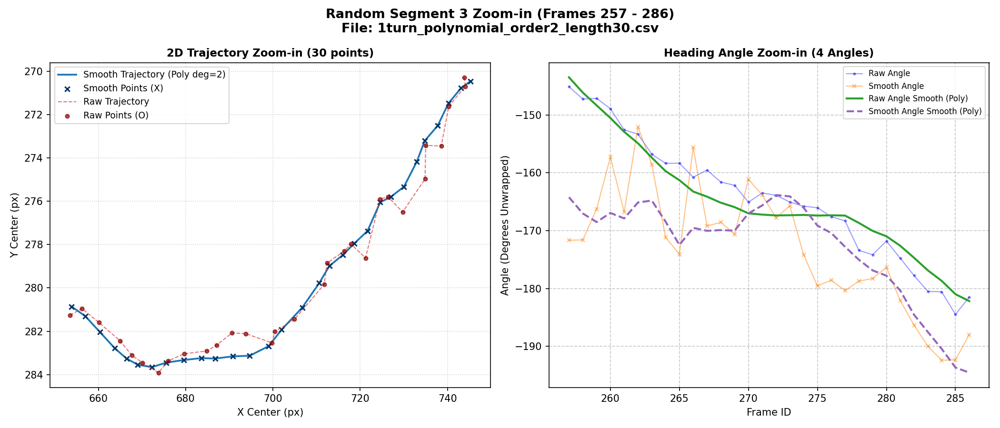
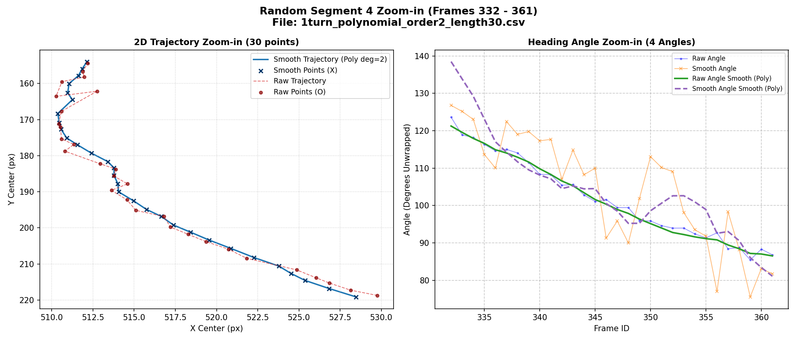
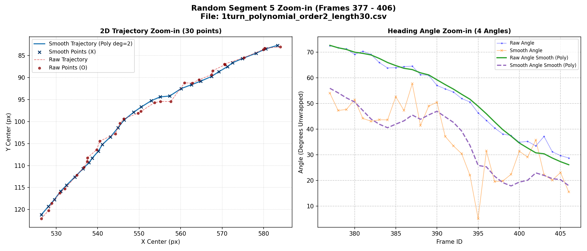

### Leanbot chạy 2 vòng


| Segment | Frame ID |
|---|---|
| 1 | 196-225 |
| 2 | 286-315 |
| 3 | 316-345 |
| 4 | 371-400 |
| 5 | 486-515 |

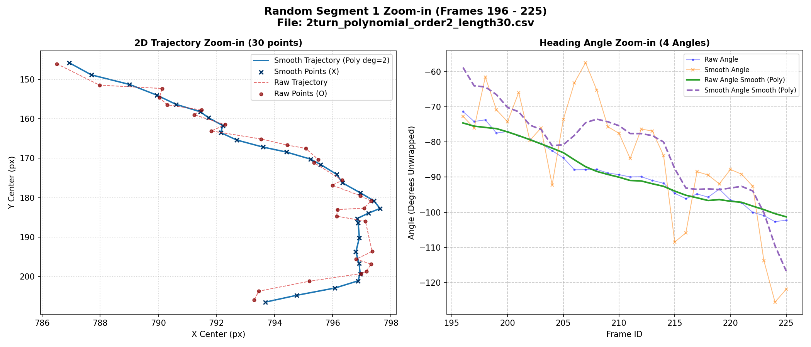

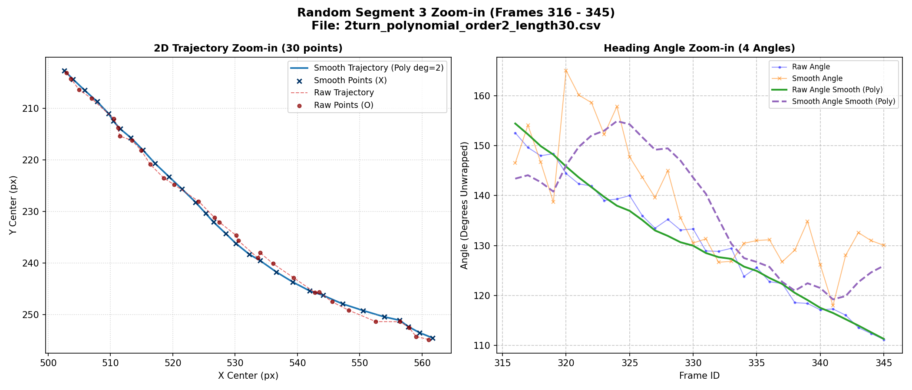
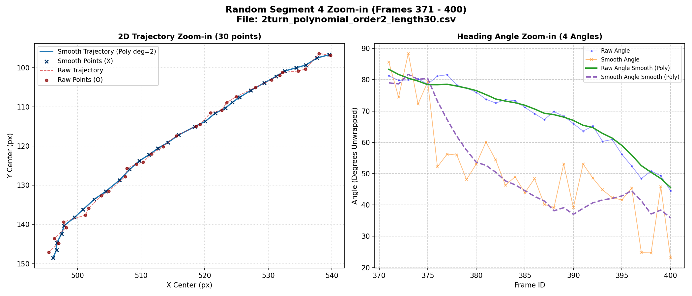
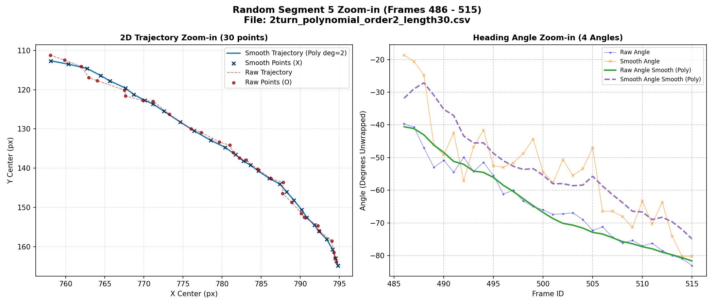

### Leanbot chạy 3 vòng


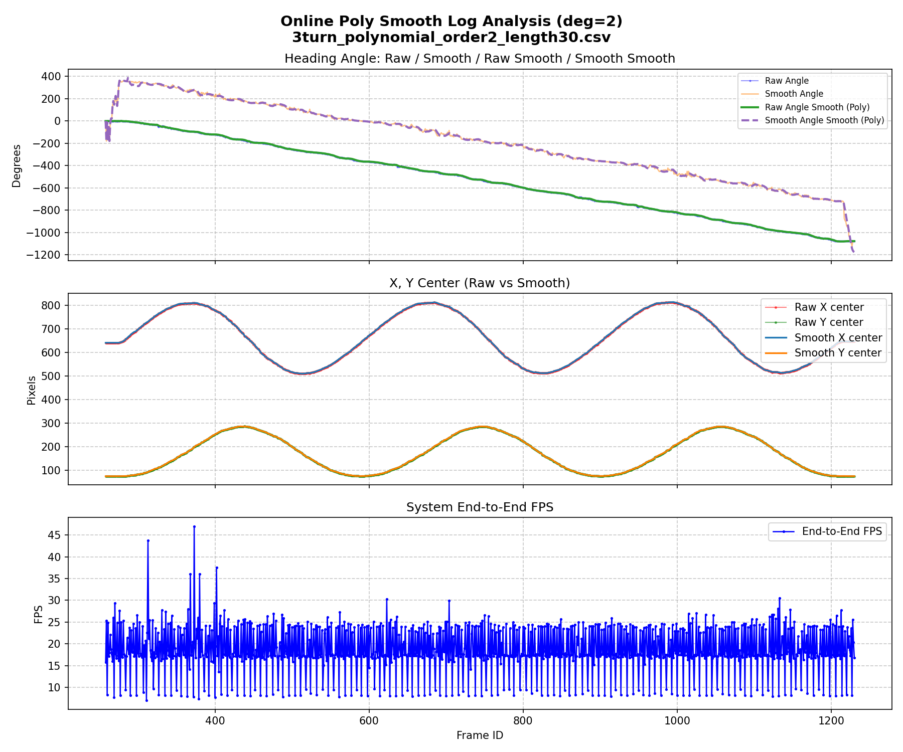

| Segment | Frame ID |
|---|---|
| 1 | 278-307 |
| 2 | 388-417 |
| 3 | 463-492 |
| 4 | 643-672 |
| 5 | 1058-1087 |

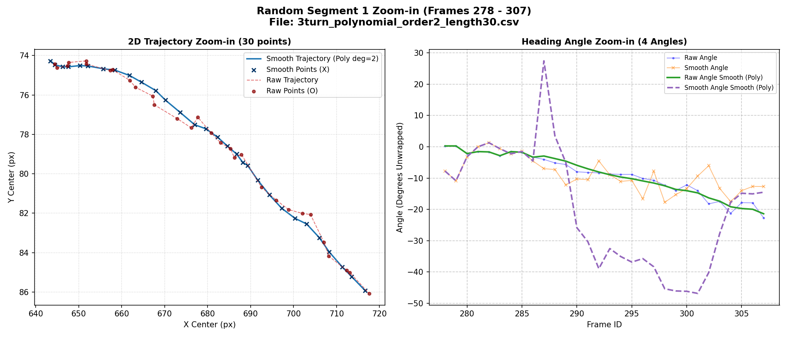
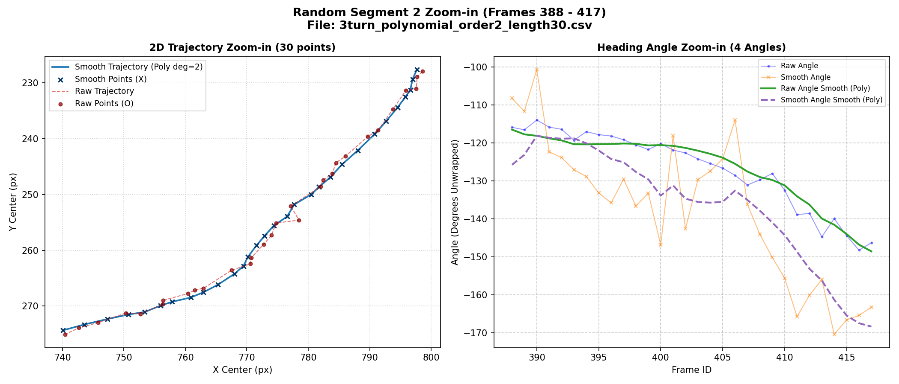
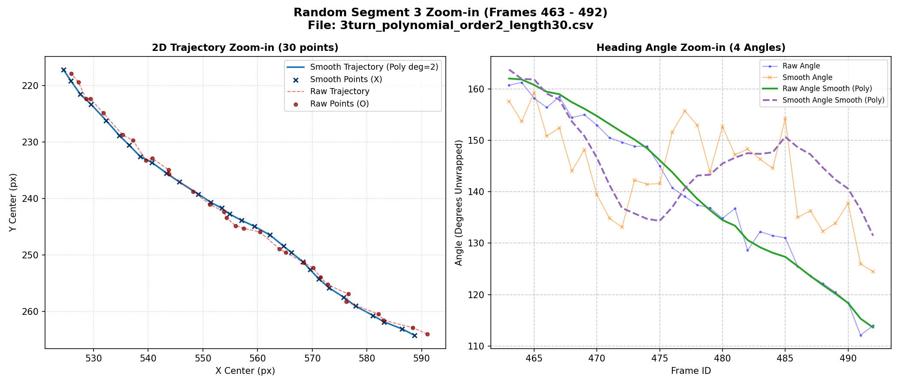
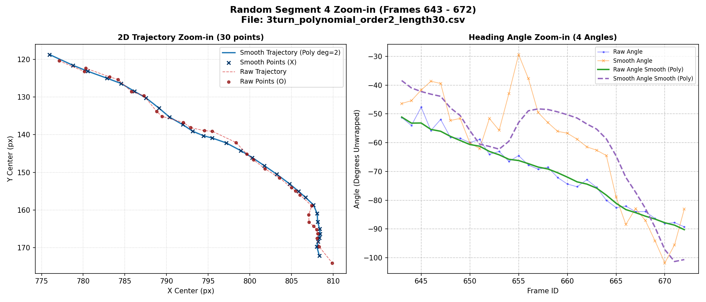


## B. Khó khăn 

- Không.

## C. Công việc tiếp theo 
- Em xin phép nhận công việc tiếp theo từ Thầy ạ .