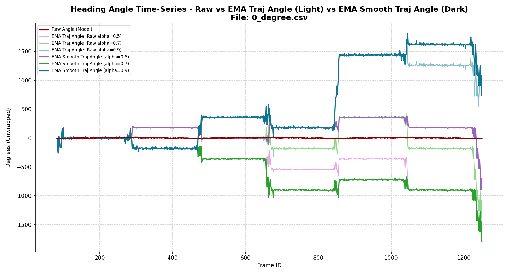
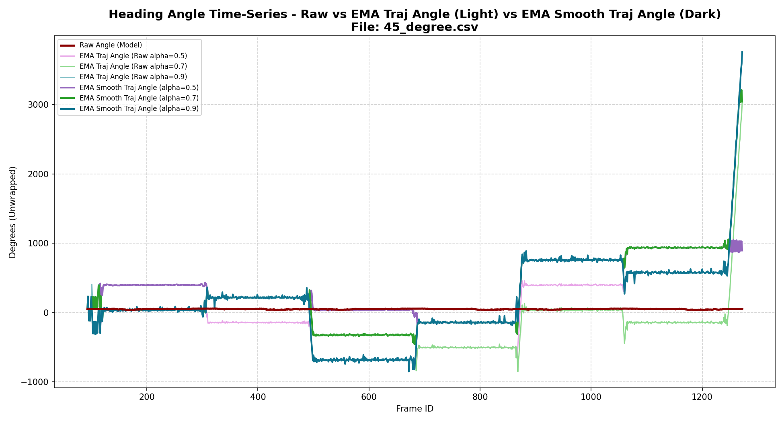
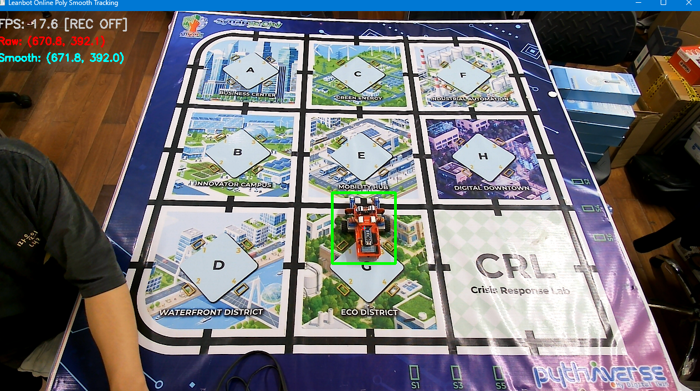
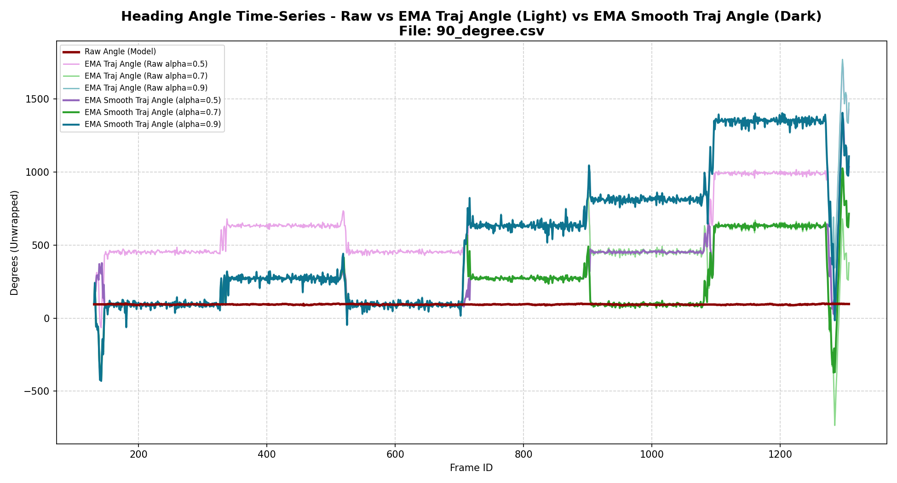

# Báo cáo công việc ngày 12/08/2026

## A. Công việc đã làm 
- Thu thập dữ liệu Leanbot đi các quỹ đạo thẳng, tiến lùi với các góc chéo 0,45,90 độ 
- Vẽ biểu đồ , đánh giá độ ổn định 

---

## 1. File Code & Lệnh chạy

- File code sử dụng: [`tools/plot_ema_clean.py`](tools/plot_ema_clean.py)

```powershell
# Tạo đồ thị EMA Selective & Double Smooth cho 3 bộ dữ liệu CSV thực tế ngày 12/08/2026
python tools/plot_ema_clean.py benchmark/0_degree.csv
python tools/plot_ema_clean.py benchmark/45_degree.csv
python tools/plot_ema_clean.py benchmark/90_degree.csv
```

---

## 2. Kết quả Biểu đồ Đánh giá theo Các Góc Quỹ đạo (0°, 45°, 90°)

- Leanbot di chuyển tiến lùi 3 lần, tổng cộng sẽ có 6 lần thay đổi vector vận tốc ( dương -> âm )

### 2.1. Quỹ đạo 0 độ (`0_degree.csv`)

#### Ảnh thực nghiệm thực tế


#### Biểu đồ Quỹ đạo 2D (Raw vs EMA 0.5, 0.7, 0.9)


#### a) Đồ thị góc Raw_angle và các đường EMA từ góc tiếp tuyến 2 điểm đồ thị liên tục


#### b) Đồ thị góc Raw_angle và các đường EMA từ góc tiếp tuyến 2 điểm đồ thị liên tục sau khi làm mịn lần 2 


---

### 2.2. Quỹ đạo 45 độ (`45_degree.csv`)

#### Ảnh thực nghiệm thực tế


#### Biểu đồ Quỹ đạo 2D (Raw vs EMA 0.5, 0.7, 0.9)


#### a) Đồ thị góc Raw_angle và các đường EMA từ góc tiếp tuyến 2 điểm đồ thị liên tục


#### b) Đồ thị góc Raw_angle và các đường EMA từ góc tiếp tuyến 2 điểm đồ thị liên tục sau khi làm mịn lần 2 


---

### 2.3. Quỹ đạo 90 độ (`90_degree.csv`)

#### Ảnh thực nghiệm thực tế


#### Biểu đồ Quỹ đạo 2D (Raw vs EMA 0.5, 0.7, 0.9)


#### a) Đồ thị góc Raw_angle và các đường EMA từ góc tiếp tuyến 2 điểm đồ thị liên tục


#### b) Đồ thị góc Raw_angle và các đường EMA từ góc tiếp tuyến 2 điểm đồ thị liên tục sau khi làm mịn lần 2 


---

> Từ các đồ thị có thể thấy tại các điểm Leanbot thay đổi chiều vector vận tốc thì đồ thị góc sẽ bị nhảy thêm n lần 180 độ khiến cho đồ thị thành dạng bậc thang tại mỗi điểm thay đổi vector vận tốc

> Nguyên nhân là do Leanbot dừng lại để lùi/tiến, khi leanbot dừng thì các vector tiếp tuyến để tính ra góc từ 2 điểm quỹ đạo liên tục sẽ ko còn phương hướng rõ ràng nên gây ra hiện tượng này . ( vì các điểm đều lấy từ tâm BBOX , mà BBOX thì có dao động ngẫu nhiên nhỏ, mắt thường có thể nhìn không thấy ạ) 

> Phương án có thể giải quyết vấn đề này là chỉ lấy vector của 2 điểm quỹ đạo mà có sự chênh lệnh nhau tối thiểu đạt --min_pixel_threshold ạ 

> Ngoài ra việc dùng EMA nhìn chung toàn bộ đồ thị thì làm mượt chưa hiệu quả , vẫn còn lên xuống zic zắc liên tục ạ . Và bước làm mượt EMA lần 2 cũng không cải thiện thêm ạ .

## B. Khó khăn 
- Không 

## C. Công việc tiếp theo
- Em xin phép nhận công việc tiếp theo từ Thầy ạ.
