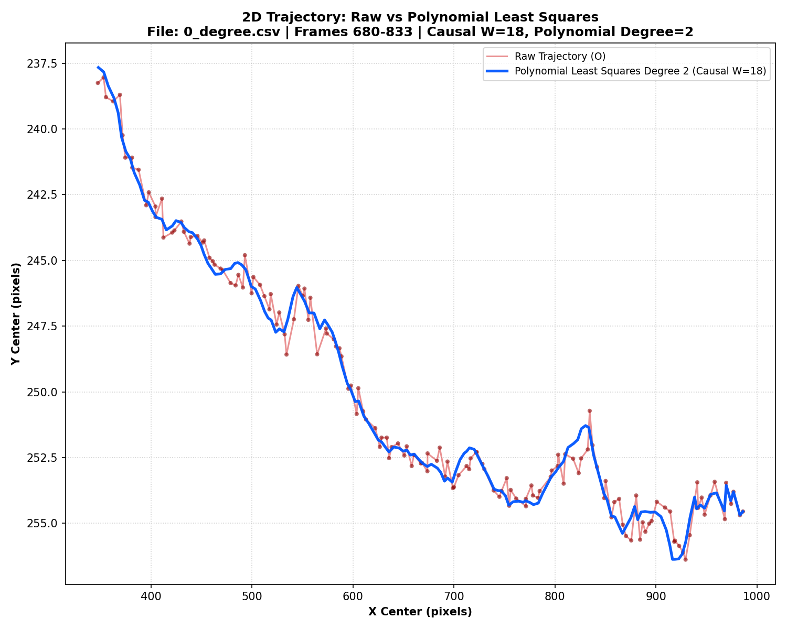
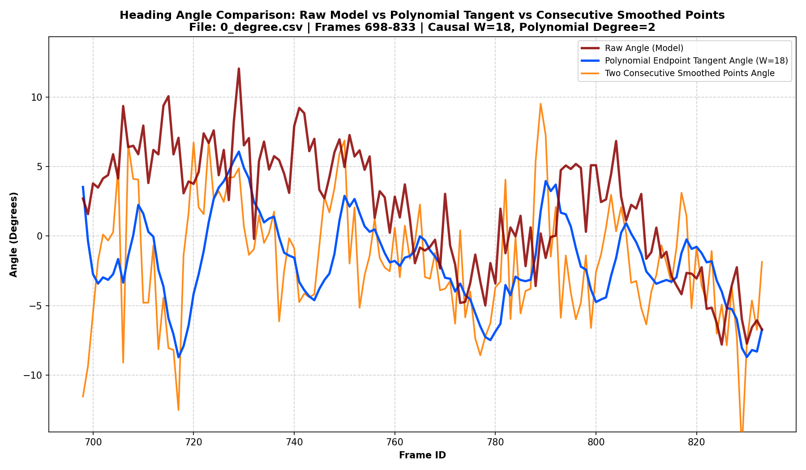
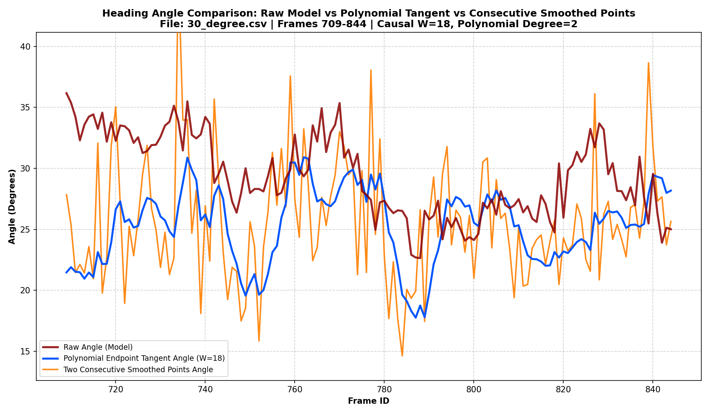
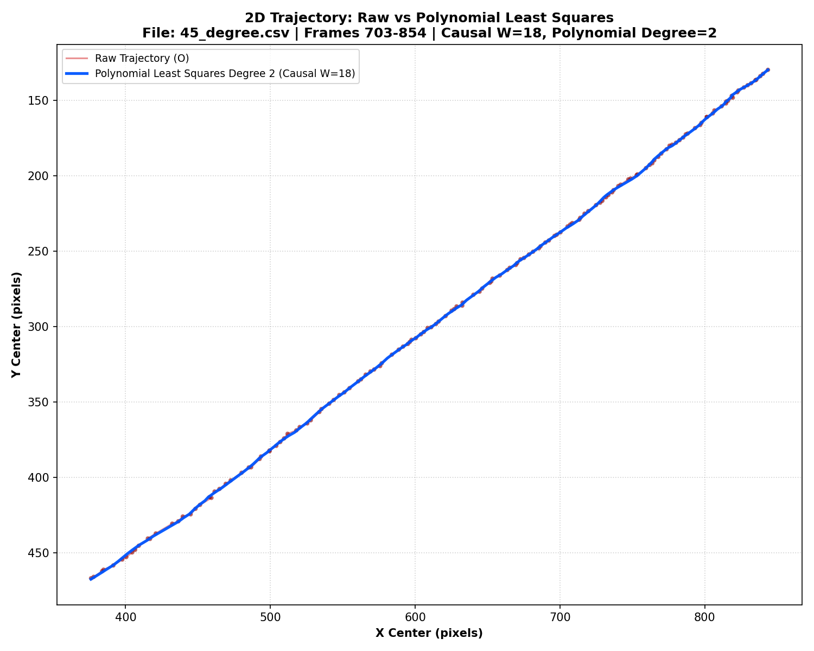
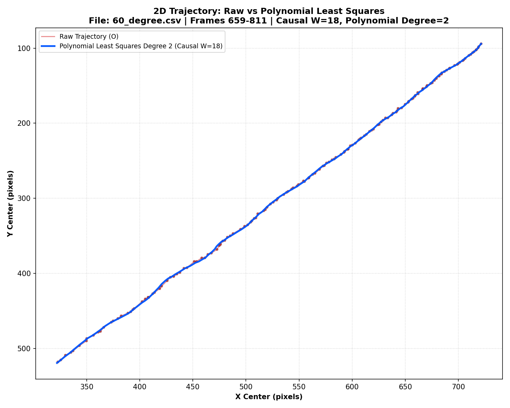
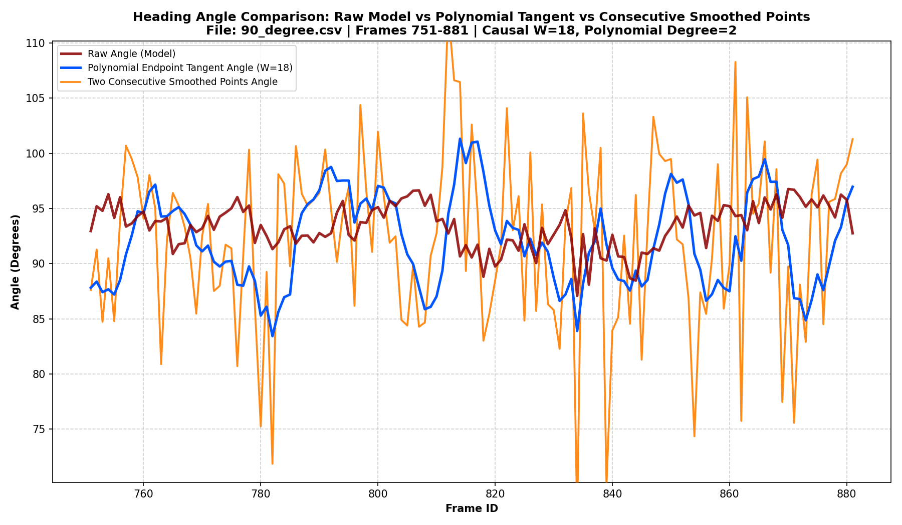
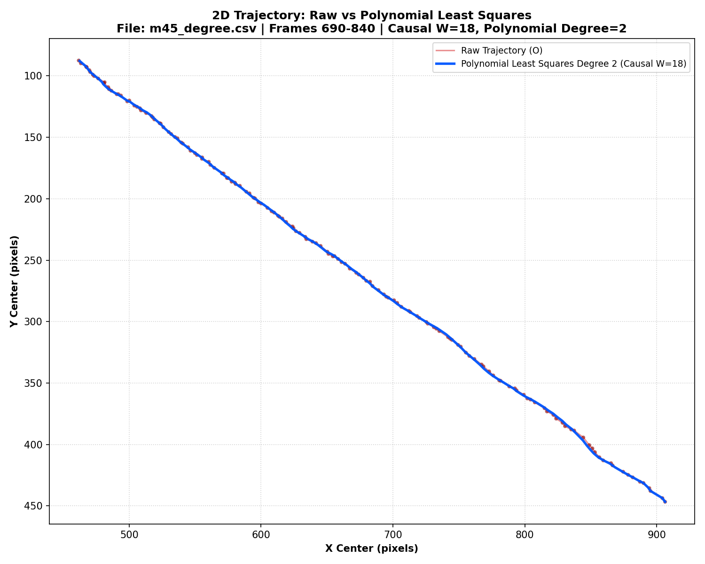
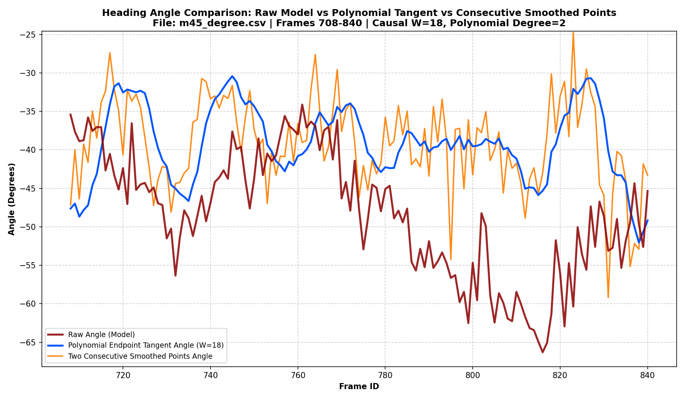

# Báo cáo công việc ngày 14/08/2026

## A. Công việc đã làm
- Tính  Góc tiếp tuyến của quỹ đạo (Không dùng góc từ hai điểm đã làm mượt liên tiếp)
    - Không cần  Quy đổi đạo hàm sang thời gian thực
    - Chưa cần thử  Dạng convolution và tối ưu khi chạy realtime
- Vẽ đồ thị so sánh, các đường đồ thị cần vẽ :
    - tiếp tuyến của quỹ đạo
    - góc từ hai điểm đã làm mượt liên tiếp
    - Raw angle (Model)
### 1. Thử nghiệm tính góc tiếp tuyến trực tiếp từ đa thức cục bộ

- Tiếp tục sử dụng **Causal Sliding Window** gồm `N = 18` mẫu từ quá khứ đến hiện tại.
- Chuẩn hóa trục thời gian của mỗi cửa sổ về $t \in [-1,0]$.
- Fit riêng hai đa thức bậc hai $x(t)$ và $y(t)$ bằng Least Squares.
- Xác định hướng tiếp tuyến của hai đa thức tại endpoint $t=0$ để tính góc quỹ đạo.
- Không sử dụng góc tạo bởi hai điểm đã làm mượt liên tiếp làm kết quả chính.
- Sử dụng `np.polyfit()`, `np.polyder()` và `np.polyval()` fit đa thức
- Vẽ thêm biểu đồ quỹ đạo 2D để so sánh quỹ đạo raw và quỹ đạo từ các điểm endpoint sau khi fit Least Squares.

- Code sử dụng: [`plot_poly_tangent_angle_comparison.py`](tools/plot_poly_tangent_angle_comparison.py)

- Lệnh chạy:

  Chạy toàn bộ các file CSV trong thư mục `benchmark`:

  ```powershell
  cd 260814
  python tools/plot_poly_tangent_angle_comparison.py benchmark --window-size 18 --poly-degree 2 --seed 42
  ```

  Chạy riêng một file CSV:

  ```powershell
  cd 260814
  python tools/plot_poly_tangent_angle_comparison.py benchmark/45_degree.csv --window-size 18 --poly-degree 2 --seed 42
  ```

  Ảnh kết quả được lưu trong thư mục: `benchmark/poly_tangent_comparison/`

### 2. Biểu đồ kết quả

#### 2.1. Quỹ đạo 0 độ (`0_degree.csv`)

##### a) Biểu đồ quỹ đạo 2D (Raw vs Fit Polynomial Least Squares Bậc 2)


##### b) Đồ thị so sánh góc (Raw Model vs Fit Polynomial Tangent vs Hai điểm làm mượt liên tiếp)


---

#### 2.2. Quỹ đạo 30 độ (`30_degree.csv`)

##### a) Biểu đồ quỹ đạo 2D (Raw vs Fit Polynomial Least Squares Bậc 2)


##### b) Đồ thị so sánh góc (Raw Model vs Fit Polynomial Tangent vs Hai điểm làm mượt liên tiếp)


---

#### 2.3. Quỹ đạo 45 độ (`45_degree.csv`)

##### a) Biểu đồ quỹ đạo 2D (Raw vs Fit Polynomial Least Squares Bậc 2)


##### b) Đồ thị so sánh góc (Raw Model vs Fit Polynomial Tangent vs Hai điểm làm mượt liên tiếp)


---

#### 2.4. Quỹ đạo 60 độ (`60_degree.csv`)

##### a) Biểu đồ quỹ đạo 2D (Raw vs  Fit Polynomial Least Squares Bậc 2)


##### b) Đồ thị so sánh góc (Raw Model vs Fit Polynomial Tangent vs Hai điểm làm mượt liên tiếp)


---

#### 2.5. Quỹ đạo 90 độ (`90_degree.csv`)

##### a) Biểu đồ quỹ đạo 2D (Raw vs Fit Polynomial Least Squares Bậc 2)


##### b) Đồ thị so sánh góc (Raw Model vs Fit Polynomial Tangent vs Hai điểm làm mượt liên tiếp)


---

#### 2.6. Quỹ đạo -45 độ (`m45_degree.csv`)

##### a) Biểu đồ quỹ đạo 2D (Raw vs Fit Polynomial Least Squares Bậc 2)


##### b) Đồ thị so sánh góc (Raw Model vs Fit Polynomial Tangent vs Hai điểm làm mượt liên tiếp)


## B. Khó khăn

- Không

## C. Công việc tiếp theo
- Em có cần tiếp tục tìm hiểu thêm các phương pháp khác khôgn ạ ? `weight function for weighted sliding windows` :
    - Uniform Weight
    - Linear Weight
- Em xin phép nhận công việc tiếp theo từ Thầy ạ.
