# Báo cáo công việc ngày 15/08/2026

## A. Công việc đã làm
- Thử nghiệm **Smooth lần 2** bằng phương pháp Least Squares đa thức với kích thước cửa sổ trượt gấp đôi: $W_{smooth2} = W \times 2$.

### 1. Thay đổi các cửa sổ Sliding Windows $W = 18 \to 15 \to 12$ (Smooth lần 2 tương ứng: $W_2 = 36, 30, 24$)

- **Các bước thực hiện Smooth 2**:
  - **Smooth lần 1**: Fit đa thức bậc 2 trên 2D trajectory $(x, y)$ với cửa sổ quá khứ $W$ để tính góc tiếp tuyến (Endpoint Tangent Angle).
  - **Smooth lần 2**: Áp dụng tiếp Least Squares đa thức bậc 2 một chiều trên chuỗi góc tiếp tuyến đã được unwrap và align, với kích thước cửa sổ trượt mở rộng $W_{smooth2} = W \times 2$.
    - Khi $W = 18 \implies W_{smooth2} = 36$
    - Khi $W = 15 \implies W_{smooth2} = 30$
    - Khi $W = 12 \implies W_{smooth2} = 24$

- **Code sử dụng**: [`plot_poly_tangent_angle_comparison.py`](tools/plot_poly_tangent_angle_comparison.py)
- **Param thay đổi**: `sliding windows length` (`--window-size 18`, `--window-size 15`, `--window-size 12`)
- **Lệnh chạy**:
  ```powershell

  # Cửa sổ W = 18 (Smooth 2 tự động W2 = 36)
  python tools/plot_poly_tangent_angle_comparison.py benchmark --window-size 18 --poly-degree 2 --seed 42

  # Cửa sổ W = 15 (Smooth 2 tự động W2 = 30)
  python tools/plot_poly_tangent_angle_comparison.py benchmark --window-size 15 --poly-degree 2 --seed 42

  # Cửa sổ W = 12 (Smooth 2 tự động W2 = 24)
  python tools/plot_poly_tangent_angle_comparison.py benchmark --window-size 12 --poly-degree 2 --seed 42
  ```

- **Đồ thị kết quả so sánh **:

#### 1.1. Góc 0 độ (`0_degree.csv`)
- **Sliding windows length W = 18 (Smooth 2: W2 = 36)**:
  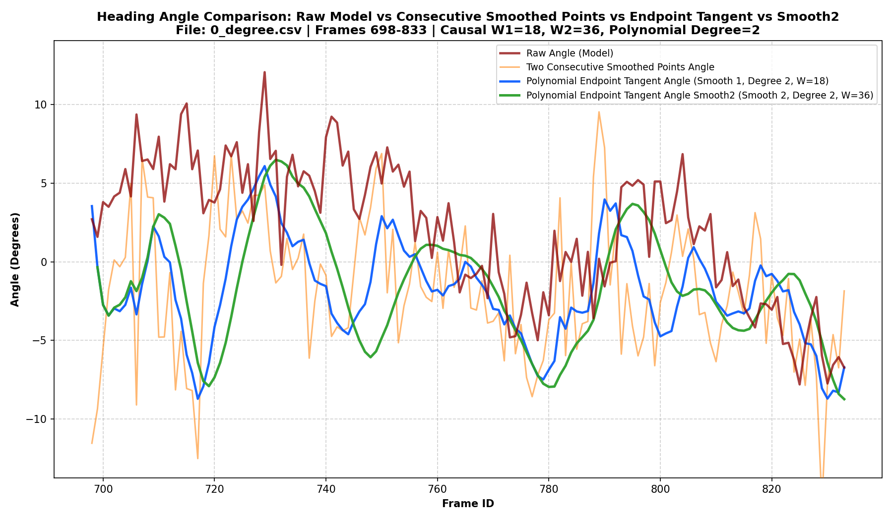
- **Sliding windows length W = 15 (Smooth 2: W2 = 30)**:
  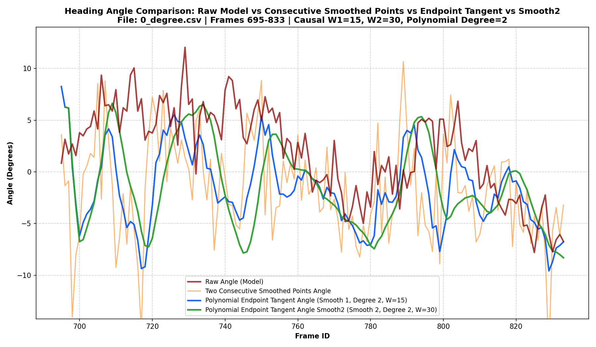
- **Sliding windows length W = 12 (Smooth 2: W2 = 24)**:
  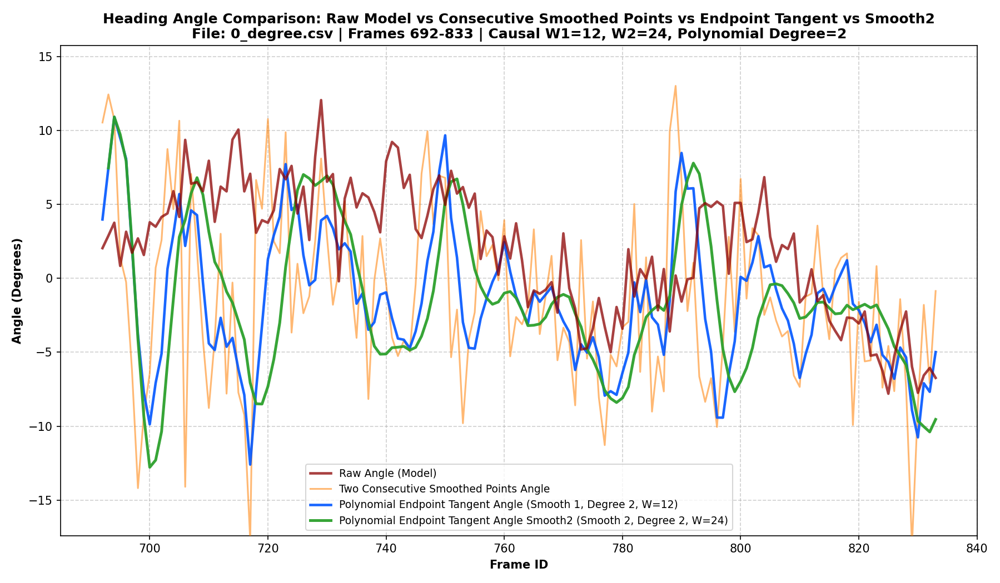

---

#### 1.2. Góc 30 độ (`30_degree.csv`)
- **Sliding windows length W = 18 (Smooth 2: W2 = 36)**:
  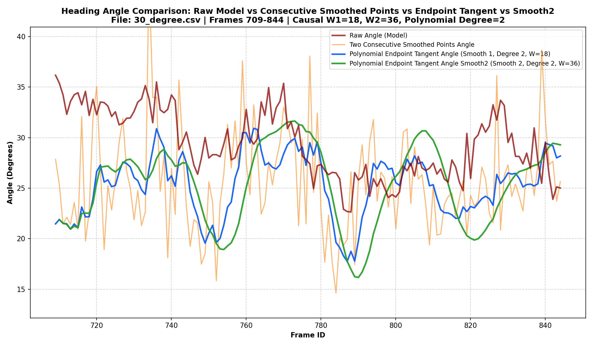
- **Sliding windows length W = 15 (Smooth 2: W2 = 30)**:
  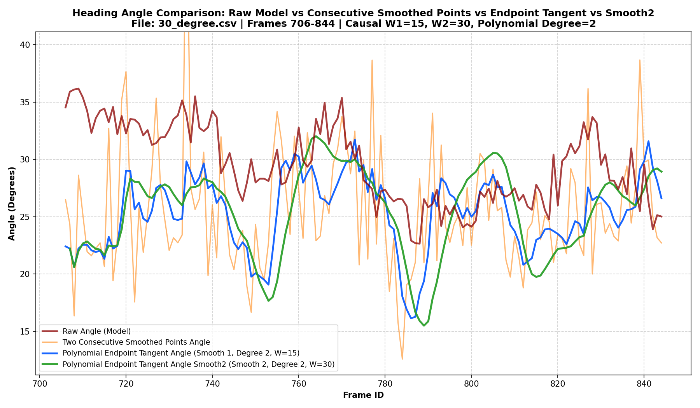
- **Sliding windows length W = 12 (Smooth 2: W2 = 24)**:
  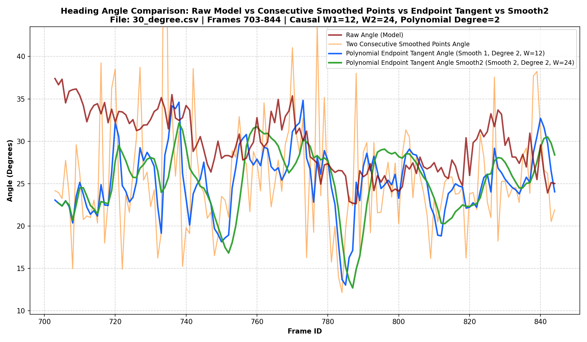

---

#### 1.3. Góc 45 độ (`45_degree.csv`)
- **Sliding windows length W = 18 (Smooth 2: W2 = 36)**:
  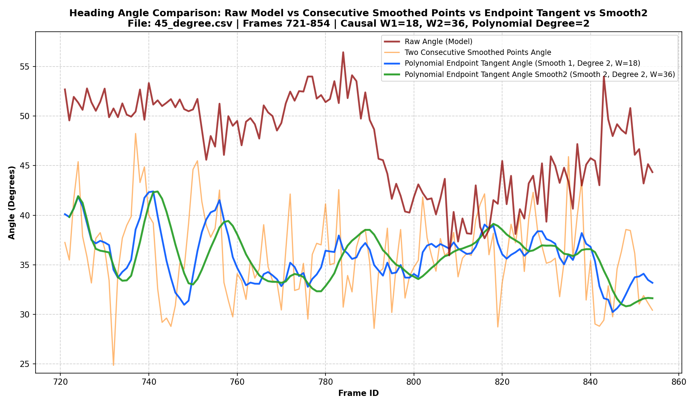
- **Sliding windows length W = 15 (Smooth 2: W2 = 30)**:
  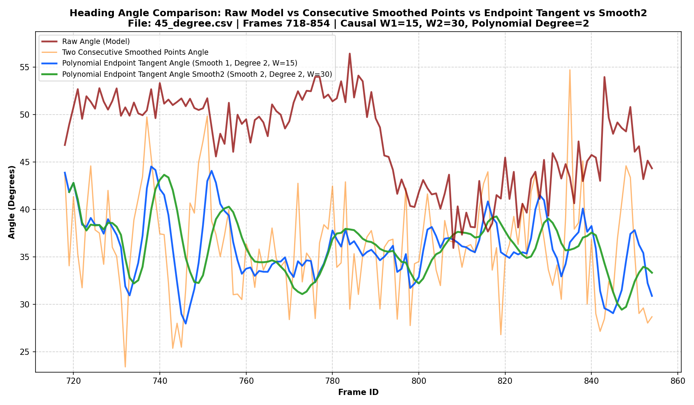
- **Sliding windows length W = 12 (Smooth 2: W2 = 24)**:
  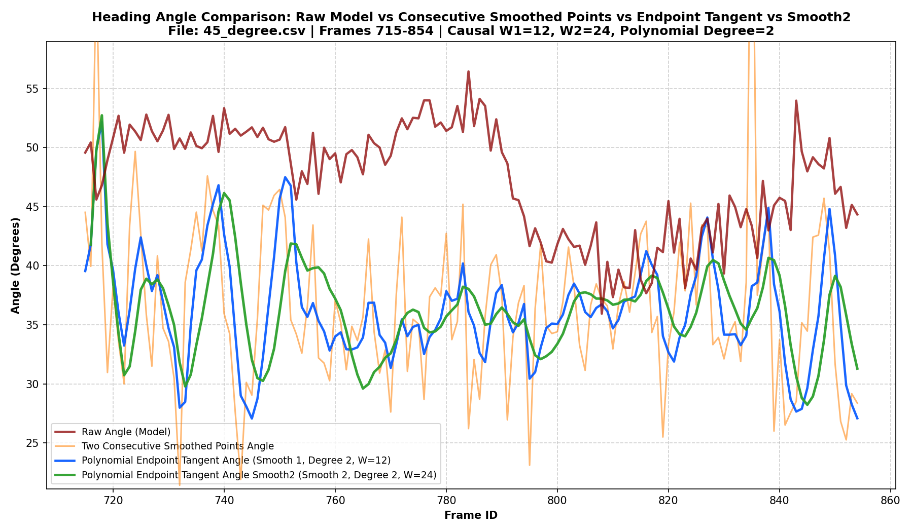

---

#### 1.4. Góc -45 độ (`m45_degree.csv`)
- **Sliding windows length W = 18 (Smooth 2: W2 = 36)**:
  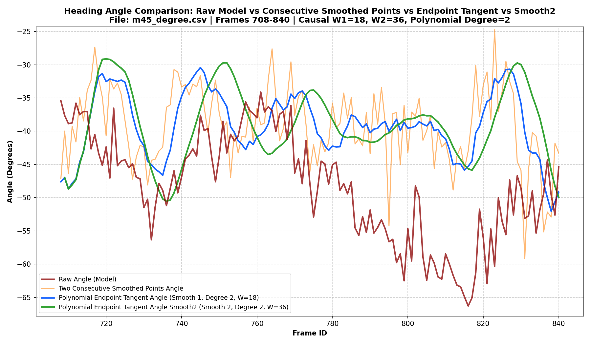
- **Sliding windows length W = 15 (Smooth 2: W2 = 30)**:
  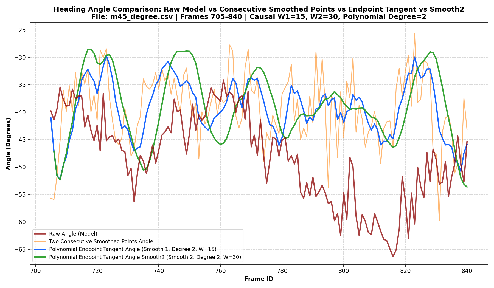
- **Sliding windows length W = 12 (Smooth 2: W2 = 24)**:
  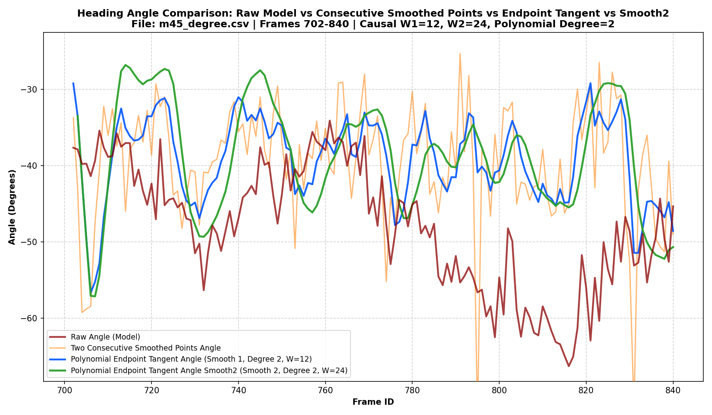

---

#### 1.5. Góc 60 độ (`60_degree.csv`)
- **Sliding windows length W = 18 (Smooth 2: W2 = 36)**:
  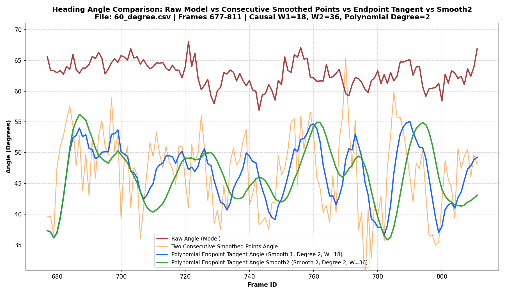
- **Sliding windows length W = 15 (Smooth 2: W2 = 30)**:
  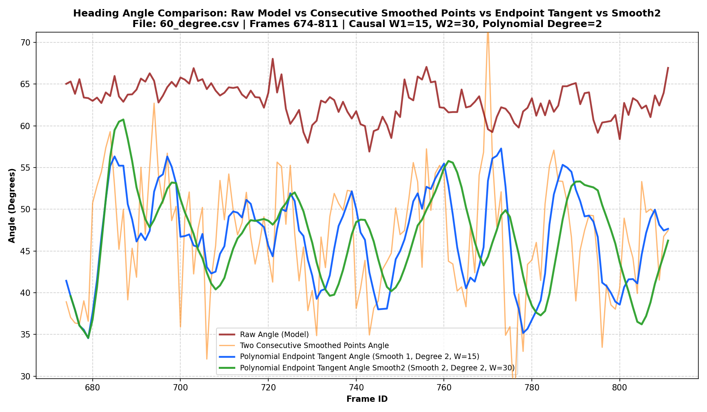
- **Sliding windows length W = 12 (Smooth 2: W2 = 24)**:
  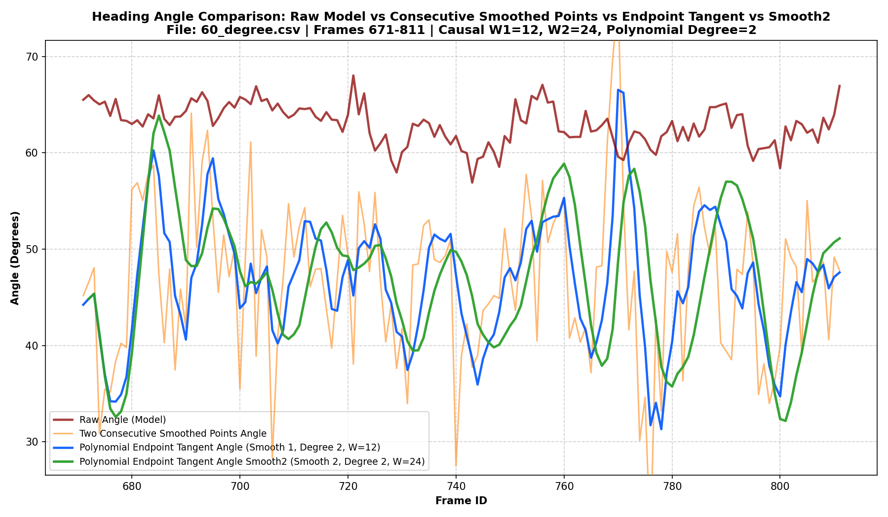

---

#### 1.6. Góc 90 độ (`90_degree.csv`)
- **Sliding windows length W = 18 (Smooth 2: W2 = 36)**:
  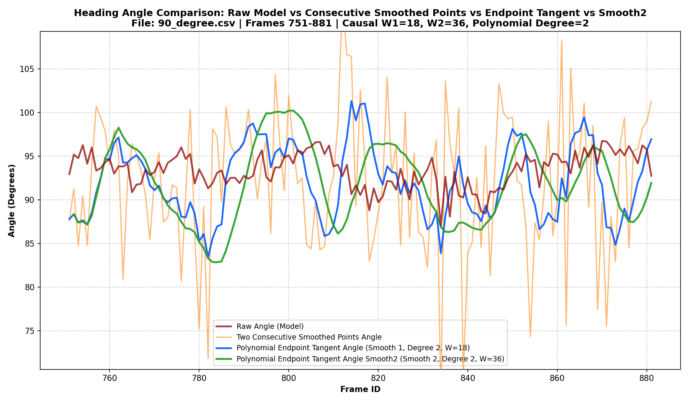
- **Sliding windows length W = 15 (Smooth 2: W2 = 30)**:
  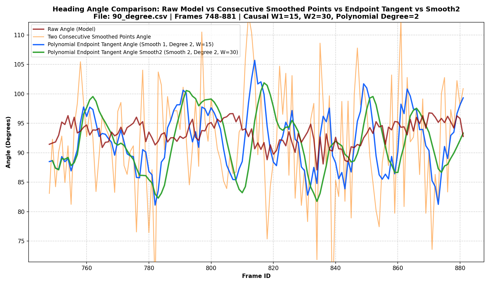
- **Sliding windows length W = 12 (Smooth 2: W2 = 24)**:
  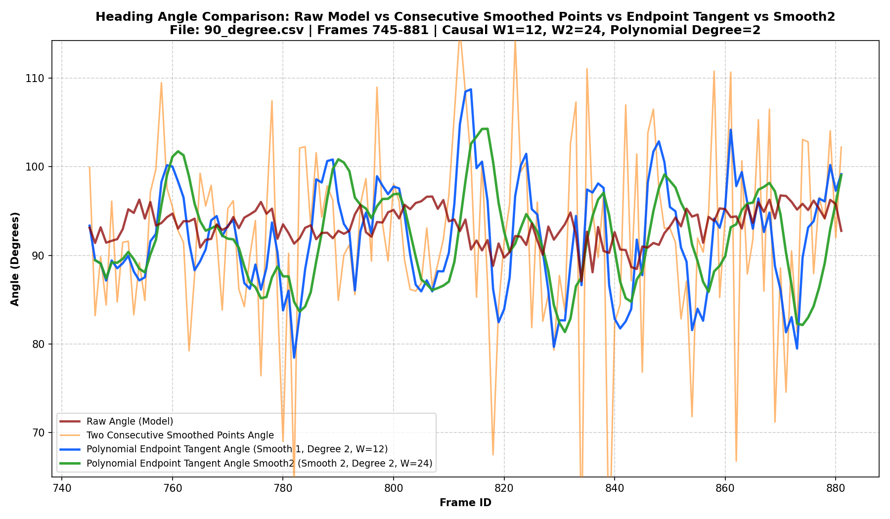

---

> **Nhận xét**:
> - Khi mở rộng cửa sổ Smooth lần 2 lên $W_{smooth2} = W \times 2$ (36, 30, 24), đường góc tiếp tuyến làm mượt lần 2 (`Smooth 2 - màu xanh lá cây`) triệt tiêu tốt hơn các dao động vi mô cục bộ so với khi dùng cùng cửa sổ $W$. Tuy nhiên đường đồ thị phản ứng chậm so với thay đổi ( có thể thấy đồ thị hơi tịnh tiến về bên phải theo trục thời gian( frame ID )
> - Khi giảm kích thước cửa sổ từ $W=18$ xuống $W=15$ và $W=12$, độ nhạy phản ứng với góc tức thời nhanh hơn nhưng mức độ dao động nhiễu của cả Smooth 1 và Smooth 2 đều tăng lên. Cửa sổ $W=18$ ($W_2=36$) cho đồ thị ổn định tốt hơn. 

## B. Khó khăn

- Không

## C. Công việc tiếp theo
- Tiếp tục tìm hiểu thêm `weight function for weighted sliding windows`:
  - Uniform Weight
  - Linear Weight
- Em xin phép nhận công việc tiếp theo từ Thầy ạ.