# Báo cáo công việc ngày 17/08/2026

## Mục lục
- [A. Công việc đã làm](#a-công-việc-đã-làm)
  - [1. Áp dụng Linear Weight vào Polynomial Least Squares](#1-áp-dụng-linear-weight-vào-polynomial-least-squares)
  - [2. Áp dụng trọng số vào bài toán Least Squares Polynomial bậc 2](#2-áp-dụng-trọng-số-vào-bài-toán-least-squares-polynomial-bậc-2)
  - [3. Các bước triển khai thuật toán](#3-các-bước-triển-khai-thuật-toán)
  - [4. Các trường hợp thực nghiệm & So sánh](#4-các-trường-hợp-thực-nghiệm--so-sánh)
  - [5. Kết quả thử nghiệm (Linear Weight 1:1.5, 1:2, 1:3)](#5-kết-quả-thử-nghiệm)
- [6. Cập nhật phương pháp Linear Weight = [0, 1]](#6-cập-nhật-phương-pháp-linear-weight--0-1)
- [7. Delayed Heading Angle tại index = -3 (Áp dụng Linear Weight [0, 1])](#7-delayed-heading-angle-tại-index---3-áp-dụng-linear-weight-0-1)
- [8. Đánh giá độ mịn bằng sai số RMS so với đường Fit bậc 1](#8-đánh-giá-độ-mịn-bằng-sai-số-rms-so-với-đường-fit-bậc-1)
  - [8.7. Bảng so sánh chất lượng độ mịn (RMS) giữa các phương án](#87-bảng-so-sánh-chất-lượng-độ-mịn-rms-giữa-các-phương-án)
- [B. Khó khăn](#b-khó-khăn)
- [C. Công việc tiếp theo](#c-công-việc-tiếp-theo)

---

## A. Công việc đã làm

- Tiếp tục tìm hiểu và thử nghiệm **Weight Function** cho bài toán **Polynomial Least Squares**:
  - **Uniform Weight** (trọng số đều) với tỷ lệ `1:1`.
  - **Linear Weight** (trọng số tuyến tính) với các tỷ lệ:
    - `1:1.5`
    - `1:2`
    - `1:3`
- Thử nghiệm phương án **Delayed Heading Angle** tại `index = -3` trên cửa sổ $W = 18$.
- Đánh giá chất lượng độ mịn bằng sai số **RMS** so với đường Fit đa thức bậc 1 (Ground Truth reference) giữa các phương án: `Smooth 1 (index = 0)`, `Delayed Tangent (index = -3)` và `Smooth 2 (W2 = 36)`.

---

### 1. Áp dụng Linear Weight vào Polynomial Least Squares

- **Hạn chế của Uniform Weight trước đây**:
  - Các điểm dữ liệu trong cửa sổ trượt quá khứ $W$ đều có mức độ ảnh hưởng như nhau:
    $$\alpha_0 = \alpha_1 = \dots = \alpha_{W-1} = 1$$

- **Ý tưởng của Linear Weight**:
  - Các frame càng gần thời điểm hiện tại càng mang nhiều thông tin thực tế về hướng chuyển động tức thời, do đó cần được gán trọng số lớn hơn các frame cũ trong quá khứ.
  - Với cửa sổ trượt gồm $W$ mẫu và tỷ lệ trọng số đầu - cuối là $1:r$:
    $$\alpha_i = 1 + \frac{i}{W-1}(r-1), \quad \text{với } i = 0, 1, \dots, W-1$$
  - Trong đó:
    - **Frame cũ nhất** ($i = 0$): $\alpha_0 = 1$
    - **Frame mới nhất** ($i = W-1$): $\alpha_{W-1} = r$
  - Ví dụ với $W = 18$ và tỷ lệ `1:2`:
    - Trọng số $\alpha$ tăng tuyến tính đều đặn từ $1 \to 2$ qua 18 mẫu.
  - **Mục tiêu**: Giảm độ trễ pha (phase lag) khi góc chuyển động thay đổi, đồng thời khảo sát mức độ làm mượt dao động nhiễu.

---

### 2. Áp dụng trọng số vào bài toán Least Squares Polynomial bậc 2

- **Hàm mục tiêu tối ưu hóa (Weighted Least Squares)**:
  - Với **Uniform Weight**:
    $$J = \sum_{i=1}^{W} e_i^2$$
  - Với **Linear Weight**:
    $$J = \sum_{i=1}^{W} \alpha_i e_i^2 \quad \text{với } e_i = y_i - \hat{y}_i$$

- **Quy đổi trọng số cho hàm `np.polyfit()`**:
  - Hàm `np.polyfit(..., w=w)` trong NumPy tối thiểu hóa $\sum (w_i e_i)^2$.
  - Do đó trọng số $w_i$ truyền vào hàm được tính bằng căn bậc hai của importance factor:
    $$w_i = \sqrt{\alpha_i}$$

- **Đoạn mã tạo Linear Weight và Fit đa thức**:
  ```python
  def linear_importance(window_length, ratio):
      return np.linspace(1.0, ratio, window_length)

  def polyfit_weights(window_length, ratio):
      return np.sqrt(linear_importance(window_length, ratio))
  ```
  - Áp dụng khi fit riêng biệt hai tọa độ $x(t)$ và $y(t)$:
  ```python
  coefficients_x = np.polyfit(time_normalized, x_window, deg=current_degree, w=fit_w)
  coefficients_y = np.polyfit(time_normalized, y_window, deg=current_degree, w=fit_w)
  ```

---

### 3. Các bước triển khai thuật toán

- **Bước 1**: Chuẩn hóa trục thời gian $t$ của cửa sổ $W$ mẫu về đoạn:
  $$t \in [-1, 0]$$
- **Bước 2**: Fit riêng hai đa thức bậc 2 theo phương pháp Weighted Least Squares:
  $$x(t) = a_x t^2 + b_x t + c_x$$
  $$y(t) = a_y t^2 + b_y t + c_y$$
- **Bước 3**: Lấy tọa độ làm mượt tại điểm cuối (Endpoint $t = 0$):
  $$x_{smooth} = x(0) = c_x, \quad y_{smooth} = y(0) = c_y$$
- **Bước 4**: Tính vector vận tốc tiếp tuyến tại Endpoint ($t = 0$):
  $$\frac{dx}{dt}\Big|_{t=0} = b_x, \quad \frac{dy}{dt}\Big|_{t=0} = b_y$$
- **Bước 5**: Xác định góc tiếp tuyến của quỹ đạo:
  $$\theta = \operatorname{atan2}\left(-\frac{dy}{dt}\Big|_{t=0}, \frac{dx}{dt}\Big|_{t=0}\right)$$

---

### 4. Các trường hợp thực nghiệm & So sánh

- **Các chuỗi góc được so sánh đồng thời trên cùng biểu đồ**:
  - **Raw Angle (Model)**: Góc thô nhận diện từ Model (màu đỏ đậm `#8b0000`, nét liền).
  - **Uniform Weight `1:1`**: Baseline làm mượt trọng số đều (màu xanh dương `#0055ff`, nét liền).
  - **Linear Weight `1:1.5`**: Trọng số tuyến tính tỷ lệ 1:1.5 (màu cam `#ff7f0e`, nét liền).
  - **Linear Weight `1:2`**: Trọng số tuyến tính tỷ lệ 1:2 (màu xanh lá `#2ca02c`, nét liền).
  - **Linear Weight `1:3`**: Trọng số tuyến tính tỷ lệ 1:3 (màu tím `#9467bd`, nét liền).

- **Mã nguồn thực thi**: [`plot_poly_tangent_linear_weight.py`](tools/plot_poly_tangent_linear_weight.py)
- **Lệnh chạy toàn bộ benchmark**:
  ```powershell
  python tools/plot_poly_tangent_linear_weight.py benchmark --window-size 18 --poly-degree 2 --weight-ratios 1.5,2,3
  ```
- **Thư mục lưu ảnh kết quả**: `benchmark/poly_tangent_linear_weight_comparison/`

---

## 5. Kết quả thử nghiệm

### 5.1. Góc 0 độ (`0_degree.csv`)

- **a) So sánh quỹ đạo 2D**:
  

- **b) So sánh biểu đồ góc**:
  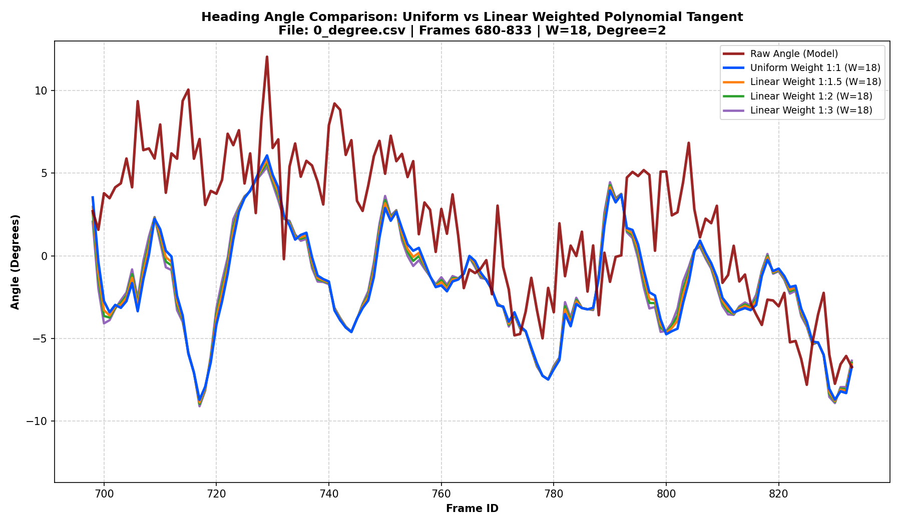

---

### 5.2. Góc 30 độ (`30_degree.csv`)

- **a) So sánh quỹ đạo 2D**:
  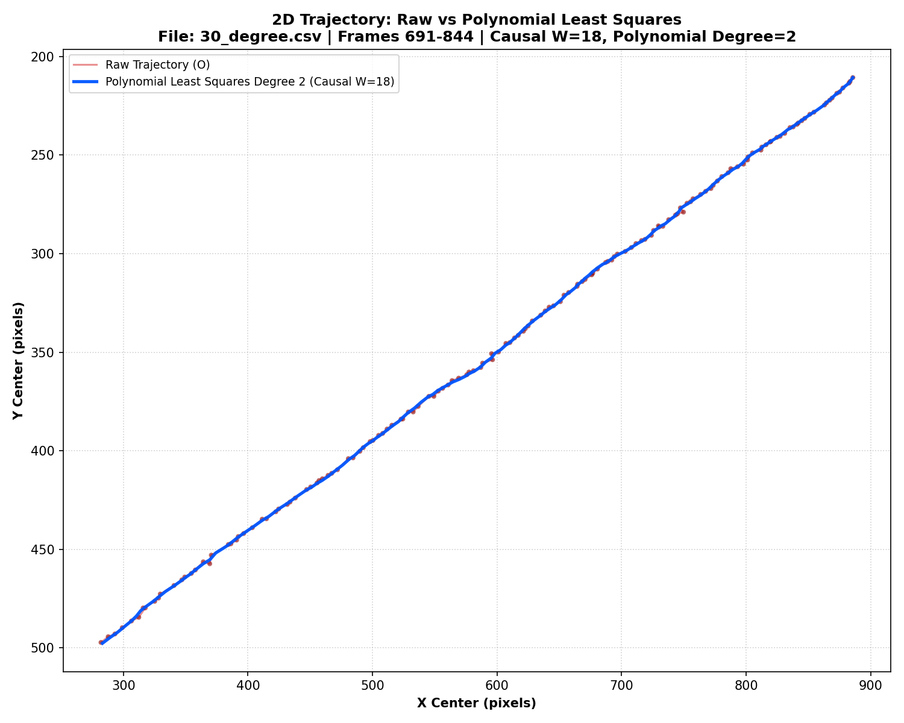

- **b) So sánh biểu đồ góc**:
  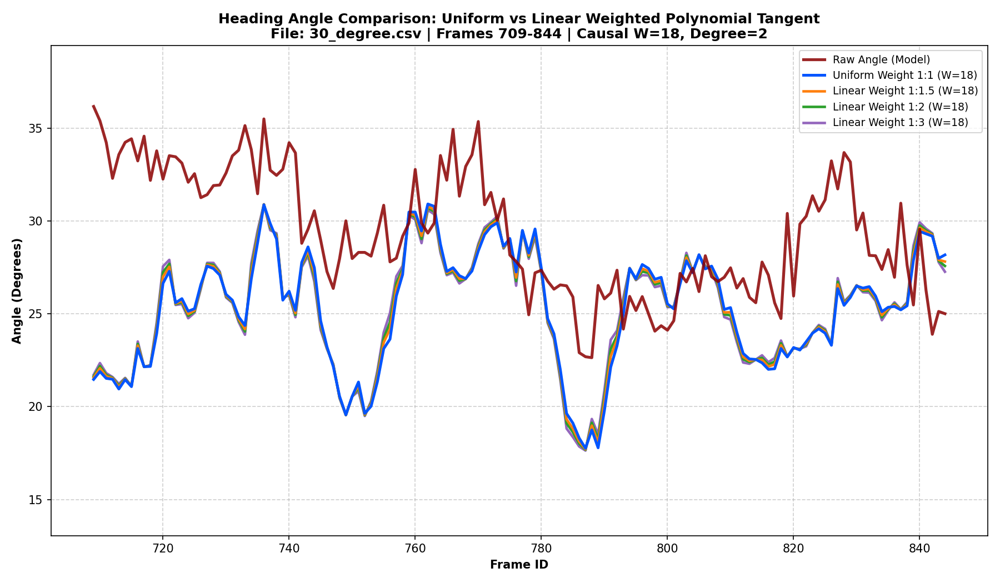

---

### 5.3. Góc 45 độ (`45_degree.csv`)

- **a) So sánh quỹ đạo 2D**:
  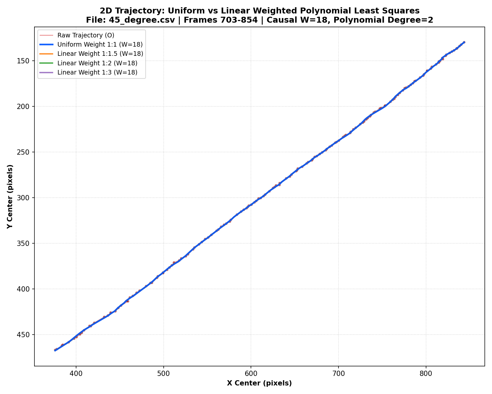

- **b) So sánh biểu đồ góc**:
  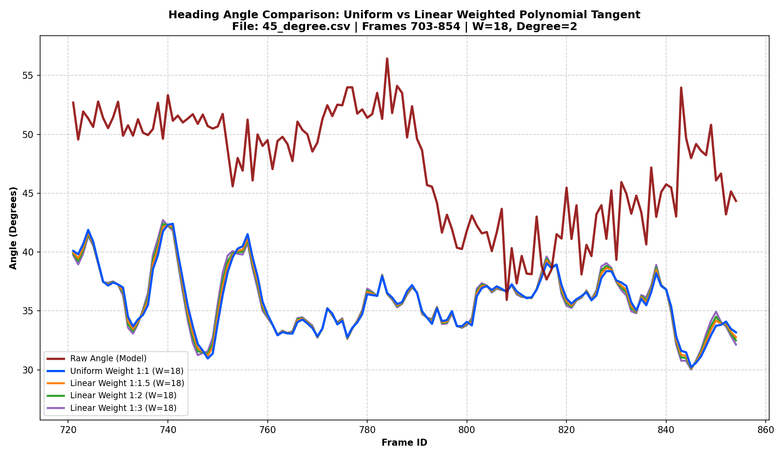

---

### 5.4. Góc -45 độ (`m45_degree.csv`)

- **a) So sánh quỹ đạo 2D**:
  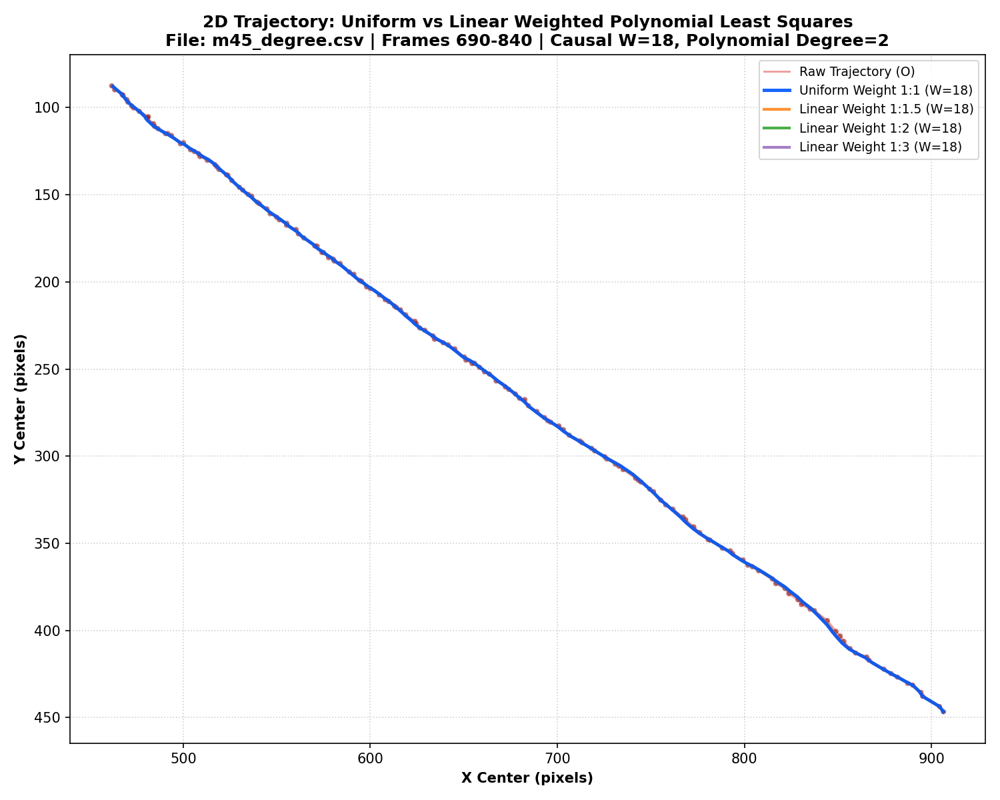

- **b) So sánh biểu đồ góc**:
  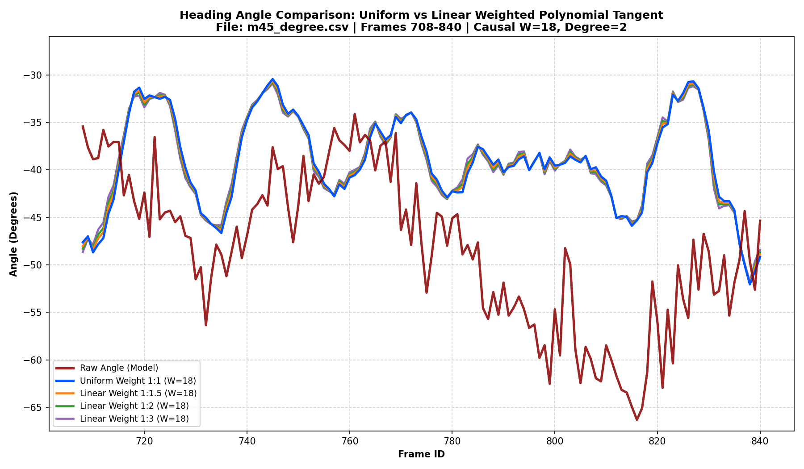

---

### 5.5. Góc 60 độ (`60_degree.csv`)

- **a) So sánh quỹ đạo 2D**:
  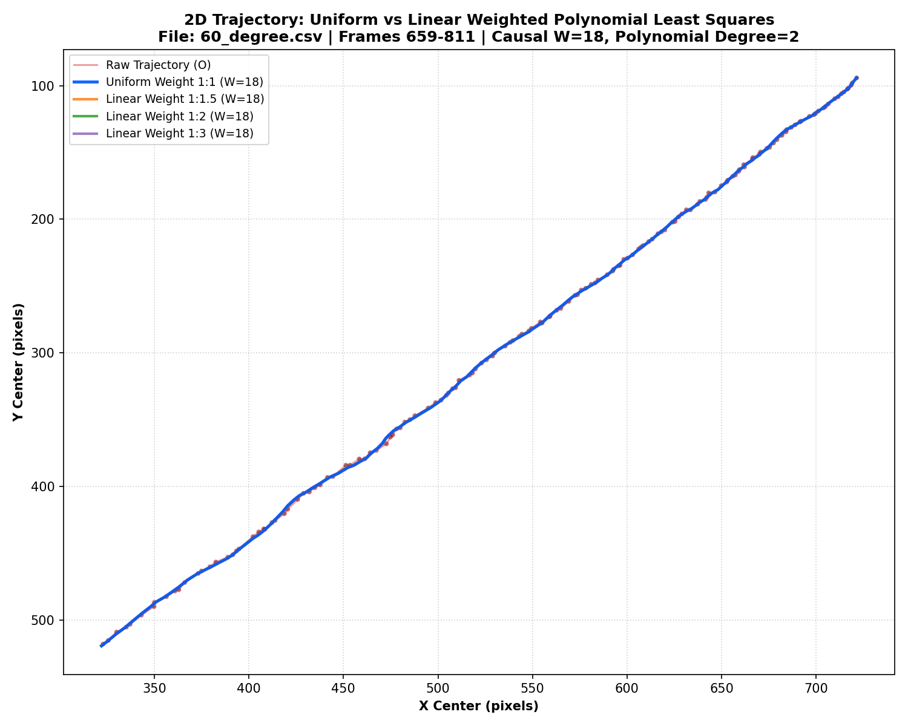

- **b) So sánh biểu đồ góc**:
  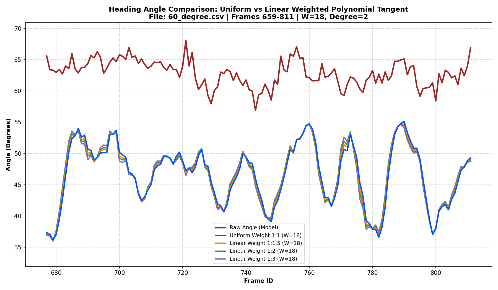

---

- **a) So sánh quỹ đạo 2D**:
  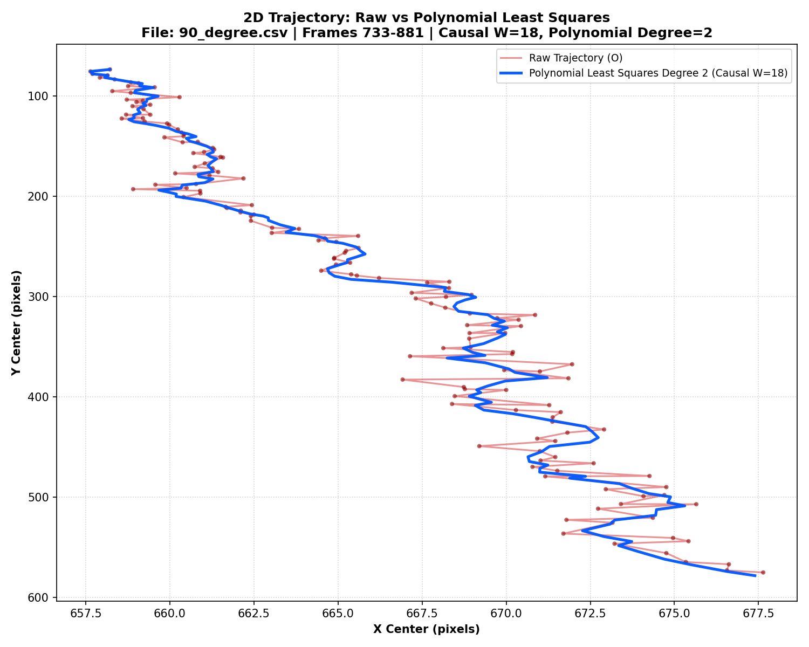

- **b) So sánh biểu đồ góc**:
  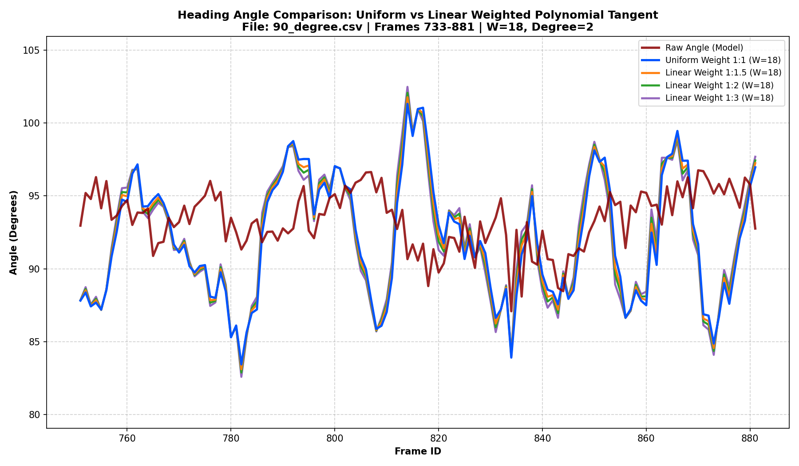

---

> **Nhận xét**:
> - **Uniform Weight `1:1`**: Coi toàn bộ 18 frame trong quá khứ có vai trò ngang nhau, cho đường góc tiếp tuyến ổn định nhưng có độ trễ nhất định khi hướng xe thay đổi đột ngột.
> - **Linear Weight (`1:1.5`, `1:2`, `1:3`)**: Đã ưu tiên trọng số lớn hơn cho các frame mới nhất gần thời điểm hiện tại.
> - **Đánh giá thực nghiệm**: Với 3 tỷ lệ `1:1.5`, `1:2` và `1:3`, đường đồ thị góc tiếp tuyến bám sát quỹ đạo rất tốt, tuy nhiên độ chênh lệch giữa các mức trọng số này chưa tạo ra sự phân hóa quá rõ rệt trên biểu đồ toàn chu trình so với Uniform Weight.

---

## 6. Cập nhật phương pháp Linear Weight = [0, 1]

- **Quy tắc gán trọng số**:
  - Với cửa sổ trượt quá khứ gồm $W = 18$ mẫu ($t \in [-1.0, 0.0]$):
    $$\alpha_i = \frac{i}{W - 1}, \quad \text{với } i = 0, 1, \dots, W - 1$$
  - Trong đó:
    - **Frame cũ nhất** ($i = 0$): $\alpha_0 = 0.0$ (triệt tiêu hoàn toàn ảnh hưởng của dữ liệu cũ ngoài rìa cửa sổ).
    - **Frame mới nhất** ($i = W - 1$): $\alpha_{W - 1} = 1.0$ (đạt trọng số cực đại tại thời điểm hiện tại).
- **Đoạn mã tạo Linear Weight [0, 1] và xử lý chống suy biến SVD**:
  ```python
  def get_weights(window_length: int, weight_mode: str, ratio: float = 1.0) -> np.ndarray:
      if weight_mode == "linear_0_to_1":
          alpha = np.linspace(0.0, 1.0, window_length, dtype=float)
          # Clip với epsilon 1e-6 để tránh ma trận suy biến ở các frame khởi đầu
          return np.sqrt(np.clip(alpha, 1e-6, 1.0))
  ```

---

## 7. Delayed Heading Angle tại index = -3 (Áp dụng Linear Weight [0, 1])

- **Cấu hình thử nghiệm**:
  - Cả hai cách tính tiếp tuyến đều áp dụng bộ trọng số **Linear Weight `[0, 1]`**:
    - **Endpoint Tangent (index = 0)**: Tính tiếp tuyến tức thời tại điểm mới nhất $t = 0.0$.
    - **Delayed Tangent (index = -3)**: Tính tiếp tuyến lùi lại 3 mẫu tại điểm $t_{delay} = \frac{-3}{W-1} \approx -0.1765$.
- **Code sử dụng**: [`plot_poly_tangent_linear_weight.py`](tools/plot_poly_tangent_linear_weight.py)
- **Lệnh chạy các file csv benchmark**:
  ```powershell
  python tools/plot_poly_tangent_linear_weight.py benchmark --mode delayed --window-size 18 --poly-degree 2
  ```
- **Thư mục lưu ảnh kết quả**: `benchmark/poly_tangent_delayed_angle_comparison/`

---

### 7.1. Góc 0 độ (`0_degree.csv`)

- **a) So sánh quỹ đạo 2D**:
  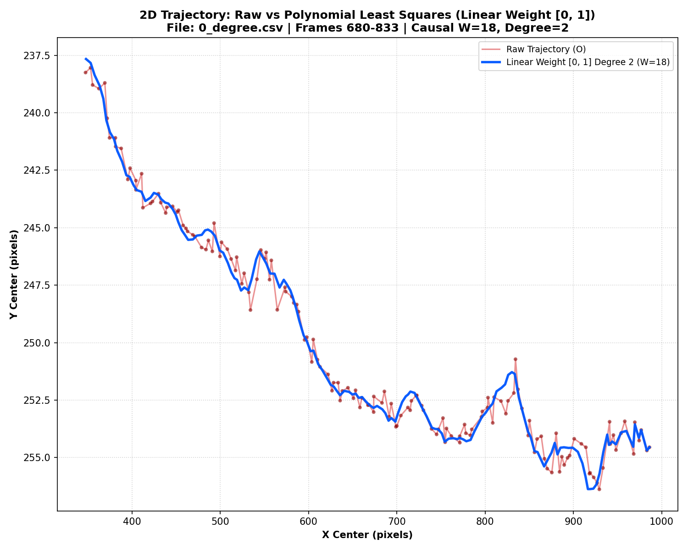

- **b) So sánh biểu đồ góc**:
  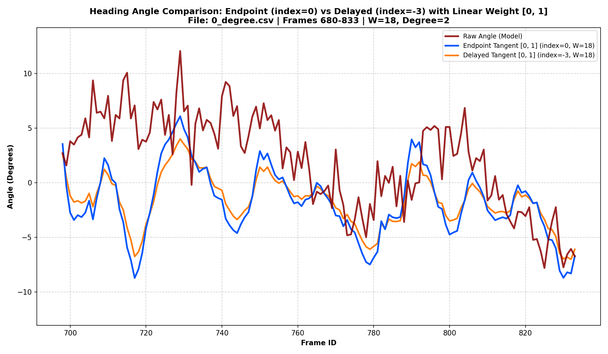

---

### 7.2. Góc 30 độ (`30_degree.csv`)

- **a) So sánh quỹ đạo 2D**:
  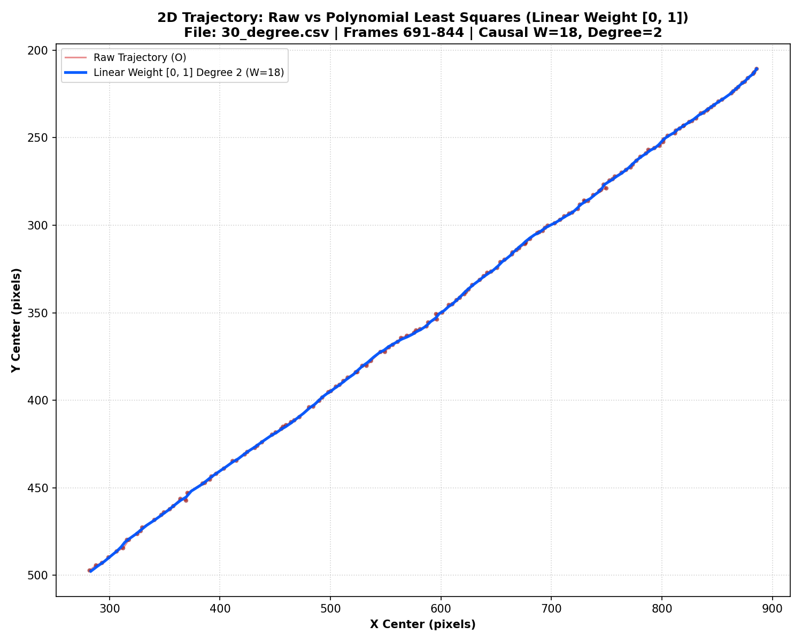

- **b) So sánh biểu đồ góc**:
  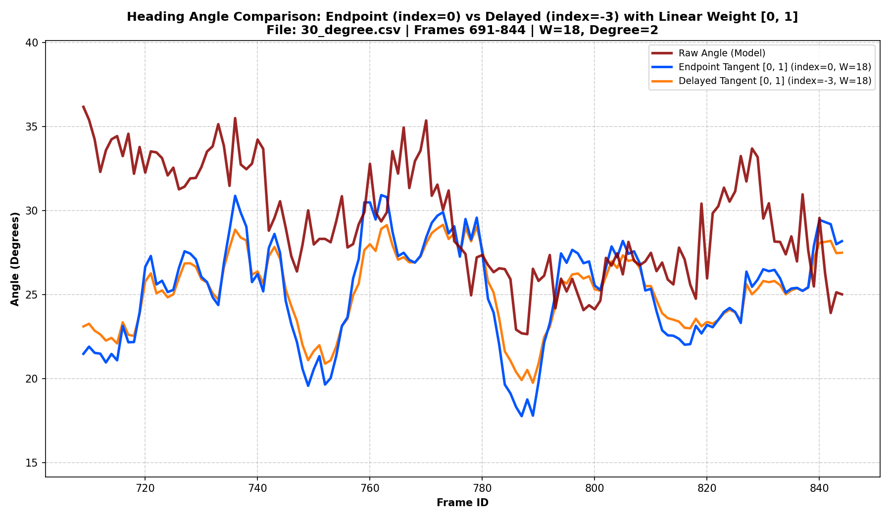

---

### 7.3. Góc 45 độ (`45_degree.csv`)

- **a) So sánh quỹ đạo 2D**:
  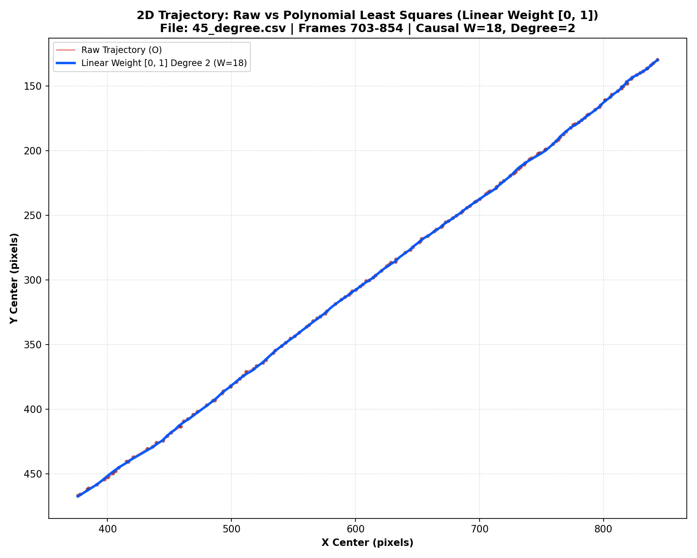

- **b) So sánh biểu đồ góc**:
  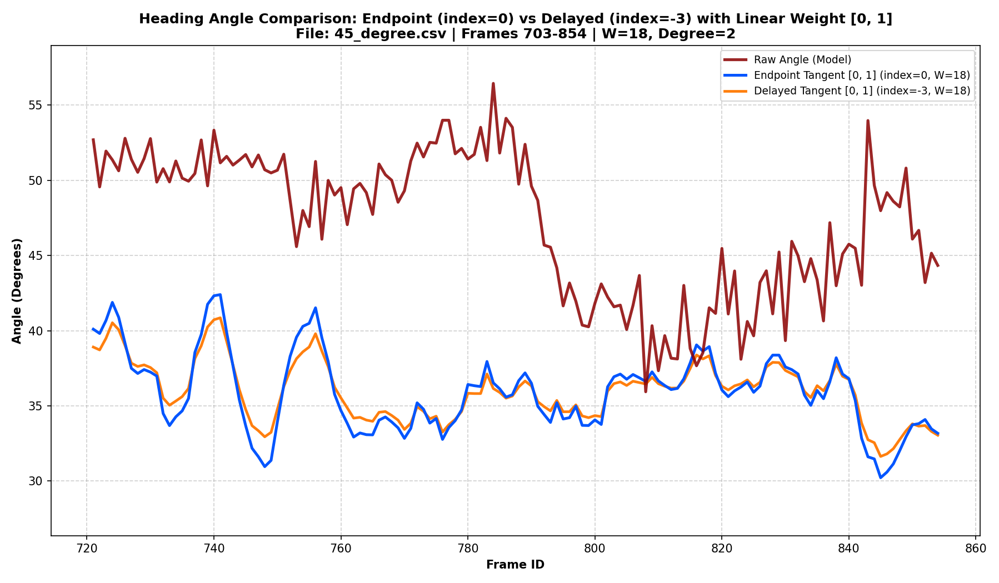

---

### 7.4. Góc -45 độ (`m45_degree.csv`)

- **a) So sánh quỹ đạo 2D**:
  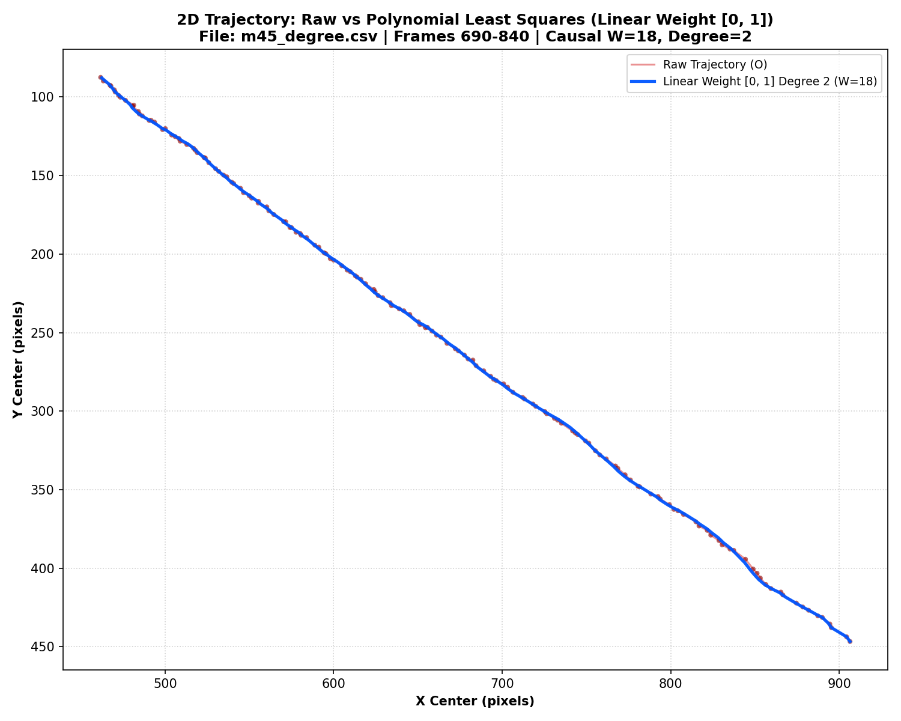

- **b) So sánh biểu đồ góc**:
  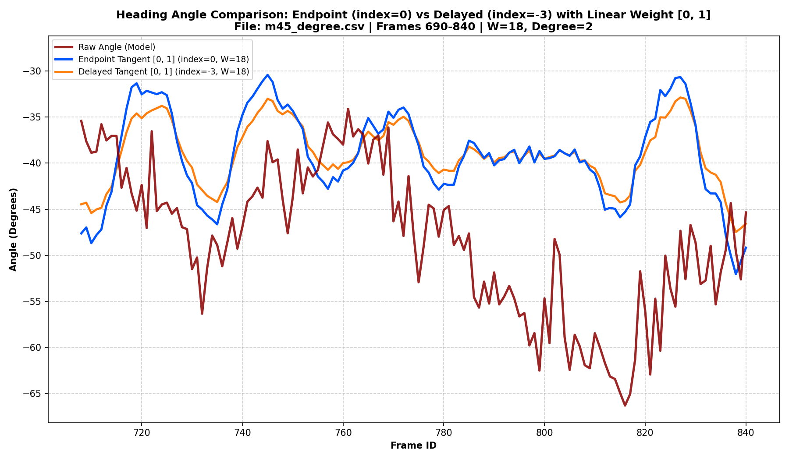

---

### 7.5. Góc 60 độ (`60_degree.csv`)

- **a) So sánh quỹ đạo 2D**:
  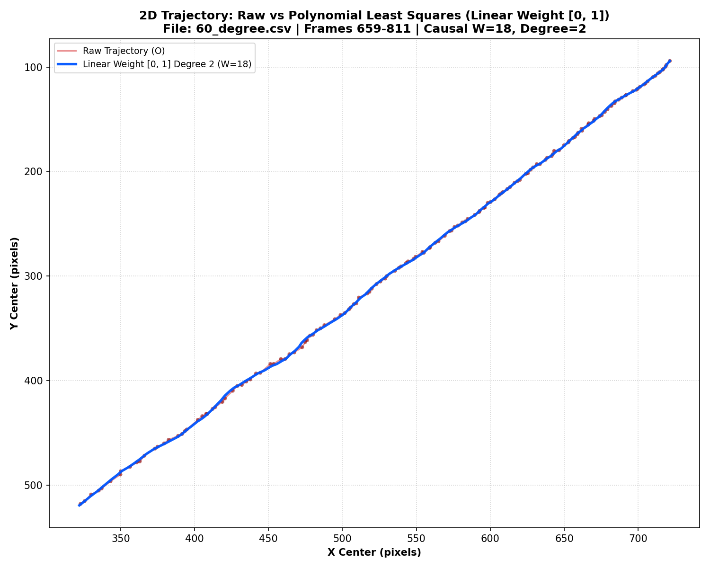

- **b) So sánh biểu đồ góc**:
  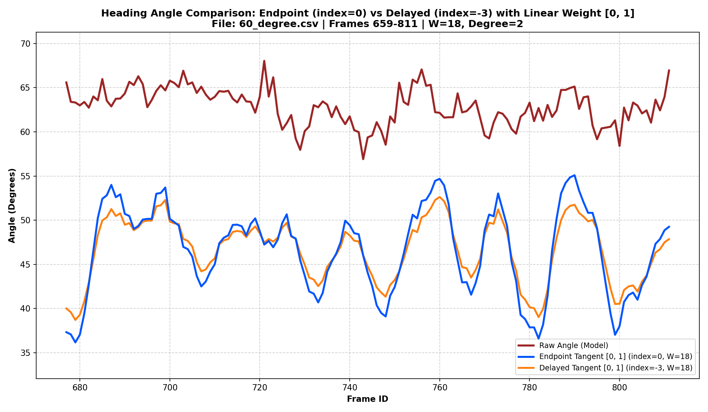

---

### 7.6. Góc 90 độ (`90_degree.csv`)

- **a) So sánh quỹ đạo 2D**:
  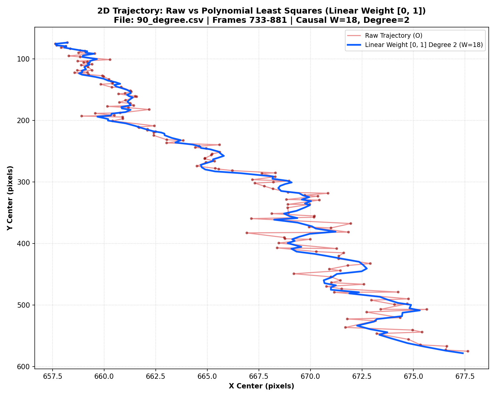

- **b) So sánh biểu đồ góc**:
  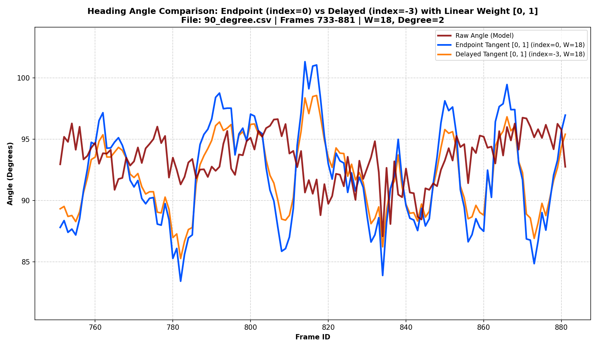

---

> **Nhận xét**:
> - Khi tính góc tiếp tuyến tại điểm lùi $\text{index} = -3$ thay vì điểm endpoint $\text{index} = 0$, đường góc tiếp tuyến (`Delayed Tangent`) có xu hướng ít nhiễu hơn đường góc tiếp tuyến tính tại điểm endpoint, các đỉnh nhiễu đồ thị thấp hơn và đường cong mượt hơn.

---

## 8. Đánh giá độ mịn bằng sai số RMS so với đường Fit bậc 1

- **Các bước triển khai**:
  - Với mỗi đoạn chạy thẳng ổn định (1 stable pass không đảo hướng), hướng thực tế của xe lý tưởng là một đường thẳng.
  - Với từng phương án làm mượt, fit chuỗi góc $\theta(t)$ vào **1 đường đa thức bậc 1 (đường thẳng)** riêng biệt làm đường chuẩn Ground Truth Reference:

    - $$\hat{\theta}_{ref}(t) = a \cdot t + b$$


  - Tính sai số bình phương trung bình căn **RMS (Root Mean Square)** giữa chuỗi góc và đường fit bậc 1 tương ứng:

    - $$\text{RMS} = \sqrt{\frac{1}{N} \sum_{i=1}^{N} \big(\theta_i - \hat{\theta}_{ref}(t_i)\big)^2}$$

- **Hàm tính toán RMS và đường Fit bậc 1**:
  ```python
  def compute_linear_fit_and_rms(frame_ids: np.ndarray, angle_values: np.ndarray):
      """
      Fit đa thức bậc 1 (đường thẳng Ground Truth) và tính sai số RMS.
      """
      valid_mask = np.isfinite(angle_values)
      if np.count_nonzero(valid_mask) < 2:
          return np.full_like(angle_values, np.nan), np.nan

      valid_frames = frame_ids[valid_mask]
      valid_angles = angle_values[valid_mask]

      # Fit đường đa thức bậc 1 (Ground Truth reference)
      p1 = np.polyfit(valid_frames, valid_angles, deg=1)
      ref_line = np.polyval(p1, frame_ids)

      # Tính sai số bình phương trung bình căn RMS
      residuals = valid_angles - np.polyval(p1, valid_frames)
      rms_error = float(np.sqrt(np.mean(residuals ** 2)))
      return ref_line, rms_error
  ```

- **Code sử dụng**: [`plot_poly_tangent_linear_weight.py`](tools/plot_poly_tangent_linear_weight.py)
- **Lệnh chạy các file csv benchmark**:
  ```powershell
  python tools/plot_poly_tangent_linear_weight.py benchmark --mode rms_compare --window-size 18 --poly-degree 2
  ```
- **Thư mục lưu ảnh kết quả**: `benchmark/rms_smoothing_comparison/`

---

### 8.1. Góc 0 độ (`0_degree.csv`)

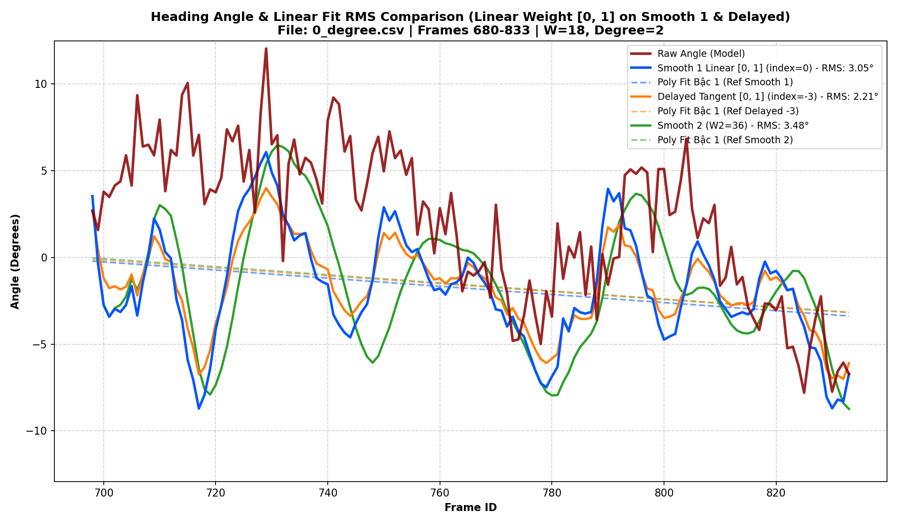

---

### 8.2. Góc 30 độ (`30_degree.csv`)

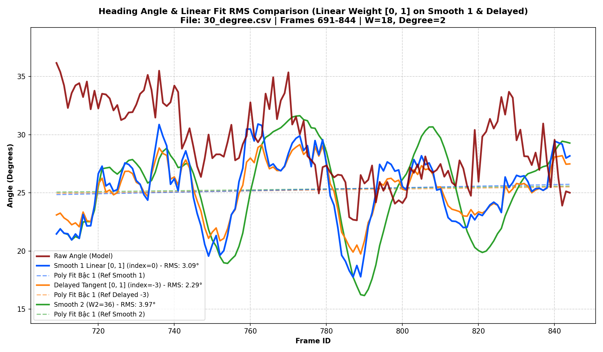

---

### 8.3. Góc 45 độ (`45_degree.csv`)

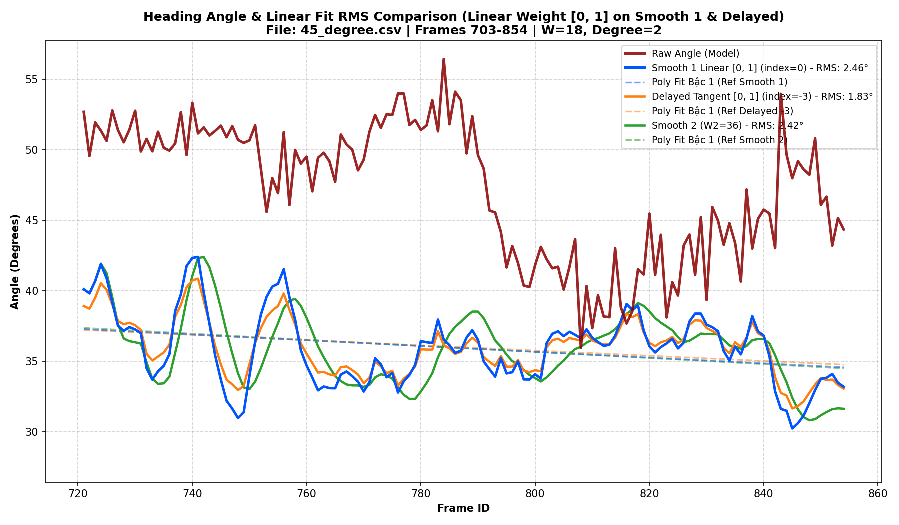

---

### 8.4. Góc -45 độ (`m45_degree.csv`)

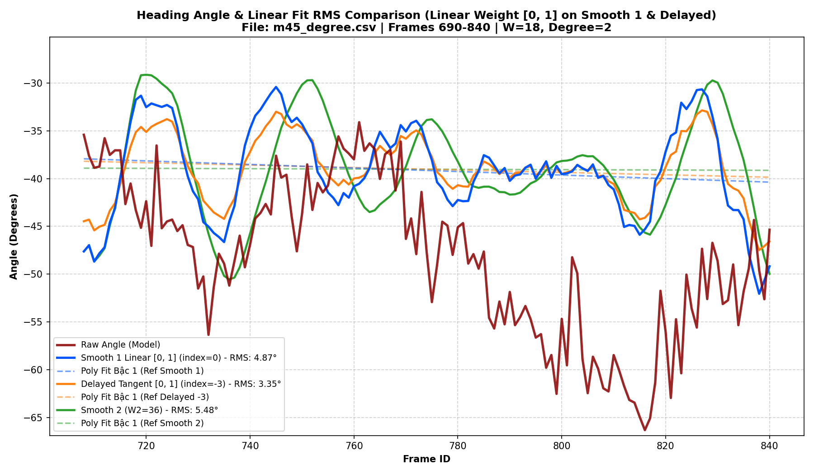

---

### 8.5. Góc 60 độ (`60_degree.csv`)

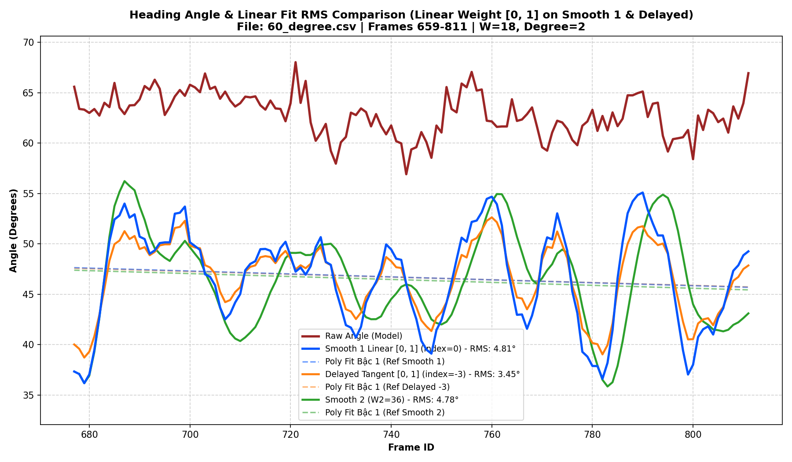

---

### 8.6. Góc 90 độ (`90_degree.csv`)

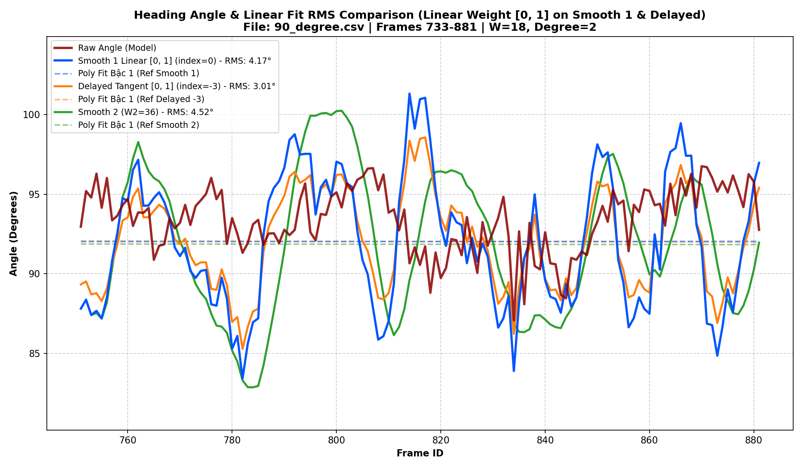

---

### 8.7. Bảng so sánh chất lượng độ mịn (RMS) giữa các phương án

| Tập dữ liệu benchmark | Smooth 1 Linear [0, 1] (index = 0) | Delayed Tangent [0, 1] (index = -3) | Smooth 2 ($W_2 = 36$) |
| :--- | :---: | :---: | :---: |
| **`0_degree.csv`** | 3.05° | **2.21°** | 3.48° |
| **`30_degree.csv`** | 3.09° | **2.29°** | 3.97° |
| **`45_degree.csv`** | 2.46° | **1.83°** | 2.42° |
| **`60_degree.csv`** | 4.81° | **3.45°** | 4.78° |
| **`90_degree.csv`** | 4.17° | **3.01°** | 4.52° |
| **`m45_degree.csv`** | 4.87° | **3.35°** | 5.48° |

> **Nhận xét**:
> - Phương án **Delayed Heading Angle [0, 1] (index = -3)** cho chỉ số sai số RMS thấp hơn trên toàn bộ 6 góc benchmark ($1.83^\circ \to 3.45^\circ$).
> - Giữa Smooth 1 và Smooth 2: Smooth 2 cho RMS hầu như là nhiễu RMS cao hơn smooth1 

## B. Khó khăn
- Không

## C. Công việc tiếp theo
- Em xin phép nhận công việc tiếp theo từ Thầy ạ.


