# Báo cáo công việc ngày 19/08/2026


## A. Công việc đã làm
- So sánh Delayed Tangent giữa Uniform Weight và Linear Weight $[0, 1]$ trên cùng cấu hình cửa sổ $W = 18$ và điểm trễ $\text{index} = -3$.
- So sánh Smooth 1 Delayed Tangent $[0, 1]$ và Smooth 2 Delayed Tangent với $W_2 = 36$
- So sánh giữa kích thước cửa sổ $W = 18$ và $W = 15$ đối với phương án tiếp tuyến Delayed $[0, 1]$.
- So sánh các mức delay (-2, -3, -4) đối với phương án Delayed Tangent với Linear Weight [0, 1] trên cùng cấu hình cửa sổ $W = 18$
- Bổ sung RMS trung bình của tất cả lần chạy các đường góc khác nhau.

---

### 1. So sánh Delayed Tangent giữa Uniform Weight và Linear Weight [0, 1]

- **Cấu hình**: Cửa sổ $W = 18$, đa thức bậc 2, delay tangent index : $\text{index} = -3$.
- **Lệnh chạy**:
  ```powershell
  python 260819/tools/plot_poly_tangent_linear_weight.py 260819/benchmark --mode compare_uniform_linear_delayed
  ```

#### 1.1. Góc 0 độ (`0_degree.csv`)
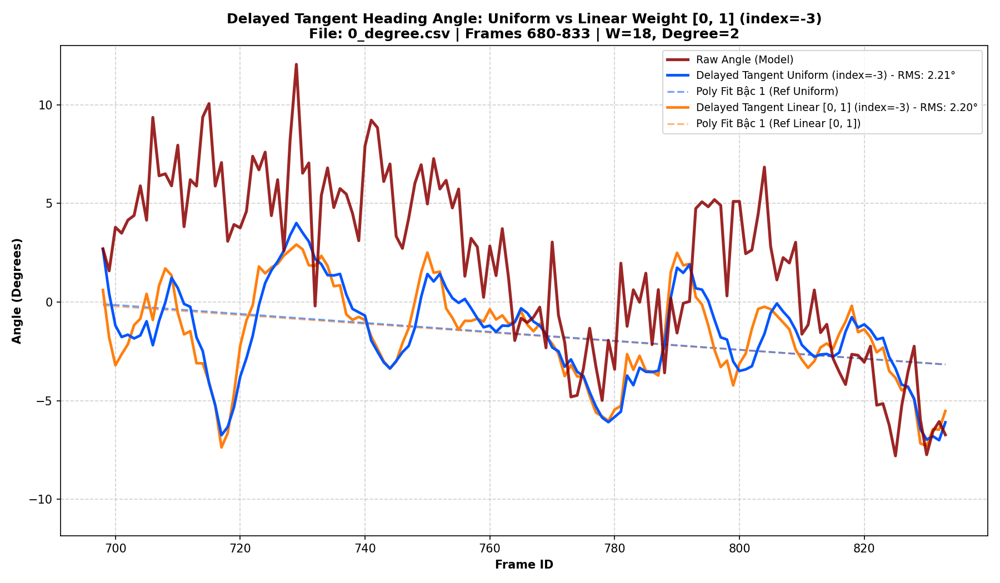

---

#### 1.2. Góc 30 độ (`30_degree.csv`)
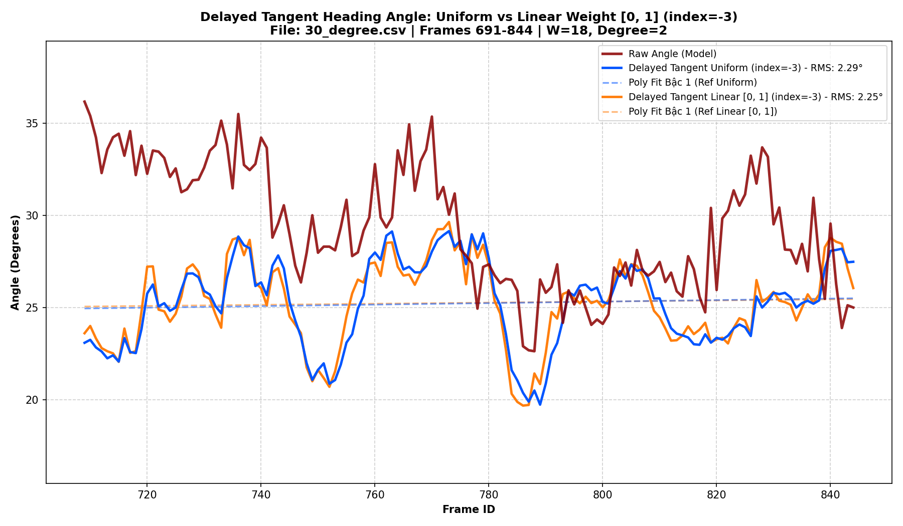

---

#### 1.3. Góc 45 độ (`45_degree.csv`)
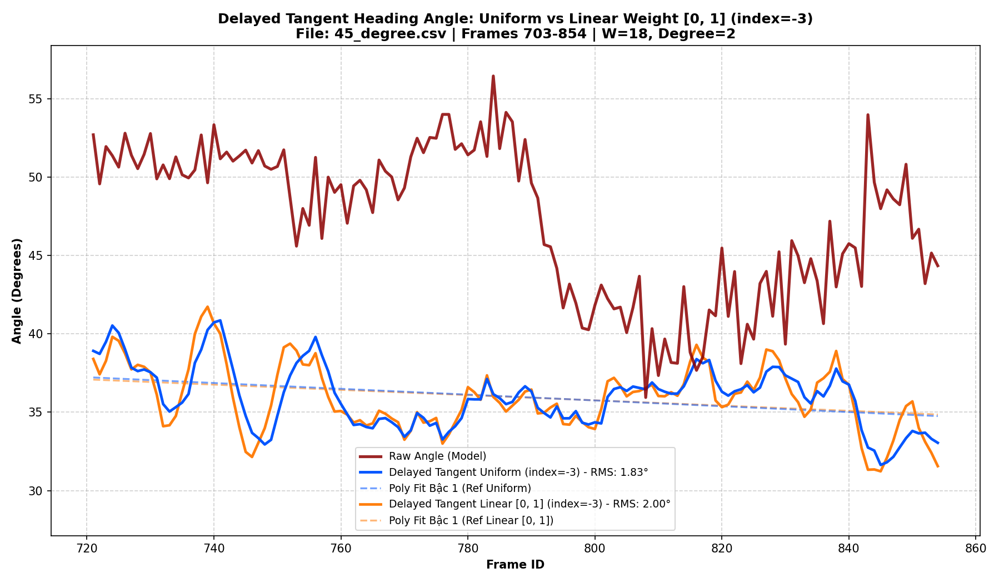

---

#### 1.4. Góc -45 độ (`m45_degree.csv`)
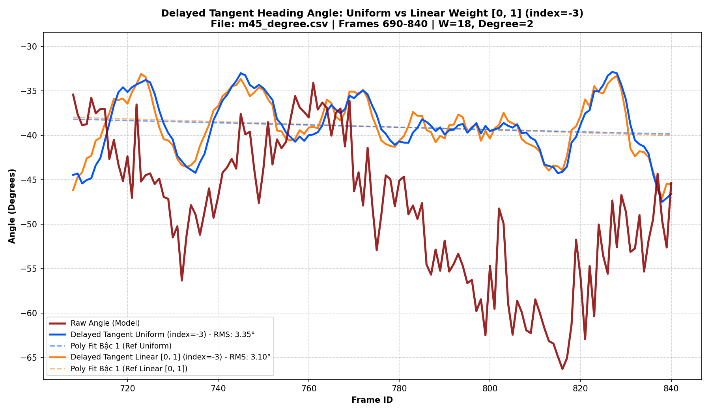

---

#### 1.5. Góc 60 độ (`60_degree.csv`)
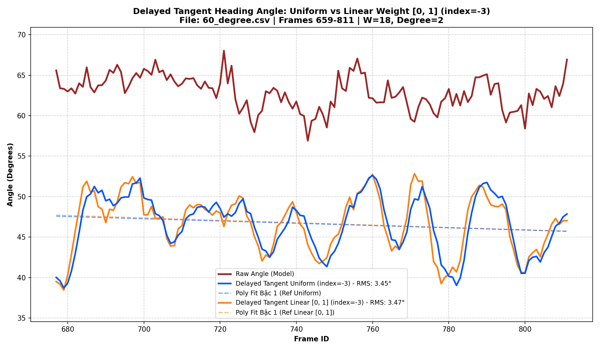

---

#### 1.6. Góc 90 độ (`90_degree.csv`)
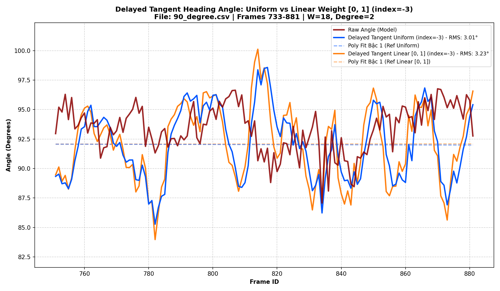

#### 1.7. Bảng tổng hợp sai số RMS: Delayed Uniform vs Delayed Linear [0, 1] (index = -3)

| Tập dữ liệu Benchmark | Delayed Uniform (index = -3) | Delayed Linear [0, 1] (index = -3) |
| :--- | :---: | :---: |
| **`0_degree.csv`** | 2.21° | **2.20°** |
| **`30_degree.csv`** | 2.29° | **2.25°** |
| **`45_degree.csv`** | **1.83°** | 2.00° |
| **`60_degree.csv`** | **3.45°** | 3.47° |
| **`90_degree.csv`** | **3.01°** | 3.23° |
| **`m45_degree.csv`** | 3.35° | **3.10°** |
| **Trung bình (Average)** | **2.69°** | **2.71°** |


---

### 2.So sánh Smooth 1 Delayed (W = 18 , index = -3 ) với Smooth 2 Delayed (W2 = 36, index = -3)

- **Cấu hình**: $W_1 = 18, W_2 = 36$, đa thức bậc 2, cả Smooth 1 và Smooth 2 đều lấy tại điểm lùi $\text{index} = -3$.
- **Lệnh chạy**:
  ```powershell
  python 260819/tools/plot_poly_tangent_linear_weight.py 260819/benchmark --mode compare_smooth1_smooth2_delayed
  ```

#### 2.1. Góc 0 độ (`0_degree.csv`)
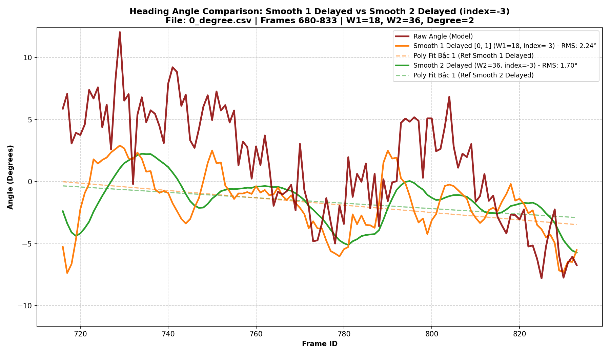

---

#### 2.2. Góc 30 độ (`30_degree.csv`)
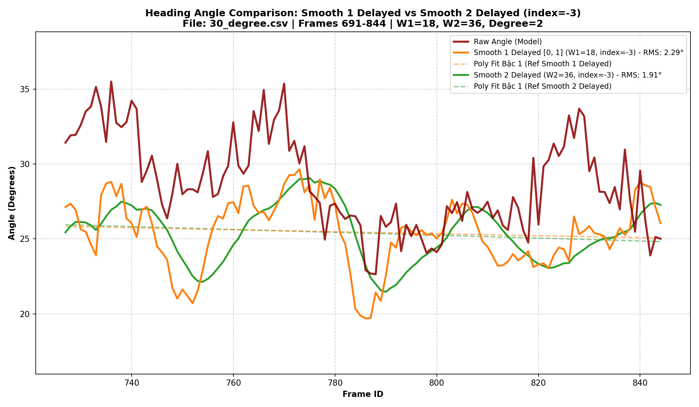

---

#### 2.3. Góc 45 độ (`45_degree.csv`)
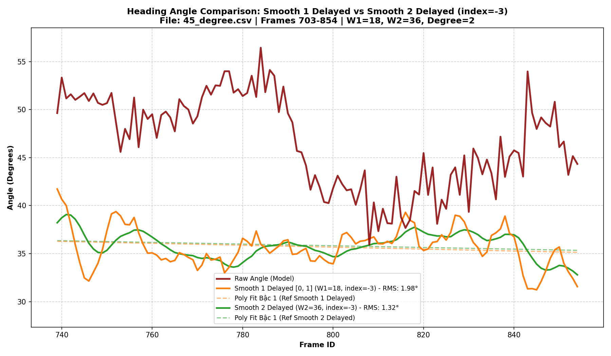

---

#### 2.4. Góc -45 độ (`m45_degree.csv`)
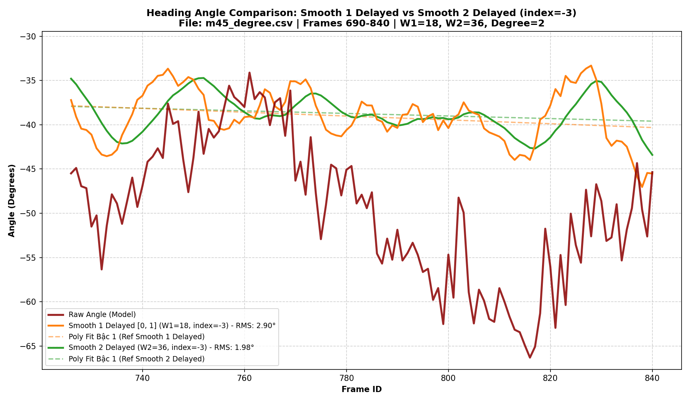

---

#### 2.5. Góc 60 độ (`60_degree.csv`)
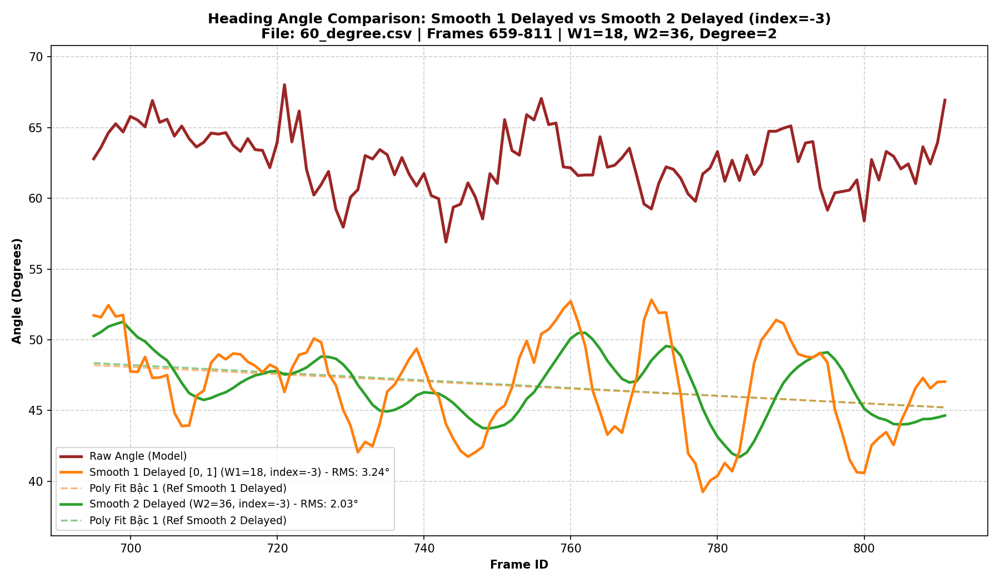

---

#### 2.6. Góc 90 độ (`90_degree.csv`)
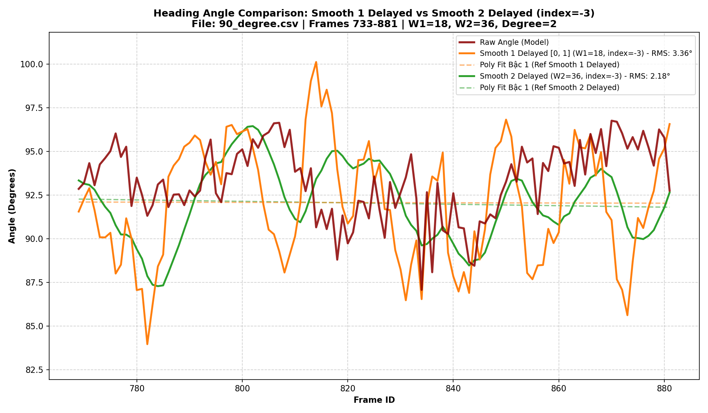

#### 2.7. Bảng tổng hợp sai số RMS: Smooth 1 Delayed vs Smooth 2 Delayed (index = -3)

| Tập dữ liệu Benchmark | Smooth 1 Delayed [0, 1] ($W_1 = 18, -3$) | Smooth 2 Delayed ($W_2 = 36, -3$) | Mức độ cải thiện RMS |
| :--- | :---: | :---: | :---: |
| **`0_degree.csv`** | 2.24° | **1.70°** | Giảm **24.1%** |
| **`30_degree.csv`** | 2.29° | **1.91°** | Giảm **16.6%** |
| **`45_degree.csv`** | 1.98° | **1.32°** | Giảm **33.3%** |
| **`60_degree.csv`** | 3.24° | **2.03°** | Giảm **37.3%** |
| **`90_degree.csv`** | 3.36° | **2.18°** | Giảm **35.1%** |
| **`m45_degree.csv`** | 2.90° | **1.98°** | Giảm **31.7%** |
| **Trung bình (Average)** | **2.67°** | **1.85°** | Giảm **30.7%** |

---

### 3. So sánh kích thước cửa sổ W = 18 vs W = 15 (Delayed [0, 1], index = -3)

- **Cấu hình**: Delayed Tangent $[0, 1]$, đa thức bậc 2, điểm lùi $\text{index} = -3$, so sánh giữa $W = 18$ và $W = 15$.
- **Lệnh chạy**:
  ```powershell
  python 260819/tools/plot_poly_tangent_linear_weight.py 260819/benchmark --mode compare_window_18_15
  ```

#### 3.1. Góc 0 độ (`0_degree.csv`)
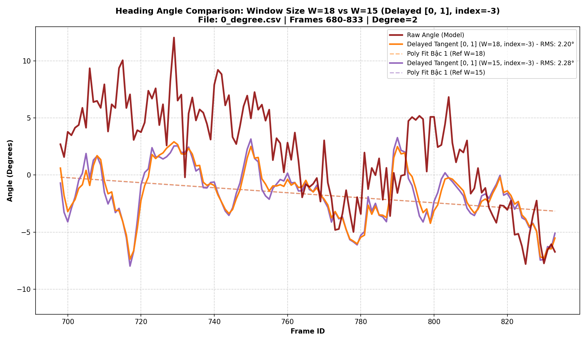

---

#### 3.2. Góc 30 độ (`30_degree.csv`)
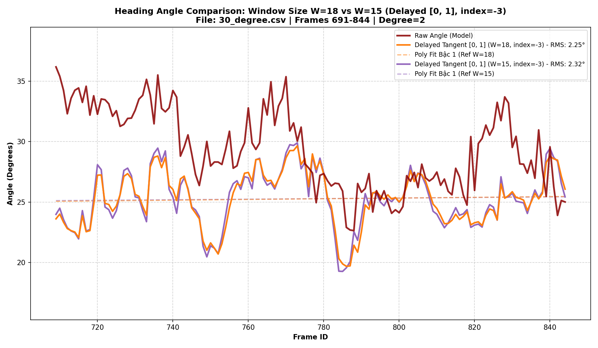

---

#### 3.3. Góc 45 độ (`45_degree.csv`)
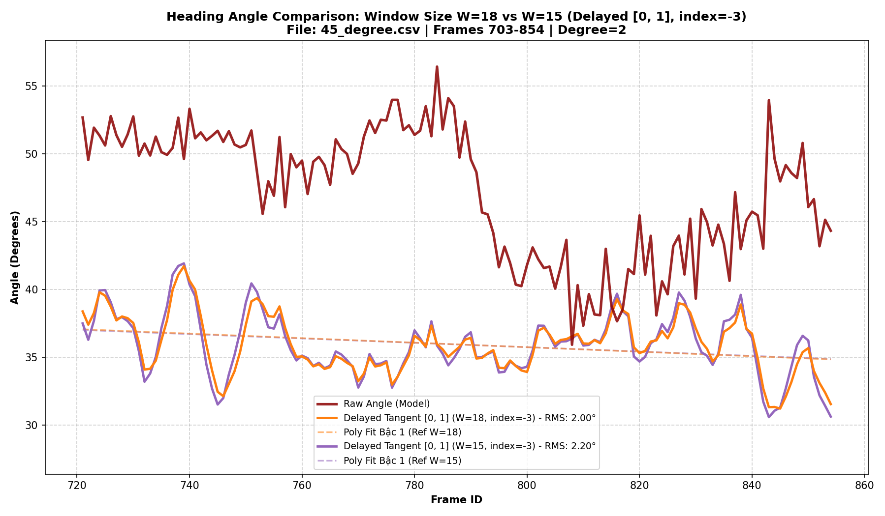

---

#### 3.4. Góc -45 độ (`m45_degree.csv`)
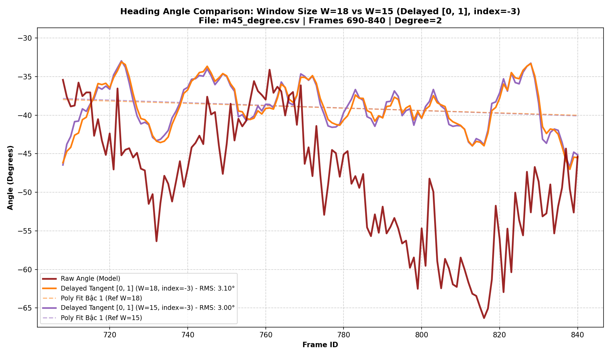

---

#### 3.5. Góc 60 độ (`60_degree.csv`)
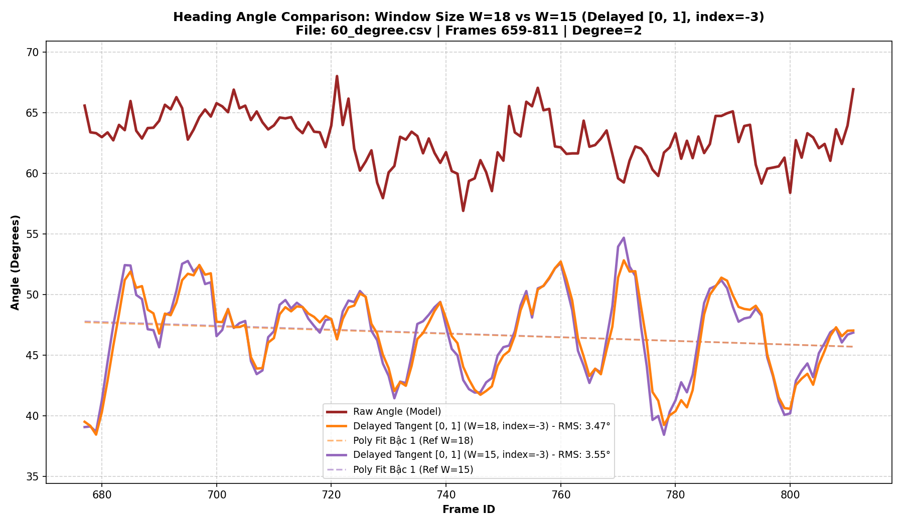

---

#### 3.6. Góc 90 độ (`90_degree.csv`)
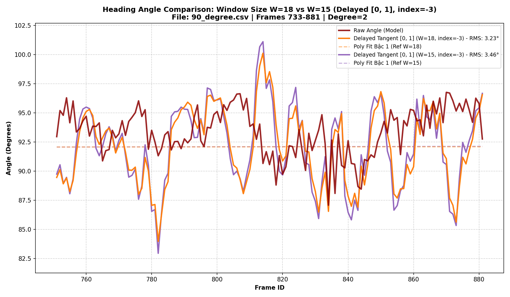

#### 3.7. Bảng tổng hợp sai số RMS: Cửa sổ W = 18 vs W = 15 (Delayed [0, 1], index = -3)

| Tập dữ liệu Benchmark | Delayed [0, 1] ($W = 18, \text{index} = -3$) | Delayed [0, 1] ($W = 15, \text{index} = -3$) |
| :--- | :---: | :---: |
| **`0_degree.csv`** | **2.20°** | 2.28° |
| **`30_degree.csv`** | **2.25°** | 2.32° |
| **`45_degree.csv`** | **2.00°** | 2.20° |
| **`60_degree.csv`** | **3.47°** | 3.55° |
| **`90_degree.csv`** | **3.23°** | 3.46° |
| **`m45_degree.csv`** | 3.10° | **3.00°** |
| **Trung bình (Average)** | **2.71°** | **2.80°** |

---

### 4. So sánh các mức delay (-2, -3, -4) trên Linear Weight [0, 1] (W = 18)

- **Cấu hình**: Cửa sổ $W = 18$, đa thức bậc 2, Linear Weight $[0, 1]$, so sánh 3 mức lùi: $\text{index} = -2$, $\text{index} = -3$, $\text{index} = -4$.
- **Lệnh chạy**:
  ```powershell
  python 260819/tools/plot_poly_tangent_linear_weight.py 260819/benchmark --mode compare_delays
  ```

#### 4.1. Góc 0 độ (`0_degree.csv`)
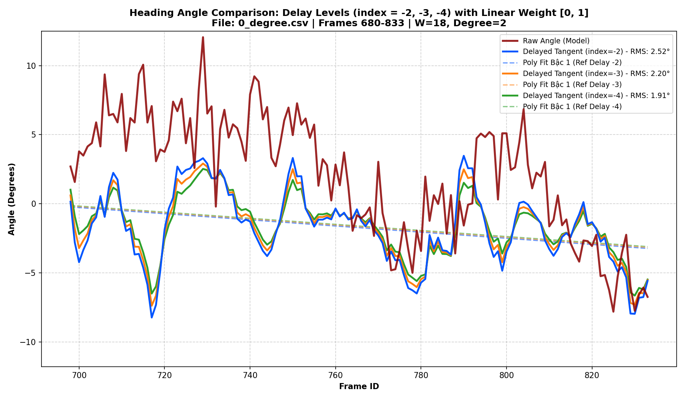

---

#### 4.2. Góc 30 độ (`30_degree.csv`)
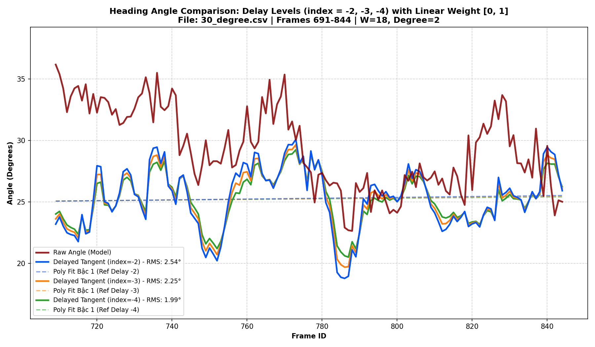

---

#### 4.3. Góc 45 độ (`45_degree.csv`)
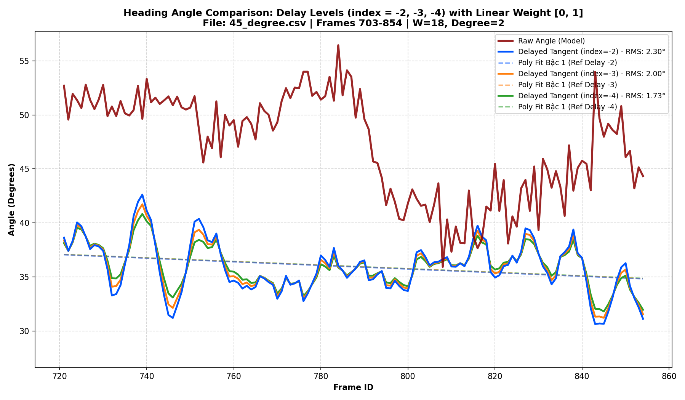

---

#### 4.4. Góc -45 độ (`m45_degree.csv`)
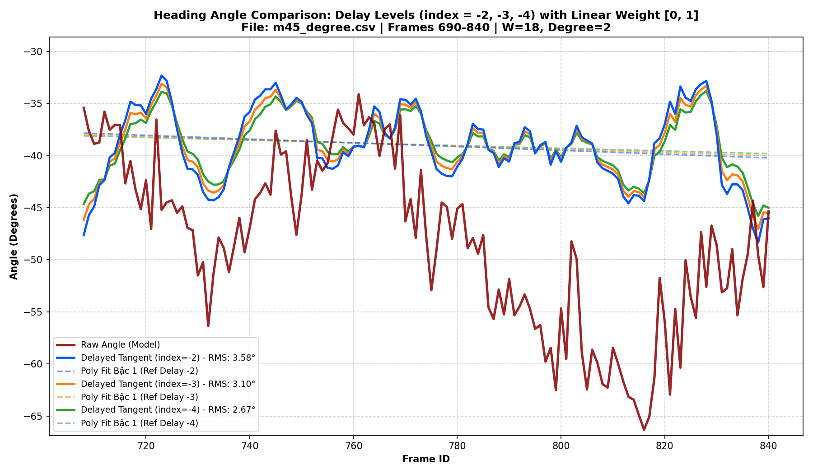

---

#### 4.5. Góc 60 độ (`60_degree.csv`)
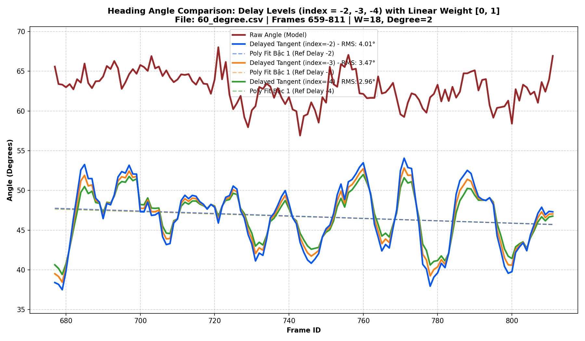

---

#### 4.6. Góc 90 độ (`90_degree.csv`)
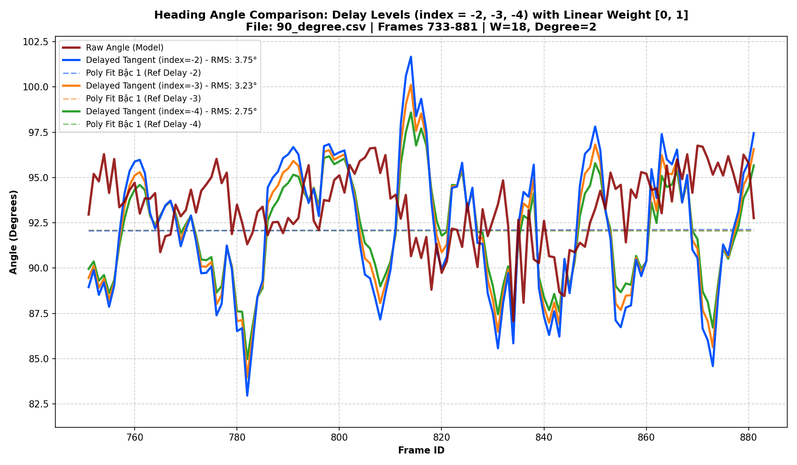

#### 4.7. Bảng tổng hợp sai số RMS: Các mức delay (-2, -3, -4) trên Linear Weight [0, 1] (W = 18)

| Tập dữ liệu Benchmark | Delay $\text{index} = -2$ | Delay $\text{index} = -3$ | Delay $\text{index} = -4$ |
| :--- | :---: | :---: | :---: |
| **`0_degree.csv`** | 2.52° | 2.20° | **1.91°** |
| **`30_degree.csv`** | 2.54° | 2.25° | **1.99°** |
| **`45_degree.csv`** | 2.30° | 2.00° | **1.73°** |
| **`60_degree.csv`** | 4.01° | 3.47° | **2.96°** |
| **`90_degree.csv`** | 3.75° | 3.23° | **2.75°** |
| **`m45_degree.csv`** | 3.58° | 3.10° | **2.67°** |
| **Trung bình (Average)** | **3.12°** | **2.71°** | **2.33°** |

---


## B. Khó khăn
- Không 
---

## C. Công việc tiếp theo
- Em xin phép nhận hướng đi tiếp theo từ Thầy ạ .