# Báo cáo công việc ngày 19/08/2026

## Mục lục
- [A. Công việc đã làm](#a-công-việc-đã-làm)
- [1. So sánh Delayed Tangent giữa Uniform Weight và Linear Weight [0, 1]](#1-so-sánh-delayed-tangent-giữa-uniform-weight-và-linear-weight-0-1)
- [2. So sánh Smooth 1 Delayed (W = 18, index = -3) với Smooth 2 Delayed (W2 = 36, index = -3)](#2-so-sánh-smooth-1-delayed-w--18--index---3--với-smooth-2-delayed-w2--36-index---3)
- [3. So sánh kích thước cửa sổ W = 18 vs W = 15 (Delayed [0, 1], index = -3)](#3-so-sánh-kích-thước-cửa-sổ-w--18-vs-w--15-delayed-0-1-index---3)
- [4. So sánh các mức delay (-2, -3, -4) trên Linear Weight [0, 1] (W = 18)](#4-so-sánh-các-mức-delay--2--3--4-trên-linear-weight-0-1-w--18)
- [5. Nhận xét tổng quan](#5-nhận-xét-tổng-quan)
- [6. Làm mượt 2 lớp cho góc Model (Model Angle Smoothing)](#6-làm-mượt-2-lớp-cho-góc-model-model-angle-smoothing)
- [7. Đề xuất công thức Hợp nhất góc thích ứng theo Vận tốc (FusedAngle Formula)](#7-đề-xuất-công-thức-hợp-nhất-góc-thích-ứng-theo-vận-tốc-fusedangle-formula)
- [8. Tính góc FusedAngle trên các tập dữ liệu góc Benchmark](#8-tính-góc-fusedangle-trên-các-tập-dữ-liệu-góc-benchmark)
- [B. Khó khăn](#b-khó-khăn)
- [C. Công việc tiếp theo](#c-công-việc-tiếp-theo)

---

## A. Công việc đã làm
- So sánh Delayed Tangent giữa Uniform Weight và Linear Weight $[0, 1]$ trên cùng cấu hình cửa sổ $W = 18$ và điểm trễ $\text{index} = -3$.
- So sánh Smooth 1 Delayed Tangent $[0, 1]$ và Smooth 2 Delayed Tangent với $W_2 = 36$
- So sánh giữa kích thước cửa sổ $W = 18$ và $W = 15$ đối với phương án tiếp tuyến Delayed $[0, 1]$.
- So sánh các mức delay (-2, -3, -4) đối với phương án Delayed Tangent với Linear Weight [0, 1] trên cùng cấu hình cửa sổ $W = 18$
- Bổ sung RMS trung bình của tất cả lần chạy các đường góc khác nhau.
- Thử nghiệm làm mượt 2 lớp cho góc Model Angle (Raw Model vs Model Smooth 1 vs Model Smooth 2 tại $\text{index} = -4$).
- Đề xuất công thức hợp nhất góc thích ứng theo vận tốc $x(v) = \frac{K}{K + v}$ và $\text{fusedAngle} = x(v) \cdot \theta_{\text{model\_smooth1}} + (1 - x(v)) \cdot \theta_{\text{smooth2\_tangent}}$.
- Thực nghiệm đánh giá góc hợp nhất FusedAngle trên toàn bộ 6 tập dữ liệu góc benchmark.

---

### 1. So sánh Delayed Tangent giữa Uniform Weight và Linear Weight [0, 1]

- **Cấu hình**: Cửa sổ $W = 18$, đa thức bậc 2, delay tangent index : $\text{index} = -3$.
- **Lệnh chạy**:
  ```powershell
  python 260819/tools/plot_poly_tangent_linear_weight.py 260819/benchmark --mode compare_uniform_linear_delayed
  ```

#### 1.1. Góc 0 độ (`0_degree.csv`)


---

#### 1.2. Góc 30 độ (`30_degree.csv`)


---

#### 1.3. Góc 45 độ (`45_degree.csv`)


---

#### 1.4. Góc -45 độ (`m45_degree.csv`)


---

#### 1.5. Góc 60 độ (`60_degree.csv`)


---

#### 1.6. Góc 90 độ (`90_degree.csv`)


#### 1.7. Bảng tổng hợp sai số RMS: Delayed Uniform vs Delayed Linear [0, 1] (index = -3)

| Tập dữ liệu Benchmark | Delayed Uniform (index = -3) | Delayed Linear [0, 1] (index = -3) |
| :--- | :---: | :---: |
| **`0_degree.csv`** | 2.21° | **2.20°** |
| **`30_degree.csv`** | 2.29° | **2.25°** |
| **`45_degree.csv`** | **1.83°** | 2.00° |
| **`60_degree.csv`** | **3.45°** | 3.47° |
| **`90_degree.csv`** | **3.01°** | 3.23° |
| **`m45_degree.csv`** | 3.35° | **3.10°** |
| **Trung bình (Average)** | **2.69°** | **2.71°** |

---

### 2. So sánh Smooth 1 Delayed (W = 18 , index = -3 ) với Smooth 2 Delayed (W2 = 36, index = -3)

- **Cấu hình**: $W_1 = 18, W_2 = 36$, đa thức bậc 2, cả Smooth 1 và Smooth 2 đều lấy tại điểm lùi $\text{index} = -3$.
- **Lệnh chạy**:
  ```powershell
  python 260819/tools/plot_poly_tangent_linear_weight.py 260819/benchmark --mode compare_smooth1_smooth2_delayed
  ```

#### 2.1. Góc 0 độ (`0_degree.csv`)


---

#### 2.2. Góc 30 độ (`30_degree.csv`)


---

#### 2.3. Góc 45 độ (`45_degree.csv`)


---

#### 2.4. Góc -45 độ (`m45_degree.csv`)


---

#### 2.5. Góc 60 độ (`60_degree.csv`)


---

#### 2.6. Góc 90 độ (`90_degree.csv`)


#### 2.7. Bảng tổng hợp sai số RMS: Smooth 1 Delayed vs Smooth 2 Delayed (index = -3)

| Tập dữ liệu Benchmark | Smooth 1 Delayed [0, 1] ($W_1 = 18, -3$) | Smooth 2 Delayed ($W_2 = 36, -3$) | Mức độ cải thiện RMS |
| :--- | :---: | :---: | :---: | :---: |
| **`0_degree.csv`** | 2.24° | **1.70°** | Giảm **24.1%** |
| **`30_degree.csv`** | 2.29° | **1.91°** | Giảm **16.6%** |
| **`45_degree.csv`** | 1.98° | **1.32°** | Giảm **33.3%** |
| **`60_degree.csv`** | 3.24° | **2.03°** | Giảm **37.3%** |
| **`90_degree.csv`** | 3.36° | **2.18°** | Giảm **35.1%** |
| **`m45_degree.csv`** | 2.90° | **1.98°** | Giảm **31.7%** |
| **Trung bình (Average)** | **2.67°** | **1.85°** | Giảm **30.7%** |

---

### 3. So sánh kích thước cửa sổ W = 18 vs W = 15 (Delayed [0, 1], index = -3)

- **Cấu hình**: Delayed Tangent $[0, 1]$, đa thức bậc 2, điểm lùi $\text{index} = -3$, so sánh giữa $W = 18$ và $W = 15$.
- **Lệnh chạy**:
  ```powershell
  python 260819/tools/plot_poly_tangent_linear_weight.py 260819/benchmark --mode compare_window_18_15
  ```

#### 3.1. Góc 0 độ (`0_degree.csv`)


---

#### 3.2. Góc 30 độ (`30_degree.csv`)


---

#### 3.3. Góc 45 độ (`45_degree.csv`)


---

#### 3.4. Góc -45 độ (`m45_degree.csv`)


---

#### 3.5. Góc 60 độ (`60_degree.csv`)


---

#### 3.6. Góc 90 độ (`90_degree.csv`)


#### 3.7. Bảng tổng hợp sai số RMS: Cửa sổ W = 18 vs W = 15 (Delayed [0, 1], index = -3)

| Tập dữ liệu Benchmark | Delayed [0, 1] ($W = 18, \text{index} = -3$) | Delayed [0, 1] ($W = 15, \text{index} = -3$) |
| :--- | :---: | :---: |
| **`0_degree.csv`** | **2.20°** | 2.28° |
| **`30_degree.csv`** | **2.25°** | 2.32° |
| **`45_degree.csv`** | **2.00°** | 2.20° |
| **`60_degree.csv`** | **3.47°** | 3.55° |
| **`90_degree.csv`** | **3.23°** | 3.46° |
| **`m45_degree.csv`** | 3.10° | **3.00°** |
| **Trung bình (Average)** | **2.71°** | **2.80°** |

---

### 4. So sánh các mức delay (-2, -3, -4) trên Linear Weight [0, 1] (W = 18)

- **Cấu hình**: Cửa sổ $W = 18$, đa thức bậc 2, Linear Weight $[0, 1]$, so sánh 3 mức lùi: $\text{index} = -2$, $\text{index} = -3$, $\text{index} = -4$.
- **Lệnh chạy**:
  ```powershell
  python 260819/tools/plot_poly_tangent_linear_weight.py 260819/benchmark --mode compare_delays
  ```

#### 4.1. Góc 0 độ (`0_degree.csv`)


---

#### 4.2. Góc 30 độ (`30_degree.csv`)


---

#### 4.3. Góc 45 độ (`45_degree.csv`)


---

#### 4.4. Góc -45 độ (`m45_degree.csv`)


---

#### 4.5. Góc 60 độ (`60_degree.csv`)


---

#### 4.6. Góc 90 độ (`90_degree.csv`)


#### 4.7. Bảng tổng hợp sai số RMS: Các mức delay (-2, -3, -4) trên Linear Weight [0, 1] (W = 18)

| Tập dữ liệu Benchmark | Delay $\text{index} = -2$ | Delay $\text{index} = -3$ | Delay $\text{index} = -4$ |
| :--- | :---: | :---: | :---: |
| **`0_degree.csv`** | 2.52° | 2.20° | **1.91°** |
| **`30_degree.csv`** | 2.54° | 2.25° | **1.99°** |
| **`45_degree.csv`** | 2.30° | 2.00° | **1.73°** |
| **`60_degree.csv`** | 4.01° | 3.47° | **2.96°** |
| **`90_degree.csv`** | 3.75° | 3.23° | **2.75°** |
| **`m45_degree.csv`** | 3.58° | 3.10° | **2.67°** |
| **Trung bình (Average)** | **3.12°** | **2.71°** | **2.33°** |

---

### 5. Nhận xét tổng quan

1. **Đối với phương pháp lùi vị trí index đạo hàm tính góc (Delayed Tangent $\text{index} = -k$)**:
   - Việc tính tiếp tuyến lùi sâu vào bên trong cửa sổ trượt ($\text{index} = -2, -3, -4$) giúp giảm hiện tượng bất ổn định đạo hàm tại biên cửa sổ (endpoint derivative instability).
   - Sai số RMS giảm khi tăng độ trễ: từ $\mathbf{3.12^\circ}$ (tại $-2$) $\to \mathbf{2.71^\circ}$ (tại $-3$) $\to \mathbf{2.33^\circ}$ (tại $-4$).

2. **Về so sánh Uniform Weight vs Linear Weight $[0, 1]$**:
   - Khi kết hợp điểm lùi $\text{index} = -3$, cả hai bộ trọng số đều cho chất lượng làm mượt tương đương nhau (RMS trung bình $\mathbf{2.69^\circ}$ vs $\mathbf{2.71^\circ}$).

3. **Về phương án smooth thêm lần 2 - Smooth 2 Delayed ($W_2 = 36, \text{index} = -3$)**:
   - Khi lớp làm mượt thứ hai (Smooth 2) cũng được cấu hình lấy trễ tại $\text{index} = -3$, cho thấy dữ liệu mượt hơn rõ rệt:
   - Sai số RMS giảm $\mathbf{30.7\%}$ so với Smooth 1 (RMS trung bình giảm từ $\mathbf{2.67^\circ} \to \mathbf{1.85^\circ}$).

4. **Về kích thước cửa sổ ($W = 18$ vs $W = 15$)**:
   - Cửa sổ $W = 18$ đạt độ ổn định và giảm nhiễu tốt hơn $W = 15$ trên $5/6$ tập dữ liệu góc benchmark (RMS trung bình $\mathbf{2.71^\circ}$ so với $\mathbf{2.80^\circ}$).

---

### 6. Làm mượt 2 lớp cho góc Model (Model Angle Smoothing)

- **Cấu hình**: Áp dụng bộ lọc đa thức 1D bậc 2 trực tiếp lên chuỗi góc `rawModelAngle`:
  - `Model Smooth 1`: $W_1 = 18, \text{index} = -4$ (Uniform Weight).
  - `Model Smooth 2`: $W_2 = 36, \text{index} = -4$ trên chuỗi `Model Smooth 1`.
- **Lệnh chạy**:
  ```powershell
  python 260819/tools/plot_poly_tangent_linear_weight.py 260819/benchmark --mode compare_model_smoothing
  ```

#### 6.1. Góc 0 độ (`0_degree.csv`)
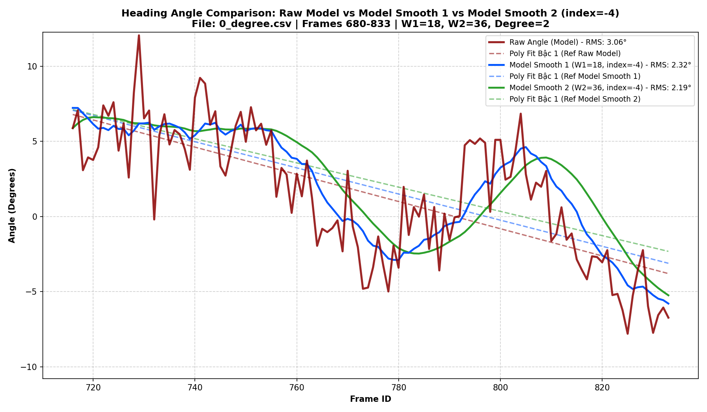

---

#### 6.2. Góc 30 độ (`30_degree.csv`)
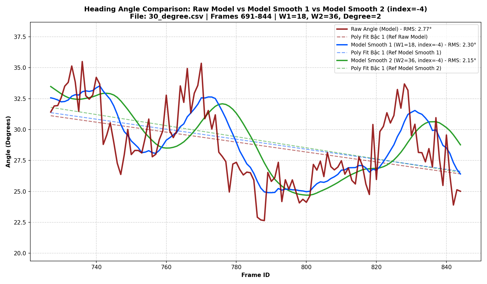

---

#### 6.3. Góc 45 độ (`45_degree.csv`)
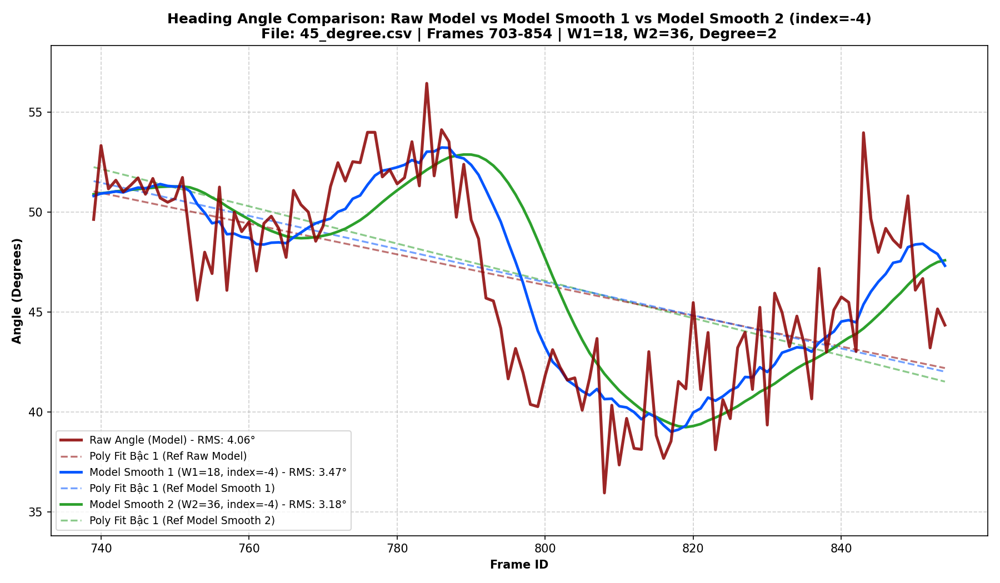

---

#### 6.4. Góc -45 độ (`m45_degree.csv`)
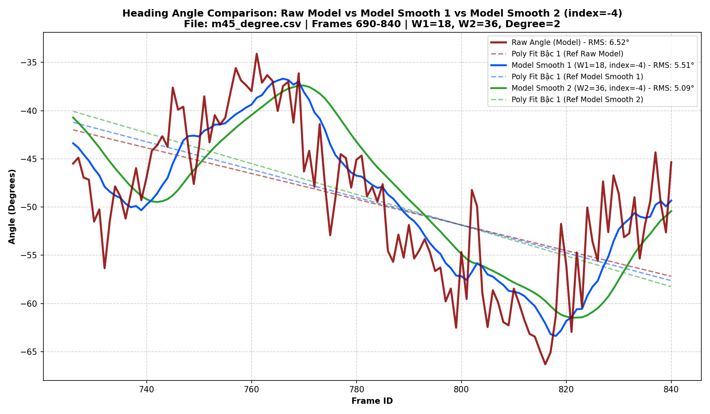

---

#### 6.5. Góc 60 độ (`60_degree.csv`)
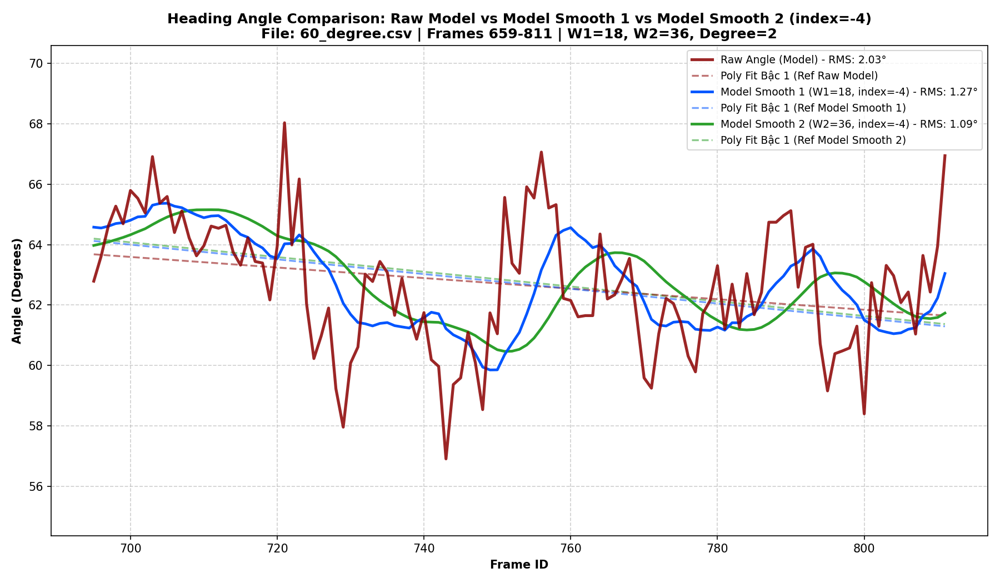

---

#### 6.6. Góc 90 độ (`90_degree.csv`)
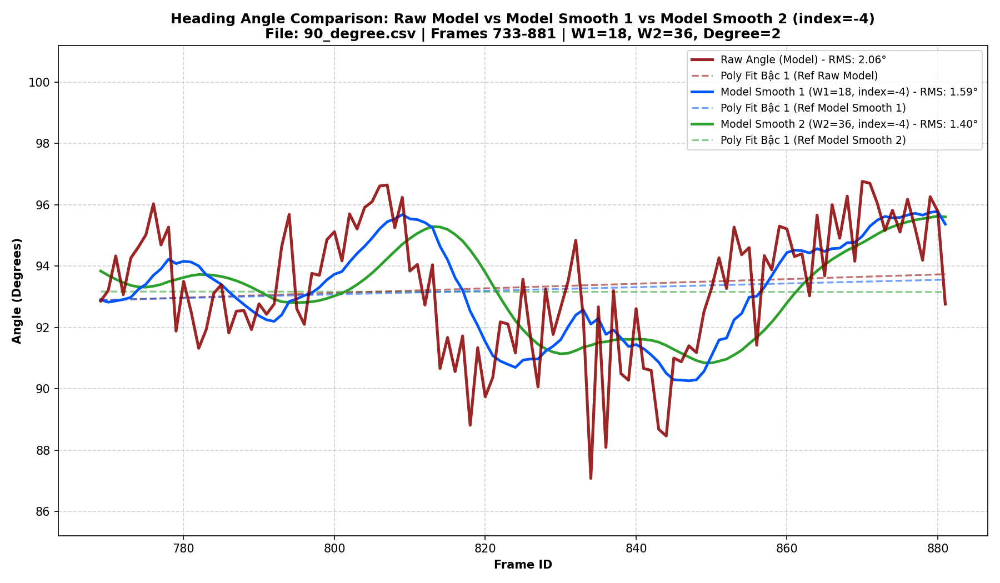

#### 6.7. Bảng tổng hợp sai số RMS: Làm mượt góc Model (Raw Model vs Model S1 vs Model S2, index = -4)

| Tập dữ liệu Benchmark | Raw Model Angle | Model Smooth 1 ($W_1=18$) | Model Smooth 2 ($W_2=36$) | Mức độ cải thiện RMS |
| :--- | :---: | :---: | :---: | :---: |
| **`0_degree.csv`** | 3.06° | 2.32° | **2.19°** | Giảm **28.4%** |
| **`30_degree.csv`** | 2.77° | 2.30° | **2.15°** | Giảm **22.4%** |
| **`45_degree.csv`** | 4.06° | 3.47° | **3.18°** | Giảm **21.7%** |
| **`60_degree.csv`** | 2.03° | 1.27° | **1.09°** | Giảm **46.3%** |
| **`90_degree.csv`** | 2.06° | 1.59° | **1.40°** | Giảm **32.0%** |
| **`m45_degree.csv`** | 6.52° | 5.51° | **5.09°** | Giảm **21.9%** |
| **Trung bình (Average)** | **3.42°** | **2.74°** | **2.52°** | Giảm **26.3%** |

> - Việc làm mượt chuỗi góc nhận diện Model qua đa thức 1D giúp loại bỏ các bước nhảy góc rời rạc giữa các khung hình liên tiếp.
> - **Model Smooth 1 ($W_1=18, -4$)** giảm sai số RMS từ $3.42^\circ \to 2.74^\circ$ (cải thiện $19.9\%$).
> - **Model Smooth 2 ($W_2=36, -4$)** giảm tiếp xuống $2.52^\circ$ (cải thiện $26.3\%$) đường đồ thị mịn hơn .

---

### 7. Công thức Fused angle thích ứng theo Vận tốc

#### 7.1. Nguồn dữ liệu góc sử dụng để Fused

1. **Góc xe từ Model được smooth 1 lần (`Model Smooth 1`)**:
   - Fit đa thức 1D bậc 2 trực tiếp lên chuỗi góc nhận diện Model: cấu hình $W_1 = 18, \text{index} = -4$, Uniform Weight.

2. **Góc tiếp tuyến quỹ đạo qua 2 lớp làm mượt (`Smooth 2 Delayed Tangent`)**:
   - **Lớp 1**: Fit đa thức 2D bậc 2 trên tọa độ vị trí $(x, y)$ với $W_1 = 18$, Uniform Weight, tính tiếp tuyến tại điểm lùi $\text{index} = -4$: $\theta_1(t) = \text{atan2}(-\dot{y}, \dot{x})$.
   - **Lớp 2**: Fit đa thức 1D bậc 2 trên chuỗi $\theta_1(t)$ với cửa sổ $W_2 = 36$, đánh giá tại điểm lùi $\text{index} = -4$.

3. **Tín hiệu điều phối: Vận tốc ước lượng tức thời (`Estimated Speed`)**:
   - Vận tốc $v(t)$ được tính bằng **Đạo hàm giải tích từ đa thức 2D bậc 2 fit vị trí $(x(t), y(t))$** với cấu hình cửa sổ $W_1 = 18$, Uniform Weight và đánh giá tại đúng điểm trễ $\mathbf{\text{index} = -4}$ ($t_{\text{eval}} = -4/17 \approx -0.235$):
     $$v(t) = \frac{\sqrt{\dot{x}(t_{\text{eval}})^2 + \dot{y}(t_{\text{eval}})^2}}{W_1 - 1} \quad (\text{pixel/frame})$$
   - Lấy đạo hàm tại điểm trễ $\text{index} = -4$ để đảm bảo tín hiệu vận tốc **đồng bộ pha với góc tiếp tuyến quỹ đạo**.
#### 7.2. Công thức 

- **Hàm trọng số thích ứng theo vận tốc $v$**:
  $$x(v) = \frac{1}{1 + \dfrac{v}{K}} = \frac{K}{K + v}$$

- **Công thức góc hợp nhất FusedAngle**:
  $$\theta_{\text{fused}}(t) = x(v(t)) \cdot \theta_{\text{model\_smooth1}}(t) + \big(1 - x(v(t))\big) \cdot \theta_{\text{smooth2\_tangent}}(t)$$

- **Ý nghĩa tham số $K$**:
  - Chọn cấu hình thực nghiệm: **$K = 3.0\text{ px/frame}$**.
  - Khi $v \to 0 \implies x = 1.0 \implies \theta_{\text{fused}} = \theta_{\text{model\_smooth1}}$ (Dữ liệu có xu hướng lấy nhiều của model).
  - Khi $v = K = 3.0\text{ px/frame} \implies x = 0.5 \implies$ dữ liệu trung bình cân bằng $50\% - 50\%$.
  - Khi $v \gg K \implies x \to 0 \implies \theta_{\text{fused}} \to \theta_{\text{smooth2\_tangent}}$ (Dữ liệu có xu hướng lấy nhiều từ Smooth Tangent angle).

---

### 8. Tính góc FusedAngle trên các tập dữ liệu góc Benchmark

- **Cấu hình**: $W_1 = 18, W_2 = 36$, điểm lùi $\text{index} = -4$, hằng số $K = 3.0$.
- **Lệnh chạy**:
  ```powershell
  python 260819/tools/plot_poly_tangent_linear_weight.py 260819/benchmark --mode compare_fused_angle --K 3.0
  ```

#### 8.1. Góc 0 độ (`0_degree.csv`)
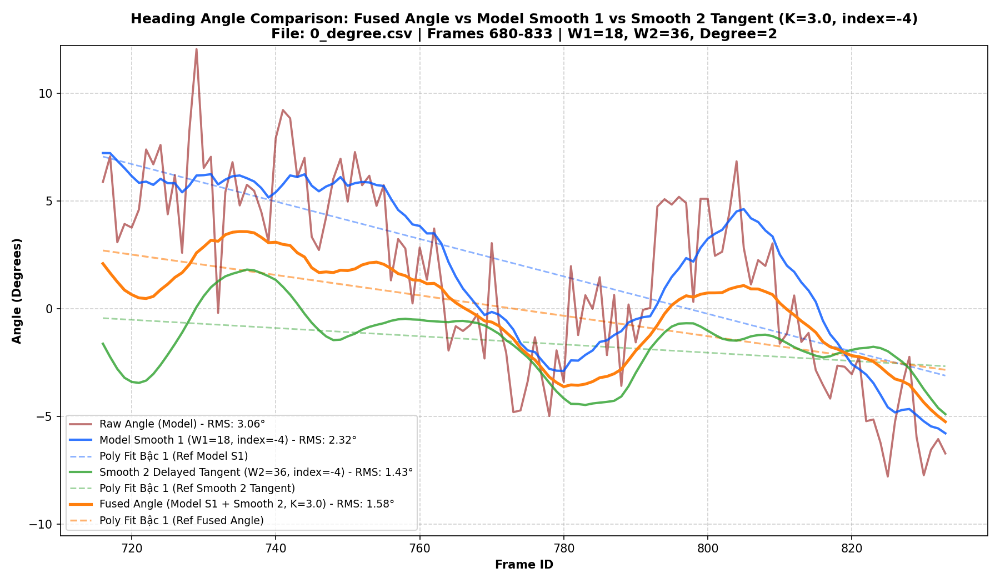

---

#### 8.2. Góc 30 độ (`30_degree.csv`)
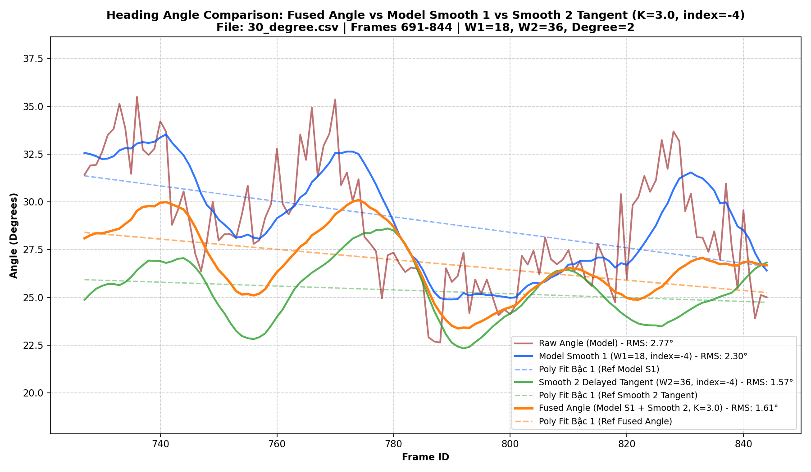

---

#### 8.3. Góc 45 độ (`45_degree.csv`)
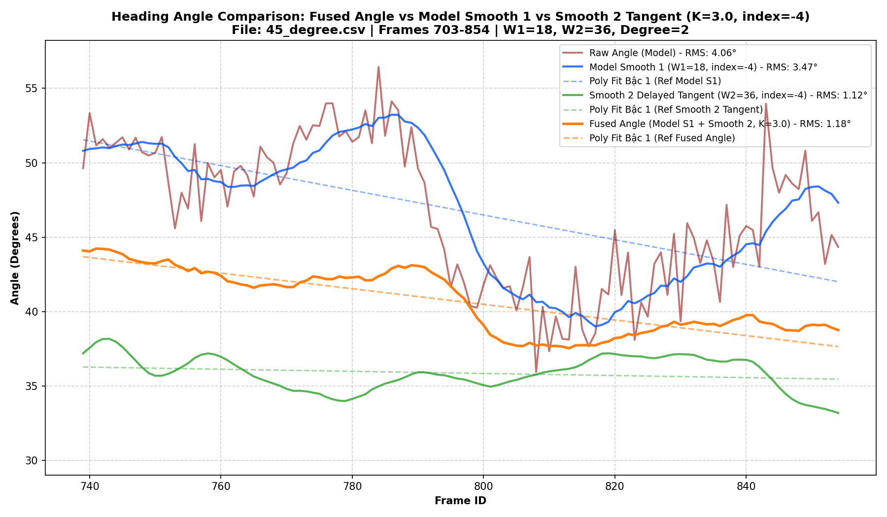

---

#### 8.4. Góc -45 độ (`m45_degree.csv`)
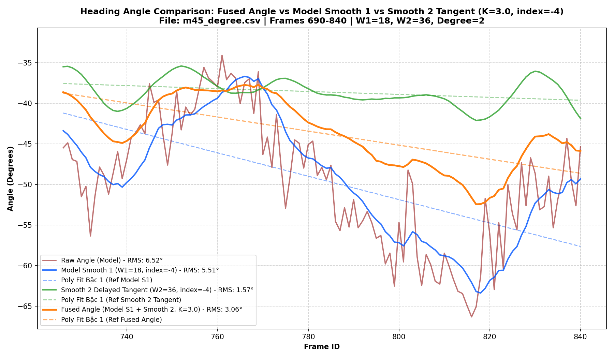

---

#### 8.5. Góc 60 độ (`60_degree.csv`)
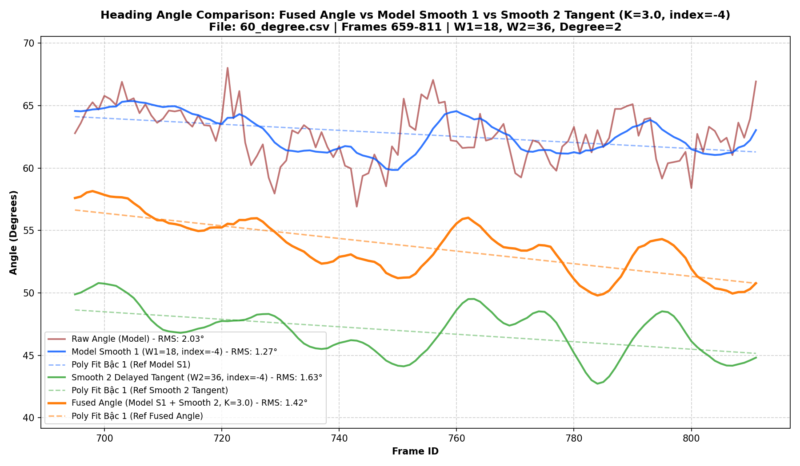

---

#### 8.6. Góc 90 độ (`90_degree.csv`)
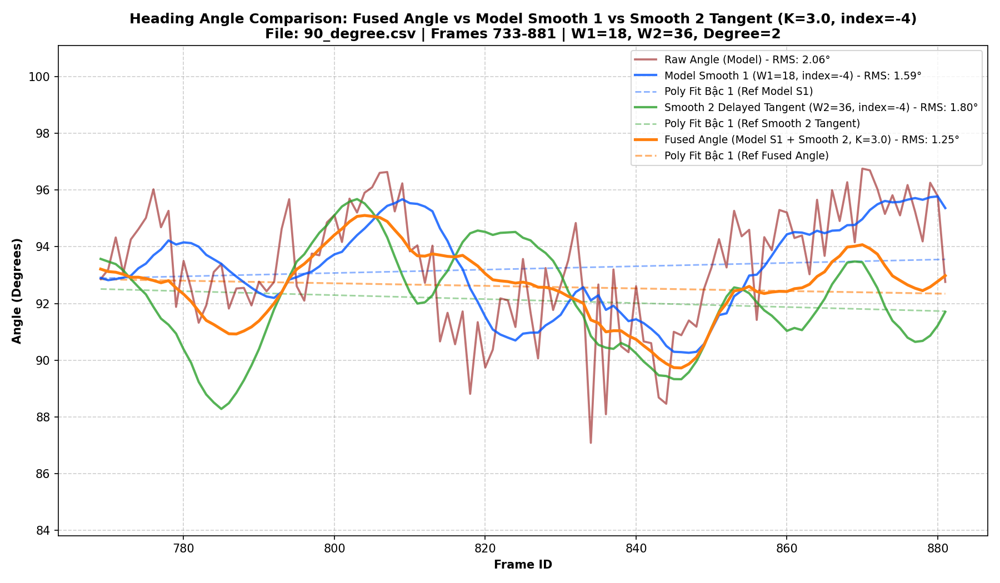

#### 8.7. Bảng tổng hợp sai số RMS: So sánh FusedAngle với Raw Model, Model S1 và Smooth 2 Tangent (K=3.0, index = -4)

| Tập dữ liệu Benchmark | Raw Model Angle | Model Smooth 1 ($W_1=18$) | Smooth 2 Tangent ($W_2=36$) | Fused Angle ($K=3.0$) |
| :--- | :---: | :---: | :---: | :---: |
| **`0_degree.csv`** | 3.06° | 2.32° | **1.43°** | 1.58° |
| **`30_degree.csv`** | 2.77° | 2.30° | **1.57°** | 1.61° |
| **`45_degree.csv`** | 4.06° | 3.47° | **1.12°** | 1.18° |
| **`60_degree.csv`** | 2.03° | **1.27°** | 1.63° | 1.42° |
| **`90_degree.csv`** | 2.06° | 1.59° | 1.80° | **1.25°** |
| **`m45_degree.csv`** | 6.52° | 5.51° | **1.57°** | 3.06° |
| **Trung bình (Average)** | **3.42°** | **2.74°** | **1.52°** | **1.68°** |

>   - Sai số RMS trung bình giảm từ **$3.42^\circ$ (Raw Model) $\to \mathbf{1.68^\circ}$ (Fused Angle)**, cải thiện **$50.9\%$** so với góc Model thô ban đầu.

---

## B. Khó khăn
- Không 

---

## C. Công việc tiếp theo
- Em xin phép nhận hướng đi tiếp theo từ Thầy ạ .