# Báo cáo công việc ngày 21/08/2026

## A. Công việc đã làm
- Đánh giá, so sánh smooth polynomial bậc 2 và bậc 1 trên tất cả các dữ liệu cần làm mượt. 
  - Raw model angle
  - Góc tiếp tuyến ước lượng từ quỹ đạo
  - Góc fusedAngle từ model angle và góc ước lượng quỹ đạo 

---

### 1. Cấu hình thực nghiệm 

#### 1.1. Cấu hình
- **Kích thước cửa sổ trượt**: $W = 18$ mẫu.
- **Trọng số**: `Uniform Weight` (trọng số đều).
- **Điểm đánh giá độ trễ**: $\text{index} = -4$ ($t_{eval} = \frac{-4}{17} \approx -0.235$)
- **Số lần làm mượt**: **1 lần duy nhất (Single-pass Smooth)** với poly bậc 1 và bậc 2 
- **Hệ số phụ thuộc vận tốc để tính FusedAngle**: $K = 3.0\text{ px/frame}$.


#### 1.2. Hai nhánh thực nghiệm
Chạy độc lập và song song 2 nhánh, ngoài bậc polynomial thì toàn bộ các tham số khác giống nhau tuyệt đối:
- **Nhánh 1**: `poly_degree = 1` .
- **Nhánh 2**: `poly_degree = 2` .

---

#### 1.3. Các dữ liệu thử nghiệm

1. **Góc Model (`Model Angle`)**:
   - `RawModelAngle`: Chuỗi `raw_angle` từ CSV, chỉ unwrap pha $\pm 360^\circ$, không làm mượt.
   - **Nhánh Bậc 1**: $\text{ModelAngleDegree1} = \text{smooth\_1d}(\text{RawModelAngle}, \text{degree}=1, W=18, \text{index}=-4)$
   - **Nhánh Bậc 2**: $\text{ModelAngleDegree2} = \text{smooth\_1d}(\text{RawModelAngle}, \text{degree}=2, W=18, \text{index}=-4)$

2. **Góc từ Quỹ đạo (`Trajectory Tangent Angle`)**:
   - Đầu vào: Tọa độ tâm $(x_{center}, y_{center})$.
   - Fit đúng **1 lần** đa thức 2D trên $(x(t), y(t))$ với $W = 18, \text{index} = -4$:
     - **Nhánh Bậc 1**: Fit bậc 1 $\to$ đạo hàm $\dot{x}_1, \dot{y}_1 \to \text{TrajectoryAngleDegree1} = \text{degrees}(\text{atan2}(-\dot{y}_1, \dot{x}_1))$
     - **Nhánh Bậc 2**: Fit bậc 2 $\to$ đạo hàm $\dot{x}_2, \dot{y}_2 \to \text{TrajectoryAngleDegree2} = \text{degrees}(\text{atan2}(-\dot{y}_2, \dot{x}_2))$
   - Unwrap chuỗi góc và căn chỉnh pha $180^\circ$ theo góc Model.

3. **Vận tốc ước lượng (`Estimated Speed`)**:
   - Lấy trực tiếp từ đạo hàm quỹ đạo $W = 18$ ở bước trên:
     $$v_1(t) = \frac{\sqrt{\dot{x}_1^2 + \dot{y}_1^2}}{W - 1}, \quad v_2(t) = \frac{\sqrt{\dot{x}_2^2 + \dot{y}_2^2}}{W - 1}$$

4. **Góc hợp nhất (`Fused Angle`)**:
   - Tính riêng cho từng nhánh không qua bước làm mượt phụ:
     $$x_1(t) = \frac{K}{K + v_1(t)}, \quad \text{FusedAngleDegree1} = x_1 \cdot \text{ModelAngleDegree1} + (1 - x_1) \cdot \text{TrajectoryAngleDegree1}$$
     $$x_2(t) = \frac{K}{K + v_2(t)}, \quad \text{FusedAngleDegree2} = x_2 \cdot \text{ModelAngleDegree2} + (1 - x_2) \cdot \text{TrajectoryAngleDegree2}$$

## 2. Kết quả thực nghiệm trên 6 tập dữ liệu góc Benchmark

- **Cấu hình thực nghiệm**: $W = 18$, $\text{index} = -4$, $K = 3.0$.
- **Lệnh chạy**:
  ```powershell
  python 260821/tools/compare_poly_degree_single_smooth.py 260821/benchmark --window-size 18 --eval-index -4 --K 3.0
  ```

---

### 2.1. Góc 0 độ (`0_degree.csv`)

#### a) So sánh góc Model (Degree 1 vs Degree 2)
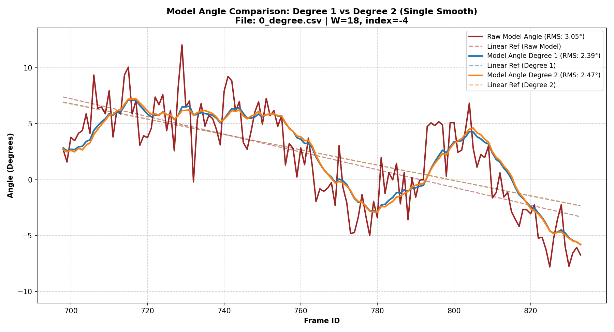

#### b) So sánh góc Quỹ đạo (Degree 1 vs Degree 2)
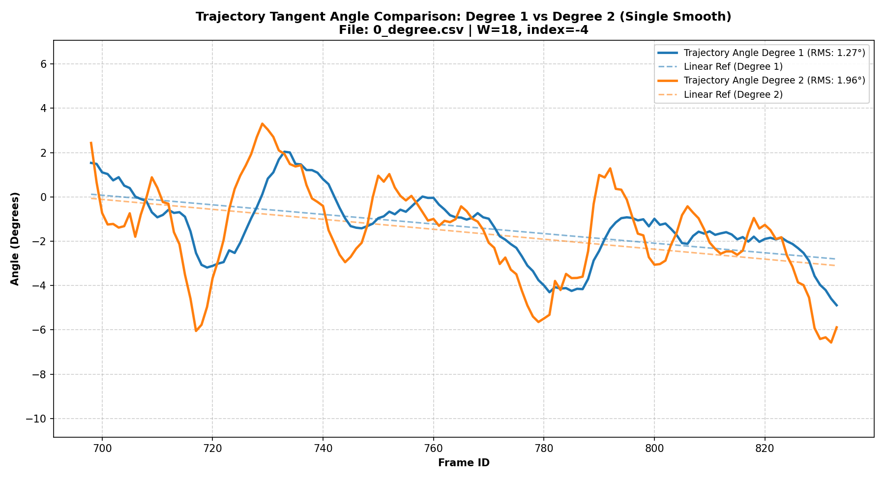

#### c) So sánh Fused Angle (Degree 1 vs Degree 2)
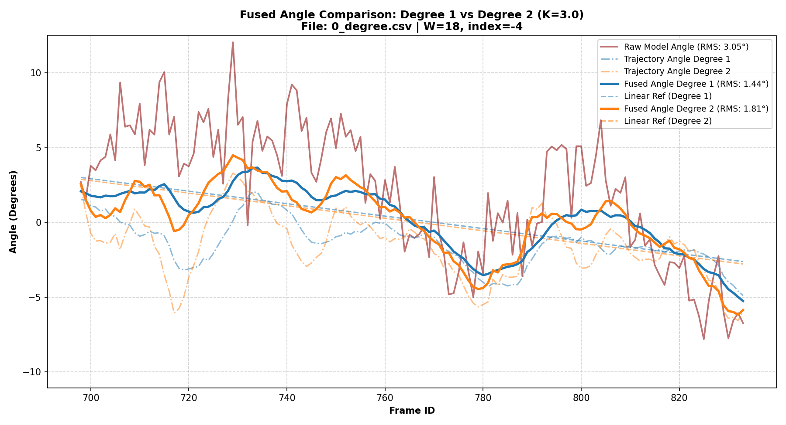

---

### 2.2. Góc 30 độ (`30_degree.csv`)

#### a) So sánh góc Model (Degree 1 vs Degree 2)
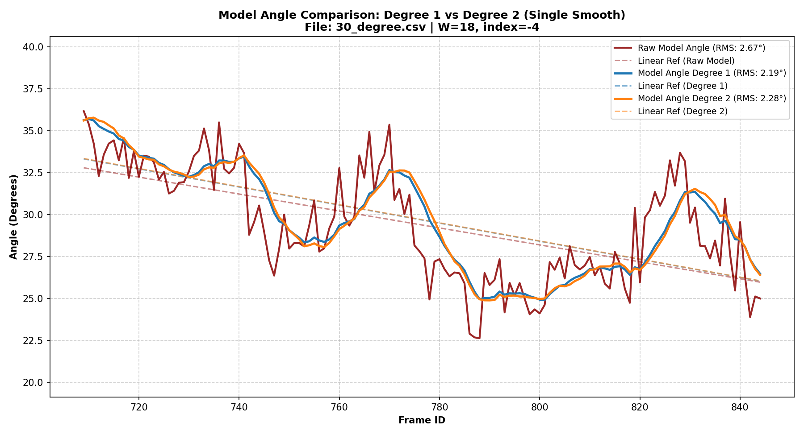

#### b) So sánh góc Quỹ đạo (Degree 1 vs Degree 2)
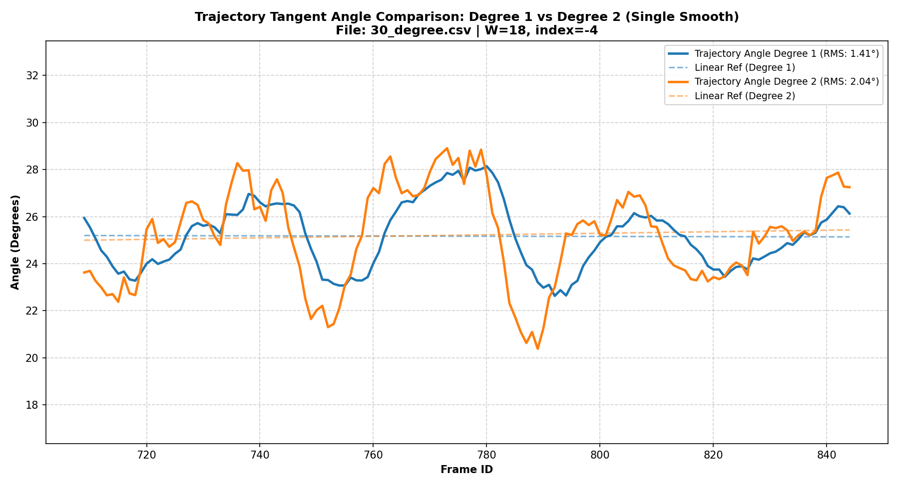

#### c) So sánh Fused Angle (Degree 1 vs Degree 2)
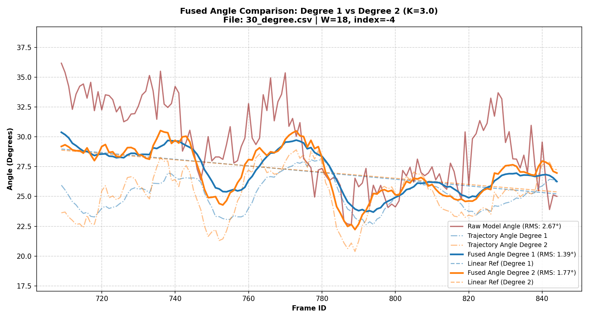

---

### 2.3. Góc 45 độ (`45_degree.csv`)

#### a) So sánh góc Model (Degree 1 vs Degree 2)
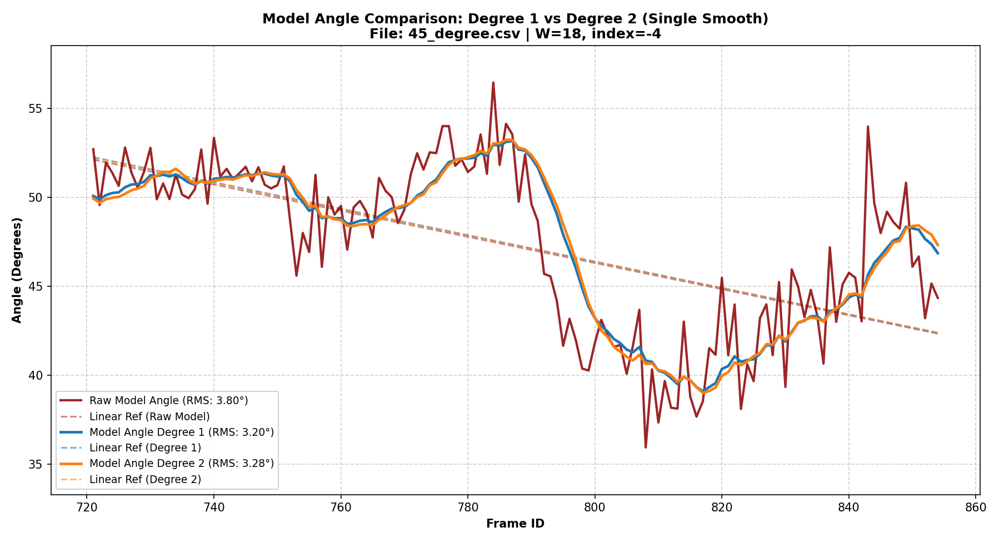

#### b) So sánh góc Quỹ đạo (Degree 1 vs Degree 2)
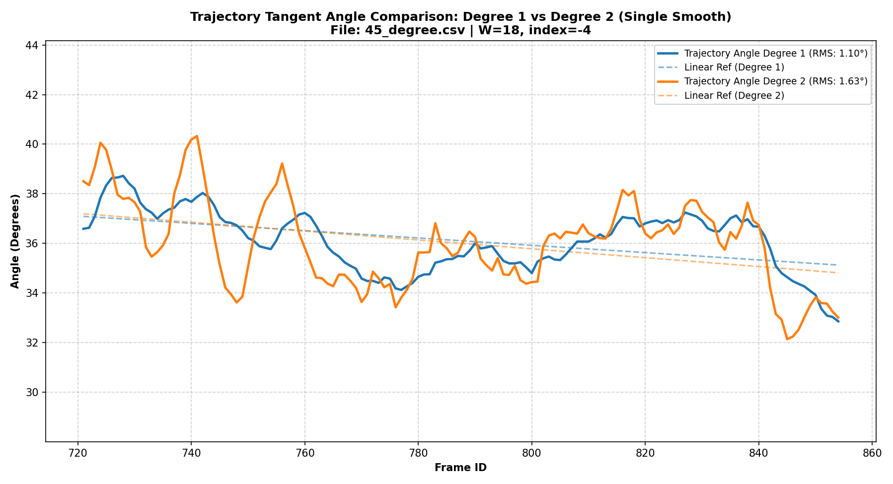

#### c) So sánh Fused Angle (Degree 1 vs Degree 2)
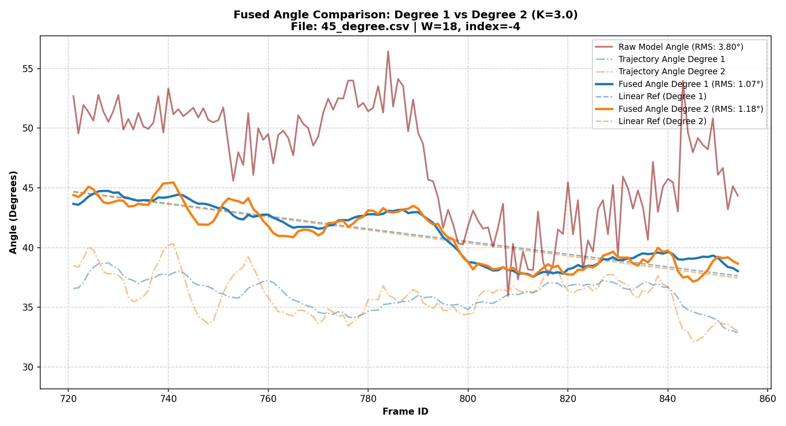

---

### 2.4. Góc -45 độ (`m45_degree.csv`)

#### a) So sánh góc Model (Degree 1 vs Degree 2)
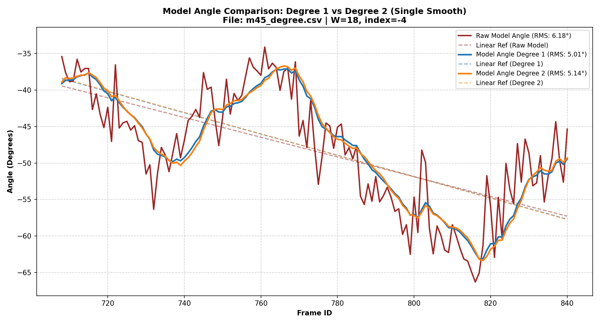

#### b) So sánh góc Quỹ đạo (Degree 1 vs Degree 2)
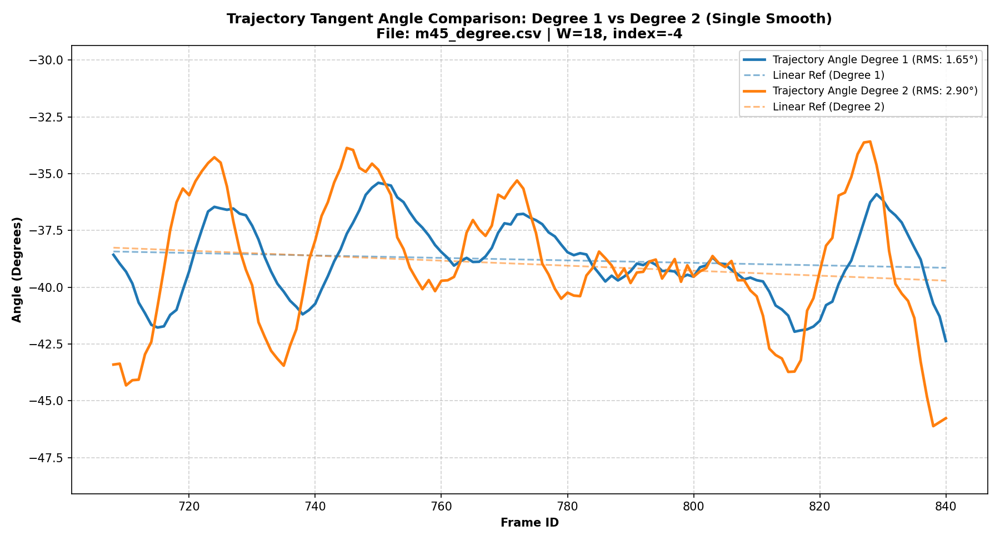

#### c) So sánh trực diện Fused Angle (Degree 1 vs Degree 2)
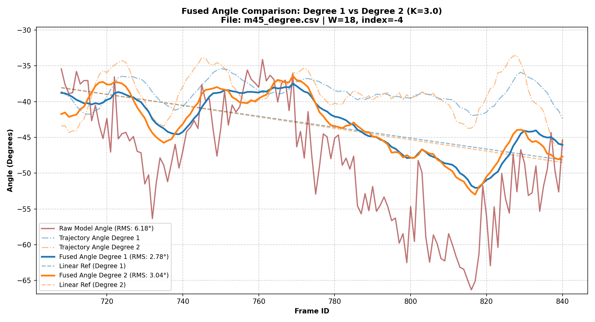

---

### 2.5. Góc 60 độ (`60_degree.csv`)

#### a) So sánh góc Model (Degree 1 vs Degree 2)
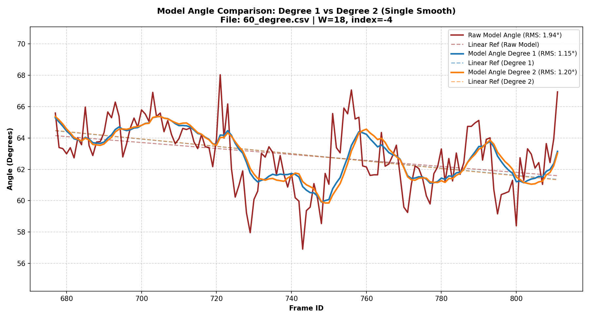

#### b) So sánh góc Quỹ đạo (Degree 1 vs Degree 2)
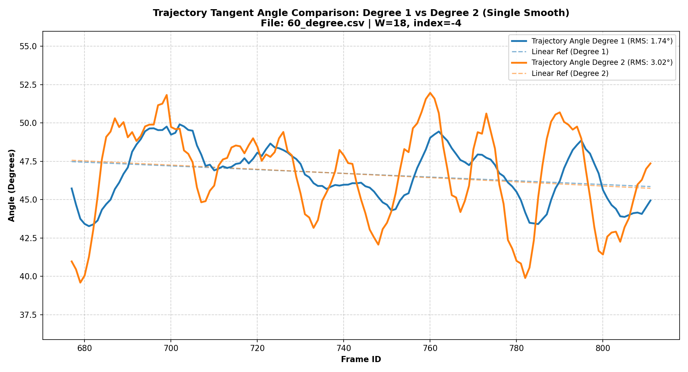

#### c) So sánh Fused Angle (Degree 1 vs Degree 2)
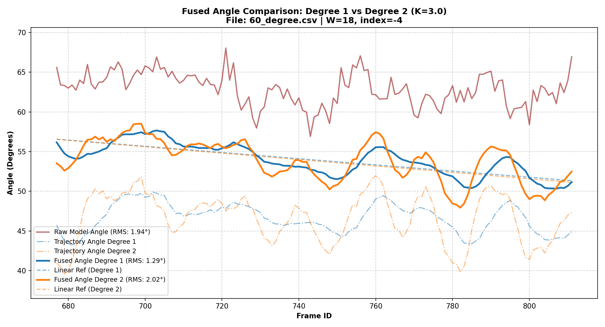

---

### 2.6. Góc 90 độ (`90_degree.csv`)

#### a) So sánh góc Model (Degree 1 vs Degree 2)
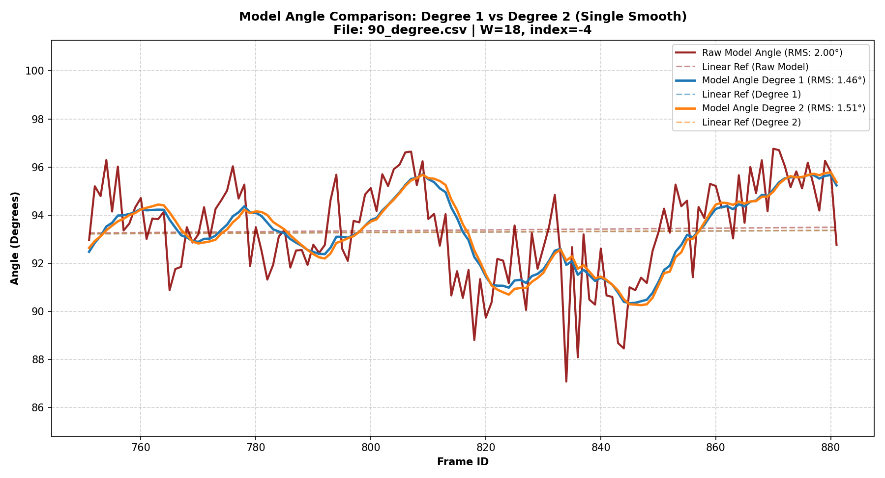

#### b) So sánh góc Quỹ đạo (Degree 1 vs Degree 2)
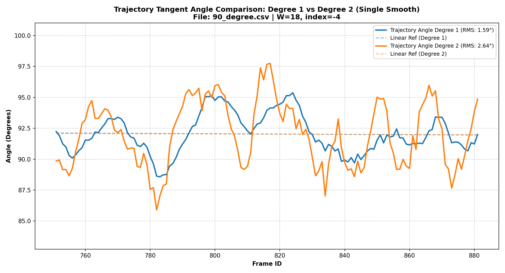

#### c) So sánh Fused Angle (Degree 1 vs Degree 2)
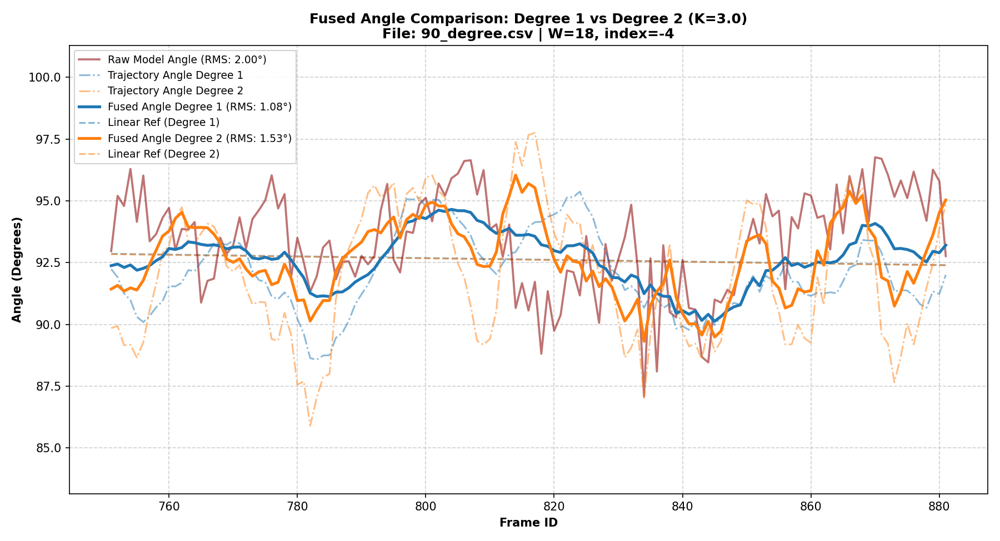

---

### 2.7. Bảng tổng hợp sai số RMS trên 6 tập Benchmark cố định (W = 18)

| Tập dữ liệu Benchmark | Raw Model Angle | Model Angle (Bậc 1) | Model Angle (Bậc 2) | Trajectory Angle (Bậc 1) | Trajectory Angle (Bậc 2) | Fused Angle (Bậc 1) | Fused Angle (Bậc 2) |
| :--- | :---: | :---: | :---: | :---: | :---: | :---: | :---: |
| **`0_degree.csv`** | 3.05° | 2.39° | 2.47° | **1.27°** | 1.96° | **1.44°** | 1.81° |
| **`30_degree.csv`** | 2.67° | 2.19° | 2.28° | **1.41°** | 2.04° | **1.39°** | 1.77° |
| **`45_degree.csv`** | 3.80° | 3.20° | 3.28° | **1.10°** | 1.63° | **1.07°** | 1.18° |
| **`m45_degree.csv`** | 6.18° | 5.01° | 5.14° | **1.65°** | 2.90° | **2.78°** | 3.04° |
| **`60_degree.csv`** | 1.94° | 1.15° | 1.20° | **1.74°** | 3.02° | **1.29°** | 2.02° |
| **`90_degree.csv`** | 2.00° | 1.46° | 1.51° | **1.59°** | 2.64° | **1.08°** | 1.53° |
| **Trung bình (Average)** | **3.27°** | **2.56°** | **2.65°** | **1.46°** | **2.37°** | **1.51°** | **1.89°** |


>
- Sai số RMS: Bậc 1 cho RMS trung bình thấp hơn Bậc 2 ở cả 3 loại dữ liệu góc . 
- Góc Quỹ đạo: Bậc 1 phù hợp với chuyển động thẳng nhờ tiếp tuyến hằng số; Bậc 2 nhạy hơn với sai số bounding box do có thêm thành phần độ cong.
- Góc Hợp nhất: Fused Bậc 1 giảm 53.8% độ lệch so với góc Model thô (từ 3.27° xuống 1.51°).

## B. Khó khăn
- Không.


## C. Công việc tiếp theo
- Em xin phép nhận hướng đi tiếp theo từ Thầy ạ.
