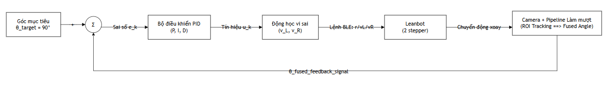
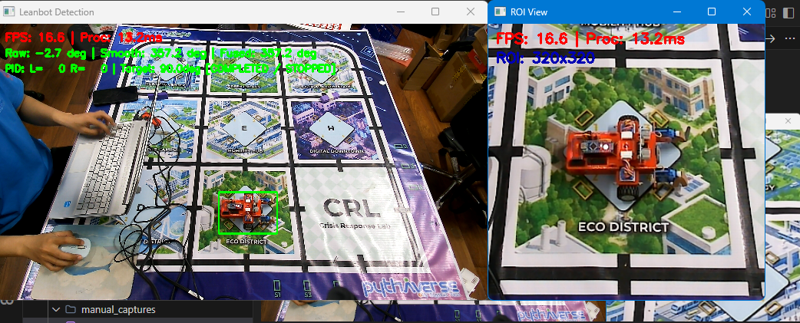
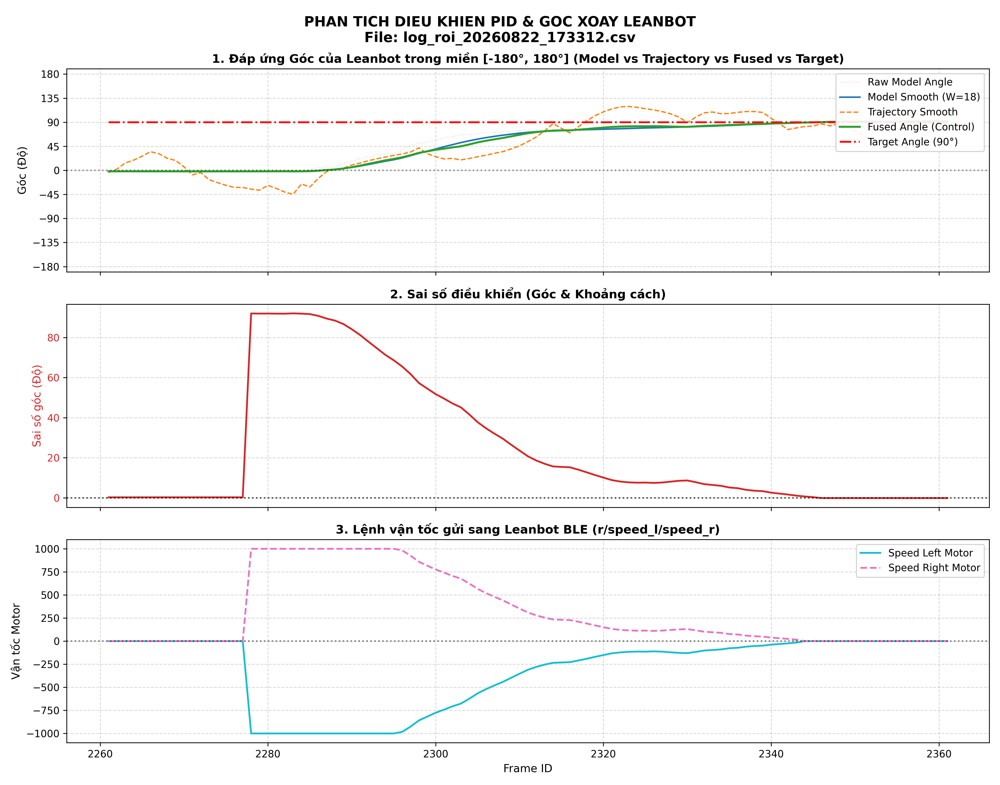
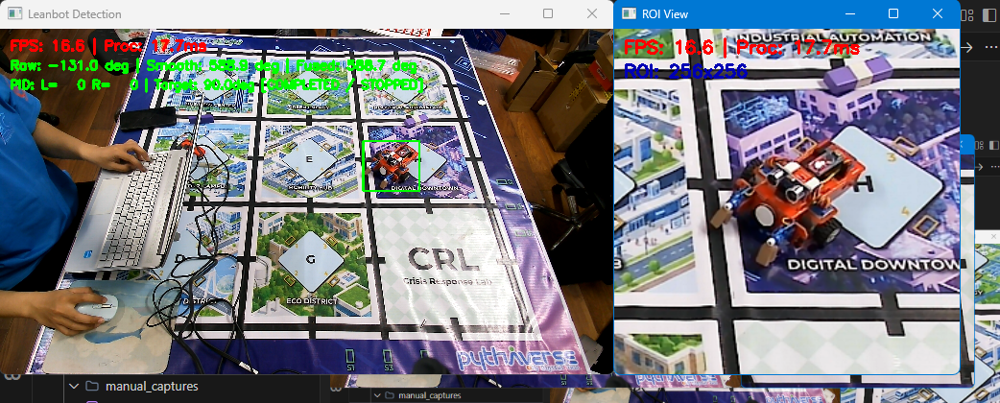
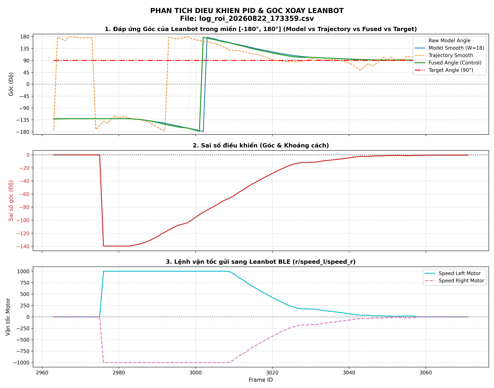
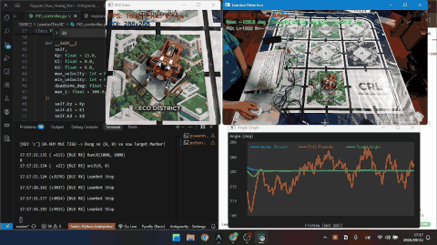

# Báo cáo công việc ngày 22/08/2026

## A. Công việc đã làm
- Lựa chọn cấu hình làm mượt có sai số RMS thấp nhất và tích hợp và code chạy Inference Camera. 
- Triển khai điều khiển Leanbot xoay về góc mục tiêu 90 độ bằng PID.
- Đánh giá quá trình điều khiển Leanbot bằng PID
---

### 1. Cấu hình làm mượt tối ưu tích hợp vào hệ thống
Dựa vào các thống kê, khảo sát trước đó thì cấu hình cuối cùng để thử nghiệm với RMS thấp nhất nhưu sau : 

| Tham số / Luồng xử lý | Cấu hình triển khai | Ý nghĩa |
| :--- | :--- | :--- |
| **Kích thước cửa sổ trượt ($W$)** | `W = 18` mẫu | Gom 18 frame liên tiếp trong buffer để lọc nhiễu. |
| **Điểm đánh giá độ trễ ($index$)** | `index = -4` ($t_{\text{eval}} \approx -0.235$) | Điểm cân bằng tối ưu giữa độ mượt và độ trễ pha. |
| **Hệ số phụ thuộc vận tốc ($K$)** | `K = 3.0` px/frame | Điều tiết trọng số hợp nhất $x(v) = \frac{K}{K+v}$. |
| **Loại trọng số** | `Uniform Weight` | Trọng số đều trên toàn bộ cửa sổ $W=18$. |
| **Luồng 1: Model Angle Smooth** | **Đa thức 1D Bậc 1** | Unwrap $\pm 360^\circ \to$ Fit Bậc 1 trên buffer 18 mẫu. |
| **Luồng 2: Trajectory 2D Fit** | **Đa thức 2D Bậc 2** | Fit quỹ đạo $(x(t), y(t))$ Bậc 2 $\to$ Đạo hàm tiếp tuyến $(\dot{x}, \dot{y})$ và vận tốc $v$. |
| **Luồng 2: Trajectory Angle Smooth** | **Đa thức 1D Bậc 1** | Unwrap & Align pha $180^\circ \to$ Fit Bậc 1 góc tiếp tuyến. |
| **Luồng 3: Fused Angle** | $x \cdot \theta_{\text{model}} + (1-x) \cdot \theta_{\text{traj}}$ | Hợp nhất góc thích nghi theo vận tốc di chuyển. |

---

### 2. Chi tiết triển khai trong code 

#### 2.1. Lấy dữ liệu góc Model raw angle smooth

* **Cấu hình triển khai**:
  * **Kích thước cửa sổ trượt ($W$)**: `W = 18` mẫu (`deque(maxlen=18)`).
  * **Bậc đa thức khớp**: Đa thức 1D Bậc 1 ($deg = 1$).
  * **Điểm đánh giá trễ ($index$)**: `eval_index = -4` ($t_{\text{eval}} \approx -0.2353$).
  * **Trọng số**: Trọng số đều (`Uniform Weight`).

* **Các bước xử lý dữ liệu**:
  1. **Trích xuất góc thô (`raw_angle`)**
  2. **Unwrap góc $\pm 360^\circ$ (`_unwrap_angle`)**: Khử hiện tượng gián đoạn góc khi vượt qua các mốc biên $\pm 180^\circ$ hoặc $360^\circ \leftrightarrow 0^\circ$ để tạo chuỗi dữ liệu pha liên tục:
     $$\Delta \theta = (\theta_{\text{new}} - \theta_{\text{prev}} + 180^\circ) \pmod{360^\circ} - 180^\circ \implies \theta_{\text{unwrapped}} = \theta_{\text{prev}} + \Delta \theta$$
  3. **Lưu trữ vào hàng đợi cửa sổ trượt**: Đẩy $\theta_{\text{unwrapped}}$ vào buffer `raw_angle_buffer` với cửa số sliding window w = 18 ;
  4. **Poly fit với hàm Bậc 1 (`_smooth_1d_poly`)**: Chuẩn hóa trục thời gian $t \in [-1, 0]$ trên các mẫu hợp lệ (`finite_mask`), khớp phương trình đường thẳng $\theta(t) = a_1 t + a_0$ bằng `np.polyfit`.
  5. **Tính toán góc làm mượt**: Đánh giá đa thức tại thời điểm $t_{\text{eval}}$ bằng `np.polyval()`. Ouput là dữ liệu góc raw từ model đã được smooth 

---

#### 2.2. Lấy dữ liệu Trajectory Angle smooth

* **Cấu hình triển khai**:
  * **Buffer tọa độ tâm $(x, y)$**: `W = 18` mẫu.
  * **Poly fit 2D**: Poly fit Bậc 2 ($deg = 2$).
  * **Poly fit 1D**: Poly fit Bậc 1 ($deg = 1$).
  * **Delay tangent point index**: `eval_index = -4`.
  * **Hệ số phụ thuộc vận tốc**: $K = 3.0\text{ px/frame}$ (Khi tính Fused Angle)

* **Các bước xử lý dữ liệu**:
  1. **Thu thập tọa độ không gian**: Lưu tọa độ tâm đối tượng $(c_x, c_y)$ vào `x_buffer` và `y_buffer` ($W=18$).
  2. **Poly fit 2D (`_fit_trajectory_2d`)**: Khớp độc lập tọa độ hai trục theo thời gian $t \in [-1, 0]$:
     $$x(t) = a_2 t^2 + a_1 t + a_0, \quad y(t) = b_2 t^2 + b_1 t + b_0$$
  3. **Tính vector đạo hàm tiếp tuyến & Vận tốc**:
     * Đạo hàm bậc 1 tại $t_{\text{eval}}$ qua `np.polyder()`:
       $$\dot{x} = \left.\frac{dx}{dt}\right|_{t_{\text{eval}}}, \quad \dot{y} = \left.\frac{dy}{dt}\right|_{t_{\text{eval}}}$$
     * Vận tốc di chuyển pixel ước lượng: $v = \frac{\sqrt{\dot{x}^2 + \dot{y}^2}}{W-1}$.
     * Góc tiếp tuyến hình học: $\theta_{\text{traj\_raw}} = \operatorname{atan2}(-\dot{y}, \dot{x}) \cdot \frac{180^\circ}{\pi}$ (lấy $-\dot{y}$ do trục tọa độ $Y$ của ảnh camera hướng xuống).
  4. **Căn chỉnh pha tiếp tuyến $180^\circ$ (`_align_trajectory_phase`)**: Do tiếp tuyến đạo hàm có tính lưỡng cực đối xứng $\pm 180^\circ$ (tiến/lùi), thuật toán so sánh với góc tham chiếu `model_angle_smooth` và bù $\pm k \cdot 180^\circ$ để chọn góc đồng pha nhất:
     $$\theta_{\text{aligned}} = \theta_{\text{traj}} - k \cdot 180^\circ \quad \text{sao cho } |\theta_{\text{aligned}} - \theta_{\text{ref}}| \to \min$$
  5. **Làm mượt góc tiếp tuyến 1D Bậc 1**: Đưa $\theta_{\text{aligned}}$ vào `traj_angle_buffer` và khớp đa thức 1D Bậc 1 tại `eval_index = -4` để lọc nhiễu góc tiếp tuyến, thu được `trajectory_angle_smooth`.
  6. **Hợp nhất góc (Fused Angle)**:
     * Trọng số suy giảm theo vận tốc: $x(v) = \frac{K}{K + v}$ với $K = 3.0\text{ px/frame}$.
     * Tính toán góc hợp nhất điều khiển:
       $$\theta_{\text{fused}} = x(v) \cdot \theta_{\text{model\_smooth}} + (1 - x(v)) \cdot \theta_{\text{traj\_smooth}}$$
       
     > Khi robot đứng yên hoặc chỉ xoay tại chỗ ($v \approx 0 \implies x(v) \to 1.0$), hệ thống tin cậy $100\%$ vào góc Model; khi robot di chuyển tịnh tiến nhanh ($v \gg 0 \implies x(v) \to 0$), hệ thống ưu tiên góc tiếp tuyến quỹ đạo để triệt tiêu rung lắc góc do model detect .

---

#### 2.3. Tính toán PID và gửi lệnh điều khiển tới LeanbotBLE

* **Sơ đồ khối điều khiển vòng kín (Closed-Loop Feedback Control)**:

* **Code thuật toán PID điều khiển**: [PID_controller.py](LeanbotTinyRC/PID_controller.py)

* **Các bước tính toán chi tiết**:

  * **Bước 1: Xác định chu kỳ lấy mẫu thời gian thực ($\Delta t$)**:
    Sử dụng bộ đếm thời gian độ phân giải cao `time.perf_counter()` để đo lường biến thiên thời gian thực tế giữa các khung hình:
    $$\Delta t_k = \max\left(0.001, t_k - t_{k-1}\right) \quad (\text{mặc định } \Delta t \approx 0.033\text{s tương ứng } 30\text{ FPS})$$

  * **Bước 2: Tính sai số góc ngắn nhất trên không gian $\mathbb{S}^1$ (Shortest Path Angular Error)**:
    Do góc xoay mang tính chu kỳ $360^\circ$, sai số giữa góc đặt và góc hiện tại được chuẩn hóa về đoạn $[ -180^\circ, +180^\circ ]$ bằng hàm `wrap_to_180`:
    $$e_k = \operatorname{wrap\_to\_180}(\theta_{\text{target}} - \theta_{\text{fused}, k}) = ((\theta_{\text{target}} - \theta_{\text{fused}, k} + 180^\circ) \bmod 360^\circ) - 180^\circ$$
    
    >Leanbot luôn tự động chọn chiều quay có cung góc nhỏ nhất 

  * **Bước 3: Tạo vùng Deadzone**:
    - Thiết lập vùng chết sai số góc $\epsilon = 1.0^\circ$:
    $$\text{Nếu } |e_k| \le \epsilon \implies \begin{cases} u_k = 0 \\ \Sigma_{I, k} = 0 \quad (\text{reset bộ tích phân}) \\ \text{Trạng thái: } \text{is\_aligned} = \text{True} \end{cases}$$

  * **Bước 4: Tính toán $P$, $I$, $D$**:
    1. **Khâu tỉ lệ (Proportional Term - $P$)**:
       $$P_k = K_p \cdot e_k \quad (K_p = 15.0)$$
       Tạo mô-men xoay tức thời tỉ lệ thuận với độ lệch góc hiện tại.
    2. **Khâu tích phân (Integral Term - $I$) với bộ khử bão hòa (Anti-Windup Clamping)**:
       $$\Sigma_{I, k} = \operatorname{clamp}\left(\Sigma_{I, k-1} + e_k \cdot \Delta t_k, -I_{\max}, +I_{\max}\right) \quad (I_{\max} = 300.0)$$
       $$I_k = K_i \cdot \Sigma_{I, k} \quad (K_i = 0.0)$$
       Giới hạn tích lũy sai số trong dải $[-300, +300]$ để chống bão hòa tích phân (integral windup) khi góc lệch ban đầu lớn.
    3. **Khâu vi phân (Derivative Term - $D$) với hiệu chỉnh pha**:
       $$\Delta e_k = \operatorname{wrap\_to\_180}(e_k - e_{k-1})$$
       $$D_k = K_d \cdot \frac{\Delta e_k}{\Delta t_k} \quad (K_d = 0.0)$$
       Đo lường tốc độ biến thiên của sai số để tạo lực hãm khi xe quay nhanh về gần đích, giảm thiểu vọt lố.

       > Hiện tại theo yêu cầu thử nghiệm của Thầy nên hệ số kD Ki em để là `0` , coi nhưu khôgn sử dụng. 

  * **Bước 5: Tổng hợp tín hiệu điều khiển xoay $u_k$**:
    $$u_k = P_k + I_k + D_k$$ 

  * **Bước 6: Bù vùng chết ma sát tĩnh (Deadband Friction Compensation)**:
    Động cơ và bánh xe thực tế luôn có ngưỡng ma sát tĩnh nghỉ $v_{\min} = 10$. Nếu tín hiệu $|u_k| < v_{\min}$ thì xe không đủ lực để chuyển động:
    $$\text{Nếu } 0 < |u_k| < v_{\min} \implies u_k = \operatorname{sgn}(u_k) \cdot v_{\min}$$ 
    > Hiện tại em để vận tốc min là `10 step/sec`

  * **Bước 7: Mô hình động học robot 2 bánh vi sai (Differential Drive Mapping)**:
    Quy đổi tín hiệu điều khiển xoay $u_k$ và vận tốc tịnh tiến $v_{\text{base}}$ ($v_{\text{base}} = 0$ khi xoay góc tại chỗ) ra vận tốc 2 bánh xe trái/phải:
    $$\begin{cases} v_{L, k} = v_{\text{base}} - u_k = -u_k \\ v_{R, k} = v_{\text{base}} + u_k = +u_k \end{cases}$$

  * **Bước 8: Giới hạn bão hòa vận tốc (Velocity Saturation)**:
    Giới hạn vận tốc đầu ra của bộ PID về vận tốc max = 1000 : 
      
    $[-v_{\max}, +v_{\max}]$ ($v_{\max} = 1000$):
    $$v_{L, k} = \operatorname{clamp}\left(v_{L, k}, -1000, 1000\right), \quad v_{R, k} = \operatorname{clamp}\left(v_{R, k}, -1000, 1000\right)$$

  * **Bước 9: Cơ chế ổn định dừng (Hold Time Verification)**:
    Khi robot duy trì sai số trong vùng chết ($|e_k| \le 1.0^\circ$) liên tục trong khoảng thời gian $\ge 100\text{ms}$ (`args.hold_ms`), bộ điều khiển chuyển sang trạng thái hoàn thành (`is_pid_completed = True`), ngắt động cơ gửi tốc độ $(0, 0)$ và khóa điều khiển tránh kích hoạt lại do nhiễu tức thời dẫn tới Leanbot lắc, nhích qua lại tại chỗ liên tục . 

  * **Bước 10: Đóng gói lệnh runLR và truyền thông BLE cho Leanbot
   - Lệnh điều khiển động cơ được đóng gói dạng chuỗi : `r/v_L/v_R\n`
   - Trong đó v_L và v_R là vận tốc 2 bánh xe, là đầu ra của bộ PID.
   - Hàm `send_motor_command` trong `leanbotCameraController.py` được sử dụng để đóng gói lệnh và gửi cho Leanbot.

#### 2.4. Ghi dữ liệu CSV và đánh giá đồ thị điều khiển PID Leanbot

* **Cấu trúc lưu trữ Log CSV**:
  * File log được lưu trong thư mục [benchmark_logs](../LeanbotTinyRC/benchmark_logs) với các trường để vẽ đồ thị đánh giá như : 
  `raw_angle`, `model_angle_smooth`, `trajectory_angle_smooth`, `estimated_speed`, `fused_angle`, `target_angle`, `angle_error`, `ble_speed_left`, `ble_speed_right`.

* **Tools vẽ đồ thị góc, tín hiện vận tốc điều khiển**:
  * script [plot_pid_navigation_log.py](../LeanbotTinyRC/plot_pid_navigation_log.py) tự động trích xuất dữ liệu CSV và vẽ 3 biểu đồ:

    1. **Biểu đồ góc**: Góc thô (`raw_angle`), Góc mượt mô hình (`model_smooth`), Góc quỹ đạo (`traj_smooth`), Góc hợp nhất (`fused_angle`) so với Góc mục tiêu (`target_angle`).
    2. **Biểu đồ sai số**: Sai số góc $\text{Angle Error} (^\circ)$ tiệm cận về 0.
    3. **Biểu đồ tín hiệu điều khiển động cơ**: Tín hiệu xung vận tốc gửi qua BLE tới 2 bánh xe trái/phải (`ble_speed_left`, `ble_speed_right`).

* **Kết quả thực nghiệm**:

  ##### a. Lần 1 
  * **File log CSV**: [log_roi_20260822_173208.csv](LeanbotTinyRC/benchmark_logs/log_roi_20260822_173208.csv)
  * **Ảnh thực tế**:
    
  * **Đồ thị**:
    

  ---

  ##### b. Lần 2 
  * **File log CSV**: [log_roi_20260822_173312.csv](LeanbotTinyRC/benchmark_logs/log_roi_20260822_173312.csv)
  * **Ảnh thực tế**:
    
  * **Đồ thị**:
    

  ---

  ##### c. Lần 3 
  * **File log CSV**: [log_roi_20260822_173359.csv](LeanbotTinyRC/benchmark_logs/log_roi_20260822_173359.csv)
  * **Ảnh thực tế**:
    
  * **Đồ thị**:
    

* **Bảng đánh giá chất lượng điều khiển PID**:

| Tiêu chí | Kết quả thực nghiệm | Nhận xét |
| :--- | :--- | :--- |
| **Độ mượt của tín hiệu góc** | fused angle biến thiên đều, mượt| Góc `fused_angle` lọc bỏ tốt xung nhiễu $\pm 2^\circ \sim 3^\circ$ của góc thô `raw_angle` và góc tiếp tuyến quỹ đạo |
| **Thời gian xác lập ($t_s$)** | $\approx 5.5\text{ giây}$ | Robot quay ở tốc độ tối đa $\pm 1000$, giảm tốc tốt khi tới gần mục tiêu. |
| **Độ vọt lố (Overshoot)** | **$0.0^\circ$ ($0\%$)** | Không xảy ra hiện tượng vượt lố với kp =  15|
| **Sai số xác lập ($e_{ss}$)** | **$< 0.5^\circ$** | nằm trong vùng chết cho phép ($\pm 1.0^\circ$). |

---

#### 2.5. Video kiểm thử

  

---

## B. Khó khăn
- Không
## C. Công việc tiếp theo
- Xây dựng bộ PID để điều khiển Leanbot tới vị trí chỉ định trên sa bàn ( thông qua click chuột tới vị trí pixel target cần đi tới + hướng Leanbot tại vị trí target ) 
- Em có cần tìm hiểu thêm về động lực học của robot 2 bánh vi sai không ạ ( differential drive robot ), hiện tại em chỉ điều khiển theo mô hình động học nghịch thôi ạ 