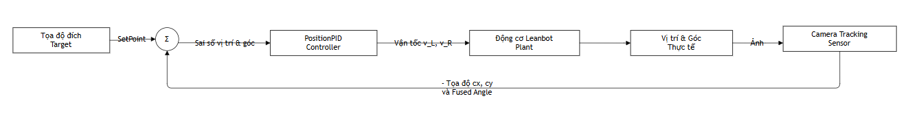
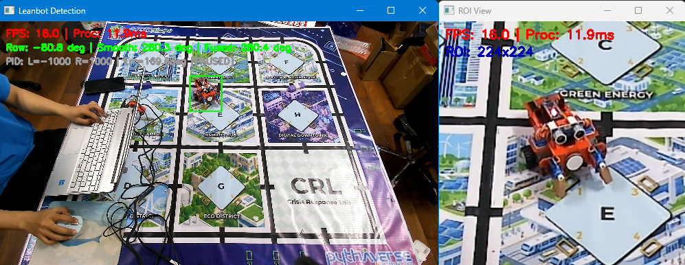
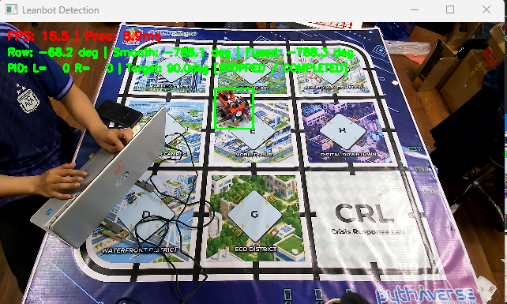
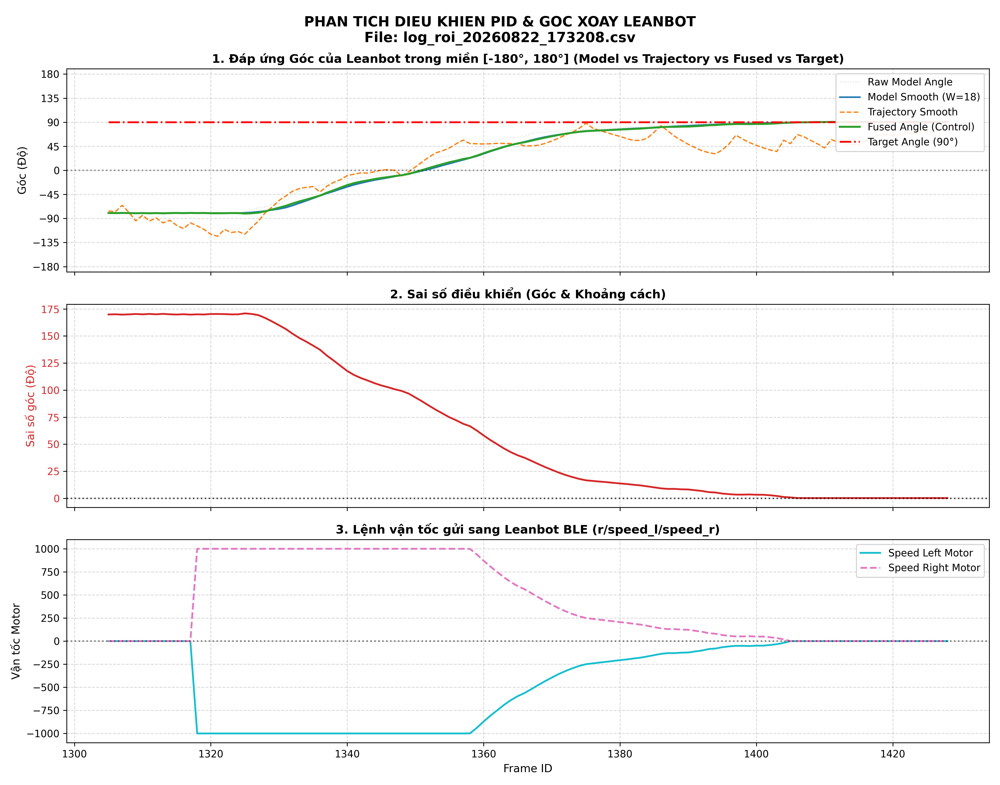
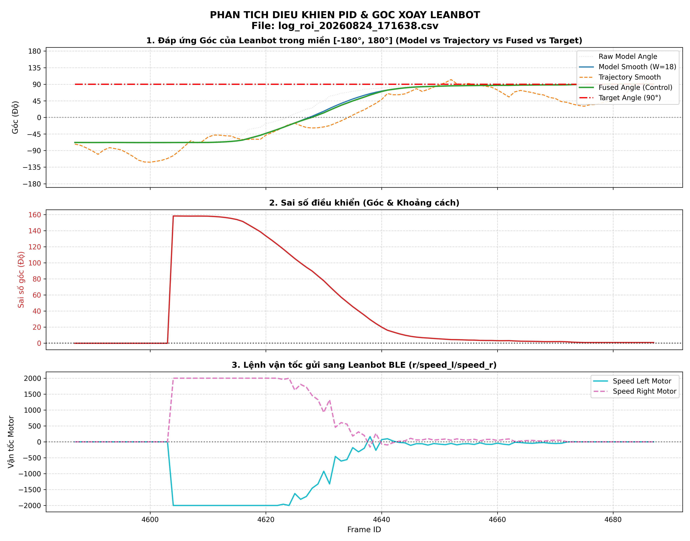
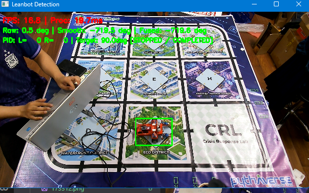
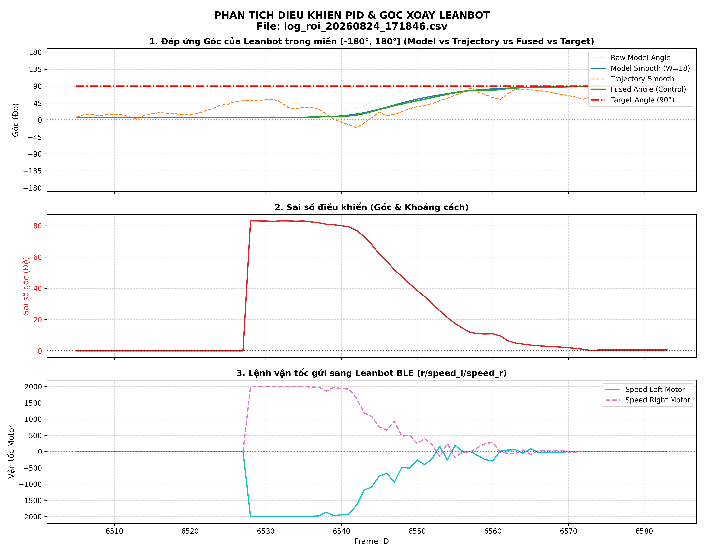
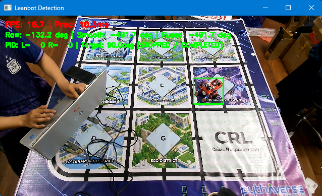
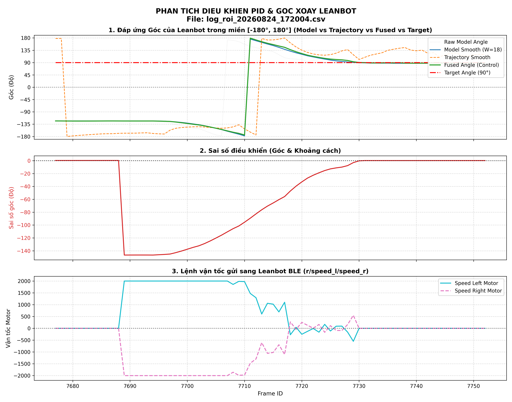

# Báo cáo công việc ngày 24/08/2026

## A. Công việc đã làm 
- Triển khai PID điều khiển Leanbot đi tới tọa độ Pixel chỉ định 
- Triển khai tích phân Ki có điều kiện, chỉ cộng dồn khi sai số đã giảm vào vùng cần bù. 
- Đánh giá bộ thông số PID sau khi tối ưu, tinh chỉnh thêm . 

---

### 1. Triển khai PID điều khiển Leanbot đi tới tọa độ pixel chỉ định 

- **Mục tiêu**: mở rộng bộ điều khiển PID xoay góc trước đó thành bộ điều khiển vị trí `Point-to-Point Navigation`, cho phép người dùng chọn một tọa độ bất kỳ trên ảnh camera và điều khiển Leanbot tự động di chuyển tới tọa độ đó.
- **Code thuật toán điều khiển**: [PID_controller.py](LeanbotTinyRC/PID_controller.py).
- **Code tích hợp Camera, giao diện chọn đích, ghi log và truyền BLE**: [leanbotCameraController.py](LeanbotTinyRC/leanbotCameraController.py).

#### 1.1. Luồng điều khiển vòng kín

Luồng điều khiển được triển khai theo chu trình phản hồi liên tục trên từng frame camera:

#### 1.2. Cấu hình bộ điều khiển PID hiện tại

| tham số PID | Giá trị |
| :--- | :---: |
| PID khoảng cách | `Kp_dist = 25.0` |
| PID khoảng cách | `Ki_dist = 0.0` |
| PID khoảng cách | `Kd_dist = 5.0` |
| PID góc | `Kp_angle = 25.0` |
| PID góc | `Ki_angle = 0.0` |
| PID góc | `Kd_angle = 8.5` |
| Ngưỡng tích phân góc | `a_angle = 15 độ` |
| Ngưỡng tích phân khoảng cách | `a_dist = 50 px` |
| Deadzone góc | `1 độ` |
| Dung sai vị trí | `10 px` |
| Thời gian ổn định | `100 ms` |
| Ngưỡng xoay trước khi chạy | `10 độ` |
| Ngưỡng quay lại căn hướng | `75 độ` |
| Vận tốc cực đại | `2000 step/s` |
| Vận tốc min để bù ma sát | `5 step/s` |

#### 1.3. Chọn tọa độ đích trên giao diện Camera

- Cửa sổ `Leanbot Detection` đăng ký hàm callback `on_mouse_click()` để nhận sự kiện click chuột. 
- Khi nhấn **chuột trái**, tọa độ trên cửa sổ hiển thị được quy đổi về hệ tọa độ ảnh gốc:

  

$$
s_x = \frac{W_{image}}{W_{display}}, \qquad s_y = \frac{H_{image}}{H_{display}}
$$

  

$$
x_{target} = x_{click} \cdot s_x, \qquad y_{target} = y_{click} \cdot s_y
$$

- Sau khi chọn mục tiêu mới, hệ thống thực hiện:
  - Lưu `target_pos = (target_x, target_y)`.
  - Bật lại chế độ điều khiển tự động `is_auto_pid_enabled = True`.
  - Xóa trạng thái dừng khẩn cấp của lượt điều khiển trước.
  - Reset PID góc, PID khoảng cách, sai số trước đó và trạng thái `is_driving`.
- Khi nhấn **chuột phải** hoặc phím `c`, mục tiêu bị hủy, PID được reset và lệnh dừng `r/0/0` được gửi tới Leanbot.

---

#### 1.4. Các bước tính toán điều khiển vị trí

* **Bước 1: Xác định chu kỳ lấy mẫu thực tế**

  Sử dụng `time.perf_counter()` để đo thời gian giữa hai lần cập nhật liên tiếp. Giá trị nhỏ nhất được giới hạn ở `0.001 s`; frame đầu tiên sử dụng giá trị mặc định `0.033 s`, tương ứng khoảng `30 FPS`:

  

$$
\Delta t_k = \max(0.001, t_k - t_{k-1})
$$

* **Bước 2: Tính vector sai lệch và khoảng cách tới đích**

  Với vị trí hiện tại $(x_k, y_k)$ và vị trí mục tiêu $(x_t, y_t)$:

  

$$
\Delta x_k = x_t - x_k, \qquad \Delta y_k = y_t - y_k
$$

  

$$
d_k = \sqrt{\Delta x_k^2 + \Delta y_k^2}
$$

  Trong đó $d_k$ là sai số khoảng cách theo đơn vị pixel.

* **Bước 3: Tính góc hướng từ Leanbot tới mục tiêu**

  Do trục $Y$ của ảnh camera tăng theo chiều từ trên xuống dưới, thành phần $\Delta y_k$ phải đổi dấu khi tính góc:

  

$$
\theta_{target,k} = \operatorname{atan2}(-\Delta y_k, \Delta x_k) \cdot \frac{180^\circ}{\pi}
$$

  Sai số góc được chuẩn hóa về đoạn $[-180^\circ, 180^\circ]$ bằng hàm `wrap_to_180()`:

  

$$
e_{\theta,k} = \operatorname{wrap180}(\theta_{target,k} - \theta_{current,k})
$$

  - Việc chuẩn hóa giúp Leanbot luôn chọn chiều quay có cung góc ngắn nhất.

* **Bước 4: Kiểm tra điều kiện đã tới đích**

  Khi khoảng cách còn lại nhỏ hơn hoặc bằng dung sai $10 px$:

$$
d_k \le 10 px \implies v_{L,k} = 0, \quad v_{R,k} = 0
$$

  Hệ thống xét tiếp tham số `--final-angle` 
  - Nếu có tham số `--final-angle`: Leanbot tự động chuyển sang PID góc để xoay tại chỗ thân xe về đúng góc đích.
  - Nếu không có tham số này: xe đứng yên.
  
  Leanbot đợi sai số nằm lọt trong vùng dung sai và duy trì liên tục trong thời gian `100ms` trước khi ngắt PID an toàn và chuyển sang trạng thái dừng PID control.

* **Bước 5: Chọn chế độ xoay tại chỗ hoặc vừa tiến vừa bẻ lái đi tới điểm target pĩel**

  Bộ điều khiển sử dụng biến trạng thái `is_driving` để tránh việc Leanbot liên tục dừng lại xoay tại chỗ khi sai số góc dao động nhỏ:

  - Khi bắt đầu, nếu $|e_{\theta,k}| > 10^\circ$: đặt `state = ALIGNING_HEADING`, vận tốc tiến bằng `0`, chỉ chạy PID góc để xoay về phía mục tiêu.
  - Khi sai số đã giảm còn $|e_{\theta,k}| \le 10^\circ$: chuyển sang `is_driving = True` và bắt đầu tiến.
  - Khi đang tiến, xe tiếp tục bẻ lái theo cung cong nếu $|e_{\theta,k}| \le 75^\circ$.
  - Nếu đang tiến nhưng $|e_{\theta,k}| > 75^\circ$: hủy trạng thái tiến và quay lại xuay Leanbot để tránh chạy sai hướng.

* **Bước 6: Tính PID khoảng cách tạo vận tốc tịnh tiến**

  Khâu P và D của PID khoảng cách được tính như sau:

$$
P_{d,k} = K_{p,d} \cdot d_k
$$

$$
D_{d,k} = K_{d,d} \cdot \frac{d_k - d_{k-1}}{\Delta t_k}
$$

  Thành phần tích phân $I_{d,k}$ chỉ được kích hoạt khi $d_k \le 50 px$ 

$$
v_{PID,k} = P_{d,k} + I_{d,k} + D_{d,k}
$$

* **Bước 7: Giảm vận tốc tiến theo sai số hướng**

  Khi Leanbot chưa hướng thẳng hoàn toàn về mục tiêu, vận tốc tiến được nhân với hệ số cosine để xe đi cong về hướng target pixel 

$$
c_k = \max\left(0.2, \cos\left(e_{\theta,k}\frac{\pi}{180}\right)\right)
$$

$$
v_{linear,k} = v_{PID,k} \cdot c_k
$$

* **Bước 8: Tính PID góc tạo vận tốc quay**

  Với sai số hướng $e_{\theta,k}$:

$$
P_{\theta,k} = K_{p,\theta} \cdot e_{\theta,k}
$$

$$
D_{\theta,k} = K_{d,\theta} \cdot \frac{\operatorname{wrap180}(e_{\theta,k} - e_{\theta,k-1})}{\Delta t_k}
$$

  Thành phần tích phân $I_{\theta,k}$ chỉ được kích hoạt khi $|e_{\theta,k}| \le 15^\circ$. Tín hiệu vận tốc quay:

$$
u_{angular,k} = P_{\theta,k} + I_{\theta,k} + D_{\theta,k}
$$

* **Bước 9: Quy đổi sang vận tốc hai bánh vi sai**

  Tín hiệu vận tốc tiến và vận tốc quay được ánh xạ sang hai bánh:

$$
\begin{cases}
  v_{L,k} = v_{linear,k} - u_{angular,k} \\
  v_{R,k} = v_{linear,k} + u_{angular,k}
  \end{cases}
$$

  Sau đó vận tốc được giới hạn trong miền an toàn:

$$
v_{L,k}, v_{R,k} \in [-2000, 2000]
$$

  Nếu vận tốc dương nhỏ hơn `5 step/s`, bộ điều khiển nâng lên vận tốc tối thiểu để thắng ma sát tĩnh của động cơ và bánh xe.

* **Bước 10: Truyền lệnh BLE và xử lý an toàn**

  - Vận tốc hai bánh được đóng gói theo định dạng lệnh Leanbot: `r/v_left/v_right\n`.

### 2. Tích phân Ki có điều kiện theo ngưỡng sai số

#### 2.1. Nhược điểm của phương pháp tích phân cộng dồn toàn thời gian

Nếu tích phân được cộng ngay từ lúc Leanbot còn cách xa mục tiêu, sai số ban đầu có giá trị lớn sẽ nhanh chóng tạo tổng tích lũy lớn:

$$
\Sigma_{I,k} = \Sigma_{I,k-1} + e_k \cdot \Delta t_k
$$

Khi xe đã tiến gần mục tiêu, phần sai số cũ vẫn còn nằm trong tổng tích phân. Thành phần $I_k$ vì vậy có thể tiếp tục đẩy vận tốc dù sai số hiện tại đã nhỏ, gây các hiện tượng:

- Tín hiệu điều khiển giảm chậm khi xe gần đích.
- Dễ vượt qua tọa độ mục tiêu (overshoot) và phải quay lại hiệu chỉnh.
- Tăng dao động quanh vùng target
- Khó tinh chỉnh `Ki` vì giá trị tích phân phụ thuộc nhiều vào thời gian chạy từ lúc bắt đầu.

#### 2.2. Phương pháp tích phân có điều kiện

Với ngưỡng kích hoạt tích phân $a$, vùng hoàn thành hoặc deadzone $\varepsilon$ và giới hạn chống bão hòa $I_{max}$:

$$
\Sigma_{I,k} =
\begin{cases}
0, & |e_k| > a \\
\operatorname{clamp}(\Sigma_{I,k-1} + e_k\Delta t_k, -I_{max}, I_{max}), & \varepsilon < |e_k| \le a \\
0, & |e_k| \le \varepsilon
\end{cases}
$$

$$
I_k = K_i \cdot \Sigma_{I,k}
$$

- Khi sai số còn lớn hơn $a$: khâu I bị tắt và giá trị tích phân được reset; bộ điều khiển sử dụng P và D để đưa xe nhanh về gần mục tiêu.
- Khi sai số đi vào miền $(\varepsilon, a]$: bắt đầu cộng dồn tích phân để bù ma sát, sai số xác lập và phần điều khiển còn thiếu của khâu P.
- Khi sai số vào deadzone hoặc đạt dung sai vị trí: reset tích phân và dừng hiệu chỉnh để tránh rung quanh mục tiêu.
- Nếu sai số tăng trở lại vượt quá $a$: tích phân được reset thay vì giữ giá trị cũ.

#### 2.3. Điều kiện kích hoạt tích phân PID góc

Các ngưỡng hiện tại:

| Tham số | Giá trị |
| :--- | :---: |
| Ngưỡng kích hoạt tích phân góc | $a_{angle} = 15^\circ$ |
| Deadzone góc | $\varepsilon_{angle} = 1^\circ$ |
| Giới hạn tích phân | $I_{max,angle} = 300$ |

Công thức triển khai:

$$
\Sigma_{\theta,k} =
\begin{cases}
0, & |e_{\theta,k}| > 15^\circ \\
\operatorname{clamp}(\Sigma_{\theta,k-1} + e_{\theta,k}\Delta t_k, -300, 300), & 1^\circ < |e_{\theta,k}| \le 15^\circ \\
0, & |e_{\theta,k}| \le 1^\circ
\end{cases}
$$

$$
I_{\theta,k} = K_{i,\theta} \cdot \Sigma_{\theta,k}
$$

| Miền sai số góc | Trạng thái khâu I | Mục đích |
| :--- | :--- | :--- |
| $\vert e_\theta \vert > 15^\circ$ | Tắt và reset tích phân | Sai số còn lớn; ưu tiên P và D để xoay nhanh. |
| $1^\circ < \vert e_\theta \vert \le 15^\circ$ | Cộng dồn tích phân | Bù mô-men nhỏ còn thiếu khi xe gần đúng hướng. |
| $\vert e_\theta \vert \le 1^\circ$ | Reset tích phân, trả `is_aligned = True` | Xuất vận tốc `0` nhưng tiếp tục theo dõi; PID chạy lại ngay nếu góc lệch khỏi deadzone. |

#### 2.4. Điều kiện kích hoạt tích phân PID khoảng cách

Các ngưỡng hiện tại:

| Tham số | Giá trị |
| :--- | :---: |
| Ngưỡng kích hoạt tích phân khoảng cách | $a_{dist} = 50 px$ |
| Dung sai hoàn thành vị trí | $\varepsilon_{dist} = 10 px$ |
| Giới hạn tích phân | $I_{max,dist} = 500$ |

Công thức triển khai:

$$
\Sigma_{d,k} =
\begin{cases}
0, & d_k > 50 px \\
\operatorname{clamp}(\Sigma_{d,k-1} + d_k\Delta t_k, -500, 500), & 10 px < d_k \le 50 px \\
0, & d_k \le 10 px
\end{cases}
$$

$$
I_{d,k} = K_{i,d} \cdot \Sigma_{d,k}
$$

| Miền sai số khoảng cách | Trạng thái khâu I | Mục đích |
| :--- | :--- | :--- |
| $d > 50 px$ | Tắt và reset tích phân | Xe còn xa; khâu P và D đảm nhiệm vận tốc tiếp cận chính. |
| $10 px < d \le 50 px$ | Cộng dồn tích phân | Bù ma sát và duy trì lực tiến nhỏ khi gần mục tiêu. |
| $d \le 10 px$ | Reset PID và dừng xe | Xác nhận đã đạt tọa độ trong dung sai cho phép. |

### 3. Kiểm thử và đánh giá bộ thông số PID (So sánh trước và sau khi tinh chỉnh)

Để so sánh với các hệ số PID cũ buổi trước ($K_p = 15, K_d = 0$) và bộ thông số PID mới được tinh chỉnh ($K_{p\_angle} = 25, K_{d\_angle} = 8.5$) , tại cùng 1 vị trí, cùng góc, em triển khai chạy PID điều khiển lại như cũ và so sánh kết quả như sau : 

#### 3.1. Thử nghiệm 1 

| Thông số PID Cũ ($K_p=15, K_d=0$) | Thông số PID Agile Mới ($K_p=25, K_d=8.5$) |
| :---: | :---: |
|  |  |
|  |  |

**Kết quả so sánh:**
- **Thời gian xác lập (Settling Time):** Giảm từ `6.69s` (Cũ) xuống còn `5.87s` (Mới).
- **Sai số xác lập (Steady-state Error):** `0.23°` (Cũ) so với `0.67°` (Mới).

#### 3.2. Thử nghiệm  2

| Thông số PID Cũ ($K_p=15, K_d=0$) | Thông số PID Agile Mới ($K_p=25, K_d=8.5$) |
| :---: | :---: |
|  |  |
|  |  |

**Kết quả so sánh:**
- **Thời gian xác lập (Settling Time):** Giảm từ `5.54s` (Cũ) xuống còn `4.48s` (Mới).
- **Sai số xác lập (Steady-state Error):** `-0.14°` (Cũ) so với `0.58°` (Mới).

#### 3.3. Thử nghiệm 3

| Thông số PID Cũ ($K_p=15, K_d=0$) | Thông số PID Agile Mới ($K_p=25, K_d=8.5$) |
| :---: | :---: |
|  |  |
|  |  |

**Kết quả so sánh:**
- **Thời gian xác lập (Settling Time):** Giảm từ `6.33s` (Cũ) xuống `3.49s` (Mới).
- **Sai số xác lập (Steady-state Error):** `-0.56°` (Cũ) so với `0.15°` (Mới)

#### 3.4. Nhận xét quá trình tinh chỉnh (Dựa trên đồ thị mới)
- **Thời gian xác lập (Settling Time):** Đồ thị mới cho thấy thời gian xe xoay và ép sai số góc tiệm cận $0^\circ$ nhanh hơn so với đồ thị cũ (vì $K_p$ tăng từ 15 lên 25).
- **Phản ứng phanh (Derivative Action):** Ở biểu đồ vận tốc truyền xuống bánh xe (`ble_speed_left`, `ble_speed_right`) của các đồ thị với bộ hệ số PID mới, có thể thấy rõ các xung hãm phanh đảo chiều đột ngột khi góc gần về 0. Khâu đạo hàm ($K_d = 8.5$) kéo hãm lại tín hiệu điều khiển, giảm hiện tượng vọt lố (Overshoot)
- **Nhược điểm** : vẫn còn có hiện tượng nhiễu làm sai số xác lập lớn hơn một chút so với bộ thông số PID cũ ( chỉ có kP = 15). 

### 4. Video thực nghiệm 

## B. Khó khăn 
- Không
## C. Công việc tiếp theo .
- Em xin phép nhận hướng đi tiếp theo từ Thầy ạ . 