# Báo cáo công việc ngày 27/08/2026

## A. Công việc đã làm
- Chỉnh sửa chương trình điều khiển Leanbot theo yêu cầu của Thầy: thực hiện lần lượt từng bước, không ghép nhiều chức năng trong một giai đoạn.
- Thay mục tiêu chọn bằng chuột thành một mục tiêu cố định (em chọn tạm là pixel tâm frame ảnh).
- Chuyển bộ điều khiển vị trí về điều khiển P, chưa triển khai khâu Ki và Kd.
- Tách quá trình điều khiển thành hai giai đoạn rõ ràng: xoay tại chỗ, sau đó tiến và bẻ lái tới target.
- Loại bỏ hệ số giảm tốc dùng `cos()` và chức năng chỉnh hướng sau khi tới target. 
- Sử dụng công thức tính vận tốc điều hướng của Thầy đề xuất.


### 1. Triển khai bộ điều khiển P hai giai đoạn đưa Leanbot tới target cố định
- **Code thuật toán điều khiển**: [PID_controller.py](LeanbotTinyRC/PID_controller.py).
- **Code tích hợp Camera, giao diện, ghi log và truyền BLE**: [leanbotCameraController.py](LeanbotTinyRC/leanbotCameraController.py).

#### 1.1. Đặt target cố định tại tâm frame ảnh

Sau khi nhận frame ảnh đầu tiên có kích thước $W \times H$, xác định target cố định:

$$
x_{target} = \left\lfloor \frac{W}{2} \right\rfloor,
\qquad
y_{target} = \left\lfloor \frac{H}{2} \right\rfloor
$$

Khi camera trả về frame `1280 × 720`, target được đặt tại:

$$
(x_{target}, y_{target}) = (640, 360)
$$

Target được vẽ cố định bằng điểm màu đỏ, đường tròn màu vàng và nhãn tọa độ trên cửa sổ `Leanbot Detection`.


#### 1.2. Tính sai số vị trí và sai số góc

Với vị trí tâm Leanbot hiện tại $(x, y)$ và target $(x_t, y_t)$:

$$
\Delta x = x_t - x,
\qquad
\Delta y = y_t - y
$$

Sai số khoảng cách theo pixel:

$$
err_{distance} = \sqrt{\Delta x^2 + \Delta y^2}
$$

Do trục $Y$ trên ảnh tăng theo chiều từ trên xuống dưới, góc từ Leanbot tới target được tính bằng:

$$
\theta_{target} = \text{atan2}(-\Delta y, \Delta x) \cdot \frac{180^\circ}{\pi}
$$

Sai số góc được chuẩn hóa về đoạn $[-180^\circ, 180^\circ]$:

$$
err_{angle} = \text{wrap180}(\theta_{current} - \theta_{target})
$$

Dấu của $err_{angle}$ được chọn theo quy ước chiều quay của hai động cơ Leanbot để áp dụng trực tiếp công thức vận tốc của Thầy đề xuất.

#### 1.3. Giai đoạn 1: xoay tại chỗ hướng đến target

Trong giai đoạn này:

$$
v_{LR} = 0
$$

$$
v_{diff} = K_{p\_angle} \times err_{angle}
$$

$$
v_L = v_{LR} + v_{diff},
\qquad
v_R = v_{LR} - v_{diff}
$$

Vì $v_{LR}=0$, hai bánh quay ngược chiều để Leanbot xoay tại chỗ. Khi:

$$
|err_{angle}| \le 10^\circ
$$

#### 1.4. Giai đoạn 2: tiến đến target và bẻ lái

Chương trình sử dụng đúng công thức:

$$
v_{LR} = K_{p\_distance} \times err_{distance}
$$

$$
v_{diff} = K_{p\_angle} \times err_{angle}
$$

$$
v_L = v_{LR} + v_{diff}
$$

$$
v_R = v_{LR} - v_{diff}
$$

Do vận tốc động cơ Leanbot được giới hạn bởi $V_{max}=2000$, chương trình lấy vận tốc tuyệt đối lớn nhất của hai bánh:

$$
v_{max\_raw} = \max(|v_L|, |v_R|)
$$

Hệ số tỷ lệ được tính như sau:

$$
scale =
\begin{cases}
1, & v_{max\_raw} \le V_{max} \\
\dfrac{V_{max}}{v_{max\_raw}}, & v_{max\_raw} > V_{max}
\end{cases}
$$

Vận tốc cuối cùng gửi tới Leanbot:

$$
v_{L,out} = v_L \times scale
$$

$$
v_{R,out} = v_R \times scale
$$

Ví dụ, nếu vận tốc thô là $(v_L,v_R)=(2650,2350)$:

$$
scale = \frac{2000}{2650} \approx 0.7547
$$

$$
(v_{L,out},v_{R,out}) \approx (2000,1774)
$$

Trong đó:

- $v_{LR}$ tạo thành phần vận tốc tiến theo sai số khoảng cách.
- $v_{diff}$ tạo chênh lệch vận tốc hai bánh để bẻ lái theo sai số góc.
- Hai bánh được nhân cùng một hệ số `scale`, vì vậy vẫn giữ được tỷ lệ vận tốc và khả năng bẻ lái khi một bánh chạm giới hạn `2000`.

#### 1.5. Điều kiện dừng tại target

Khi khoảng cách tới target thỏa mãn:

$$
err_{distance} \le 10\,px
$$

chương trình gửi để dừng leanbot :

$$
v_L = 0,
\qquad
v_R = 0
$$

### 2. Cấu hình bộ điều khiển hiện tại

| Tham số | Giá trị |
| :--- | :---: |
| Hệ số P khoảng cách | `Kp_dist = 25.0` |
| Hệ số P góc | `Kp_angle = 15.0` |
| Khâu tích phân | Chưa triển khai |
| Khâu đạo hàm | Chưa triển khai |
| Ngưỡng hoàn thành căn hướng giai đoạn 1 | `10 độ` |
| Dung sai hoàn thành vị trí | `10 px` |
| Vận tốc cực đại | `2000 step/s` |
| Target | Tâm frame ảnh |


---
### 3. Triển khai thực tế

#### 3.1. Lệnh chạy

```powershell
python LeanbotTinyRC\leanbotCameraController.py --show --source 1 --ble 123456
```

Trong đó:

| Tham số | Ý nghĩa |
| :--- | :--- |
| `--show` | Hiển thị cửa sổ camera để quan sát target và nhận phím điều khiển. |
| `--source 1` | Sử dụng camera số `1`; đổi thành `1`, `2`,... nếu máy có nhiều camera. |
| `--ble 343245` | Kết nối tới Leanbot có ID `343245`. |
   
#### 3.2. Trình tự chạy demo thực tế

1. Đặt Leanbot tại một vị trí bất kỳ trong vùng camera.
2. Kiểm tra target màu đỏ đã xuất hiện cố định tại tâm frame ảnh.
3. Chờ chương trình nhận diện được Leanbot và hiển thị góc `Fused Angle`.
4. Nhấn `R` để bắt đầu ghi log.
5. Nhấn `S` để bắt đầu lượt điều khiển từ giai đoạn 1.
6. Sau khi xe dừng, nhấn `R` lần nữa để đóng file log.
7. Nhấn `Q` để kết thúc chương trình.

#### 3.3. Lệnh vẽ biểu đồ

```powershell
python LeanbotTinyRC\plot_pid_navigation_log.py
```

#### 3.4. Đồ thị đánh giá

##### Trường hợp 1 (Log: 10:45:32)
**Ảnh Detection UI thực tế:**
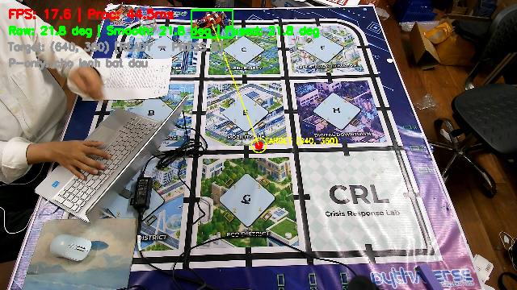

**Đồ thị quỹ đạo 2D:**
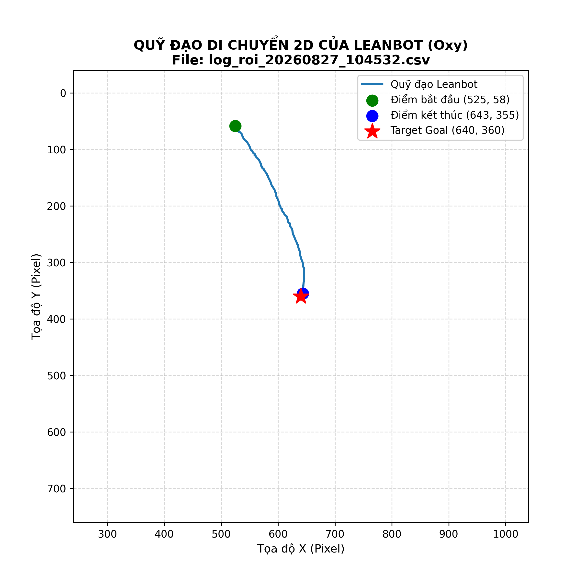

**Đồ thị PID & Góc:**
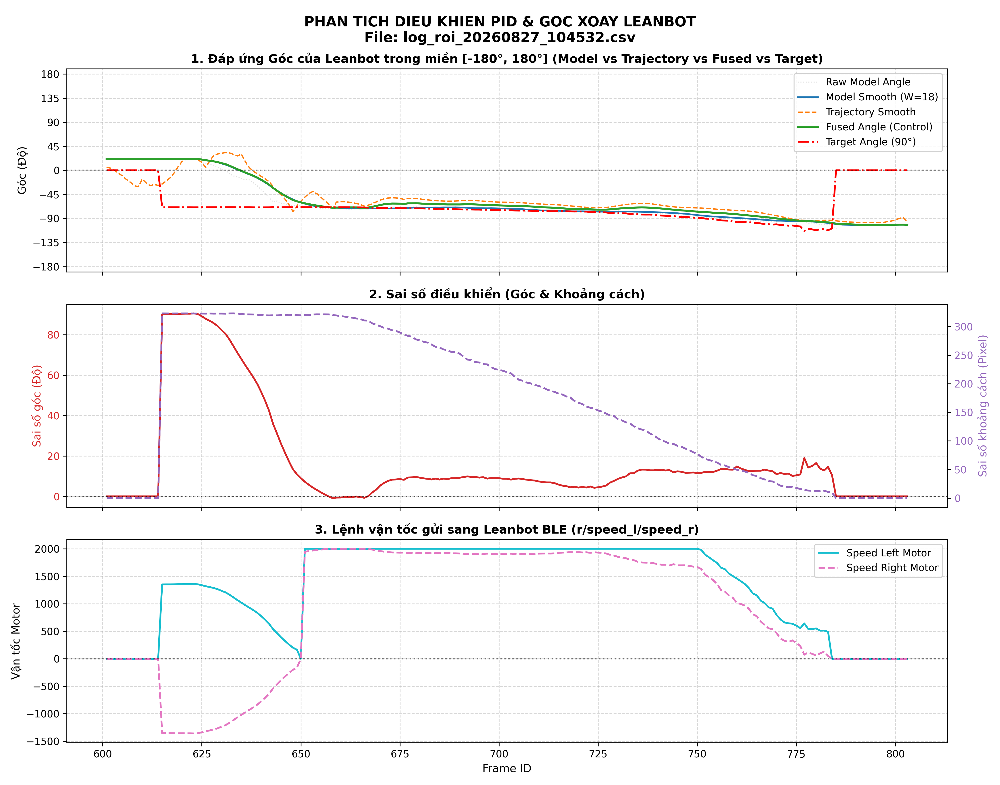

---

##### Trường hợp 2 (Log: 10:45:54)
**Ảnh Detection UI thực tế:**
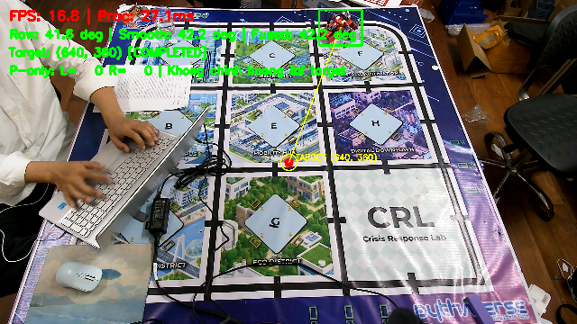

**Đồ thị quỹ đạo 2D:**
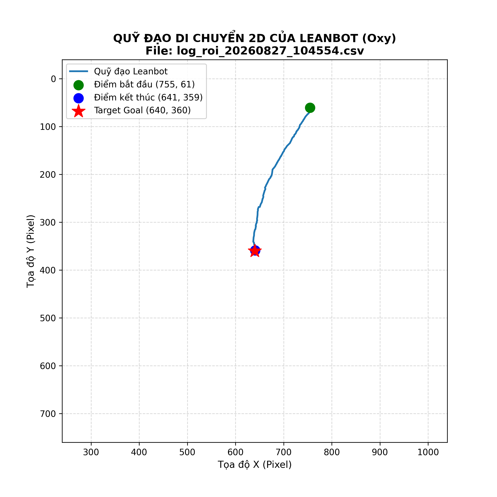

**Đồ thị PID & Góc:**
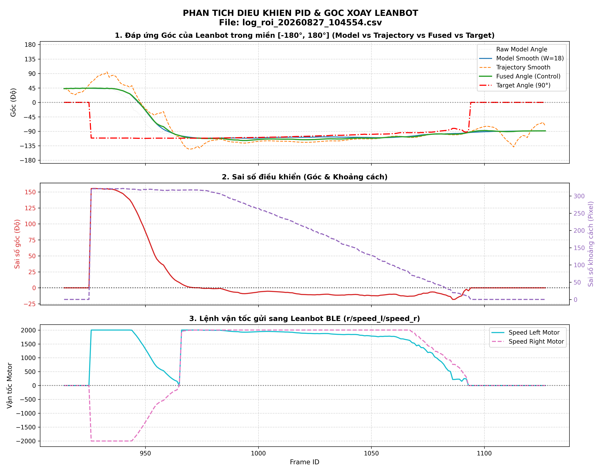

---

##### Trường hợp 3 (Log: 10:46:52)
**Ảnh Detection UI thực tế:**
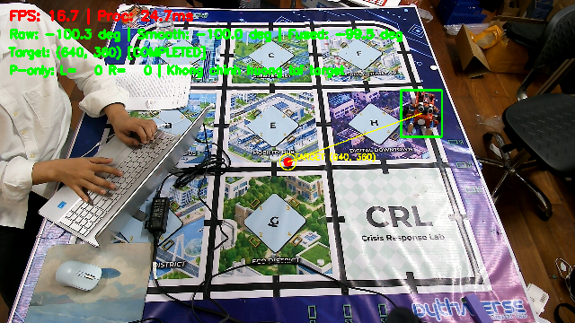

**Đồ thị quỹ đạo 2D:**
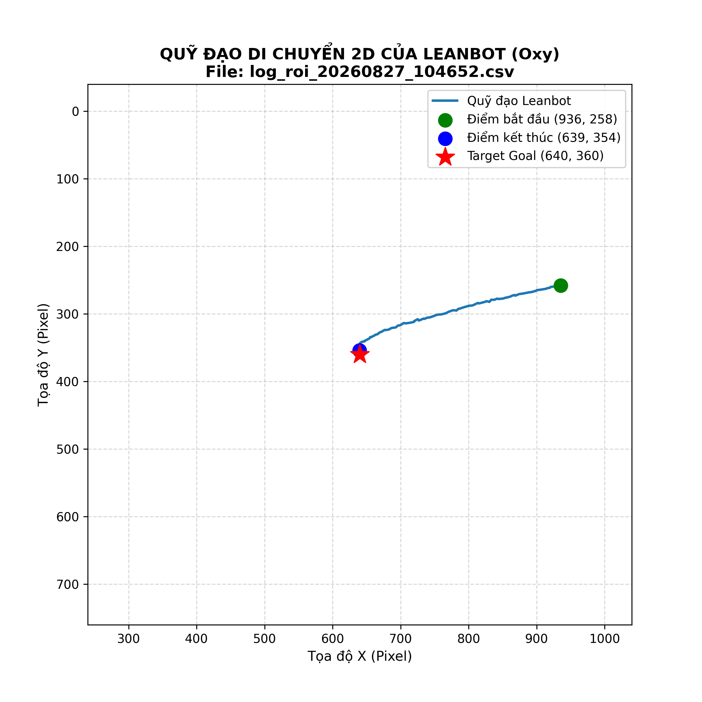

**Đồ thị PID & Góc:**
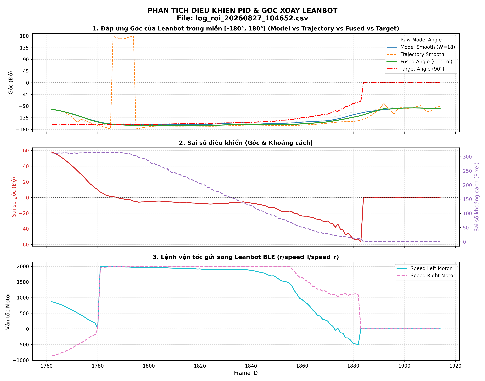

---

##### Trường hợp 4 (Log: 10:48:00)
**Ảnh Detection UI thực tế:**
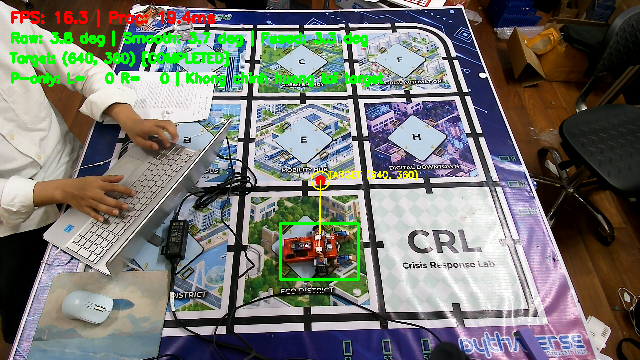

**Đồ thị quỹ đạo 2D:**
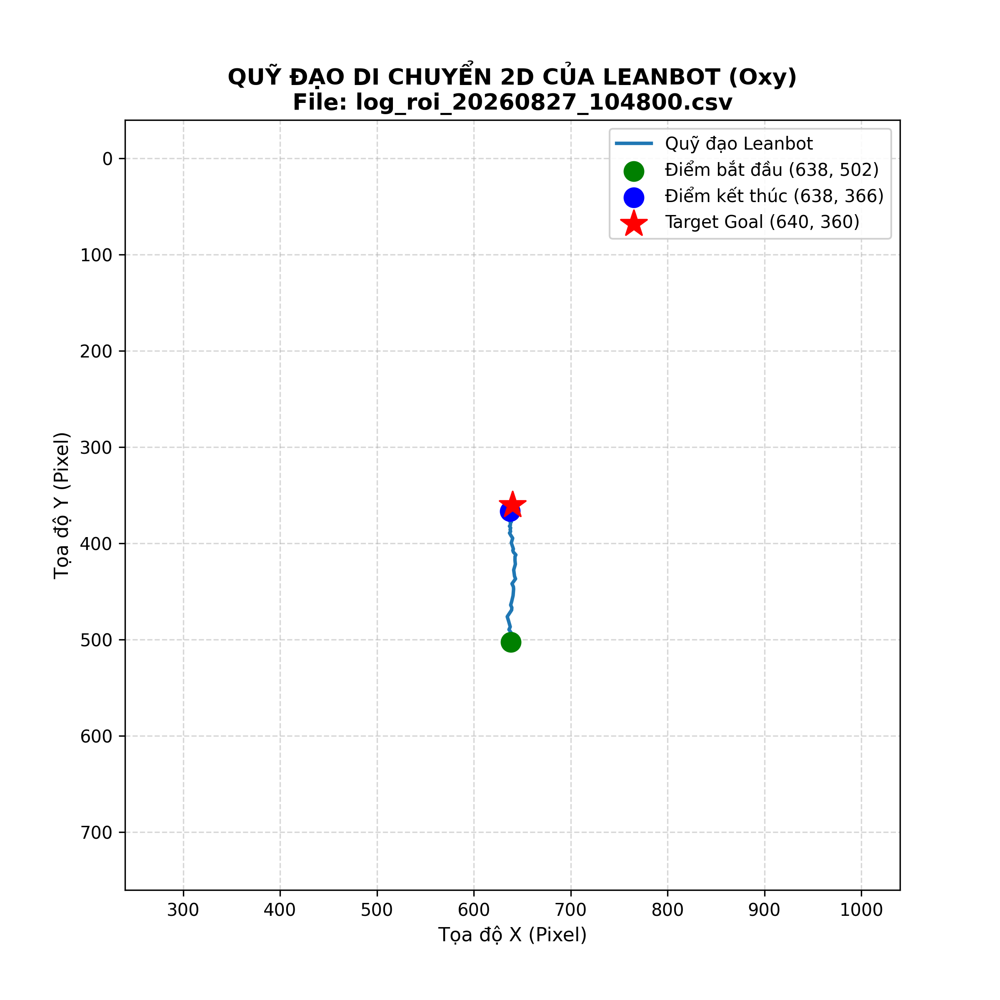

**Đồ thị PID & Góc:**
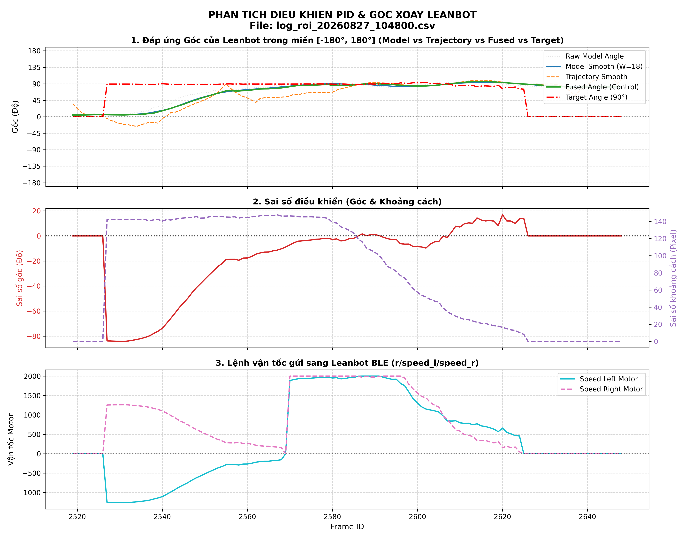

---

##### Trường hợp 5 (Log: 10:48:18)
**Ảnh Detection UI thực tế:**
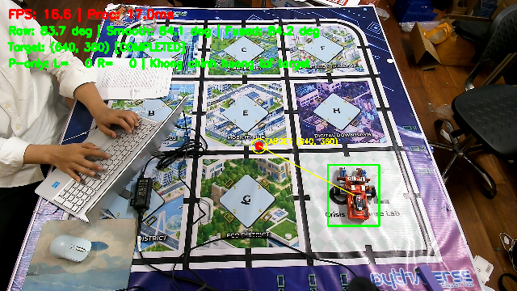

**Đồ thị quỹ đạo 2D:**
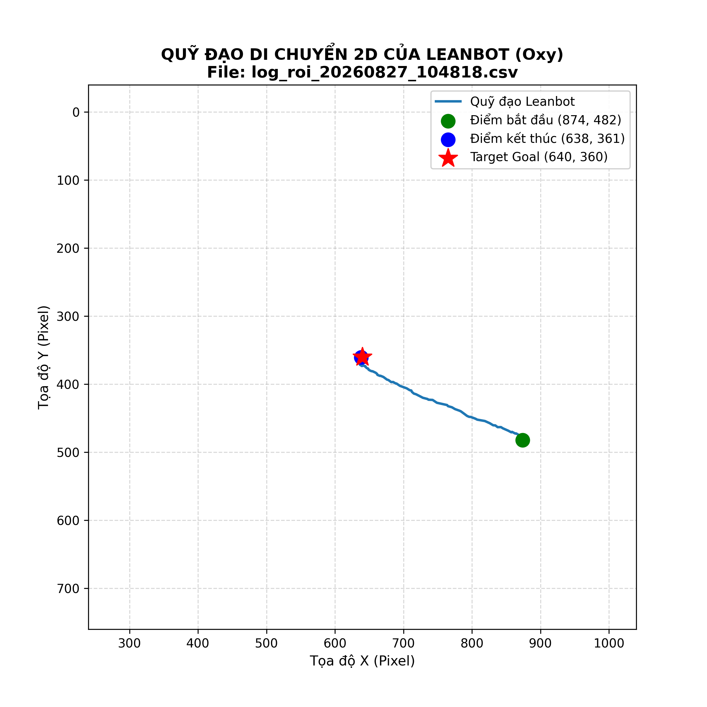

**Đồ thị PID & Góc:**
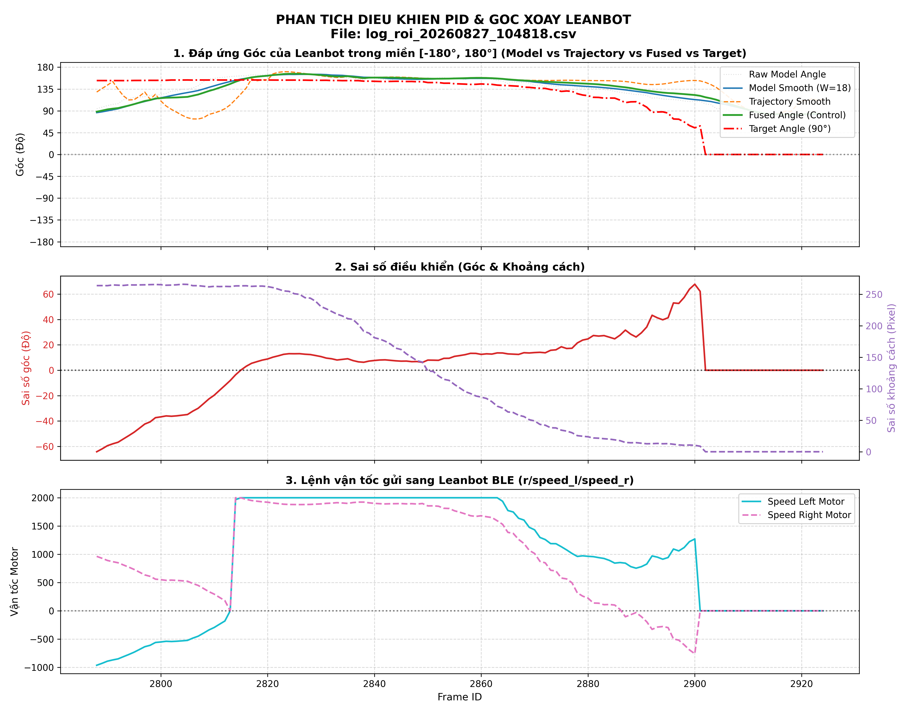


## B. Khó khăn
- Không

## C. Công việc tiếp theo
- Em xin phép nhận hướng đi tiếp theo từ Thầy ạ .
