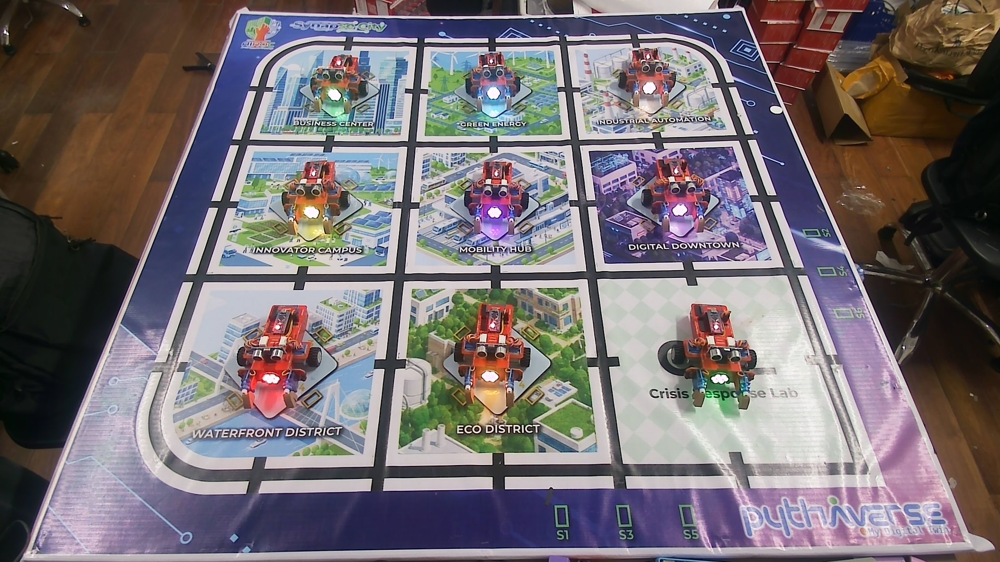
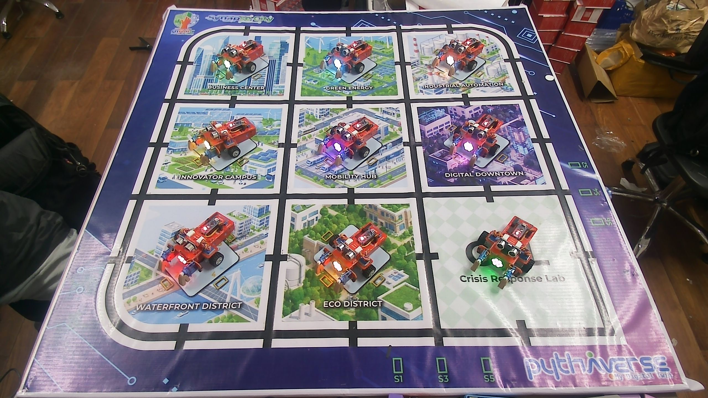
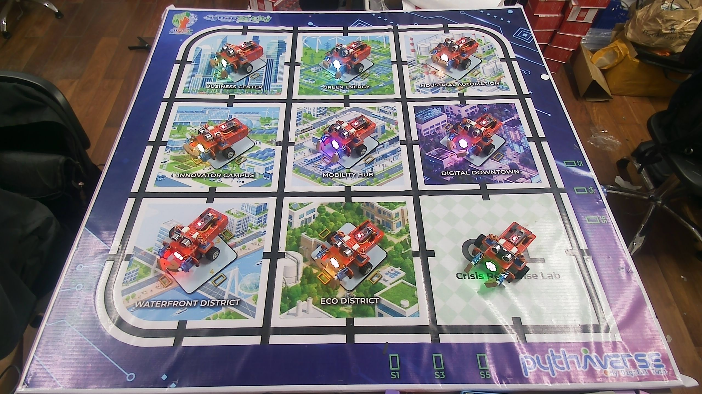
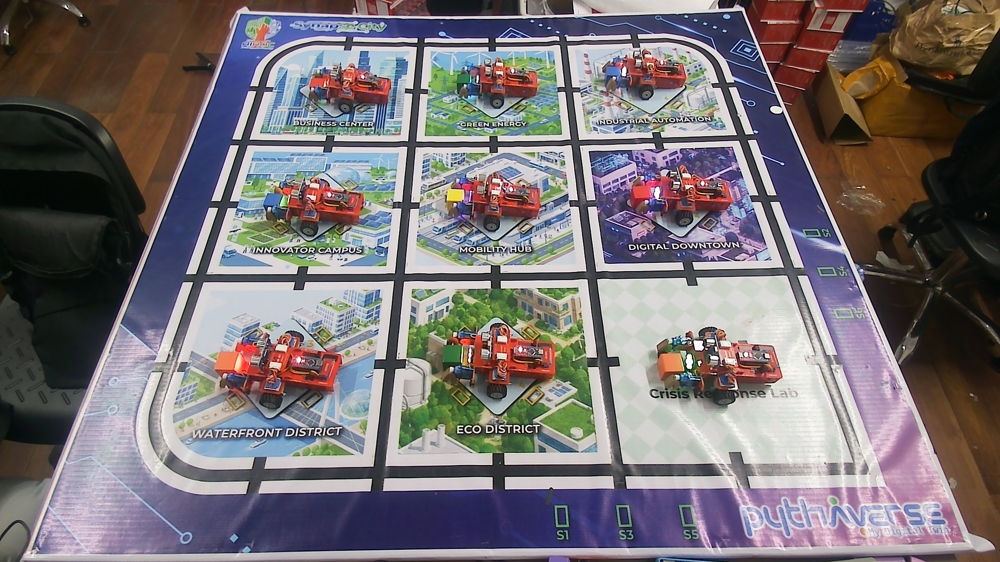
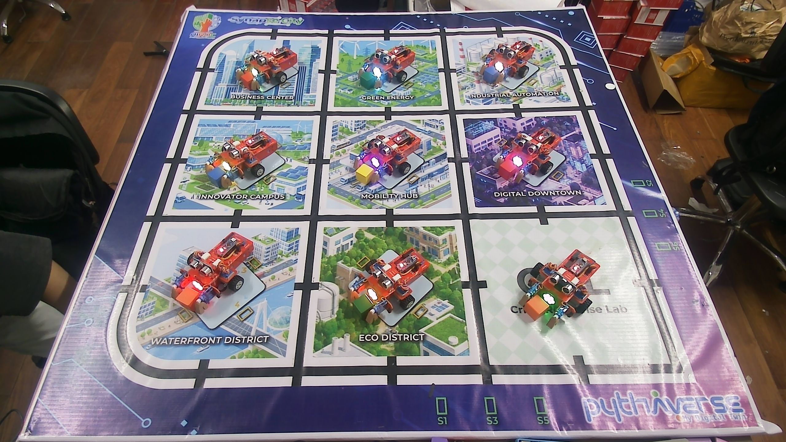

# Báo cáo công việc ngày 09/09/2026 

## A. Công việc đã làm 
- Thu thập mẫu một vài ảnh 

### 1. Ảnh mẫu thu thập 
- 9 Leanbot bật lead RGB ngẫu nhiên 
- Góc tay gripper đa dạng 

#### 1.1 Leanbot với các màu đa dạng 

> Setup các class từ góc m45 -> m135 độ để nhìn thấy được sự khác biệt giữa có đèn và không có đèn

#### 1.2 Leanbot với các tay gắp ngẫu nhiên 

> Tay gắp leanbot ngẫu nhiên , ảnh thu thập trên toàn bộ 24 class 

#### 1.3 Leanbot với các khối gỗ 3cm 

> Thu thập ảnh toàn bộ 24 class, khối gỗ đặt trước leanbot, bên trong tay gắp. 

## B. Khó khăn 
- Không

## C. Công việc tiếp theo 
- Tìm hiểu về thêm về kĩ thuật làm mịn  *filter noisy differential data in a PID controller*
- Thu thập thêm dữ liệu ảnh để trainning 
