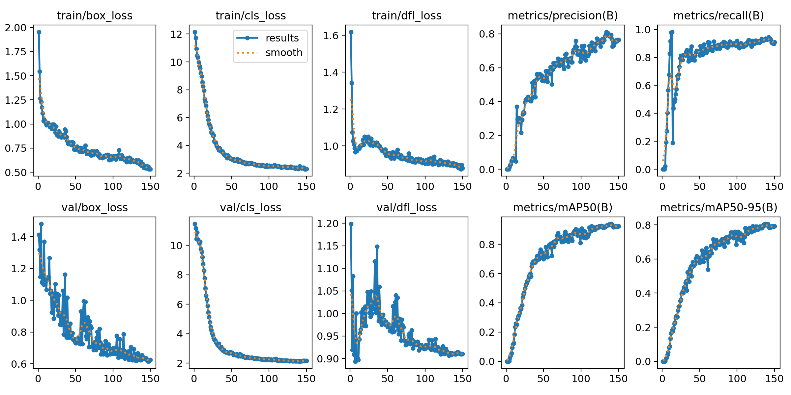
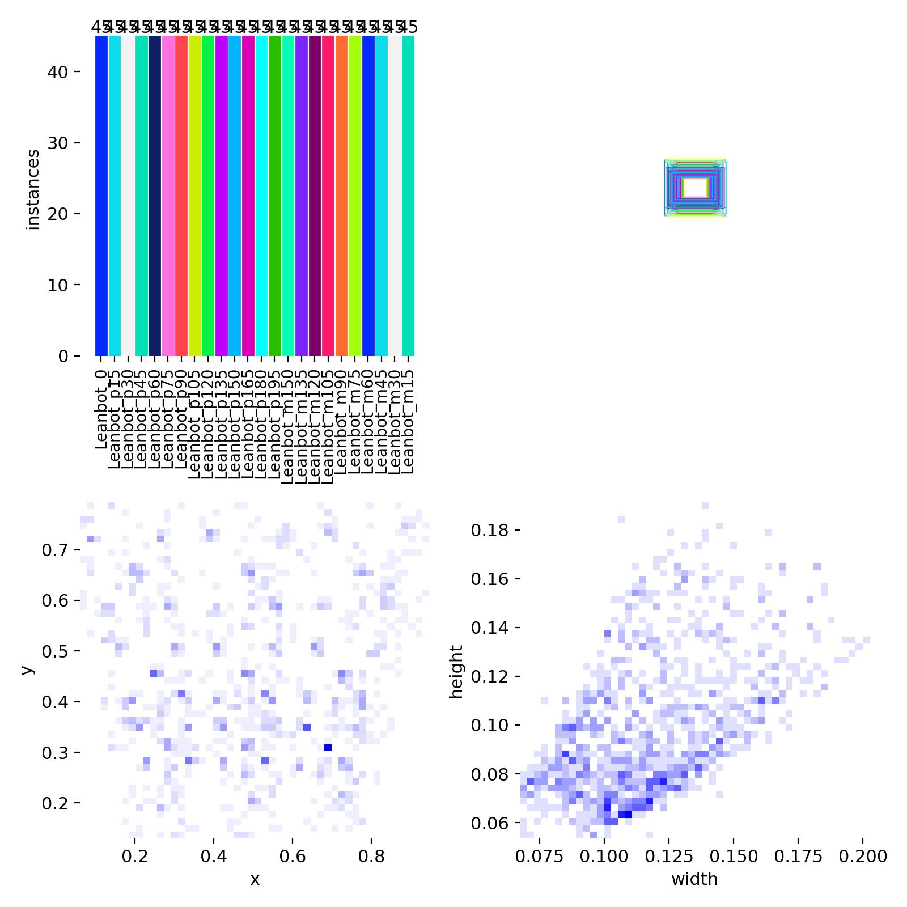
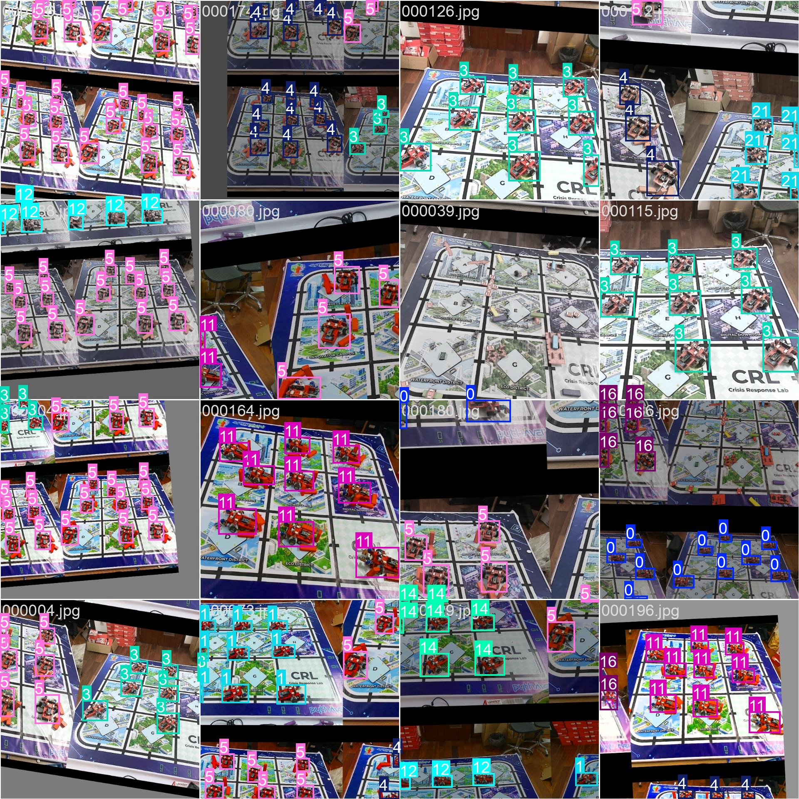
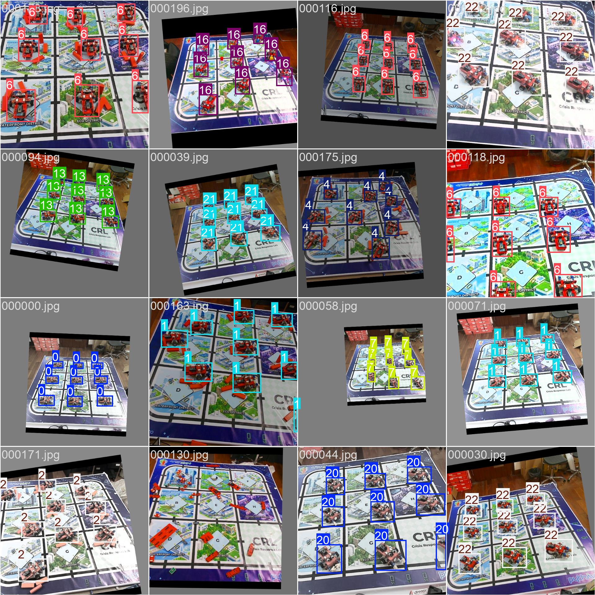
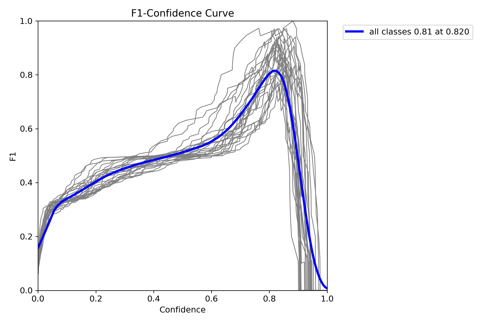
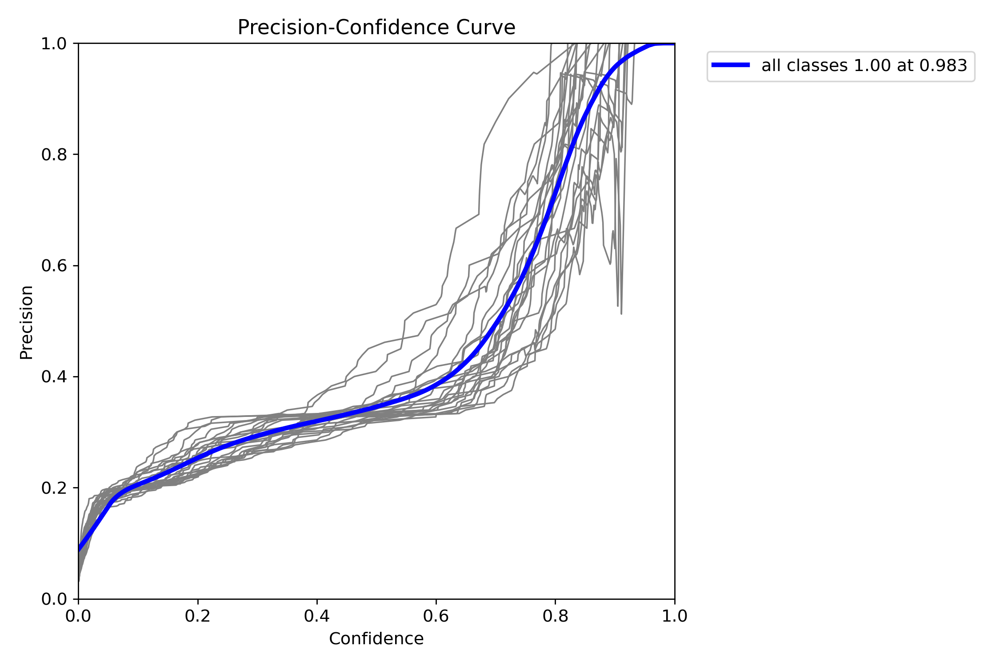
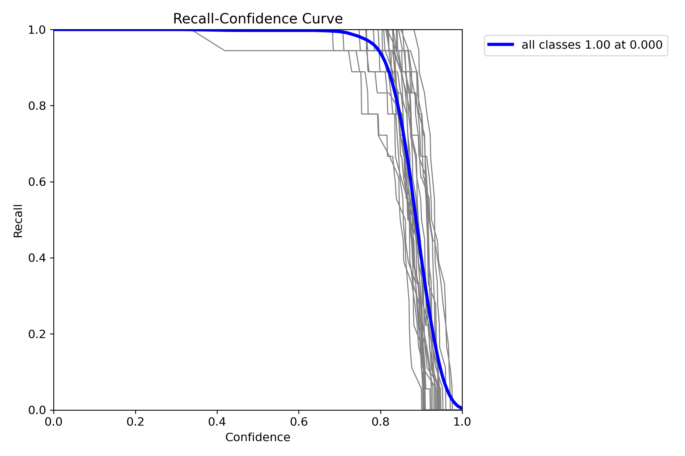
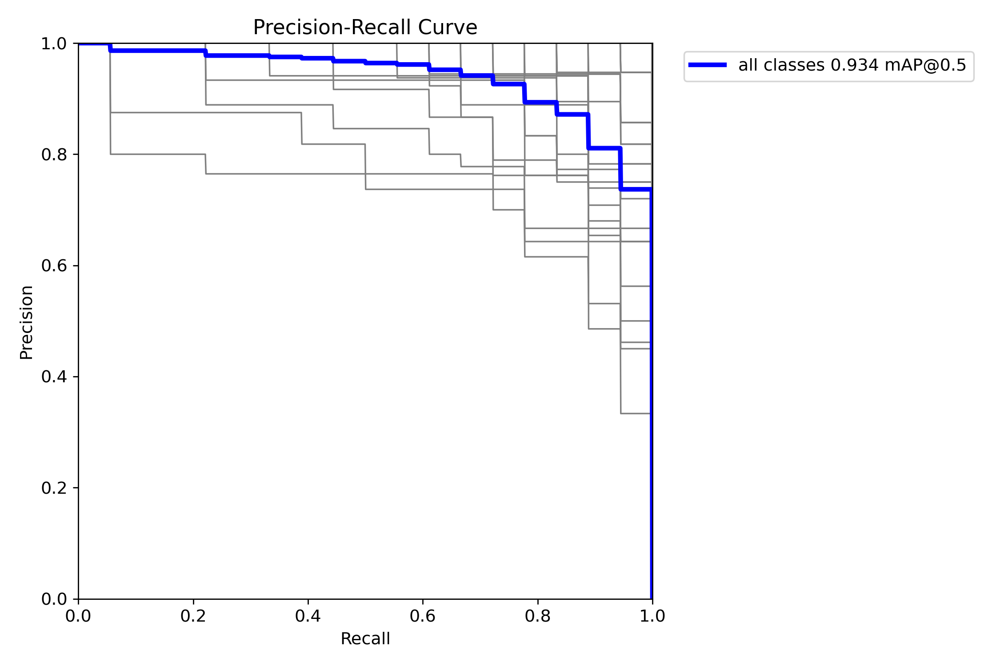
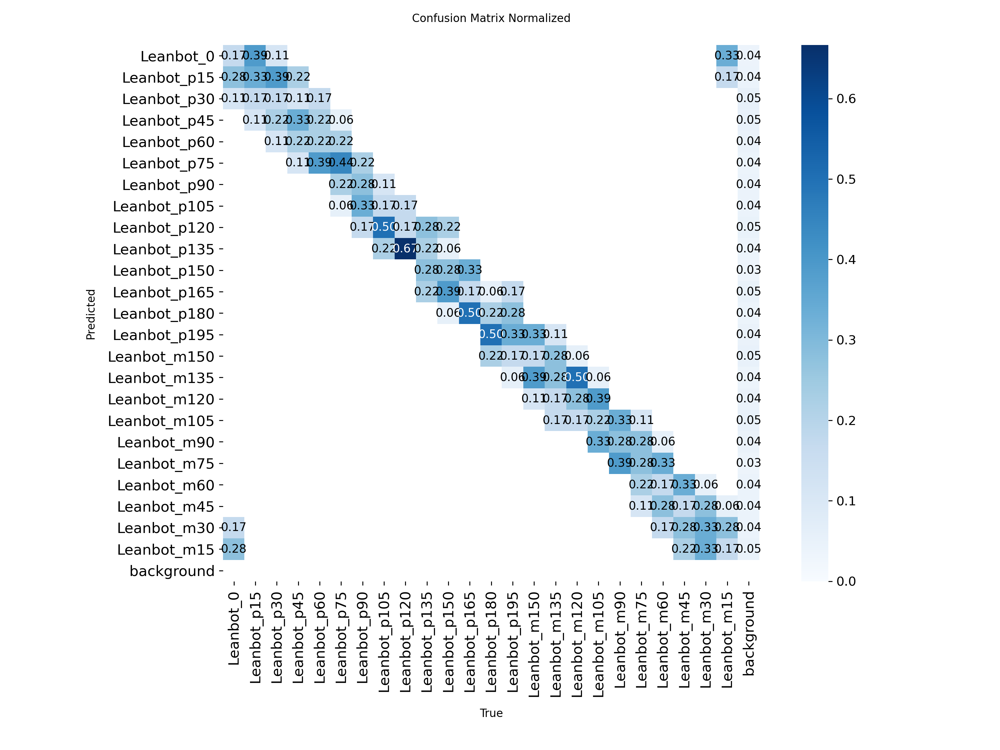
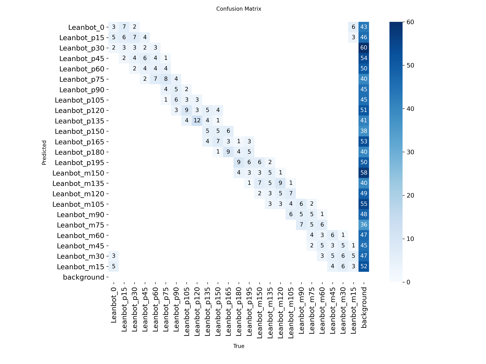

# Báo cáo công việc ngày 11/09/2026

## Mục lục
- [A. Công việc đã làm](#a-công-việc-đã-làm)
  - [1. Training model với datasets mới](#1-training-model-với-datasets-mới)
    - [1.1. Thông tin dataset](#11-thông-tin-dataset)
    - [1.2. Thông tin training](#12-thông-tin-training)
    - [1.3. Kết quả training](#13-kết-quả-training)
    - [1.4. Đánh giá & Nhận xét kết quả](#14-đánh-giá--nhận-xét-kết-quả)
- [B. Khó khăn](#b-khó-khăn)
- [C. Công việc tiếp theo](#c-công-việc-tiếp-theo)

## A. Công việc đã làm 
- Trainning lại model với datasets mới 

### 1. Training model với datasets mới 

#### 1.1. Thông tin dataset

- Sử dụng dataset **204 ảnh** đã được chuẩn hóa và hợp nhất tại thư mục: [`datasets/`](./datasets/).

| Thành phần | Số lượng | Ghi chú |
| :--- | ---: | :--- |
| Ảnh Leanbot gốc (`original_120`) | `120` ảnh | `24` class, `5` ảnh/class, không có vật cản |
| Ảnh Leanbot có vật cản đỏ (`new_red_obstacle_48`) | `48` ảnh | `24` class, `2` ảnh/class, có các khối hộp đỏ |
| Ảnh Leanbot mới bổ sung (`new_setup_24class_260911`) | `24` ảnh | `24` class, `1` ảnh/class (bật Led RGB, gripper xoay, kẹp khối gỗ 3cm) |
| Ảnh background negative (`background_negative_12`) | `12` ảnh | Nền sa bàn trống không có Leanbot, label rỗng |
| **Tổng dataset** | **`204` ảnh** | **`192` ảnh có Leanbot và `12` ảnh background (Tổng `1.728` bounding box)** |

Dataset được phân chia đều theo từng class nhằm đảm bảo tính cân bằng dữ liệu giữa các tập:

| Tập dữ liệu | Số ảnh | Tỷ lệ thực tế |
| :--- | ---: | ---: |
| Train | `128` | `62.75%` |
| Validation | `51` | `25.00%` |
| Test | `25` | `12.25%` |

- Mỗi class góc Leanbot có `8` ảnh được chia thành: `5` ảnh train, `2` ảnh validation và `1` ảnh test.
- Nhóm nền trống (`empty`) có `12` ảnh được chia thành: `8` ảnh train, `3` ảnh validation và `1` ảnh test.
- Mỗi class trong tổng dataset đều có chính xác **72 bounding box**, tạo nên độ cân bằng phân bố tuyệt đối ($24 \times 72 = 1.728$).

#### 1.2. Thông tin training

Model được huấn luyện bằng kiến trúc **YOLO11 Nano** (`yolo11n.pt`) trên môi trường Google Colab GPU:

| Thông tin | Giá trị thực tế |
| :--- | :--- |
| Model nền tảng | `yolo11n.pt` - YOLO11 Nano, pretrained |
| Task | Object Detection kết hợp phân loại hướng Leanbot |
| Số class | `24`, mỗi class góc quay cách nhau `15°` |
| Tổng dataset | `204` ảnh: `192` ảnh có Leanbot (`1.728` bboxes) và `12` ảnh background negative |
| Dataset split | `128` ảnh train, `51` ảnh validation, `25` ảnh test |
| Số epoch | `150` |
| Batch size | `16` |
| Image size | `640 x 640` |
| Optimizer | `auto` |
| Learning rate | `lr0=0.01`, `lrf=0.01` |
| Momentum / weight decay | `0.937` / `0.0005` |
| Warmup | `3` epochs |
| Augmentation chính | `degrees=10.0`, `translate=0.1`, `scale=0.5`, `mosaic=1.0` |
| Flip augmentation | `fliplr=0.0`, `flipud=0.0` (tắt lật để bảo toàn nhãn hướng góc) |
| Close mosaic | Tắt mosaic trong `10` epoch cuối (`close_mosaic=10`) |
| Mixed precision | `amp=true` |
| Seed / deterministic | `seed=0`, `deterministic=true` |
| Môi trường | Google Colab, GPU `device=0` |
| Thời gian training | `439.298 s`, tương đương khoảng `7 phút 19 giây` |
| Output | [`leanbot_colab/`](./leanbot_colab/) |
| Best model | [`leanbot_colab/weights/best.pt`](./leanbot_colab/weights/best.pt) |
| Last model | [`leanbot_colab/weights/last.pt`](./leanbot_colab/weights/last.pt) |

Các file kết quả chính được lưu trữ đầy đủ trong thư mục [`leanbot_colab/`](./leanbot_colab/):
- [`args.yaml`](leanbot_colab/args.yaml): Toàn bộ cấu hình training thực tế.
- [`results.csv`](leanbot_colab/results.csv): Diễn biến loss và metric chi tiết qua `150` epoch.
- [`results.png`](leanbot_colab/results.png): Biểu đồ tổng hợp quá trình huấn luyện.
- [`confusion_matrix.png`](leanbot_colab/confusion_matrix.png) và [`confusion_matrix_normalized.png`](leanbot_colab/confusion_matrix_normalized.png): Ma trận nhầm lẫn.
- [`BoxP_curve.png`](leanbot_colab/BoxP_curve.png), [`BoxR_curve.png`](leanbot_colab/BoxR_curve.png), [`BoxF1_curve.png`](leanbot_colab/BoxF1_curve.png), [`BoxPR_curve.png`](leanbot_colab/BoxPR_curve.png): Các đường cong đánh giá theo confidence.
- [`labels.jpg`](leanbot_colab/labels.jpg), [`train_batch0.jpg`](leanbot_colab/train_batch0.jpg), [`train_batch1122.jpg`](leanbot_colab/train_batch1122.jpg): Phân bố dữ liệu và kiểm tra augmentation.
- [`val_batch0_labels.jpg`](leanbot_colab/val_batch0_labels.jpg), [`val_batch0_pred.jpg`](leanbot_colab/val_batch0_pred.jpg), [`val_batch1_labels.jpg`](leanbot_colab/val_batch1_labels.jpg), [`val_batch1_pred.jpg`](leanbot_colab/val_batch1_pred.jpg): So sánh đối chiếu nhãn ground truth với kết quả dự đoán của model.

#### 1.3. Kết quả training

##### Bảng chỉ số tối ưu

| Metric | Giá trị tốt nhất | Tại Epoch | Giá trị Epoch cuối (150) |
| :--- | :---: | :---: | :---: |
| **mAP50** | **`0.9398` (93.98%)** | Epoch 140 | `0.9245` (92.45%) |
| **mAP50-95** | **`0.8061` (80.61%)** | Epoch 137 | `0.7920` (79.20%) |
| **Precision** | **`0.7943` (79.43%)** | Epoch 140 | `0.7636` (76.36%) |
| **Recall** | **`0.9286` (92.86%)** | Epoch 140 | `0.9088` (90.88%) |
| **Train Loss** | - | - | `box: 0.5326`, `cls: 2.3283`, `dfl: 0.8780` |
| **Validation Loss** | - | - | `box: 0.6260`, `cls: 2.1535`, `dfl: 0.9103` |

##### Biểu đồ tổng hợp quá trình training

##### Phân bố label và dữ liệu augmentation

Ảnh batch ở giai đoạn đầu, khi mosaic và augmentation còn hoạt động:

Ảnh batch gần cuối quá trình training, khi mosaic đã được tắt bởi `close_mosaic=10`:

##### Precision, Recall, F1 và PR curve

##### Ma trận nhầm lẫn

Ma trận chuẩn hóa:

Ma trận đếm số lượng:

#### 1.4. Đánh giá & Nhận xét kết quả

1. **Hiệu năng detection và recognition**:
   - Model YOLO11n đạt độ chính xác cao với **mAP50 đạt 93.98%** và **mAP50-95 đạt 80.61%**.
   - Khả năng bao quát (Recall) đạt **92.86%**, cho thấy mô hình phát hiện gần như toàn bộ các Leanbot xuất hiện trong khung hình mà không bị sót.

2. **Khả năng phân biệt góc quay tốt và liên hệ các góc với nhau tốt**:
   - Dựa trên ma trận nhầm lẫn chuẩn hóa (`confusion_matrix_normalized.png`), so sánh trực quan giữa mô hình ngày 28/07/2026 (mô hình YOLO11n được sử dụng xuyên suốt cho toàn bộ quá trình inference thực nghiệm đến hiện tại) và mô hình YOLO11n vừa được huấn luyện lại : 

| Mô hình ngày 28/07/2026 (YOLO11n - Đang dùng inference) | Mô hình ngày 11/09/2026 (YOLO11n - Mới huấn luyện) |
| :---: | :---: |
|  |  |

   - **Phân tích so sánh**:
     - **Mô hình ngày 28/07/2026 (YOLO11n)**: Đây là mô hình đã được export OpenVINO FP16 và phục vụ cho tất cả các bài thử nghiệm tracking ROI, bám quỹ đạo và PID từ trước tới hiện tại ạ.
     - ma trận nhầm lẫn trên tập validation của bản này vẫn bị phân tán nhiều điểm ra xa đường chéo chính, như báo cáo hôm đó em cũng có báo cáo với Thầy là em cũng khôgn rõ nguyên nhân ạ , nhưng từ đó tới giờ thì mô hình vẫn chạy inference được ạ. 

     - **Mô hình hôm nay này 11/09/2026 (YOLO11n) mới train lại**: Với Dataset được mở rộng lên 204 ảnh, có đa dạng điều kiện sa bàn, leanbot, led RGB,... , ma trận nhầm lẫn hình thành một **đường chéo chính và tập trung**. Các điểm nhầm lẫn chỉ xuất hiện cục bộ ở các góc liền kề 15 độ, chứng minh mô hình hiểu được mối liên hệ không gian góc liên tục và giữ được vòng khép kín liên tục từ 0 đến 340 độ 

## B. Khó khăn 
- Không

## C. Công việc tiếp theo 
- Em có cần triển khai export OpneVino FP16 model mới này và chạy inference luôn không ạ ? 
- Em xin phép nhận hướng đi tiếp theo từ thầy ạ.