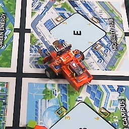
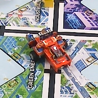
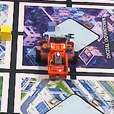
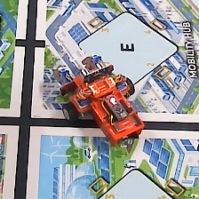
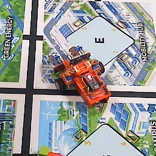
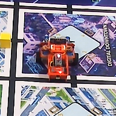
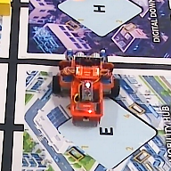
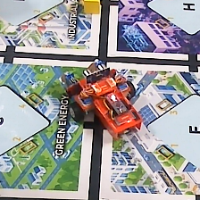
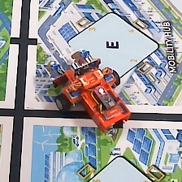
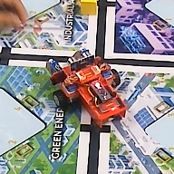

# Báo cáo công việc ngày 16/09/2026

## A. Công việc đã làm
- Triển khai thêm Phase 3 và Phase 4 vào `PID_controller.py` và `leanbotCameraController.py`
- Bổ sung code vẽ đồ thị để phân tích quỹ đạo và đánh giá sai số heading Phase 4

---

### 1. Triển khai thêm Phase 3 và Phase 4

#### 1.1 Phase 3 – Căn chỉnh góc hướng cuối cùng (`PHASE_3_FINAL_ALIGNING`)
Sau khi Leanbot đã đến đích (Phase 2 hoàn thành), Phase 3 thực hiện xoay tại chỗ để căn chỉnh đúng góc hướng mong muốn `target_heading` — là tư thế dừng cuối cùng.

- **Code bổ sung:** [`PID_controller.py`](LeanbotTinyRC/PID_controller.py)
  ```python
  # Phase 3: spin in place, reuse Phase 1 PID gains (Kp_angle, Ki_angle, Kd_angle)
  if self.phase == self.PHASE_FINAL_ALIGNING:
      final_angle_error = wrap_to_180(current_angle - target_h)
      if abs(final_angle_error) <= self.heading_tolerance3:
          if self._within_tolerance_since is None:
              self._within_tolerance_since = current_time
          elapsed_ms = (current_time - self._within_tolerance_since) * 1000.0
          if elapsed_ms >= self.settle_time_ms:
              # Chuyển sang Phase 4 (nếu bật) hoặc COMPLETED
              ...
      else:
          self._within_tolerance_since = None  
      v_lr   = 0.0  
      v_diff = Kp_angle * err + Ki_angle * integral + Kd_angle * d_err
      ...
  ```

- **Cấu hình PID sử dụng:** Tái sử dụng bộ PID góc của Phase 1 (`Kp_angle`, `Ki_angle`, `Kd_angle`) — cùng mục tiêu căn góc, chỉ khác điểm tham chiếu (Phase 1: căn về hướng tới đích, Phase 3: căn về `target_heading` cố định).
- **Các argument đầu vào:**

 | Argument | Kiểu | Mặc định | Mô tả |
 |---|---|---|---|
 | `--target-heading` | `float` | `None` | **Góc hướng mong muốn cuối cùng (°)**. Nếu không truyền, Phase 3 bị bỏ qua. |
 | `--heading-tol3` | `float` | `10.0` | Dải sai số chấp nhận ở Phase 3 (°), hẹp hơn Phase 1 |
 | `--settle-time-ms` | `float` | `200.0` | Thời gian giữ ổn định tối thiểu (ms) trước khi complete |
 | `--kp-angle` | `float` | `30.0` | Kp Phase 1 |
 | `--kd-angle` | `float` | `0.0` | Kd Phase 1 |


---


#### 1.2 Phase 4 – Tiến/Lùi thẳng (`PHASE_4_FORWARD` / `PHASE_4_BACKWARD`)
Ngay sau khi Phase 3 ổn định xong, Leanbot thực hiện đi **tiến thẳng** trong `fwd_bwd_time_s` giây, sau đó **lùi thẳng** trong `fwd_bwd_time_s` giây cùng vận tốc cố định `fwd_bwd_speed`. Dữ liệu quỹ đạo tiến/lùi này được ghi log và dùng để **fit bậc 1** tính ra heading thực tế, sau đó so sánh với `target_heading` đã truyền vào ở Phase 3.

- **Code bổ sung:** [`PID_controller.py`](LeanbotTinyRC/PID_controller.py)

  ```python
  # Phase 4A: FORWARD – đi tiến fwd_bwd_time_s giây
  if self.phase == self.PHASE_FORWARD:
      elapsed_fwd = current_time - self._fwd_start_time
      if elapsed_fwd >= self.fwd_bwd_time_s:
          self.phase = self.PHASE_BACKWARD
          self._bwd_start_time = current_time
          ...
      speed = self.fwd_bwd_speed  # 2 bánh cùng vận tốc, đi thẳng

  # Phase 4B: BACKWARD – đi lùi fwd_bwd_time_s giây
  if self.phase == self.PHASE_BACKWARD:
      elapsed_bwd = current_time - self._bwd_start_time
      if elapsed_bwd >= self.fwd_bwd_time_s:
          self.phase = self.PHASE_COMPLETED
          ...
      speed = -self.fwd_bwd_speed
  ```

- **Cấu hình PID sử dụng:** Phase 4 — tốc độ 2 bánh bằng nhau và cố định (`fwd_bwd_speed`), điều hướng là đi thẳng thuần túy.

- **Các argument đầu vào:**

 | Argument | Kiểu | Mặc định | Mô tả |
 |---|---|---|---|
 | `--fwd-bwd-time` | `float` | `10.0` | Thời gian tiến (và lùi) tính bằng giây. Đặt `0` để tắt Phase 4. |
 | `--fwd-bwd-speed` | `int` | `1000` | Vận tốc bánh xe trong Phase 4 (đơn vị `runLR`) |

- **Lệnh chạy thực tế (PowerShell):**
- **Lệnh chạy thực tế (PowerShell):**

  ```powershell
  python leanbotCameraController.py `
    --kp-angle 30 `
    --target-heading 135 `
    --heading-tol3 5 `
    --settle-time-ms 500 `
    --fwd-bwd-time 10 `
    --fwd-bwd-speed 1000 `
    --full-model ..\models\yolo11n_latest_version\best_fp16_no_nms_imgsz640_openvino_model `
    --tracking-model ..\models\yolo11n_latest_version\best_fp16_no_nms_imgsz160_openvino_model `
    --show --source 1 `
    --ble 343944
  ```
---

### 2. Thực nghiệm thực tế và đánh giá

Cấu hình chạy thực nghiệm chung:

| Tham số | Giá trị |
|---|---|
| `--kp-angle` | `30.0` |
| `--heading-tol3` | `5.0°` |
| `--settle-time-ms` | `500 ms` |
| `--fwd-bwd-time` | `10 s` |
| `--fwd-bwd-speed` | `1000 runLR` |
| Model | `yolo11n_latest_version` |
| Leanbot BLE | `343944` |

#### 2.1 Tổng hợp kết quả

| # | Log | `--target-heading` | Thời gian | Ph1 | Ph2 | Ph3 | Ph4 FWD | Ph4 BWD | Heading Fit (θ_traj) | Sai số \|Δθ\| | Lost Tracking |
|---|---|---|---|---|---|---|---|---|---|---|---|
| 1 | `152558` | **90°** | 39.8s | 33f | 170f | 94f | 144f | 145f | 91.9° | **1.9°** | 11f |
| 2 | `152648` | **90°** | 32.7s | 36f | 116f | 36f | 147f | 149f | 90.1° | **0.1°** | 8f |
| 3 | `152824` | **135°** | 57.5s | 36f | 133f | **305f** | 149f | 151f | 136.6° | **1.6°** | 57f |
| 4 | `153439` | **0°** | 38.1s | 40f | 175f | 57f | 149f | 151f | 1.5° | **1.5°** | 1f |
| 5 | `153523` | **0°** | 34.4s | 40f | 145f | 33f | 151f | 149f | 2.4° | **2.4°** | 0f |
| 6 | `153706` | **-90°** | 35.0s | 36f | 163f | 25f | 151f | 144f | -88.1° | **1.9°** | 4f |

> **Nhận xét:**
> - Tất cả 6 lần chạy hoàn chỉnh đều có sai số heading fit **dưới 2.4°**
> - Lần 3 (`152824`, target 135°): Phase 3 mất **305 frame (~20s)** không rõ nguyên nhân .
---


#### 2.2 Kết quả từng lần chạy

**Lần 1 — `log_roi_20260916_152558` | `--target-heading 90°` | θ_traj = 91.9° | |Δθ| = 1.9° **


---

**Lần 2 — `log_roi_20260916_152648` | `--target-heading 90°` | θ_traj = 90.1° | |Δθ| = 0.1° **


---

**Lần 3 — `log_roi_20260916_152824` | `--target-heading 135°` | θ_traj = 136.6° | |Δθ| = 1.6° |  Phase 3 lâu (305f), lost tracking nhiều (57f)**


---

**Lần 4 — `log_roi_20260916_153439` | `--target-heading 0°` | θ_traj = 1.5° | |Δθ| = 1.5° **


---

**Lần 5 — `log_roi_20260916_153523` | `--target-heading 0°` | θ_traj = 2.4° | |Δθ| = 2.4° **


---

**Lần 6 — `log_roi_20260916_153706` | `--target-heading -90°` | θ_traj = -88.1° | |Δθ| = 1.9° **


---

## B. Khó khăn

- **Sai lệch phối cảnh ảnh camera:** Việc dùng fit quỹ đạo trên ảnh để suy ra heading chưa hoàn toàn chính xác để đánh giá, vì camera đặt góc chéo gây ra biến dạng phối cảnh. Leanbot đi thẳng trên thực tế nhưng quỹ đạo trên ảnh sẽ bị xiên nhẹ — đặc biệt khi di chuyển theo chiều dọc ($y(t) \neq 0$), do vùng xa camera hẹp hơn vùng gần camera.


- **Thông số PID Phase 1 không phù hợp cho Phase 3:** Khi tái sử dụng bộ PID góc của Phase 1 cho Phase 3, em thấy Leanbot thường bị lắc qua lại và không ổn định trong nhiều trường hợp test thực tế. 
- **Hiện tượng mất dấu (Lost Tracking) diễn ra thường xuyên:** Trong quá trình inference thời gian thực, hệ thống gặp hiện tượng lost tracking tương đối dày và thường xuyên (thể hiện rõ qua các khoảng ngắt quãng / mất mẫu trên các đồ thị vận tốc và góc). Nguyên nhân có thể do khi xe quay hoặc chuyển hướng nhanh, Leanbot bị lệch ra khỏi biên vùng ROI crop hoặc hiện tượng mờ chuyển động (motion blur) làm giảm điểm tin cậy (confidence) của mô hình.
- Một số trường hợp bị lost tracking được hệ thống tự động ghi lại như sau:

| Trường hợp mất dấu (Lost Tracking) | Trường hợp mất dấu (Lost Tracking) |
| :---: | :---: |
| <br>Frame 1472 (15:29:53) | <br>Frame 1598 (15:30:01) |
| <br>Frame 1719 (15:26:30) | <br>Frame 639 (15:28:56) |
| <br>Frame 617 (15:28:55) | <br>Frame 1653 (15:26:26) |
| <br>Frame 2415 (15:27:17) | <br>Frame 1583 (15:30:00) |
| <br>Frame 1498 (15:29:55) | <br>Frame 1672 (15:30:07) |

> Tất cả các trường hợp lost tracking đề bình thường, không có vật thể nhiễu , chưa rõ nguyên nhân mất tracking Leanbot. 

## C. Công việc tiếp theo
- Em xin phép nhận hướng đi tiếp theo từ Thầy ạ.
