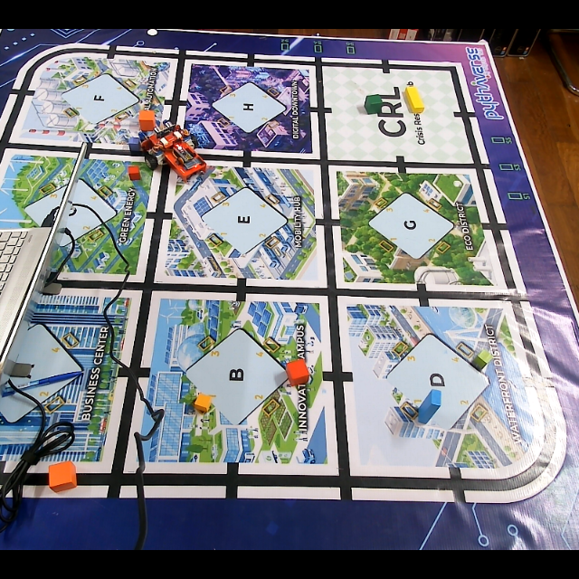
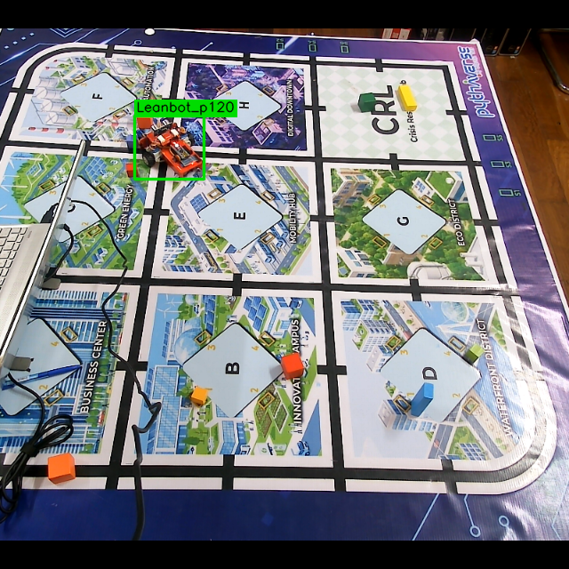
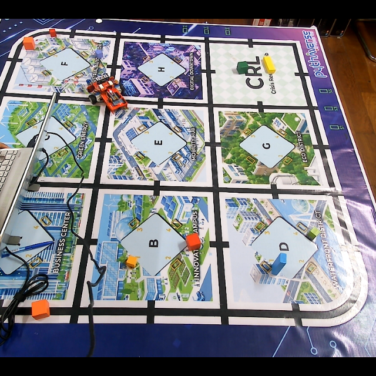
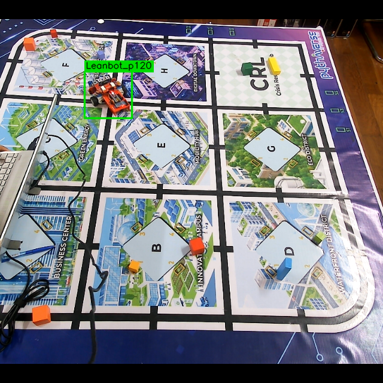
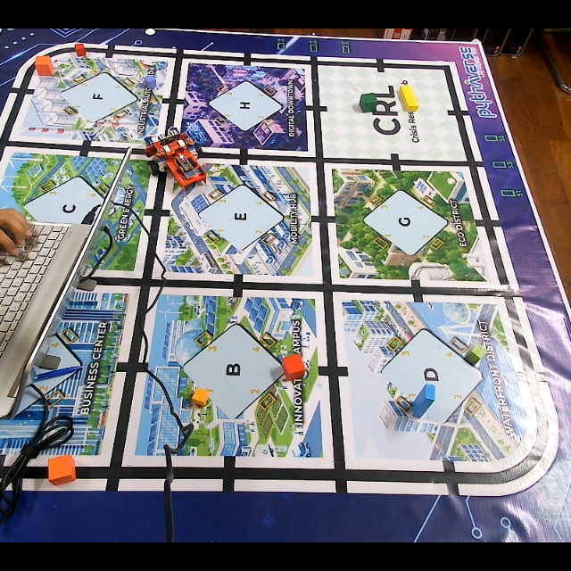
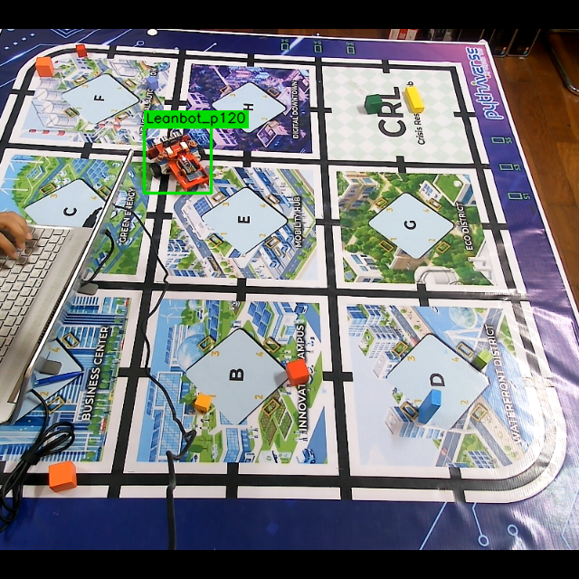
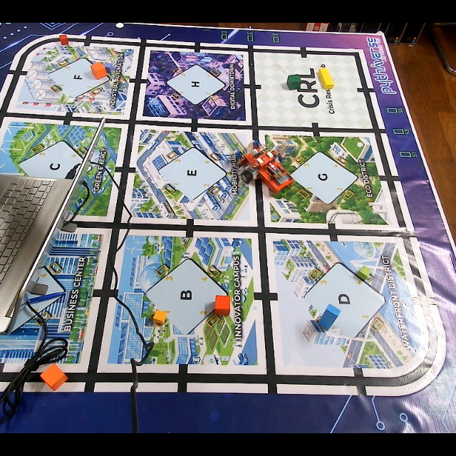
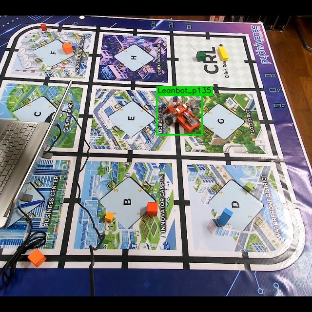

# Báo cáo công việc ngày 23/09/2026
## A. Công việc đã làm 
- Thêm cơ chế tự động thu thập thêm dataset khi lost tracking 
- Gửi tài liệu hướng dẫn anh Thế Anh dùng model mới 

### 1. Thêm cơ chế tự động thu thập thêm sample ảnh khi lost tracking 
- **Code bổ sung**:  [lost_tracking_collector.py](LeanbotTinyRC_AI_PIDControl/lost_tracking_collector.py)  import class  LostTrackingCollector vào [leanbotCameraController.py](LeanbotTinyRC_AI_PIDControl/leanbotCameraController.py).
- **Quy trình hoạt động**: 
    - Khi bấm `t` (Set Target) hoặc `s` (Start PID) thì Leanbot bắt đầu
    - Trong quá trình chuyển động, nếu bị lost tracking (`detected=False`):
        - **Tiền xử lý ảnh**: Frame camera gốc được center-crop tỉ lệ 0.625 chiều rộng, đệm đen 2 bên thành hình vuông và resize về chuẩn $640 \times 640$ (khớp với pipeline dataset train YOLO model).
        - **Gán nhãn kế thừa**: Lấy lại bounding box YOLO chuẩn hóa $[x, y, w, h]$ và class góc từ frame phát hiện thành công gần nhất gán cho ảnh hiện tại.
        - **Lưu trữ hàng đợi nếu lost tracking liên tục**: Lưu bằng `queue.Queue(maxsize=32)` và lưu vào thư mục `../lost_tracking_dataset/session_<timestamp>_<uuid>/` gồm 4 thư mục:
            + `images/`: Ảnh dataset $640 \times 640$.
            + `labels/`: File txt nhãn YOLO bao gồm tọa độ BBOX và class góc.
            + `metadata/`: File JSON thông tin nguồn gốc frame 
            + `check_labels/`: Ảnh trực quan hóa vẽ bbox xanh lá để kiểm tra nhãn nhanh.

- Khi chạy thực tế thì một số trường hợp lost tracking thu được như sau : 

| Ảnh Dataset (640x640) | Ảnh Label Debug Checking |
| :---: | :---: |
|  |  |
|  |  |
|  |  |
|  |  |

### 2. Hướng dẫn anh Thế Anh chạy lại toàn bộ Inference trên Model mới . 
- Link repo tổng hợp lại toàn bộ dự án mới nhất hiện tại :  [https://github.com/HoangAnh301194/Leanbot-Visual-Heading-Estimation-YOLO](https://github.com/HoangAnh301194/Leanbot-Visual-Heading-Estimation-YOLO)
- Link readme hướng dẫn sử dụng : [https://github.com/HoangAnh301194/Leanbot-Visual-Heading-Estimation-YOLO/blob/main/README.md](https://github.com/HoangAnh301194/Leanbot-Visual-Heading-Estimation-YOLO/blob/main/README.md)

## B. Khó khăn 
- Hiện tại việc lấy lost tracking sẽ khiến lượng ảnh được lấy về liên tục làm cho dataset nhiều ảnh trùng nhau ạ . Khi lost tracking thì Leanbot gần như dừng lại, đi rất chậm nên lượng ảnh lưu về bị spam nhiều ( các ảnh gần nhưu giống hệt nhau) ạ . 
- Em xin phép nhận thêm đề xuất từ Thầy ạ , em có nên giới hạn thời gian chụp ảnh lost tracking mới khôgn ạ ? 
- Hiện tại Cam thu thập dataset anh Thế Anh đang sử dụng ạ, em đang sử dụng Cam thứ 2 nên vị trí đặt sa bàn hơi lệch trái chút ạ. Khi xác định xong phương pháp thu thập thêm dataset cuối cùng em sẽ liên hệ anh Thế Anh đổi sang Cam chính ạ . 
## C. Công việc tiếp theo 
- khảo sát thêm Phase 4 với spin-speed = 50, tìm hệ số Kp ưu tiên các trường hợp Sai số trước bù lớn.
- Giảm bớt thời gian Pha 1, 2 để khảo sát nhanh bằng cách  đặt Leanbot gần và hướng về taret pixel
- Báo cáo thêm thời gian thực hiện Phase 4.  