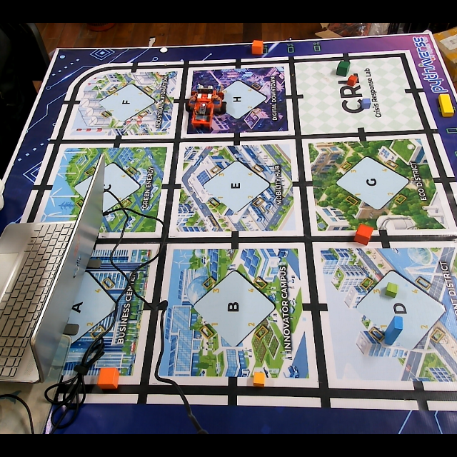
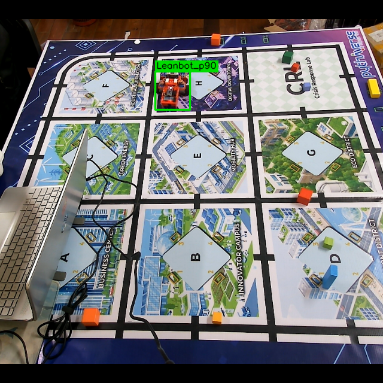
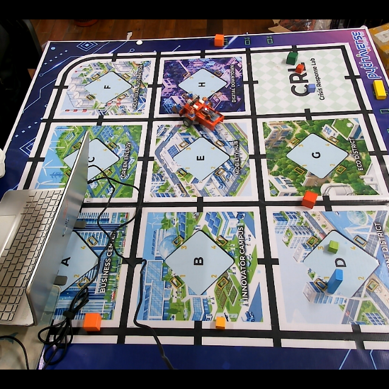
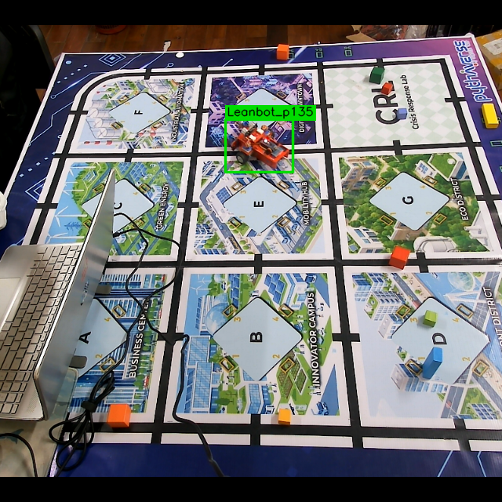
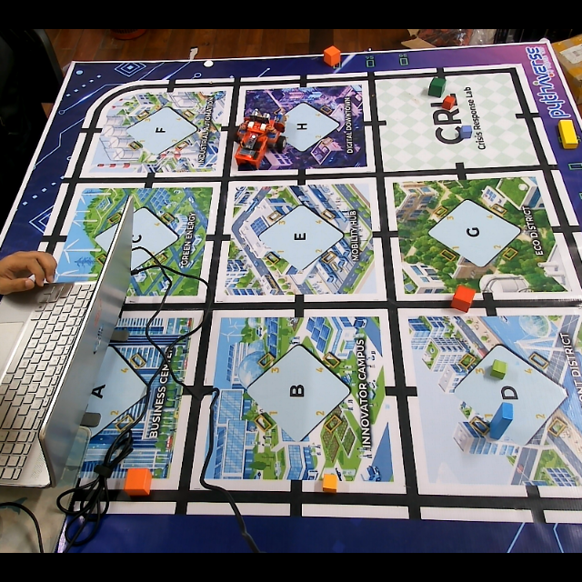
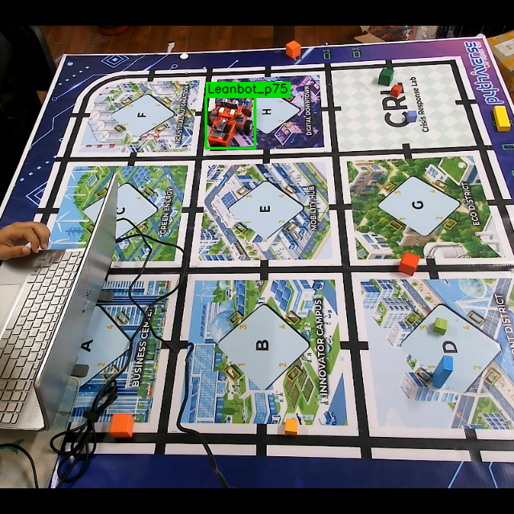
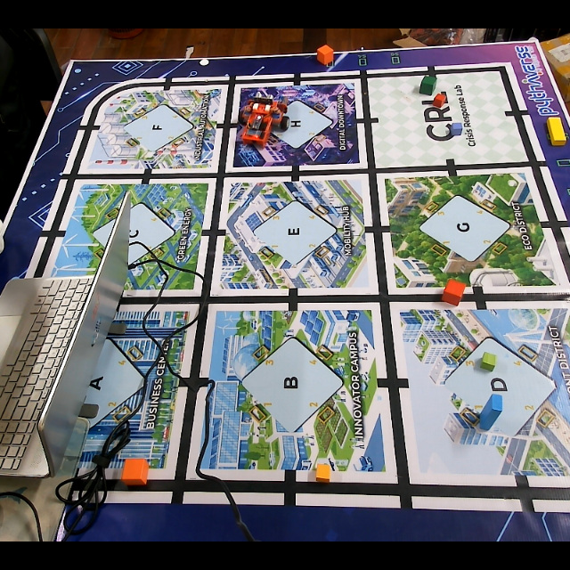
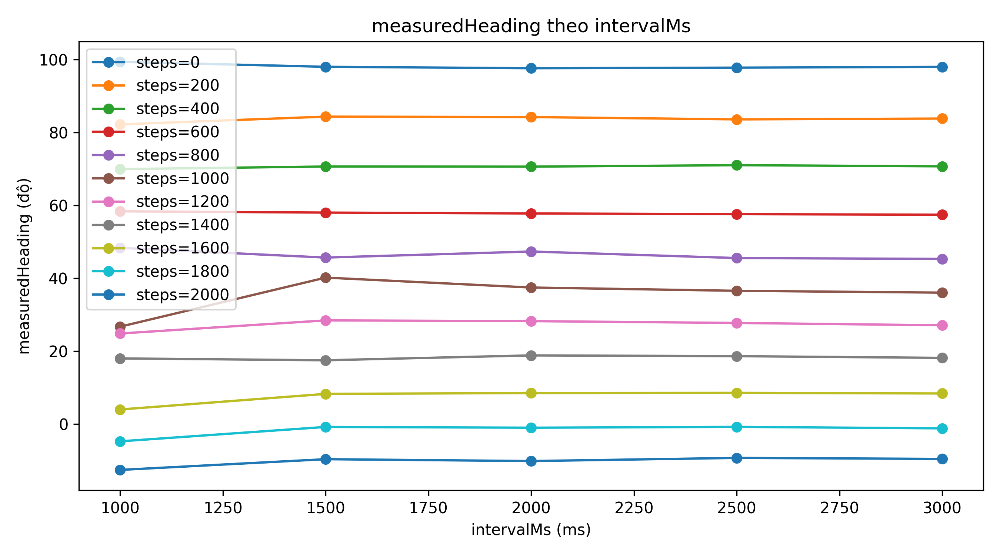
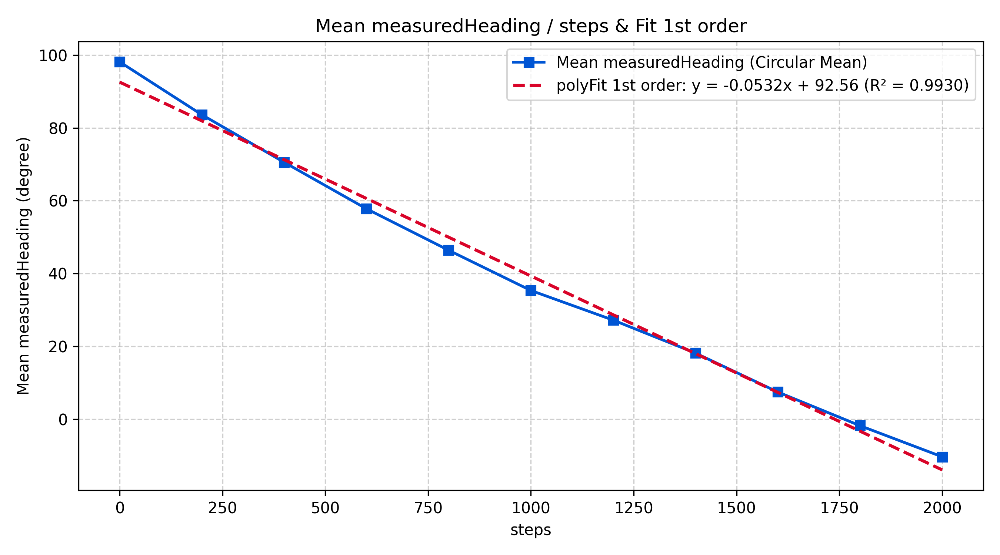
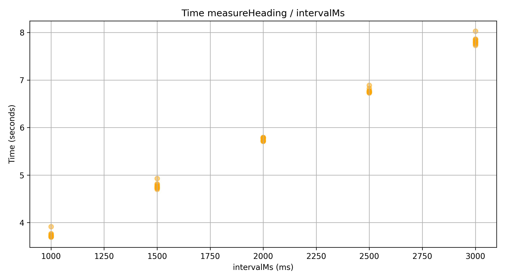

# Báo cáo công việc ngày 28/09/2026

## A. Công việc đã làm 
- Bổ sung cơ chế chỉ lưu 1 lần lost tracking đầu tiên của mỗi lần chạy tới target 
- Thêm --save-lost để bật cơ chế lưu lost tracking dataset khi chạy inference (mặc định tắt) 
- Viết thêm hàm measureHeading(intervalMs) để đo góc heading với các bước sau : 
  - run_fw_bw(2000, intervalMs)
  - linear fit
  - return measuredHeading result 

- Viết code Python riêng khảo sát kết quả measureHeading()  và  spinSteps()
  - Vẽ đồ thị measuredHeading theo intervalMs
  - Tính trung bình measuredHeading từ tất cả các lần intervalMs
  - Vẽ đồ thị  trung bình measuredHeading   theo  steps
  - Báo cáo thời gian từng lần measureHeading


### 1. Bổ sung cơ chế lưu dataset khi lost tracking lần đầu tiên trong mỗi lần chạy tới target 
- Các bước xử lí khi lost tracking : 
  - **Kiểm tra trạng thái mất dấu và bộ đếm**: Khi xe đang chạy tới target (`collect_lost = True`) mà camera mất dấu (`detected = False`), hệ thống kiểm tra cờ `samples_in_current_run` trong `LostTrackingCollector` và `lost_frame_saved_in_run` trong controller để kiểm tra xem đã lưu lost tracking frame nào chưa, nếu có rồi thì bỏ qua các bước tiếp theo . 
  - **Kế thừa nhãn gần nhất & Lưu 1 sample duy nhất**: Nếu trong lượt chạy hiện tại chưa lưu mẫu nào (`samples_in_current_run < 1`), hệ thống lấy lại Bounding Box và Class góc từ frame nhận diện thành công gần nhất (`last_successful_detection`), đưa vào hàng đợi để center-crop $640 \times 640$, thêm padding đen và lưu đầy đủ 4 thư mục (`images/`, `labels/`, `metadata/`, `check_labels/`). 
  - **Bỏ qua toàn bộ frame mất dấu tiếp theo**: Các frame lost tracking tiếp theo trong cùng chu trình di chuyển đó sẽ tự động bị bỏ qua (`skipped_count += 1`), tránh hiện tượng bị spam các ảnh trùng lặp nhau.
  - **Tự động Reset khi sang lượt chạy mới**

### 2. Thêm program option để bật tắt chế độ lưu dataset khi lost tracking và dataset khi chạy thực tế 
- Program option bổ sung là : 
  - `--save-lost`: Bật chế độ thu thập dataset khi lost tracking (mỗi lượt chạy chỉ lưu đúng 1 frame lost tracking đầu tiên). Mặc định là tắt . 
- Lệnh chạy đầy đủ là : 
```bash
# 1. Chế độ mặc định (TẮT lưu dataset khi lost tracking):
python .\leanbotCameraController.py --source 1 --show --ble 654321

# 2. Chế độ BẬT lưu 1 frame lost tracking đầu tiên mỗi lượt chạy:
python .\leanbotCameraController.py --source 1 --show --save-lost --ble 654321
```

- Các ảnh dataset qua các lần chạy inference thử nghiệm là 

| Ảnh Dataset (`images/`) | Ảnh Check Label (`check_labels/`) |
| :---: | :---: |
| **Trường hợp 1** — Frame ID: 3286 (ROI, Class: `Leanbot_p90` - 91.2°)<br> | **Check Label Preview** (BBox & Class Angle)<br> |
| **Trường hợp 2** — Frame ID: 3557 (ROI, Class: `Leanbot_p135` - 134.0°)<br> | **Check Label Preview** (BBox & Class Angle)<br> |
| **Trường hợp 3** — Frame ID: 4245 (ROI, Class: `Leanbot_p75` - 72.8°)<br> | **Check Label Preview** (BBox & Class Angle)<br> |
| **Trường hợp 4** — Frame ID: 5150 (ROI, Class: `Leanbot_p75` - 75.0°)<br> | **Check Label Preview** (BBox & Class Angle)<br> |

> Mỗi lần chạy chỉ chụp 1 lần lost tracking đầu tiên, các ảnh dataset không bị spam trùng lặp nhau nữa 
> Hiện tại em đã test nhiều trường hợp nhưng lần chạy hôm nay bị lost tracking khá ít ạ ( em cũng không rõ lí do ạ). Các trường hợp lost tracking chủ yếu rơi vào ô H trên sa bàn .

### 3. Thêm hàm measureHeading(intervalMs) để đo góc heading 
- Hàm bổ sung như sau : 
```python
def measureHeading(
    speed_or_interval: int = 2000,
    intervalMs: int = None,
    ble_worker: BLEMotorWorker = None,
    tracker: LeanbotCameraTracker = None,
    get_pos_fn = None,
    wait_frame_fn = None,
    show_ui: bool = False
) -> float:
    """
    1. Hàm measureHeading(intervalMs) đo góc heading bằng chuyển động tiến - lùi (run_fw_bw):
       - run_fw_bw(2000, intervalMs)
       - linear fit
       - return measuredHeading
    """
    if intervalMs is None:
        interval_ms = int(speed_or_interval)
        speed = 2000
    else:
        speed = int(speed_or_interval)
        interval_ms = int(intervalMs)

    if ble_worker is None:
        raise ValueError("[ERROR] measureHeading cần đối tượng ble_worker để gửi lệnh BLE tới Leanbot.")

    drive_duration_s = float(interval_ms) / 1000.0
    total_motion_duration = 2.0 * drive_duration_s

    # 1. Gửi lệnh run_fw_bw(speed, intervalMs)
    ble_worker.send_run_fw_bw(speed, interval_ms)
    t_start = time.perf_counter()

    traj_samples_x = []
    traj_samples_y = []

    # 2. Thu thập tọa độ tâm (cx, cy) từ camera trong thời gian xe chạy
    while True:
        elapsed = time.perf_counter() - t_start

        cx, cy, detected = 0.0, 0.0, False
        frame = None
        if tracker is not None:
            frame, (cx, cy), detected, _ = tracker.read_and_track()
            if show_ui and frame is not None:
                cv2.putText(
                    frame,
                    f"[MEASURING HEADING] interval={interval_ms}ms ({elapsed:.2f}s / {total_motion_duration:.2f}s)",
                    (20, 40), cv2.FONT_HERSHEY_SIMPLEX, 0.7, (0, 255, 255), 2
                )
                cv2.imshow("Leanbot Heading Measurement", frame)
                cv2.waitKey(1)
        elif get_pos_fn is not None:
            if wait_frame_fn is not None:
                wait_frame_fn()
            pos_res = get_pos_fn()
            if pos_res is not None:
                cx, cy, detected = pos_res

        # Chỉ thu thập tọa độ trong giai đoạn xe đang chạy tiến (từ 0.05s đến drive_duration_s)
        # Bỏ 50ms đầu tiên để tránh quán tính giật khởi động
        if detected and (0.05 <= elapsed <= drive_duration_s):
            traj_samples_x.append(cx)
            traj_samples_y.append(cy)

        # Chờ đến khi hết cả chu kỳ tiến + lùi và BLE worker báo xong hành động
        if elapsed >= total_motion_duration and (not ble_worker.is_busy):
            break

        time.sleep(0.01)

    # 3. Linear fit
    n_pts = len(traj_samples_x)
    if n_pts >= 3:
        t_norm = np.linspace(0.0, 1.0, n_pts)
        px_fit = np.polyfit(t_norm, traj_samples_x, deg=1)
        py_fit = np.polyfit(t_norm, traj_samples_y, deg=1)
        dx_fit = float(px_fit[0])
        dy_fit = float(py_fit[0])
        # Hệ trục camera có y hướng xuống dưới -> góc theo hệ tọa độ Descartes là arctan2(-dy, dx)
        theta_fit = float(np.degrees(np.arctan2(-dy_fit, dx_fit)))
        measuredHeading = round(theta_fit, 2)
    elif n_pts > 0:
        dx = traj_samples_x[-1] - traj_samples_x[0]
        dy = traj_samples_y[-1] - traj_samples_y[0]
        if abs(dx) > 1e-3 or abs(dy) > 1e-3:
            measuredHeading = round(float(np.degrees(np.arctan2(-dy, dx))), 2)
        else:
            measuredHeading = 0.0
    else:
        print(f"[WARN] measureHeading: Không phát hiện được điểm tâm nào trong {interval_ms}ms!")
        measuredHeading = 0.0

    # 4. return measuredHeading
    return measuredHeading
``` 
- Các bước hoạt động như sau : 
  - **Gửi lệnh di chuyển tiến-lùi**: Gửi lệnh `run_fw_bw(+2000, intervalMs)` qua BLE xuống Leanbot để xe tự động chạy tiến trong `intervalMs` ms rồi lùi về vị trí ban đầu trong `intervalMs` ms.
  - **Thu thập chuỗi điểm quỹ đạo tiến lùi**: 
  - **Fit đường Linear**: dùng hàm `numpy.polyfit(t, pos, deg=1)` cho cả trục X và Y để tìm vector chỉ phương $(\Delta x, \Delta y)$ của chuyển động.
  - **Xác định góc Heading**
  - **Đợi hoàn tất và trả về kết quả**: Hàm đợi xe hoàn thành chu kỳ lùi về vị trí ban đầu và dừng hẳn (`ble_worker.is_busy == False`), sau đó `return measuredHeading`.

- Bổ sung thêm 1 chương trình python để chạy khảo sát kết quả của hàm mmeasureHeading(intervalMs) với các tham số steps và intervalMs: [survey_heading.py](LeanbotTinyRC_AI_PIDControl/survey_heading.py)
- Các bước thực hiện như sau :
  - **Vòng lặp 2 tầng khảo sát**: Vòng lặp ngoài duyệt qua các mốc `steps = 0 : 5 : 200` và thực hiện quay `spinSteps(+50, steps)`. Vòng lặp trong duyệt qua các khoảng `intervalMs = 1000 : 100 : 3000` và gọi `measureHeading(+2000, intervalMs)`.

  - Tuy nhiên theo cấu hình Thầy đề xuất, dự kiến với step = 5 ( có 41 bước )và thời gian mỗi lần chạy cho 1 step là khoảng 21 lần , tính ttổng thời gian thực hiện 2 vòng lặp sẽ mất khoảng \(41 \times 21 \approx 861\) lần chạy measureHeading , sẽ khoảng 1 tiếng để chạy liên tục . 
  - Vì vậy em đã chọn bộ cấu hình tạm thời như sau để test trước và đánh giá ạ . : 
    - step: 0, 2001, 200 ( từ 0 tới 2000, bước step là 200) . Theo kiểm tra thì em thấy khonarg 2000 step với vận tốc 50step/sec thì Leanbot xuay được khoảng 90 độ ạ 
    - intervalMs : 1000, 3001, 500 ( các mức intervalMs từ 1 -> 3 giây, bước 0.5 giây )

  - **Đo thời gian & Lưu log CSV**: tính `duration = time.time() - t0` cho từng lần đo và ghi log vào file CSV (`heading_survey.csv`).
  - **Tính trung bình góc vòng tròn (Circular Mean)**: công thức Circular Mean $\bar{\theta} = \text{atan2}(\frac{1}{N}\sum \sin \theta_i, \frac{1}{N}\sum \cos \theta_i)$ để tính góc trung bình cho từng mốc steps
  - **Vẽ và xuất 3 đồ thị khảo sát**:
    1. Đồ thị 1: `measuredHeading` theo `intervalMs`.
    2. Đồ thị 2: Trung bình `measuredHeading` theo `steps` (khảo sát góc quay thực tế theo số bước xung).
    3. Đồ thị 3: Thời gian từng lần `measureHeading` theo `intervalMs` so sánh với đường thời gian lý thuyết $2 \times \text{intervalMs} / 1000$.

- Code triển khai : 

```python
import os, sys, time, csv, argparse
from pathlib import Path
import numpy as np
import matplotlib.pyplot as plt

from leanbotCameraController import BLEMotorWorker, LeanbotCameraTracker, measureHeading as _measureHeading

# 1. Khởi tạo BLE và Camera qua CLI params
parser = argparse.ArgumentParser()
parser.add_argument("--ble", type=int, default=654321, help="Leanbot BLE ID")
parser.add_argument("--source", default="1", help="Camera source (index hoặc path)")
args = parser.parse_args()

ble = BLEMotorWorker(args.ble)
tracker = LeanbotCameraTracker(source=args.source)
time.sleep(2.0)

def spinSteps(speed: int, steps: int):
    if steps > 0:
        ble.send_spin_steps(speed, steps)
        time.sleep(0.5 + steps * 0.04)
        while ble.is_busy:
            time.sleep(0.05)
        time.sleep(0.3)

def measureHeading(intervalMs: int) -> float:
    return _measureHeading(speed_or_interval=2000, intervalMs=intervalMs, ble_worker=ble, tracker=tracker)

# 2. Vòng lặp khảo sát (cấu hình thực nghiệm)
records = []
STEP_SIZE = 200

for steps in range(0, 2001, STEP_SIZE):          # steps = 0 : 200 : 2000
    if steps > 0:
        spinSteps(+50, STEP_SIZE)                # Quay gia số thêm STEP_SIZE mỗi nấc
    
    for intervalMs in range(1000, 3001, 500):   # intervalMs = 1000 : 500 : 3000
        t0 = time.time()
        heading = measureHeading(intervalMs)
        duration = time.time() - t0
        
        records.append({
            "steps": steps, "intervalMs": intervalMs,
            "heading": heading, "duration": duration
        })
        print(f"steps={steps:3d} | intervalMs={intervalMs:4d} | heading={heading:6.2f}° | time={duration:.2f}s")
``` 

- Kết quả 3 đồ thị khảo sát:

#### 1. Đồ thị 1: measuredHeading theo intervalMs


#### 2. Đồ thị 2: Trung bình measuredHeading theo steps


- **Đường poly fit bậc 1 tuyến tính hóa dữ liệu đo**:
  $$\text{Heading} = a \cdot \text{steps} + b = -0.05322 \cdot \text{steps} + 92.56$$


- **Mối quan hệ tuyến tính giữa số bước xung (steps) và góc xoay (độ)**:
  - **Mỗi bước xung (`1 step`) xe xoay được**:
    $$1 \text{ step} \approx 0.05322^\circ \quad (\approx \frac{1}{18.79}^\circ)$$
  - **Để Leanbot xoay được góc $1^\circ$, cần phát số bước xung là**:
    $$\text{Số steps} = \frac{1^\circ}{0.05322^\circ} \approx 18.79 \text{ steps} \quad (\approx 18.8 \text{ steps/độ})$$
  - **Công thức điều khiển góc quay thực nghiệm (ở tốc độ +50) cho Phase căn chỉnh góc bằng spinStep() trước đó là**:
    $$\text{Steps}(\Delta \theta) \approx 18.79 \times |\Delta \theta|$$

#### 3. Đồ thị 3: Thời gian từng lần measureHeading theo intervalMs


## B. Khó khăn 
- Không

## C. Công việc tiếp theo 
- Em xin phép nhận hướng đi tiếp theo từ Thầy ạ . 

