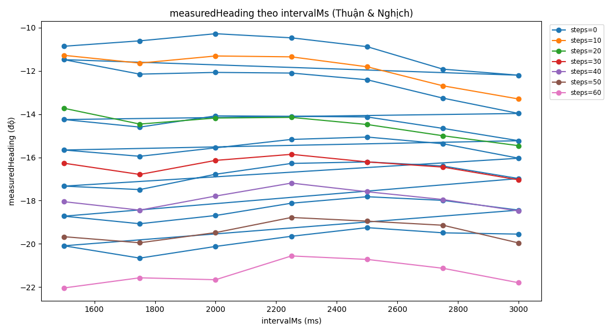
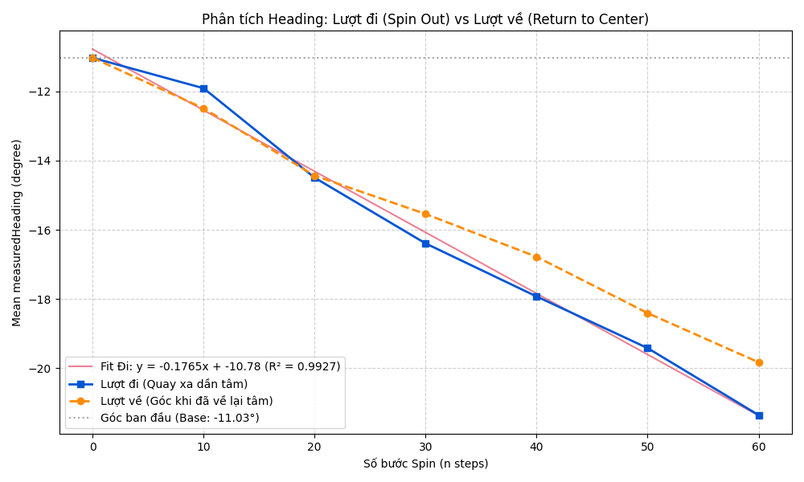
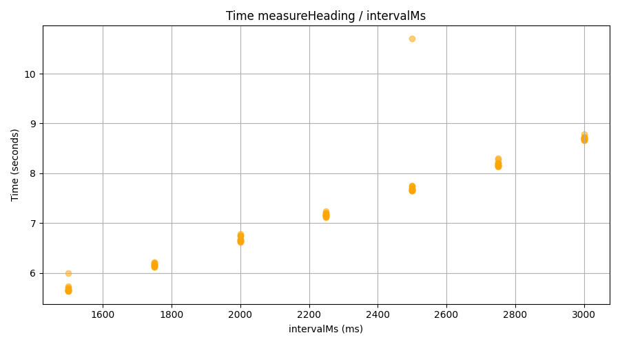

# Báo cáo công việc ngày 30/09/2026

## Mục lục
- [A. Công việc đã làm](#a-công-việc-đã-làm)
  - [1. Khảo sát ngẫu nhiên các trường hợp Leanbot chạy tiến, lùi](#1-khảo-sát-ngẫu-nhiên-các-trường-hợp-leanbot-chạy-tiến-lùi)
  - [2. Bổ sung chương trình khảo sát bước Step nhỏ và kết quả khảo sát](#2-bổ-sung-chương-trình-khảo-sát-bước-step-nhỏ-và-kết-quả-khảo-sát)
- [B. Khó khăn](#b-khó-khăn)
- [C. Công việc tiếp theo](#c-công-việc-tiếp-theo)

## A. Công việc đã làm 
- Khảo sát thêm ngẫu nhiên các trường hợp Leanbot chạy Phase 1 và 2 đi lùi, tiến ngẫu nhiên 
- Bổ sung chương trình khảo sát bước Step nhỏ : 
  - số step: range(0,201,10) 
  - khoảng thời gian : range(1500,3001,250) milisecond. 
  - Đảo chiều xoay về vị trí ban đầu sau mỗi bước step 

### 1. Khảo sát ngẫu nhiên các trường hợp Leanbot chạy tiến, lùi 
- Triển khai khảo sát ngẫu nhiên các trường hợp tiến, lùi về target pixel. 
- Lệnh chạy : 
```bash
python leanbotCameraController.py --source 1 --ble 654321
```
- Các trường hợp thử nghiệm như sau : 

- **Trường hợp 1 (Chạy LÙI)**
  - Tên log: `log_roi_20260930_154848.csv`
  - Quỹ đạo 2D (2D Trajectory): 
  - Đồ thị PID Analysis: 
  - Đồ thị sai số (Diff Analysis): 
  - Tổng hợp Phase 4 (Spin bù góc): 
    - Target heading: 15.3°
    - Heading lần 1 (trước Spin): 17.86° (Error: +2.56°)
    - Bù góc: Xoay 48 steps (speed=50)
    - Heading lần 2 (sau Spin): 15.68° (Error: +0.38°)
    - Mức độ cải thiện: 2.18°

- **Trường hợp 2 (Chạy TIẾN)**
  - Tên log: `log_roi_20260930_154930.csv`
  - Quỹ đạo 2D (2D Trajectory): 
  - Đồ thị PID Analysis: 
  - Đồ thị sai số (Diff Analysis): 
  - Tổng hợp Phase 4 (Spin bù góc): 
    - Target heading: 15.3°
    - Heading lần 1 (trước Spin): 13.17° (Error: -2.13°)
    - Bù góc: Xoay 40 steps (speed=-50)
    - Heading lần 2 (sau Spin): 14.52° (Error: -0.78°)
    - Mức độ cải thiện: 1.35°

- **Trường hợp 3 (Chạy LÙI)**
  - Tên log: `log_roi_20260930_155020.csv`
  - Quỹ đạo 2D (2D Trajectory): 
  - Đồ thị PID Analysis: 
  - Đồ thị sai số (Diff Analysis): 
  - Tổng hợp Phase 4 (Spin bù góc): 
    - Target heading: 15.3°
    - Heading lần 1 (trước Spin): 12.99° (Error: -2.31°)
    - Bù góc: Xoay 43 steps (speed=-50)
    - Heading lần 2 (sau Spin): 14.29° (Error: -1.01°)
    - Mức độ cải thiện: 1.30°

- **Trường hợp 4 (Chạy LÙI)**
  - Tên log: `log_roi_20260930_155126.csv`
  - Quỹ đạo 2D (2D Trajectory): 
  - Đồ thị PID Analysis: 
  - Đồ thị sai số (Diff Analysis): 
  - Tổng hợp Phase 4 (Spin bù góc): 
    - Target heading: 15.3°
    - Heading lần 1 (trước Spin): 12.12° (Error: -3.18°)
    - Bù góc: Xoay 60 steps (speed=-50)
    - Heading lần 2 (sau Spin): 13.93° (Error: -1.37°)
    - Mức độ cải thiện: 1.81°

- **Trường hợp 5 (Chạy TIẾN)**
  - Tên log: `log_roi_20260930_155215.csv`
  - Quỹ đạo 2D (2D Trajectory): 
  - Đồ thị PID Analysis: 
  - Đồ thị sai số (Diff Analysis): 
  - Tổng hợp Phase 4 (Spin bù góc): 
    - Target heading: 15.3°
    - Heading lần 1 (trước Spin): 16.59° (Error: +1.29°)
    - Bù góc: Xoay 24 steps (speed=50)
    - Heading lần 2 (sau Spin): 15.52° (Error: +0.22°)
    - Mức độ cải thiện: 1.08°
- **Trường hợp 6 (Chạy TIẾN)**
  - Tên log: `log_roi_20260930_161600.csv`
  - Quỹ đạo 2D (2D Trajectory): 
  - Đồ thị PID Analysis: 
  - Đồ thị sai số (Diff Analysis): 
  - Tổng hợp Phase 4 (Spin bù góc): 
    - Target heading: 15.3°
    - Heading lần 1 (trước Spin): 14.32° (Error: -0.98°)
    - Bù góc: Xoay 18 steps (speed=-50)
    - Heading lần 2 (sau Spin): 15.26° (Error: -0.04°)
    - Mức độ cải thiện: 0.94°

> Có một số trường hợp bị lost tracking , sẽ bổ sung dataset sau khi chỉnh sửa cơ chế lưu dataset thành dạng ảnh 160x160 như Thầy đề xuất . 

### 2. Bổ sung chương trình khảo sát bước Step nhỏ và kết quả khảo sát
- Chương trình khảo sát hiện tại :  [survey_heading.py](LeanbotTinyRC_AI_PIDControl/survey_heading.py)

```python
# Khảo sát với trường hợp step = 0 trước , để tránh bị lặp 2 lần trong vòng lặp. 
for intervalMs in range(1500, 3001, 250):
    measurement_id = make_measurement_id(0, 0, intervalMs)
    t0 = time.time()
    heading = measureHeading(intervalMs, direction=0, steps=0, signed_steps=0, measurement_id=measurement_id)

    .....


for steps in range(10, 201, 10):
    # Từ center, xoay thuận
    spinSteps(+50, steps)
    
    for intervalMs in range(1500, 3001, 250):
        measurement_id = make_measurement_id(1, steps, intervalMs)
        t0 = time.time()
        heading = measureHeading(intervalMs, direction=1, steps=steps, signed_steps=steps, measurement_id=measurement_id)
        
        .....
    
    # Từ vị trí đang đứng quay ngược đúng 'steps' bước để trả về lại center
    spinSteps(-50, steps)
    # Tiếp tục khảo sát 
    for intervalMs in range(1500, 3001, 250):
        measurement_id = make_measurement_id(-1, steps, intervalMs)
        t0 = time.time()
        heading = measureHeading(intervalMs, direction=-1, steps=steps, signed_steps=0, measurement_id=measurement_id)
        
        ....

```

- **Tổng kết quy mô và thời gian khảo sát (Từ mốc step 0 đến 60):**
  - **Tổng số mốc góc xoay (steps):** 7 mốc (0, 10, 20, 30, 40, 50, 60).
  - **Tổng số lần phát lệnh xoay (Spin):** 12 lần
  - **Tổng số lần đo quỹ đạo (measureHeading):** 91 phép đo. 
    - Tại mốc `step=0`: Đo 7 lần (cho 7 mức thời gian `intervalMs` từ 1500 đến 3000).
    - Tại 6 mốc `step` còn lại: Đo 14 lần/mốc (7 lần ở vị trí đã xoay +N, 7 lần ở vị trí đã xoay về -N).
  - **Thời gian trung bình 1 lần Spin:** Phụ thuộc vào số lượng xung, từ 1 đến 2 giây .
  - **Thời gian trung bình 1 lần đo quỹ đạo:** Mỗi lần đo Leanbot chạy Tiến và Lùi, mất trung bình khoảng **7.2 giây/lượt đo** (dao động từ 5.6s cho chu kỳ 1500ms tới 8.7s cho chu kỳ 3000ms).
  - **Tổng thời gian thực thi của riêng pha đo đạc (measure duration):** **656.6 giây** (~11 phút).
- Các đồ thị kết quả phân tích từ các mẫu csv thu thập (Lưu ý: Dữ liệu từ bước `steps >= 70` đã bị loại bỏ do hiện tượng lỗi đồng bộ BLE gây lật góc 180° , các đồ thị dưới đây phản ánh dữ liệu an toàn từ `steps = 0` đến `steps = 60`): 

  - **Đồ thị 1: Sự phụ thuộc của Heading vào thời gian chạy Interval (ms)**
    

  - **Đồ thị 2: Sự thay đổi của Heading theo số bước Spin (steps)**
    

  - **Đồ thị 3: Thời gian thực thi thực tế (Duration) theo IntervalMs**
    


## B. Khó khăn 
- Không
## C. Công việc tiếp theo 
- Chỉnh sửa lại cách lưu lại dataset khi lost tracking ( lưu ảnh 160x160 ROI tracking)