# Báo cáo công việc ngày 01/10/2026

## A. Công việc đã làm
- Chỉnh sửa lại cách lưu dataset khi lost tracking.
- Lấy trực tiếp ROI tại đúng frame bị lost tracking và resize ROI này lên 640x640 để phục vụ train bổ sung.
### 1. Chỉnh sửa lại cách lưu dataset khi lost tracking
- Code hiện tại:
  - Khi tracking thành công Leanbot, hệ thống tính ROI dựa trên BBOX hiện tại bằng hàm `calculate_roi()`.
  - ROI có kích thước động, dạng hình vuông, cạnh được tính bằng khoảng 2 lần cạnh lớn nhất của BBOX và làm tròn lên bội số 32.
  - ROI sau khi crop từ ảnh camera được resize về 160x160 để đưa vào tracking model.
  - Khi tracking bị mất, code trước đó lưu ảnh từ full frame rồi tiếp tục crop, padding và resize về 640x640 để tạo dataset.

- **Hướng chỉnh sửa**:
  - Giữ nguyên cơ chế tạo ROI và tracking model hiện tại.
  - Tại mỗi frame ROI tracking, giữ lại ROI raw trước khi resize về 160x160.
  - Khi ROI tracking bị fail, sử dụng chính ROI raw của frame đó làm ảnh dataset.
  - ROI raw được resize trực tiếp lên 640x640:
    `dataset_image = cv2.resize(lost_roi_input, (640, 640))`
  - Chỉ lưu dataset khi lỗi xảy ra trong chế độ ROI tracking, không lưu các frame FULL detection bị fail.
  - Chuyển BBOX từ hệ tọa độ full frame sang hệ tọa độ ROI trước khi tạo YOLO label.
  - Giữ lại metadata và ảnh `check_labels` để kiểm tra pseudo-label trước khi sử dụng dataset để train.

- Code chỉnh sửa:
  - Trong [`leanbotCameraController.py`](leanbotCameraController.py):
    - Giữ lại ROI bằng:
      `lost_roi_input = roi_input.copy()`
    - Lưu thêm vị trí ROI:
      `lost_roi_rect = (rx, ry, rw, rh)`
    - Khi tracking thành công, tiếp tục cache BBOX, angle, confidence và class gần nhất.
    - Khi ROI tracking fail, truyền `lost_roi_input` và `lost_roi_rect` vào `LostTrackingCollector`.
    - Không thu dataset đối với các frame FULL-search thất bại.

  - Trong `lost_tracking_collector.py`:
    - Bỏ cơ chế tạo ảnh dataset từ full frame.
    - Ảnh dataset được tạo trực tiếp từ ROI bị lost:
      `cv2.resize(frame, (640, 640), interpolation=cv2.INTER_LINEAR)`
    - Chuyển BBOX từ full-frame coordinate sang ROI coordinate:
      - `roi_x = full_x - rx`
      - `roi_y = full_y - ry`
    - Clip BBOX vào biên ROI.
    - Tính lại YOLO normalized label theo kích thước ROI.
    - Thêm các thông tin vào metadata:
      - `roi_rect_xywh`
      - `source_roi_size`
      - `bbox_roi_xyxy`
      - `bbox_yolo`

- Pipeline dataset sau khi chỉnh sửa:
```text
Successful detection
        |
        v
calculate_roi()
        |
        v
Raw ROI, ví dụ 200x180 --> 224x224
        |
        +----> resize 160x160
                    |
                    v
             Tracking model
                    |
                   FAIL
                    |
                    v
          Lấy lại raw ROI 224x224
                    |
                    v
          Full BBOX -> ROI BBOX
                    |
                    v
          YOLO normalize theo ROI
                    |
                    v
          Resize raw ROI -> 640x640
                    |
                    v
      images / labels / metadata / check_labels
```

- Chạy thực nghiệm:
  - Lệnh chạy:
  ```bash
    python leanbotCameraController.py --source 1 --show --save-lost --ble 654321
  ```

  - Kết quả dataset sau khi thu thập: folder [leanbotCameraController.py](LeanbotTinyRC_AI_PIDControl/leanbotCameraController.py)
  
    - `images/`: ảnh ROI lost tracking đã resize về 640x640.
    - `labels/`: YOLO label được chuyển sang hệ tọa độ ROI.
    - `metadata/`: thông tin frame, ROI, BBOX, angle, confidence và nguồn label.
    - `check_labels/`: ảnh preview để kiểm tra BBOX và class trước khi đưa vào train.

- Ảnh các dataset thu thập ví dụ như sau : 

| Ảnh Dataset (ROI resize 640x640) | Ảnh Check Label (YOLO BBOX) |
| :---: | :---: |
| 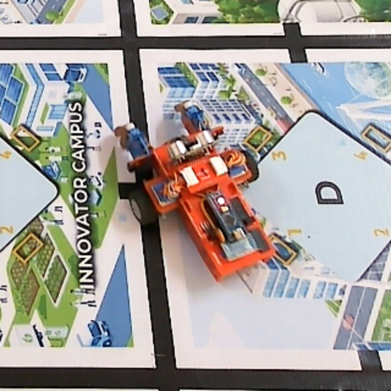 | 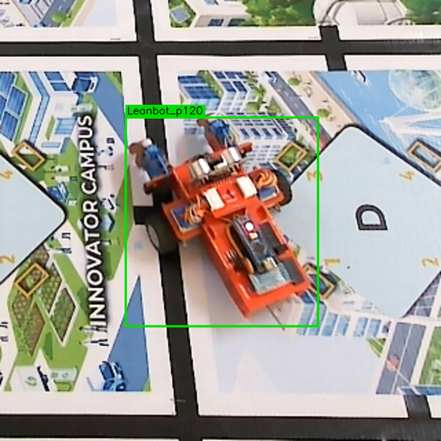 |
| 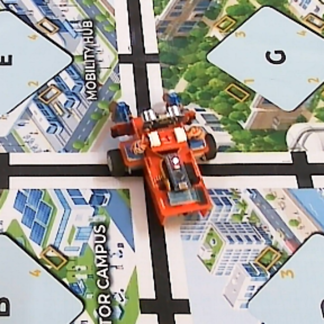 | 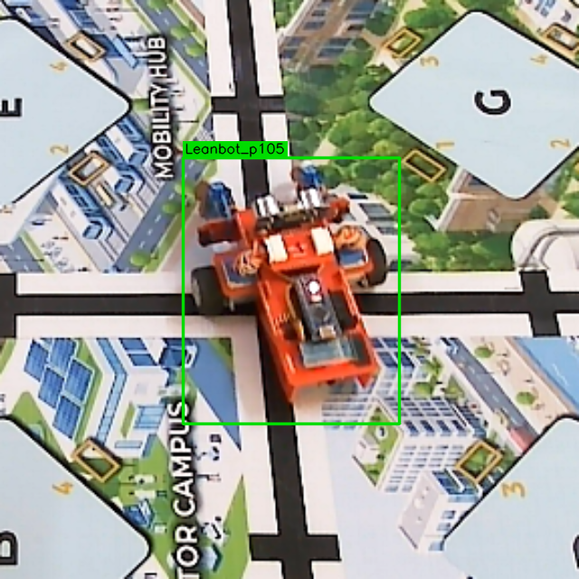 |
| 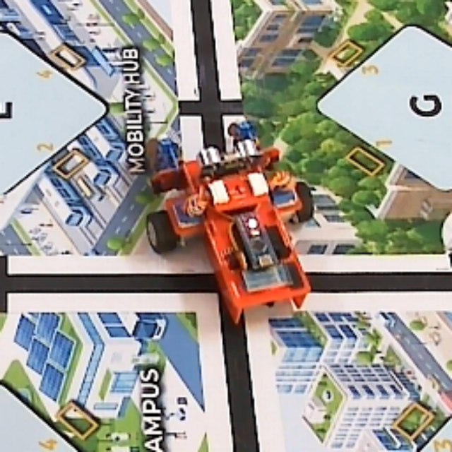 |  |
| 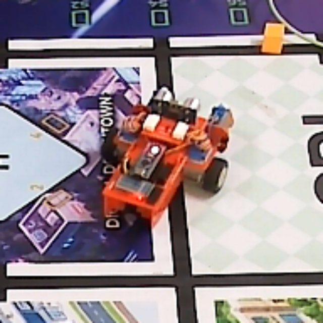 | 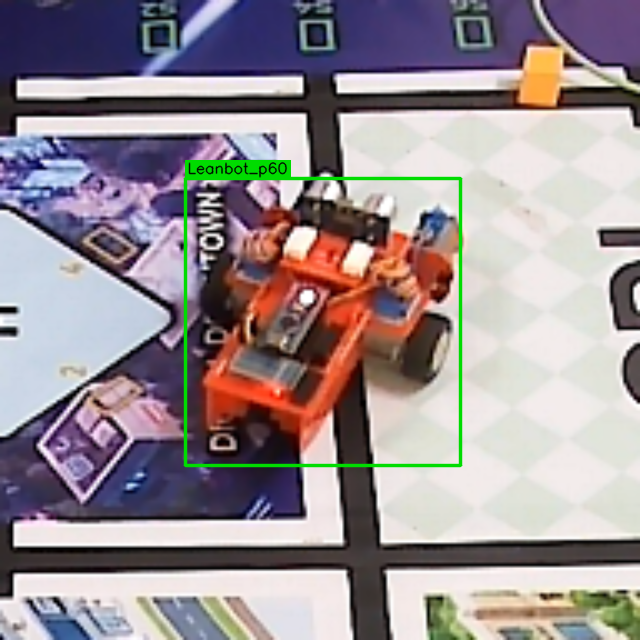 |
| 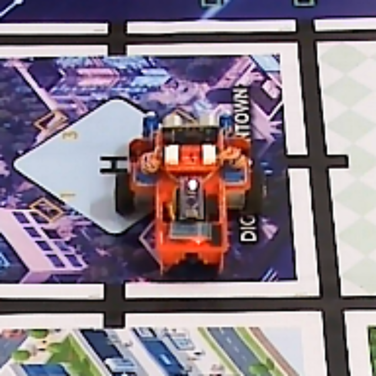 | 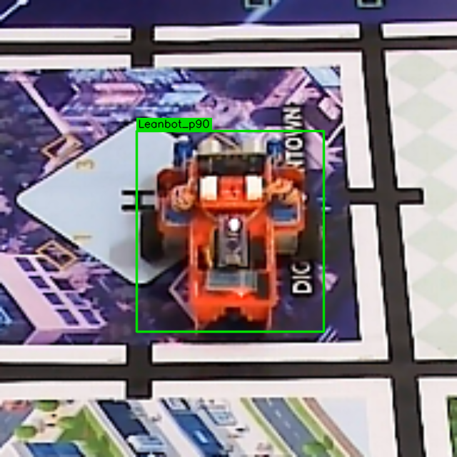 |
| 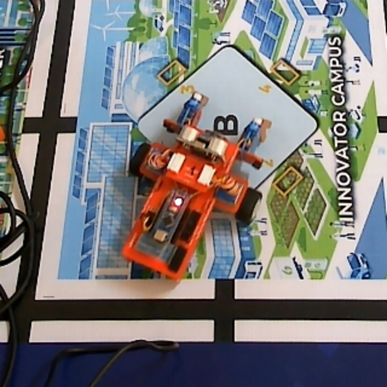 | 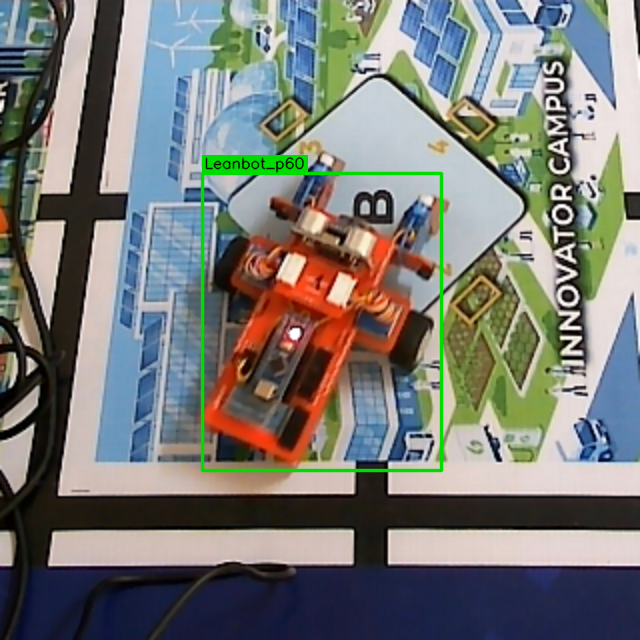 |
| 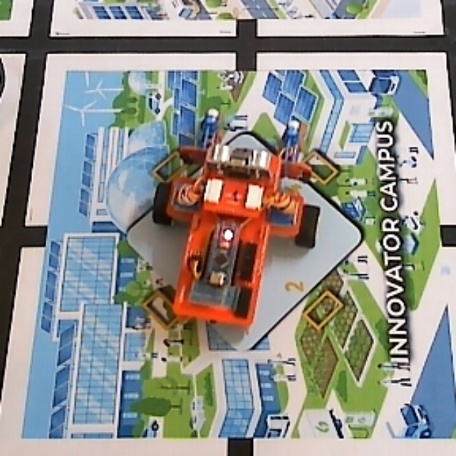 | 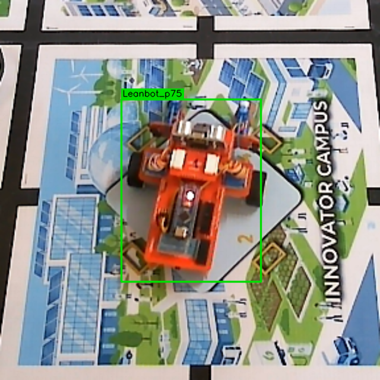 |
| 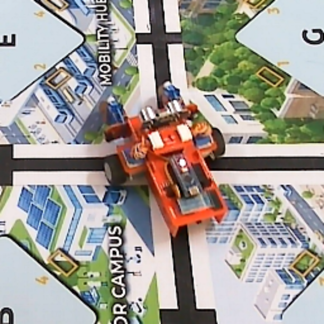 | 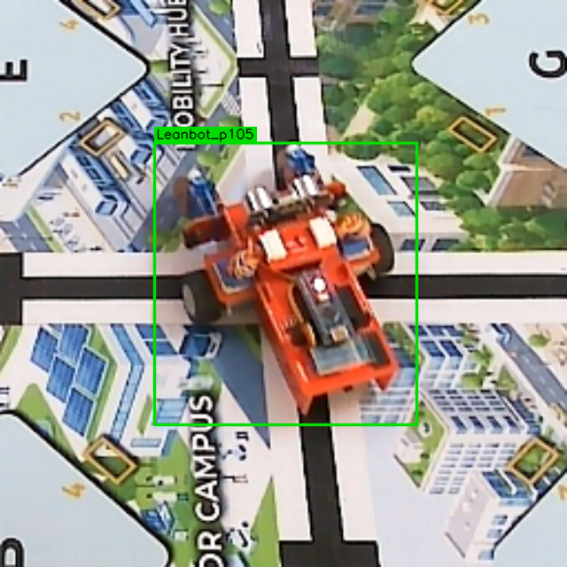 |

## B. Khó khăn
- Không 
## C. Công việc tiếp theo
- Em xin phép nhận hướng đi tiếp theo từ Thầy ạ . 