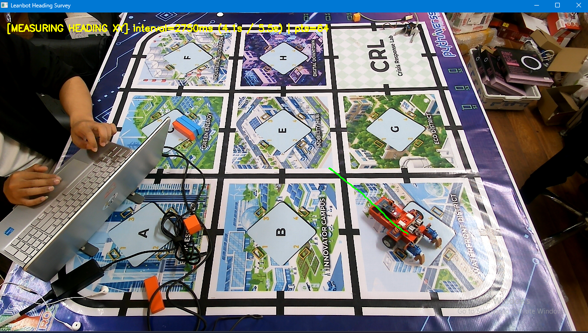
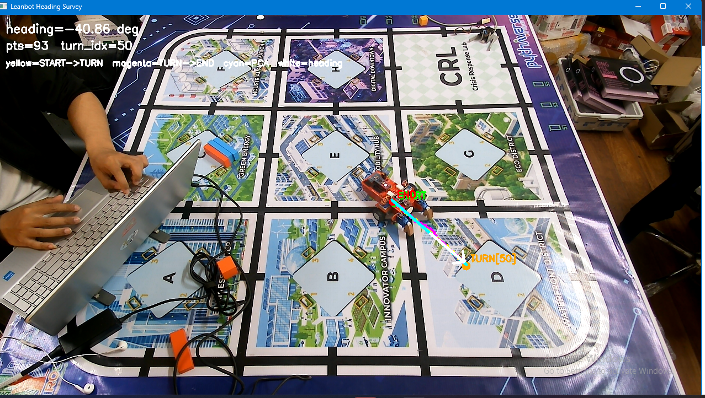
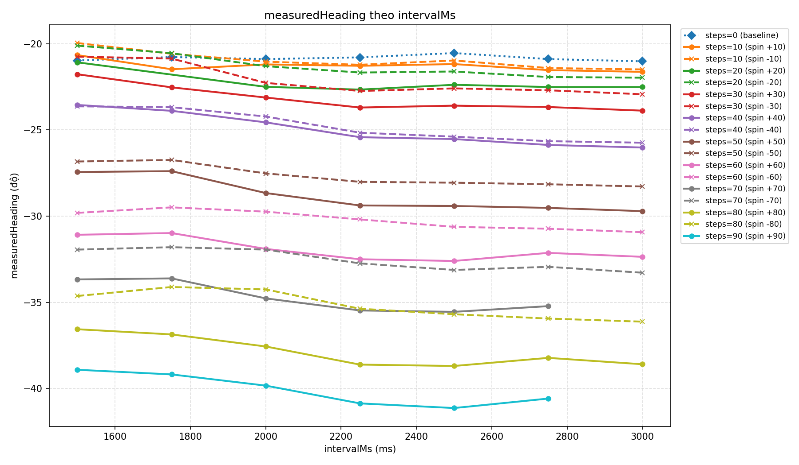
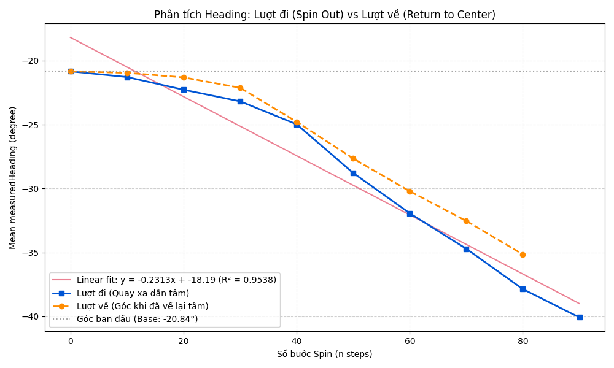
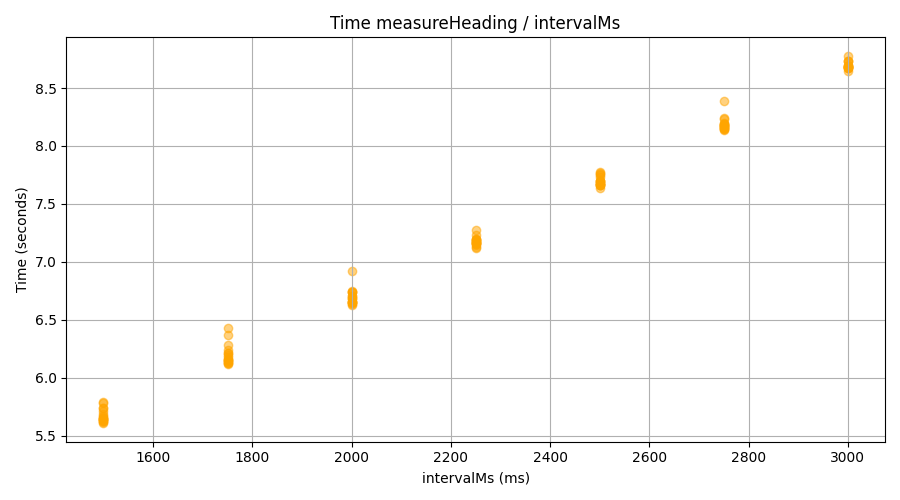

# Báo cáo công việc ngày 02/10/2026 

## A. Công việc đã làm 
- Chạy lại heading survey một lần nữa với góc heading khác, vị trí khác . 
- Vẽ lại biểu đồ 
- Báo cáo thông tin file csv thu thập
- Báo cáo lại cách thu thập quỹ đạo, cách tính heading 

### 1. Chạy lại heading survey với góc heading khác , vị trí khác
- Thử chạy heading survey lại với góc heading mới, và vị trí ngẫu nhiên .
- Hình ảnh thực tế như sau : 




### 2. Kết quả các file CSV thu thập

#### 2.1. Tổng quan
- Tổng cộng **127 file CSV** :
  - **1 file tổng hợp**: [`heading_survey_20261001_121921.csv`](LeanbotTinyRC_AI_PIDControl/heading_survey_results/heading_survey_20261001_121921.csv) – chứa kết quả tóm tắt của toàn bộ phép đo.
  - **126 file trajectory** (trong thư mục [`trajectories/`](LeanbotTinyRC_AI_PIDControl/heading_survey_results/trajectories/)): mỗi file chứa dữ liệu quỹ đạo thô (raw trajectory) của từng phép đo riêng lẻ.


#### 2.2. Cấu trúc file tổng hợp (heading_survey_*.csv)
File tổng hợp gồm **10 cột**, mỗi dòng tương ứng với một phép đo:

| Cột | Ý nghĩa |
|---|---|
| `measurement_id` | Mã định danh của phép đo (bao gồm: thứ tự, hướng quay, số bước, interval, thời gian) |
| `direction` | Hướng di chuyển: `0` = đứng yên (baseline), `+1` = đã quay thuận (spin out), `-1` = đã quay nghịch về tâm (return) |
| `steps` | Số bước spin đã thực hiện trước khi đo heading |
| `signed_steps` | Số bước có dấu (thể hiện vị trí tích lũy hiện tại so với tâm ban đầu) |
| `intervalMs` | Khoảng thời gian robot chạy forward + backward (ms). Robot chạy thẳng `intervalMs` ms rồi lùi lại `intervalMs` ms |
| `heading` | Góc heading đo được (đơn vị: độ, trong khoảng [-180, 180)) |
| `duration` | Thời gian thực tế để hoàn thành phép đo (giây) |
| `status` | Trạng thái: `OK` hoặc `FAILED` |
| `error` | Thông báo lỗi nếu có (vd: `START_TIMEOUT_END_RECEIVED`) |
| `raw_trajectory_file` | Đường dẫn tới file chứa quỹ đạo thô tương ứng trong thư mục `trajectories/` |

**Ví dụ** (3 dòng đầu):

| measurement_id | direction | steps | signed_steps | intervalMs | heading | duration | status | error | raw_trajectory_file |
|---|---|---|---|---|---|---|---|---|---|
| m0001_dir+0_steps000_int1500_20261001_121921_553150 | 0 | 0 | 0 | 1500 | -20.97 | 5.65 | OK | | trajectories\m0001_dir+0_steps000_int1500_20261001_121921_553150.csv |
| m0002_dir+0_steps000_int1750_20261001_121927_198863 | 0 | 0 | 0 | 1750 | -20.77 | 6.15 | OK | | trajectories\m0002_dir+0_steps000_int1750_20261001_121927_198863.csv |
| m0003_dir+0_steps000_int2000_20261001_121933_347950 | 0 | 0 | 0 | 2000 | -20.89 | 6.70 | OK | | trajectories\m0003_dir+0_steps000_int2000_20261001_121933_347950.csv |

#### 2.3. Cấu trúc file trajectory (trajectories/*.csv)
Mỗi file trajectory gồm **19 cột**, mỗi dòng là một mẫu (sample) tọa độ (cx, cy) được camera ghi nhận:

| Cột | Ý nghĩa |
|---|---|
| `measurement_id` | Mã phép đo (giống file tổng hợp) |
| `sample_index` | Chỉ số index thứ tự của mẫu trong phép đo |
| `elapsed_s` | Thời gian kể từ lúc bắt đầu phép đo (giây) |
| `cx`, `cy` | Tọa độ tâm robot trên mặt phẳng ảnh (pixel) |
| `segment` | Phân đoạn: `forward` (từ START đến TURN) hoặc `backward` (từ TURN đến END) |
| `is_start` | Cờ đánh dấu điểm bắt đầu (1 = điểm đầu tiên của quá trình thu thập quxy đạo) |
| `is_turn` | Cờ đánh dấu điểm quay đầu (1 = điểm xa nhất so với điểm bắt đầu) |
| `is_end` | Cờ đánh dấu điểm kết thúc (1 = điểm cuối cùng của quỹ đạo) |
| `heading_deg` | Góc heading tính được cho toàn bộ phép đo (độ) |
| `fit_vx`, `fit_vy` | Vector hướng đơn vị – hướng của đường thẳng fit qua toàn bộ quỹ đạo |
| `turn_idx` | Chỉ số mẫu tại điểm quay đầu (turn point) |
| `direction`, `steps`, `signed_steps`, `intervalMs` | cấu hình của phép đo (giống file tổng hợp) |
| `action_status`, `action_error` | Trạng thái BLE action |

**Ví dụ** (3 dòng đầu của file `m0001_dir+0_steps000_int1500_20261001_121921_553150.csv`):

| sample_index | elapsed_s | cx | cy | segment | is_start | is_turn | is_end | heading_deg | fit_vx | fit_vy | turn_idx |
|---|---|---|---|---|---|---|---|---|---|---|---|
| 0 | 0.821 | 739.58 | 408.04 | forward | 1 | 0 | 0 | -20.97 | 0.9338 | 0.3579 | 28 |
| 1 | 0.880 | 744.02 | 408.60 | forward | 0 | 0 | 0 | -20.97 | 0.9338 | 0.3579 | 28 |
| 2 | 0.935 | 745.56 | 409.16 | forward | 0 | 0 | 0 | -20.97 | 0.9338 | 0.3579 | 28 |


#### 2.4. Các thông số khảo sát (Survey Parameters)
- Trong quá trình chạy thửu nghiệm tới bước 90 robot gặp lỗi và dừng quá trình survey. 
- **Steps**: từ 0 đến 90 bước (bước nhảy 10): `[0, 10, 20, 30, 40, 50, 60, 70, 80, 90]`
- **IntervalMs**: từ 1500ms đến 3000ms (bước nhảy 250ms): `[1500, 1750, 2000, 2250, 2500, 2750, 3000]`
- **Quy trình mỗi mức steps**:
  1. Spin thuận (direction=+1) và đo heading ở 7 mức interval
  2. Spin nghịch (direction=-1) về tâm và đo heading ở 7 mức interval

### 3. Vẽ lại biểu đồ

Sau khi chạy xong heading survey, sử dụng script `plot_survey_heading.py` để vẽ 3 biểu đồ:

#### Biểu đồ 1: Heading theo IntervalMs (Thuận & Nghịch)


> **Nhận xét**: Heading tương đối ổn định theo intervalMs tại cùng một mức steps, tuy nhiên khi các bước tăng dần thì khi xuay về center thì góc heading lại không về vị trí như ban đầu nữa . 

#### Biểu đồ 2: Heading theo Steps – Lượt đi (Spin Out) vs Lượt về (Return)

- **Nhận xét**: 
  - Lượt đi: heading thay đổi tuyến tính theo số bước spin (robot xoay → heading thay đổi).
  - Lượt về: heading gần trở lại giá trị baseline → robot quay lại được vị trí gần ban đầu.

#### Biểu đồ 3: Thời gian đo theo IntervalMs


> Thời gian phép đo tăng tuyến tính theo intervalMs, với vận tốc 2000. 

### 4. Cách thu thập quỹ đạo và cách tính heading

#### 4.1. Quy trình thu thập quỹ đạo (measureHeading)
Mỗi phép đo heading thực hiện theo các bước sau:

1. **Gửi lệnh `run_fw_bw(speed, intervalMs)` qua BLE**: Robot chạy thẳng về phía trước trong `intervalMs` ms, sau đó tự động lùi lại trong `intervalMs` ms (tổng thời gian chuyển động lý thuyết = `2 × intervalMs`, tuy nhiên do có hàm stopAndWait() nên leanbot sẽ dừng lâu hơn do quán tính).

2. **Camera tracking quỹ đạo**: Trong suốt quá trình robot chạy forward + backward, camera liên tục theo dõi vị trí tâm robot `(cx, cy)` trên mặt phẳng ảnh (pixel). Mỗi mẫu ghi nhận: tọa độ `(cx, cy)` và thời gian `elapsed_s`.

3. **Kết thúc thu thập quỹ đạo**: Khi nhận được tín hiệu kết thúc từ BLE sau khi kết thúc hàm run_fw_bw thì kết thúc 1 lượt thu thập quỹ đạo

4. **Kết quả**: Mỗi phép đo tạo ra một chuỗi điểm `(cx, cy)` mô tả quỹ đạo forward-backward trên mặt phẳng ảnh.

#### 4.2. Cách tính heading (estimate_heading_from_xy_trajectory)
Từ chuỗi điểm quỹ đạo `(cx, cy)`, heading được tính như sau:

1. **Xác định điểm quay đầu (Turn Point)**: Tìm điểm trong quỹ đạo **xa nhất** so với điểm bắt đầu (START). Đây chính là điểm robot chuyển từ forward sang backward.

2. **Fit đường thẳng bậc 1** qua toàn bộ quỹ đạo (cả forward lẫn backward) để tìm vector hướng chính `(vx, vy)` của quỹ đạo.

3. **Xác định chiều forward của vector quỹ đạo**: Việc fit đường thẳng bậc 1 chỉ cho ra **phương** (đường thẳng), nhưng chưa biết **chiều** nào là forward. Để xác định chiều đúng:
   - Tính vector `d_fwd = TURN - START` (vector từ điểm bắt đầu đến điểm quay đầu trên mặt phẳng ảnh), trong đó `d_fwd_x = TURN.cx - START.cx` và `d_fwd_y = TURN.cy - START.cy`.
   - So sánh bằng **tích vô hướng**: `vx × d_fwd_x + vy × d_fwd_y`
     - Nếu kết quả `>= 0`: vector `(vx, vy)` đã cùng chiều với hướng forward 
     - Nếu kết quả `< 0`: vector `(vx, vy)` ngược chiều forward -> đảo dấu thành `(-vx, -vy)`.

4. **Tính heading**: 
   ```
   heading = atan2(-vy, vx)   (chuyển sang độ, wrap về [-180, 180))
   ```
   - Dấu trừ trước `vy` là để **chuyển từ hệ tọa độ ảnh** (trục y hướng xuống) sang **hệ tọa độ toán học** (trục y hướng lên).

## B. Khó khăn 
- Không 
## C. Công việc tiếp theo 
- Em xin phép nhận hướng đi tiếp theo từ Thầy ạ 
- Cái thu thập dữ liệu ảnh lost tracking như vậy đã được chưa ạ Thầy ? 
- Như trước đó em có đề cập với Thầy là em xin phép làm tới hết tháng 9 ạ, nên hôm nay là buổi cuối em đi làm ạ, em có cần viết các tài liệu bàn giao không ạ Thầy ? 
