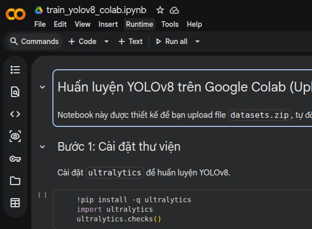
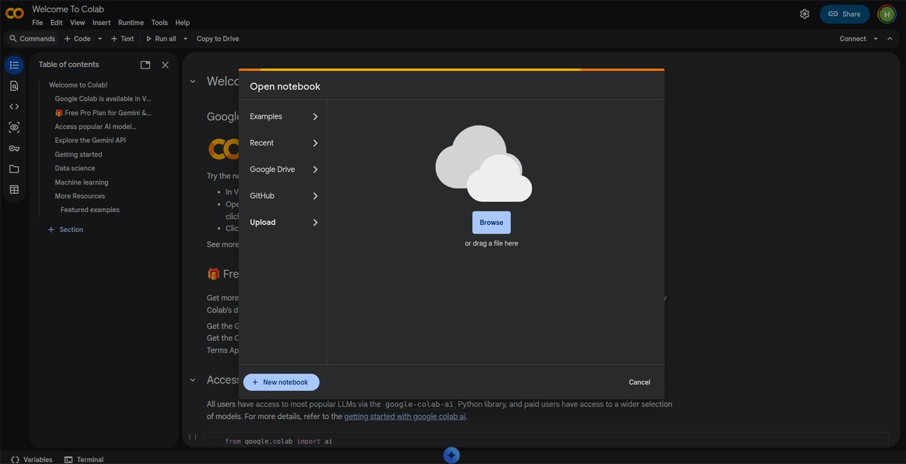
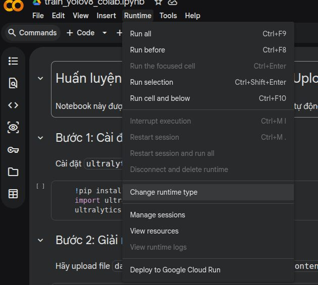
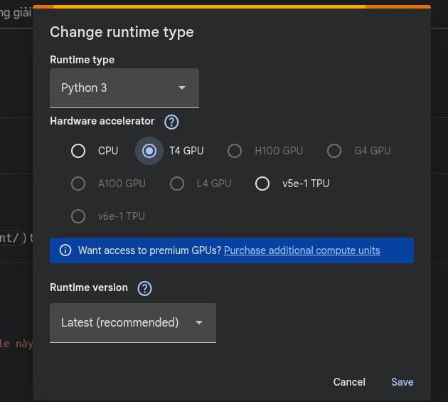
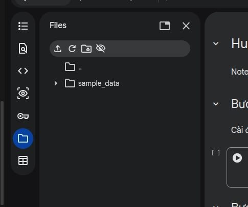
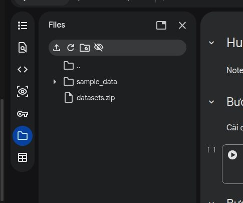
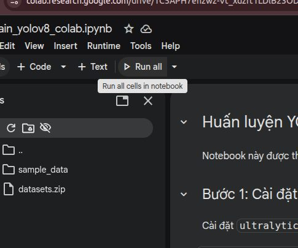

# 2. Training và Export OpenVINO FP16 Model

Toàn bộ quy trình huấn luyện model YOLO11n cho 24 class góc Leanbot, đánh giá kết quả và export model sang OpenVINO FP16 để sử dụng trong runtime.

## 2.1. Các file sử dụng

- [`Leanbot_Train_SoftBCE.ipynb`](../tools/Leanbot_Train_SoftBCE.ipynb): notebook training chính.
- [`datasets.zip`](../datasets.zip): dataset dùng cho model hiện tại.
- [`export_openvino_fp16.py`](../tools/export_openvino_fp16.py): export model `.pt` sang OpenVINO FP16.
- [Model OpenVINO 640](../models/yolo11n_latest_version/best_fp16_no_nms_imgsz640_openvino_model/): model FULL detection.
- [Model OpenVINO 160](../models/yolo11n_latest_version/best_fp16_no_nms_imgsz160_openvino_model/): model ROI tracking.

## 2.2. Dataset dùng để training

Model hiện tại được train với dataset gần nhất bao gồm:

- 204 ảnh 640x640.
- 192 ảnh có Leanbot.
- 12 ảnh negative background.
- 1.728 bounding box.
- 24 class góc, mỗi class cách nhau 15 độ.

File dataset:

- [`datasets.zip`](../datasets.zip)

> Nếu đã bổ sung lost-tracking samples bằng [`merge_lost_tracking_dataset.py`](../tools/merge_lost_tracking_dataset.py), có thể tạo một file zip dataset mới và dùng file đó thay cho `datasets.zip` hiện có trên repo.

## 2.3. Hướng dẫn sử dụng Google Colab để huấn luyện mô hình

Notebook được thiết kế để chạy trên Google Colab với GPU. Em sử dụng notebook **[`Leanbot_Train_SoftBCE.ipynb`](../tools/Leanbot_Train_SoftBCE.ipynb)** trên Google Colab để huấn luyện và kiểm tra mô hình YOLO11n.

- Tìm Google Colab và mở môi trường làm việc.

  <p align="center">
    <br>
    
  </p>

- Upload notebook huấn luyện lên Colab.

  <p align="center">
    
  </p>

- Chọn cấu hình runtime phù hợp để huấn luyện.

  <p align="center">
    <br>
    
  </p>

- Upload file dữ liệu **`datasets.zip`** (đã chuẩn bị ở bước trước) để notebook chuẩn bị dữ liệu đầu vào.

  <p align="center">
    <br>
    
  </p>

- Chạy toàn bộ notebook để cài thư viện, giải nén dữ liệu và huấn luyện mô hình.

  <p align="center">
    <br>
  </p>

Trong notebook, dataset được giải nén và chia thành các tập:

```text
datasets/
├── train/
│   ├── images/
│   └── labels/
├── val/
│   ├── images/
│   └── labels/
└── test/
    ├── images/
    └── labels/
```

- Sau khi chạy hoàn tất thì Notebook tự động tải 1 folder bao gồm cả model best.pt và các file dữ liệu đánh giá quá trình trainning về máy. 

## 2.4. Export OpenVINO FP16

Script:

- [`export_openvino_fp16.py`](../tools/export_openvino_fp16.py)

Script hỗ trợ hai kích thước input:

```text
160
640
```


### Export model 640

Từ thư mục `Leanbot_Camera_AI_Control_FINAL`:

```powershell
python .\tools\export_openvino_fp16.py `
  --model .\best.pt `
  --imgsz 640 `
  --no-nms
```

- Phần --model có thể đổi đường dẫn cho phù hợp.

### Export model 160

```powershell
python .\tools\export_openvino_fp16.py `
  --model .\best.pt `
  --imgsz 160 `
  --no-nms
```

Output có dạng:

```text
best_fp16_no_nms_imgsz640_openvino_model/
best_fp16_no_nms_imgsz160_openvino_model/
```


## 2.5. Vị trí model trong project

Runtime hiện tại mặc định tìm model ở:

- [FULL 640](../models/yolo11n_latest_version/best_fp16_no_nms_imgsz640_openvino_model/)
- [ROI 160](../models/yolo11n_latest_version/best_fp16_no_nms_imgsz160_openvino_model/)

Cấu trúc:

```text
models/
└── yolo11n_latest_version/
    ├── best_fp16_no_nms_imgsz640_openvino_model/
    │   ├── best_fp16_no_nms_imgsz640.xml
    │   ├── best_fp16_no_nms_imgsz640.bin
    │   └── metadata.yaml
    │
    └── best_fp16_no_nms_imgsz160_openvino_model/
        ├── best_fp16_no_nms_imgsz160.xml
        ├── best_fp16_no_nms_imgsz160.bin
        └── metadata.yaml
```

## 2.6. Vai trò hai model trong runtime

```text
Camera frame
    │
    ├── FULL detection
    │      model 640x640
    │      dùng để tìm lại Leanbot trên toàn frame
    │
    └── ROI tracking
           model 160x160
           dùng khi đã có ROI quanh Leanbot
```

Model 640 ưu tiên phạm vi tìm kiếm toàn ảnh. Model 160 giảm kích thước input để phục vụ tracking ROI với chi phí inference thấp hơn.

## 2.7. Tổng quan quy trình retrain sau khi bổ sung dữ liệu

```text
Dataset gốc
    │
    + Lost-tracking samples đã review
    │
    ↓
merge_lost_tracking_dataset.py
    ↓
datasets_with_lost_tracking/
    ↓
zip dataset
    ↓
Leanbot_Train_SoftBCE.ipynb
    ↓
best.pt
    ↓
export_openvino_fp16.py
    ├── 640 FP16 no-NMS
    └── 160 FP16 no-NMS
    ↓
thay model trong models/yolo11n_latest_version/
```
